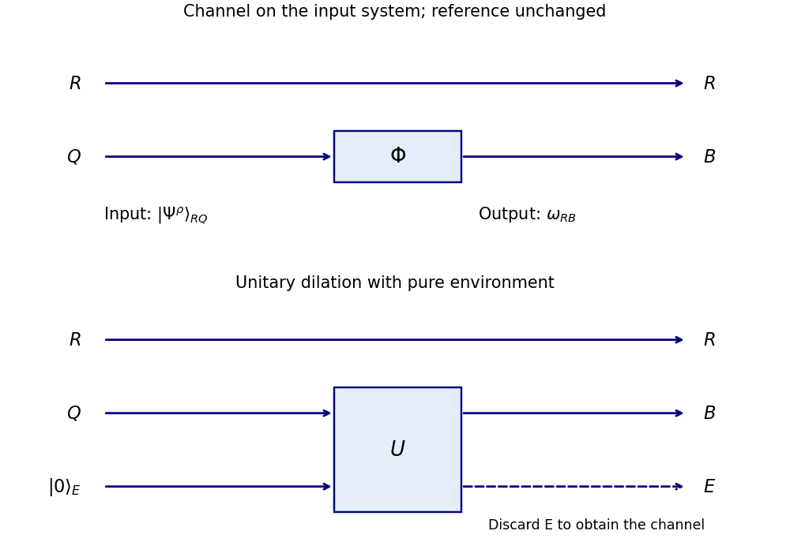

# Paper 48

↑ **Parent:** [Iii](../iii.md)

[https://www.maths.cam.ac.uk/postgrad/part-iii/files/pastpapers/2010/Paper48.pdf](https://www.maths.cam.ac.uk/postgrad/part-iii/files/pastpapers/2010/Paper48.pdf)

**Table of contents**

- [1](#1)
  - [a](#1/a)
    - [Solution](#1/a/solution)
  - [b](#1/b)
    - [Solution](#1/b/solution)
  - [c](#1/c)
    - [Solution](#1/c/solution)
- [2](#2)
  - [a](#2/a)
    - [Solution](#2/a/solution)
  - [b](#2/b)
    - [Solution](#2/b/solution)
  - [c](#2/c)
    - [Solution](#2/c/solution)
- [3](#3)
  - [a](#3/a)
    - [i](#3/a/i)
      - [Solution](#3/a/i/solution)
    - [ii](#3/a/ii)
      - [Solution](#3/a/ii/solution)
    - [iii](#3/a/iii)
      - [Solution](#3/a/iii/solution)
  - [b](#3/b)
    - [Solution](#3/b/solution)
- [4](#4)
  - [a](#4/a)
    - [Solution](#4/a/solution)
  - [b](#4/b)
    - [Solution](#4/b/solution)
- [5](#5)
  - [a](#5/a)
    - [Solution](#5/a/solution)
  - [b](#5/b)
    - [Solution](#5/b/solution)
  - [c](#5/c)
    - [Solution](#5/c/solution)
  - [d](#5/d)
    - [Solution](#5/d/solution)

## 1

↑ **Parent:** [Paper 48](paper-48.md)

<h3 id="1/a">a</h3>

↑ **Parent:** [1](#1)

<h4 id="1/a/solution">Solution</h4>

↑ **Parent:** [A](#1/a)

Use logarithms to base two, so all [Von Neumann entropies](../../../von-neumann-entropy.md) and [Shannon entropies](../../../information-theory.md#information-entropy) are measured in bits. Write the nonzero [eigenvalues](../../../linear-operator-theory.md#eigenvalue) of $\rho_i$ as $\lambda_{ij}$. Orthogonality of the supports makes the mixture a [block diagonal matrix](../../../vector-space.md#block-diagonal-matrix), with eigenvalues $p_i\lambda_{ij}$. Therefore

$$
\begin{aligned}
S(\rho)&=-\sum_{i,j}p_i\lambda_{ij}\log_2(p_i\lambda_{ij})\\
&=-\sum_i p_i\log_2p_i\sum_j\lambda_{ij}
-\sum_i p_i\sum_j\lambda_{ij}\log_2\lambda_{ij}\\
&=\boxed{H(p)+\sum_i p_iS(\rho_i)}.
\end{aligned}
$$

Each $\rho_i$ has [trace](../../../linear-algebra.md#matrix-trace) one. Terms with zero probability or zero eigenvalue vanish under the convention $0\log0=0$. This proves the [entropy of an orthogonal quantum mixture](../../../von-neumann-entropy.md#entropy-of-an-orthogonal-quantum-mixture).

<h3 id="1/b">b</h3>

↑ **Parent:** [1](#1)

<h4 id="1/b/solution">Solution</h4>

↑ **Parent:** [B](#1/b)

For a bipartite [density operator](../../../quantum-theory.md#density-matrix) $\rho_{AB}$, the [Subadditivity of Von Neumann entropy](../../../von-neumann-entropy.md#subadditivity-of-von-neumann-entropy) is

$$
\boxed{S(AB)\leq S(A)+S(B)}.
$$

Here $S(A)=S(\operatorname{Tr}_B\rho_{AB})$ and likewise for $B$, using the [partial trace](../../../quantum-theory.md#partial-trace). For a tripartite density operator, the [Strong subadditivity of Von Neumann entropy](../../../von-neumann-entropy.md#strong-subadditivity-of-quantum-entropy) is

$$
\boxed{S(ABC)+S(B)\leq S(AB)+S(BC)}.
$$

Equivalently, [quantum conditional entropy](../../../von-neumann-entropy.md#quantum-conditional-entropy) cannot increase upon adding a conditioning system: $S(A\mid BC)\leq S(A\mid B)$.

<h3 id="1/c">c</h3>

↑ **Parent:** [1](#1)

<h4 id="1/c/solution">Solution</h4>

↑ **Parent:** [C](#1/c)

Introduce an orthonormal classical label register $X$ and the [classical-quantum state](../../../quantum-information-theory.md#classical-quantum-state)

$$
\omega_{XQ}=\sum_i p_i|i\rangle\langle i|_X\otimes\rho_i.
$$

The blocks have orthogonal supports because their label vectors are orthogonal, regardless of whether the original $\rho_i$ have orthogonal supports. Part (a) gives $S(XQ)=H(p)+\sum_i p_iS(\rho_i)$. The marginals are $\omega_X=\sum_i p_i|i\rangle\langle i|$ and $\omega_Q=\sum_i p_i\rho_i$, so $S(X)=H(p)$. Apply the [Subadditivity of Von Neumann entropy](../../../von-neumann-entropy.md#subadditivity-of-von-neumann-entropy) and cancel $H(p)$:

$$
H(p)+\sum_i p_iS(\rho_i)\leq H(p)+S\!\left(\sum_i p_i\rho_i\right).
$$

Thus **$S(\sum_i p_i\rho_i)\geq\sum_i p_iS(\rho_i)$**. This is the [Concavity of Von Neumann entropy](../../../von-neumann-entropy.md#concavity-of-von-neumann-entropy).

## 2

↑ **Parent:** [Paper 48](paper-48.md)

<h3 id="2/a">a</h3>

↑ **Parent:** [2](#2)

<h4 id="2/a/solution">Solution</h4>

↑ **Parent:** [A](#2/a)

The channel acts only on the input system $Q$; the reference $R$ is untouched. Write

$$
\omega_{RB}=(\operatorname{id}_R\otimes\Phi)(|\Psi^\rho\rangle\langle\Psi^\rho|_{RQ}).
$$

The [coherent information](../../../quantum-information-theory.md#coherent-information) is

$$
\boxed{I_c(\Phi,\rho)=S(B)_\omega-S(RB)_\omega=-S(R\mid B)_\omega}.
$$

The reference marginal remains $\rho_R$, whose nonzero eigenvalues agree with those of $\rho$. Unlike a classical information quantity, coherent information can be negative.

**[Figure 1](#2/a/image-quantum-channel-acting-on-one-half-of-a-purification-with-untouched-reference-and-discarded-environment). Quantum channel acting on one half of a purification, with untouched reference and discarded environment**.

The lower diagram uses a [Stinespring dilation](../../../quantum-information-theory.md#stinespring-dilation): append an environment in a fixed [pure state](../../../quantum-theory.md#pure-state), apply a joint [unitary operator](../../../vector-space.md#unitary-operator), and discard the environment by [partial trace](../../../quantum-theory.md#partial-trace). Before discarding it, the global $RBE$ state is pure.

<h3 id="2/b">b</h3>

↑ **Parent:** [2](#2)

<h4 id="2/b/solution">Solution</h4>

↑ **Parent:** [B](#2/b)

Implement the [quantum channel](../../../quantum-information-theory.md#quantum-channel) by a unitary dilation with a pure initial environment. The final state on $RBE$ is pure. The [Schmidt decomposition](../../../von-neumann-entropy.md#schmidt-decomposition) across either bipartition gives equal complementary [Von Neumann entropies](../../../von-neumann-entropy.md), so $S(RB)=S(E)$ and $S(B)=S(RE)$. By the [Subadditivity of Von Neumann entropy](../../../von-neumann-entropy.md#subadditivity-of-von-neumann-entropy),

$$
I_c(\Phi,\rho)=S(RE)-S(E)\leq S(R).
$$

The reference is untouched and purifies the input, hence $S(R)=S(\rho)$. Therefore **$\boxed{I_c(\Phi,\rho)\leq S(\rho)}$.**

<h3 id="2/c">c</h3>

↑ **Parent:** [2](#2)

<h4 id="2/c/solution">Solution</h4>

↑ **Parent:** [C](#2/c)

After the first [quantum channel](../../../quantum-information-theory.md#quantum-channel), denote the joint reference-output state by $\omega_{RB_1}$. Dilate the second [CPTP map](../../../quantum-information-theory.md#quantum-channel) as an [linear isometry](../../../hilbert-space.md#linear-isometry-of-hilbert-spaces) $B_1\to B_2E_2$, with the resulting state denoted $\tau$. [Linear isometries](../../../hilbert-space.md#linear-isometry-of-hilbert-spaces) preserve nonzero eigenvalues, both globally and on the transformed output, giving

$$
I_c(\Phi_1,\rho)=S(B_2E_2)_\tau-S(RB_2E_2)_\tau.
$$

Tracing out $E_2$ implements the second channel, so

$$
I_c(\Phi_2\circ\Phi_1,\rho)=S(B_2)_\tau-S(RB_2)_\tau.
$$

The [Strong subadditivity of Von Neumann entropy](../../../von-neumann-entropy.md#strong-subadditivity-of-quantum-entropy) for $R,B_2,E_2$ gives $S(RB_2)+S(B_2E_2)\geq S(B_2)+S(RB_2E_2)$. Rearranging proves the [data-processing inequality for coherent information](../../../quantum-information-theory.md#data-processing-inequality-for-coherent-information):

$$
\boxed{I_c(\Phi_1,\rho)\geq I_c(\Phi_2\circ\Phi_1,\rho)}.
$$

## 3

↑ **Parent:** [Paper 48](paper-48.md)

<h3 id="3/a">a</h3>

↑ **Parent:** [3](#3)

<h4 id="3/a/i">i</h4>

↑ **Parent:** [A](#3/a)

<h5 id="3/a/i/solution">Solution</h5>

↑ **Parent:** [I](#3/a/i)

Use the unsquared [quantum fidelity](../../../quantum-information-theory.md#fidelity-of-quantum-states) convention in the question. For any [matrix](../../../vector-space.md#matrix) $X$, its [trace norm](../../../functional-analysis.md#trace-norm) is $\|X\|_1=\operatorname{Tr}\sqrt{X^\dagger X}=\operatorname{Tr}\sqrt{XX^\dagger}$: the two positive matrices have the same nonzero eigenvalues, namely the squared [singular values](../../../linear-algebra.md#singular-value). This follows directly from the [singular value decomposition](../../../linear-algebra.md#singular-value-decomposition).

Set $X=\sqrt\rho\sqrt\sigma$. Then $XX^\dagger=\sqrt\rho\,\sigma\sqrt\rho$ and $X^\dagger X=\sqrt\sigma\,\rho\sqrt\sigma$. Their positive square roots therefore have the same trace, proving

$$
\boxed{F(\rho,\sigma)=\|\sqrt\rho\sqrt\sigma\|_1=F(\sigma,\rho)}.
$$

The argument also covers singular density operators, since zero singular values contribute zero.

<h4 id="3/a/ii">ii</h4>

↑ **Parent:** [A](#3/a)

<h5 id="3/a/ii/solution">Solution</h5>

↑ **Parent:** [Ii](#3/a/ii)

For positive operators, the unique [positive square root of an operator](../../../hilbert-space.md#positive-square-root-of-an-operator) respects tensor products: $\sqrt{A\otimes B}=\sqrt A\otimes\sqrt B$. To verify this, diagonalize $A,B$; the product eigenvectors have eigenvalues $a_ib_j$, whose square roots are $\sqrt{a_i}\sqrt{b_j}$. Hence the operator inside the outer square root in the fidelity factors as

$$
\bigl(\sqrt\rho\,\rho'\sqrt\rho\bigr)\otimes
\bigl(\sqrt\sigma\,\sigma'\sqrt\sigma\bigr).
$$

Taking its positive square root and using $\operatorname{Tr}(C\otimes D)=\operatorname{Tr}C\,\operatorname{Tr}D$ gives **$\boxed{F(\rho\otimes\sigma,\rho'\otimes\sigma')=F(\rho,\rho')F(\sigma,\sigma')}$.**

<h4 id="3/a/iii">iii</h4>

↑ **Parent:** [A](#3/a)

<h5 id="3/a/iii/solution">Solution</h5>

↑ **Parent:** [Iii](#3/a/iii)

We first establish the purification-overlap formula for [quantum fidelity](../../../quantum-information-theory.md#fidelity-of-quantum-states), rather than assume the desired monotonicity. Write a canonical [purification of a density operator](../../../quantum-theory.md#purification-of-a-density-operator) as

$$
|\sqrt\rho\rangle\!\rangle=\sum_{i,j}(\sqrt\rho)_{ij}|i\rangle|j\rangle.
$$

Tracing the second factor gives $\rho$. The [Schmidt decomposition](../../../von-neumann-entropy.md#schmidt-decomposition) shows that any other purification on a sufficiently large fixed ancillary space differs by a unitary on that space: its orthonormal ancillary vectors can be mapped to those of the canonical purification and the map extended to a [unitary operator](../../../vector-space.md#unitary-operator). Zero eigenvalues are handled by padding the ancillary basis.

The overlap of two canonical purifications, with a relative ancillary unitary $U$, is $\operatorname{Tr}(\sqrt\rho\sqrt\sigma\,U^T)$, with zero padding when the ancillary dimension is larger. The [unitary variational formula for the trace norm](../../../functional-analysis.md#unitary-variational-formula-for-the-trace-norm) is

$$
\max_{V\ {\rm unitary}}|\operatorname{Tr}(XV)|=\|X\|_1.
$$

Indeed if $X=PDQ^\dagger$ is a [singular value decomposition](../../../linear-algebra.md#singular-value-decomposition), the trace is $\operatorname{Tr}(DW)$ with $W=Q^\dagger VP$ unitary. Its modulus is at most $\sum_jD_{jj}$ because $|W_{jj}|\leq1$, and $V=QP^\dagger$ attains that bound. Thus the maximal absolute overlap of purifications equals $F(\rho,\sigma)$; this also proves the needed form of [Uhlmann's theorem](../../../quantum-theory.md#uhlmann-s-theorem).

Choose purifications $|\psi\rangle_{ABE}$ and $|\phi\rangle_{ABE}$ attaining $F(\rho_{AB},\sigma_{AB})$. Regard the very same vectors as purifications of $\rho_A,\sigma_A$ with ancillary system $BE$. Their overlap is among those maximized in the marginal purification formula, so

$$
\boxed{F(\rho_{AB},\sigma_{AB})=|\langle\psi|\phi\rangle|\leq F(\rho_A,\sigma_A)}.
$$

This proves the [monotonicity of quantum fidelity under partial trace](../../../quantum-information-theory.md#monotonicity-of-quantum-fidelity-under-partial-trace).

<h3 id="3/b">b</h3>

↑ **Parent:** [3](#3)

<h4 id="3/b/solution">Solution</h4>

↑ **Parent:** [B](#3/b)

Write a qubit density operator as $\rho=(I+\mathbf r\cdot\boldsymbol\sigma)/2$, with [Bloch vector](../../../quantum-theory.md#bloch-vector) $|\mathbf r|\leq1$. The [depolarizing channel](../../../quantum-information-theory.md#quantum-depolarizing-channel) sends $\mathbf r$ to $p\mathbf r$. Its output eigenvalues are $(1\pm |p||\mathbf r|)/2$, so its [Von Neumann entropy](../../../von-neumann-entropy.md) is minimized at $|\mathbf r|=1$. Define

$$
\boxed{q=(1-p)/2}.
$$

The minimum output entropy is $h(q)$, since binary entropy is symmetric under $q\mapsto1-q$. The usual probabilistic-mixture convention has $0\leq p\leq1$. The argument also holds throughout the physical qubit CPTP range $-1/3\leq p\leq1$, where this $q$ still lies in $[0,1]$.

To handle multiple channel uses, let a classical message $x$ select a product input $\rho_x=\bigotimes_{j=1}^n\rho_{xj}$ with probability $\pi_x$. Memorylessness gives product outputs $\sigma_x=\bigotimes_j\Phi(\rho_{xj})$. Additivity of [Von Neumann entropy](../../../von-neumann-entropy.md) on tensor products gives $S(\sigma_x)\geq n h(q)$. The average output $\bar\sigma=\sum_x\pi_x\sigma_x$ acts on $n$ qubits, so $S(\bar\sigma)\leq\log_2(2^n)=n$. Thus the [Holevo quantity](../../../quantum-information-theory.md#holevo-quantity) obeys the [product-input block bound for a qubit depolarizing channel](../../../quantum-information-theory.md#product-input-block-bound-for-a-qubit-depolarizing-channel)

$$
\chi=S(\bar\sigma)-\sum_x\pi_xS(\sigma_x)\leq n[1-h(q)].
$$

The [Holevo bound](../../../quantum-information-theory.md#holevo-s-theorem) says the classical [mutual information](../../../information-theory.md#mutual-information) obtained by any measurement, including a joint measurement on all outputs, is at most $\chi$.

For a reliable code with $M$ equiprobable messages and decoding error $P_e$, [Fano's inequality](../../../information-theory.md#fano-s-inequality) gives $H(X\mid\hat X)\leq h(P_e)+P_e\log_2(M-1)$. Consequently $(1-P_e)\log_2M\leq n[1-h(q)]+h(P_e)$. Letting the error tend to zero proves **$\boxed{\mathcal I(\Phi)\leq1-h((1-p)/2)}$.**

The bound is tight: equal use of $|0\rangle,|1\rangle$ and computational-basis output measurements produce a [binary symmetric channel](../../../coding-theory.md#binary-symmetric-channel) with crossover probability $q$. Ordinary classical coding achieves $1-h(q)$ bits per use.

## 4

↑ **Parent:** [Paper 48](paper-48.md)

<h3 id="4/a">a</h3>

↑ **Parent:** [4](#4)

<h4 id="4/a/solution">Solution</h4>

↑ **Parent:** [A](#4/a)

**They need a pre-shared entanglement resource that permits deterministic production of a Bell pair.** In particular, one shared [Bell pair](../../../bell-state.md#bell-pair) and two classical bits suffice for exact [quantum teleportation](../../../bell-state.md#quantum-teleportation). This condition is stronger than merely having some entanglement.

Let Alice's input be $|\psi\rangle_C=\alpha|0\rangle+\beta|1\rangle$, and let her system $A$ and Bob's system $B$ share $|\Phi^+\rangle_{AB}=(|00\rangle+|11\rangle)/\sqrt2$. Use the [Bell states](../../../bell-state.md) $|\Phi^\pm\rangle=(|00\rangle\pm|11\rangle)/\sqrt2$ and $|\Psi^\pm\rangle=(|01\rangle\pm|10\rangle)/\sqrt2$. Direct expansion gives

$$
|\psi\rangle_C|\Phi^+\rangle_{AB}
=\frac12\left[
|\Phi^+\rangle_{CA}|\psi\rangle_B+
|\Phi^-\rangle_{CA}Z|\psi\rangle_B+
|\Psi^+\rangle_{CA}X|\psi\rangle_B+
|\Psi^-\rangle_{CA}XZ|\psi\rangle_B
\right].
$$

Alice performs a [projective measurement](../../../quantum-measurement.md#projective-measurement) in this Bell basis and sends its two-bit outcome. Each outcome has probability $1/4$. Bob applies respectively $I,Z,X,ZX$, recovering $|\psi\rangle$ exactly, without either party knowing $\alpha,\beta$. Before he receives the outcome, his averaged state is $I/2$, so the protocol does not communicate without the classical message. Alice's measurement consumes the input and the shared entanglement.

For necessity, exact transmission of every pure qubit means the induced [quantum channel](../../../quantum-information-theory.md#quantum-channel) is the identity: pure-state projectors span the operator space, and a physical channel is linear. Alice can therefore prepare a Bell pair locally and transmit one half by the proposed protocol, leaving a Bell pair shared with Bob. The protocol would itself be a deterministic [local operations and classical communication](../../../bell-state.md#local-operations-and-classical-communication) conversion of their resource into a Bell pair. This proves the [exact teleportation resource criterion](../../../bell-state.md#exact-teleportation-resource-criterion). With no shared entanglement, it is impossible: local operations and classical communication preserve [separable quantum states](../../../quantum-information-theory.md#separable-quantum-state), whereas the resulting Bell pair would be entangled.

<h3 id="4/b">b</h3>

↑ **Parent:** [4](#4)

<h4 id="4/b/solution">Solution</h4>

↑ **Parent:** [B](#4/b)

For an ensemble $\mathcal E=\{p_i,\rho_i\}$, write its channel-output [Holevo quantity](../../../quantum-information-theory.md#holevo-quantity) as

$$
\chi(\Phi,\mathcal E)=S\!\left(\sum_i p_i\Phi(\rho_i)\right)-\sum_i p_iS(\Phi(\rho_i)),
\qquad
\chi^*(\Phi)=\sup_{\mathcal E}\chi(\Phi,\mathcal E).
$$

Take ensembles $\mathcal E_1=\{p_i,\rho_i\}$ and $\mathcal E_2=\{q_j,\sigma_j\}$ independently, giving the product ensemble $\{p_iq_j,\rho_i\otimes\sigma_j\}$. Its average output factors:

$$
\sum_{i,j}p_iq_j\,\Phi_1(\rho_i)\otimes\Phi_2(\sigma_j)
=\left(\sum_i p_i\Phi_1(\rho_i)\right)\otimes
\left(\sum_j q_j\Phi_2(\sigma_j)\right).
$$

The [Von Neumann entropy](../../../von-neumann-entropy.md) of a tensor product is the sum of its entropies. Applying this both to the average and to every labelled output gives

$$
\chi(\Phi_1\otimes\Phi_2,\mathcal E_1\otimes\mathcal E_2)
=\chi(\Phi_1,\mathcal E_1)+\chi(\Phi_2,\mathcal E_2).
$$

Choose each ensemble within $\varepsilon$ of its supremum. The supremum for the joint channel includes this product ensemble, so its value is at least $\chi^*(\Phi_1)+\chi^*(\Phi_2)-2\varepsilon$. Let $\varepsilon\downarrow0$. The [superadditivity of Holevo capacity](../../../quantum-information-theory.md#superadditivity-of-holevo-capacity) follows:

$$
\boxed{\chi^*(\Phi_1\otimes\Phi_2)\geq\chi^*(\Phi_1)+\chi^*(\Phi_2)}.
$$

This argument does not restrict the joint supremum to product ensembles and does not require the individual suprema to be attained.

## 5

↑ **Parent:** [Paper 48](paper-48.md)

<h3 id="5/a">a</h3>

↑ **Parent:** [5](#5)

<h4 id="5/a/solution">Solution</h4>

↑ **Parent:** [A](#5/a)

In the [generalized measurement postulate](../../../quantum-measurement.md#generalized-measurement-postulate), outcome $m$ is described by a [Kraus operator](../../../quantum-information-theory.md#kraus-operator) $M_m$, with $\sum_mM_m^\dagger M_m=I$. On a [density operator](../../../quantum-theory.md#density-matrix) $\rho$ its probability and conditional output, for nonzero probability, are

$$
\boxed{p_m=\operatorname{Tr}(M_m\rho M_m^\dagger),\qquad
\rho_m=M_m\rho M_m^\dagger/p_m}.
$$

For a pure input the conditional vector is $M_m|\psi\rangle/\sqrt{p_m}$. The effects $E_m=M_m^\dagger M_m$ are positive and sum to the identity, defining a [positive operator-valued measure](../../../quantum-measurement.md#positive-operator-valued-measure).

More generally an outcome can have several [Kraus operators](../../../quantum-information-theory.md#kraus-operator) $M_{m\alpha}$. Then sum over $\alpha$ in both the numerator and the probability, and require $\sum_{m,\alpha}M_{m\alpha}^\dagger M_{m\alpha}=I$.

The usual [projective measurement](../../../quantum-measurement.md#projective-measurement) with the [Lüders rule](../../../quantum-measurement.md#luders-rule) is recovered when the measurement operators are mutually orthogonal projections, $M_m=P_m=P_m^\dagger=P_m^2$, $P_mP_n=0$ for $m\ne n$, and $\sum_mP_m=I$. Projector-valued effects alone give projective outcome statistics; to obtain the Lüders state update as well, the instrument must implement $\rho\mapsto P_m\rho P_m$, without an additional conditional state change.

<h3 id="5/b">b</h3>

↑ **Parent:** [5](#5)

<h4 id="5/b/solution">Solution</h4>

↑ **Parent:** [B](#5/b)

The [Schmidt decomposition](../../../von-neumann-entropy.md#schmidt-decomposition) of a normalized bipartite pure state is

$$
\boxed{|\psi\rangle_{AB}=\sum_{j=1}^{r}\sqrt{\lambda_j}\,|u_j\rangle_A|v_j\rangle_B},
\qquad \lambda_j>0,\quad\sum_j\lambda_j=1.
$$

The two sets of local vectors are orthonormal. The [Schmidt coefficients](../../../von-neumann-entropy.md#schmidt-coefficient) are the nonnegative numbers $\sqrt{\lambda_j}$, and the Schmidt number for this pure state, also called its [Schmidt rank](../../../von-neumann-entropy.md#schmidt-rank), is $r$, the number of nonzero coefficients. It equals the rank of either [reduced density operator](../../../bell-state.md#reduced-density-matrix) and of the coefficient matrix in any product bases. The general mixed-state [Schmidt number](../../../von-neumann-entropy.md#schmidt-number) specializes to this same value on a pure state.

<h3 id="5/c">c</h3>

↑ **Parent:** [5](#5)

<h4 id="5/c/solution">Solution</h4>

↑ **Parent:** [C](#5/c)

In the computational product bases, the coefficient matrix is

$$
C=\frac1{\sqrt3}\begin{pmatrix}1&1\\1&0\end{pmatrix}.
$$

Its determinant is $-1/3$, so it has rank two. Therefore **the Schmidt number is $\boxed{2}$.** As a check, the reduced density operator $CC^\dagger=\frac13\begin{pmatrix}2&1\\1&1\end{pmatrix}$ has eigenvalues $(3+\sqrt5)/6$ and $(3-\sqrt5)/6$, both positive.

<h3 id="5/d">d</h3>

↑ **Parent:** [5](#5)

<h4 id="5/d/solution">Solution</h4>

↑ **Parent:** [D](#5/d)

The two displayed amplitudes have modulus $1/\sqrt2$. Absorb their phases into Bob's basis rather than use complex [Schmidt coefficients](../../../von-neumann-entropy.md#schmidt-coefficient). Take $|u_0\rangle=|0\rangle$, $|u_1\rangle=|1\rangle$, and

$$
|v_0\rangle=e^{-i\pi/4}|1\rangle,\qquad
|v_1\rangle=e^{i\pi/4}|0\rangle.
$$

Both local bases are orthonormal. A [Schmidt decomposition](../../../von-neumann-entropy.md#schmidt-decomposition) is therefore

$$
\boxed{|\psi\rangle_{AB}=\frac1{\sqrt2}|u_0\rangle|v_0\rangle+\frac1{\sqrt2}|u_1\rangle|v_1\rangle}.
$$

The two Schmidt coefficients are $1/\sqrt2$, the Schmidt number is two, and both reduced density operators are $I/2$. Their equal eigenvalues make this decomposition nonunique.

## ↑ Ancestors (8)

1. [Iii](../iii.md)
2. [2010](../../2010.md)
3. [Past exam of the mathematics course of the University of Cambridge](../../../past-exam-of-the-mathematics-course-of-the-university-of-cambridge.md)
4. [Mathematics course of the University of Cambridge](../../../university-of-cambridge.md#mathematics-course-of-the-university-of-cambridge)
5. [Course of the University of Cambridge](../../../university-of-cambridge.md#course-of-the-university-of-cambridge)
6. [University of Cambridge](../../../university-of-cambridge.md)
7. [List of universities](../../../README.md#list-of-universities)
8. [Codex Wiki](../../../README.md)
