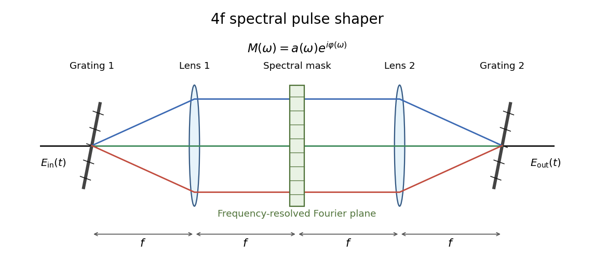

# Paper 50

↑ **Parent:** [Iii](../iii.md)

[https://www.maths.cam.ac.uk/postgrad/part-iii/files/pastpapers/2010/Paper50.pdf](https://www.maths.cam.ac.uk/postgrad/part-iii/files/pastpapers/2010/Paper50.pdf)

**Table of contents**

- [1](#1)
  - [a](#1/a)
    - [Solution](#1/a/solution)
  - [b](#1/b)
    - [Solution](#1/b/solution)
  - [c](#1/c)
    - [Solution](#1/c/solution)
  - [d](#1/d)
    - [Solution](#1/d/solution)
  - [e](#1/e)
    - [Solution](#1/e/solution)
- [2](#2)
  - [a](#2/a)
    - [Solution](#2/a/solution)
  - [b](#2/b)
    - [Solution](#2/b/solution)
  - [c](#2/c)
    - [Solution](#2/c/solution)
  - [d](#2/d)
    - [Solution](#2/d/solution)
  - [e](#2/e)
    - [Solution](#2/e/solution)
- [3](#3)
  - [a](#3/a)
    - [Solution](#3/a/solution)
  - [b](#3/b)
    - [Solution](#3/b/solution)
  - [c](#3/c)
    - [Solution](#3/c/solution)
  - [d](#3/d)
    - [Solution](#3/d/solution)
  - [e](#3/e)
    - [Solution](#3/e/solution)
  - [f](#3/f)
    - [Solution](#3/f/solution)
  - [g](#3/g)
    - [Solution](#3/g/solution)

## 1

↑ **Parent:** [Paper 50](paper-50.md)

<h3 id="1/a">a</h3>

↑ **Parent:** [1](#1)

<h4 id="1/a/solution">Solution</h4>

↑ **Parent:** [A](#1/a)

The [density operators](../../../quantum-theory.md#density-matrix) are Hermitian, so their squared [Hilbert-Schmidt distance](../../../compact-operator.md#hilbert-schmidt-distance) is $2V=\operatorname{Tr}(\rho^2)+\operatorname{Tr}(\rho_d^2)-2\operatorname{Tr}(\rho\rho_d)$. Both [purity of a density operator](../../../quantum-theory.md#purity-of-a-density-operator) values are constant under their respective [unitary time evolution](../../../quantum-mechanics.md#unitary-time-evolution): cyclicity gives $\operatorname{Tr}(\rho[H,\rho])=0$ for every Hermitian $H$. Consequently

$$
\dot V=-\operatorname{Tr}(\dot\rho\rho_d)-\operatorname{Tr}(\rho\dot\rho_d)=-f\operatorname{Tr}\bigl(\rho_d[-iH_1,\rho]\bigr).
$$

The terms containing $H_0$ cancel because $\operatorname{Tr}([-iH_0,\rho]\rho_d)=-\operatorname{Tr}(\rho[-iH_0,\rho_d])$. The quantity $F=\operatorname{Tr}(\rho_d[-iH_1,\rho])$ is real: $[-iH_1,\rho]$ is Hermitian, and the [trace](../../../linear-algebra.md#matrix-trace) of the product of two [Hermitian matrices](../../../hilbert-space.md#hermitian-operator) equals its conjugate. The [Lyapunov quantum control](../../../control-theory.md#lyapunov-quantum-control) choice $f=F$ therefore gives $\boxed{\dot V=-f^2\le0}$. For $t_2\ge t_1$, integration yields $V(t_2)=V(t_1)-\int_{t_1}^{t_2}f(t)^2\,dt\le V(t_1)$. Since the distance is $\sqrt{2V}$, it is **monotonically nonincreasing**. The decrease need not be strict when $f=0$.

<h3 id="1/b">b</h3>

↑ **Parent:** [1](#1)

<h4 id="1/b/solution">Solution</h4>

↑ **Parent:** [B](#1/b)

**Neither monotonic decrease alone nor equality of the initial spectra guarantees convergence**. A nonnegative [Lyapunov function](../../../dynamical-systems.md#lyapunov-function) can approach a positive limiting value, and the set where $\dot V=0$ can contain trajectories other than the target. Different initial spectra already obstruct exact tracking: [unitary time evolution](../../../quantum-mechanics.md#unitary-time-evolution) preserves the eigenvalues of each [density operator](../../../quantum-theory.md#density-matrix), while two matrices approaching one another in norm must have the same limiting eigenvalues.

Even the spectral obstruction can be absent while the [Lyapunov quantum control](../../../control-theory.md#lyapunov-quantum-control) stalls. Take a [qubit](../../../quantum-mechanics.md#qubit) with $H_0=Z/2$, $H_1=X$, $\rho_d(0)=|0\rangle\langle0|$ and $\rho(0)=|1\rangle\langle1|$. Both [density operators](../../../quantum-theory.md#density-matrix) commute with $H_0$, and the [commutator](../../../lie-algebra.md#commutator) of $X$ with $\rho$ has zero diagonal, so $f=\operatorname{Tr}(\rho_d[-iX,\rho])=0$. Both states remain constant. They have the identical spectrum $(1,0)$, but $\boxed{\|\rho(t)-\rho_d(t)\|_{\mathrm{HS}}=\sqrt2\text{ for all }t}$. Moreover $iZ,iX$ generate the full [special unitary Lie algebra](../../../lie-algebra.md#special-unitary-lie-algebra) $\mathfrak{su}(2)$, so the failure here is a limitation of this particular feedback law, not a lack of available state-transfer controls.

<h3 id="1/c">c</h3>

↑ **Parent:** [1](#1)

<h4 id="1/c/solution">Solution</h4>

↑ **Parent:** [C](#1/c)

The [Lyapunov quantum control](../../../control-theory.md#lyapunov-quantum-control) law requires an exact instantaneous expectation value. Cyclicity writes it as

$$
f(t)=\operatorname{Tr}\bigl(\rho(t)A(t)\bigr),\qquad A(t)=i[H_1,\rho_d(t)],
$$

where $A(t)$ is a known Hermitian [observable](../../../quantum-mechanics.md#observable). A measurement on one system produces a random outcome, not its exact ensemble expectation, and changes the system state. Repeated measurements for state estimation or continuous weak measurements introduce noise and backaction absent from the assumed closed-system equation. Thus **the law cannot be implemented unchanged as exact measurement-based quantum feedback while retaining the dynamics and guarantee in part (a)**. A conditional-state feedback scheme must include the measurement evolution and rederive its stability properties.

If the initial [density operator](../../../quantum-theory.md#density-matrix) and Hamiltonian model are known, we can instead solve the deterministic equations in a computer, calculate $f(t)$ along the simulated trajectory, and apply that precomputed waveform in the laboratory as [open-loop control](../../../control-theory.md#open-loop-control). Ensemble measurements can help calibrate such a waveform, but they do not supply nondisturbing instantaneous feedback from an individual evolving system.

<h3 id="1/d">d</h3>

↑ **Parent:** [1](#1)

<h4 id="1/d/solution">Solution</h4>

↑ **Parent:** [D](#1/d)

A [quantum optimal control](../../../control-theory.md#quantum-optimal-control) problem specifies a terminal task, admissible fields and resource costs. Pure-state transfer can minimize $1-|\langle\psi_d|\psi(T)\rangle|^2$; mixed-state transfer on an accessible spectral orbit can minimize $\|\rho(T)-\rho_d\|_{\mathrm{HS}}^2/2$; preparing an observable value can minimize $-\operatorname{Tr}(O\rho(T))$. A gate task can minimize $1-|\operatorname{Tr}(U_d^\dagger U(T))|^2/n^2$ for an $n$-dimensional [Hilbert space](../../../hilbert-space.md), which is insensitive to an overall phase. These different terminal functions encode different tasks even when the dynamics are the same. Fluence penalties, amplitude bounds, bandwidth limits, or the total duration can be added to express experimental requirements.

For example, minimize

$$
J[f]=\Phi(\rho(T))+\frac12\sum_m\lambda_m\int_0^T f_m(t)^2\,dt,\qquad \lambda_m>0,
$$

subject to $\dot\rho=\mathcal L_f(\rho)$ and a specified $\rho(0)$. For a closed system, $\mathcal L_f(\rho)=-i[H_0+\sum_mf_mH_m,\rho]$; for an open system add the known [Lindblad equation](../../../quantum-information-theory.md#lindblad-equation) dissipator. Introducing a Hermitian [costate](../../../control-theory.md#costate) $\Lambda$ and taking the [Hilbert-Schmidt inner product](../../../compact-operator.md#hilbert-schmidt-inner-product) gives the forward and backward equations and functional gradient

$$
\dot\rho=\mathcal L_f(\rho),\qquad \dot\Lambda=-\mathcal L_f^\dagger(\Lambda),\qquad \Lambda(T)=\nabla_\rho\Phi(\rho(T)),
$$

$$
\boxed{\frac{\delta J}{\delta f_m(t)}=\lambda_mf_m(t)+\operatorname{Tr}\left(\Lambda(t)\frac{\partial\mathcal L_f}{\partial f_m}(\rho(t))\right)}.
$$

For Hamiltonian controls the second term is $\operatorname{Tr}(\Lambda[-iH_m,\rho])$. The adjoint is defined by the [Hilbert-Schmidt inner product](../../../compact-operator.md#hilbert-schmidt-inner-product); in particular, the closed-system costate equation is $\dot\Lambda=-i[H,\Lambda]$, integrated backward from its terminal condition. An unconstrained interior optimum has zero gradient; amplitude constraints replace this by the corresponding constrained first-order conditions.

Numerically, represent the fields by piecewise constant amplitudes $f_{m,j}$ on slices, or by a finite basis $f_m(t)=\sum_j a_{mj}b_j(t)$ such as splines or Fourier modes. For piecewise constant closed-system dynamics, $U_j=e^{-iH_j\Delta t}$ and $U(T)=U_K\cdots U_1$. Forward products and backward costates provide all slice derivatives in one pair of propagations. In [gradient ascent pulse engineering](../../../control-theory.md#gradient-ascent-pulse-engineering), update these amplitudes to improve the chosen objective, with projection onto amplitude bounds if needed. The exact slice derivative is the [derivative of the matrix exponential](../../../linear-operator-theory.md#derivative-of-the-matrix-exponential)

$$
\frac{\partial U_j}{\partial f_{m,j}}=-i\int_0^{\Delta t}e^{-iH_j(\Delta t-\tau)}H_m e^{-iH_j\tau}\,d\tau.
$$

Replacing it by $-i\Delta t H_mU_j$ is only a short-slice approximation when $H_j$ and $H_m$ do not commute. Other [gradient descent](../../../numerical-analysis.md#gradient-descent) or [nonlinear optimization](../../../mathematical-optimization.md#nonlinear-programming) methods can optimize the same finite parameter set; [direct-adjoint looping](../../../control-theory.md#direct-adjoint-looping) avoids a separate dynamical simulation for each control coefficient.

A pulse is accepted after propagation with the actual constrained waveform confirms its terminal error and resource use. Sampling model uncertainties in the objective can favor robust pulses. Nonconvexity means a numerical stationary point need not be a global optimum, so initial guesses, convergence tolerances and a sufficiently resolved time grid matter.

<h3 id="1/e">e</h3>

↑ **Parent:** [1](#1)

<h4 id="1/e/solution">Solution</h4>

↑ **Parent:** [E](#1/e)

[Spectral pulse shaping](../../../optics.md#spectral-pulse-shaping) implements a calculated optical control by modifying its complex frequency spectrum. If the available input pulse has spectrum $\widetilde E_{\mathrm{in}}(\omega)$, program a calibrated mask $M(\omega)=a(\omega)e^{i\varphi(\omega)}$ so that

$$
\boxed{\widetilde E_{\mathrm{out}}(\omega)=M(\omega)\widetilde E_{\mathrm{in}}(\omega),\qquad E_{\mathrm{out}}(t)=\frac1{2\pi}\int\widetilde E_{\mathrm{out}}(\omega)e^{-i\omega t}\,d\omega}.
$$

The temporal waveform follows from [Fourier inversion](../../../fourier-analysis.md#fourier-inversion-theorem). For a real applied field, its spectrum has conjugate symmetry, so the mask must satisfy $M(-\omega)=M(\omega)^*$. Spectral phase controls interference between frequencies and hence their arrival times, chirp and temporal subpulses; spectral attenuation changes their weights. The optimized field envelope is translated into this complex mask, with compensation for known phase shifts and losses in the optical system.

A typical [4f pulse shaper](../../../optics.md#4f-pulse-shaper) contains a first [diffraction grating](../../../optics.md#diffraction-grating), a focusing lens, a mask or [spatial light modulator](../../../optics.md#spatial-light-modulator) in the common focal plane, a second lens and a second grating. The first grating separates the frequencies by angle. The first lens converts those angles into different transverse positions at the spectral Fourier plane. The pixels of the [spatial light modulator](../../../optics.md#spatial-light-modulator) modify the amplitude and phase of the corresponding frequency bins. The second lens and grating reverse this spatial dispersion and recombine the components into one shaped output beam. In the ideal symmetric layout the four consecutive propagation distances are $f,f,f,f$, giving the name $4f$.

**[Figure 1](#1/e/image-spectral-pulse-shaping-with-gratings-lenses-and-a-programmable-mask-in-a-4f-arrangement). Spectral pulse shaping with gratings, lenses and a programmable mask in a 4f arrangement**.

A phase-only [spatial light modulator](../../../optics.md#spatial-light-modulator) needs suitable polarization optics or another modulation stage for independent amplitude shaping. A passive mask has $0\le a(\omega)\le1$ and cannot create frequencies absent from the input; finite bandwidth and finite pixel resolution limit temporal features and the useful shaping window. These constraints must be included when converting a mathematical optimum into a laboratory pulse. The programmed mask is an [open-loop control](../../../control-theory.md#open-loop-control), although repeated measurements of the output pulse or system performance can be used to calibrate or optimize it experimentally.

## 2

↑ **Parent:** [Paper 50](paper-50.md)

<h3 id="2/a">a</h3>

↑ **Parent:** [2](#2)

<h4 id="2/a/solution">Solution</h4>

↑ **Parent:** [A](#2/a)

The [Hermitian operators](../../../hilbert-space.md#hermitian-operator) form a [real vector space](../../../vector-space.md#real-vector-space) of dimension $N^2$. To see that the same basis spans all complex operators, decompose an arbitrary $A$ as $A=B+iC$, where $B=(A+A^\dagger)/2$ and $C=(A-A^\dagger)/(2i)$ are Hermitian. Expand $B,C$ in the real [orthonormal basis](../../../linear-algebra.md#orthonormal-basis) and combine their coefficients. The resulting complex expansion is unique because $\operatorname{Tr}(\sigma_m\sigma_k)=\delta_{mk}$. Taking the [Hilbert-Schmidt inner product](../../../compact-operator.md#hilbert-schmidt-inner-product) with $\sigma_m$ gives

$$
\boxed{A=\sum_{k=1}^{N^2}a_k\sigma_k,\qquad a_k=\operatorname{Tr}(\sigma_kA)}.
$$

If $A$ is Hermitian, then $a_k^*=\operatorname{Tr}((\sigma_kA)^\dagger)=\operatorname{Tr}(A\sigma_k)=a_k$ by cyclicity. Hence $\boxed{\vec a\in\mathbb R^{N^2}\text{ for Hermitian }A}$. The basis is a real basis of [Hermitian operators](../../../hilbert-space.md#hermitian-operator) and its complexification is a complex basis of all operators.

<h3 id="2/b">b</h3>

↑ **Parent:** [2](#2)

<h4 id="2/b/solution">Solution</h4>

↑ **Parent:** [B](#2/b)

Write $\rho=\sum_n r_n\sigma_n$ in the [Generalized Bloch representation](../../../quantum-theory.md#generalized-bloch-representation). Linearity of the [Lindbladian](../../../quantum-information-theory.md#lindbladian) gives $\dot r_m=\sum_n\operatorname{Tr}(\sigma_m\mathcal L(\sigma_n))r_n$. For the Hamiltonian term, cyclicity yields

$$
\operatorname{Tr}(\sigma_m[-iH,\sigma_n])=-i\operatorname{Tr}(H\sigma_n\sigma_m-H\sigma_m\sigma_n)=\operatorname{Tr}(iH[\sigma_m,\sigma_n])=L_{mn}.
$$

For one [Lindblad operator](../../../quantum-information-theory.md#lindblad-operator) $V_d$, the jump term becomes $\operatorname{Tr}(\sigma_mV_d\sigma_nV_d^\dagger)=\operatorname{Tr}(V_d^\dagger\sigma_mV_d\sigma_n)$, and the two remaining terms give

$$
\operatorname{Tr}(\sigma_mV_d^\dagger V_d\sigma_n)+\operatorname{Tr}(\sigma_m\sigma_nV_d^\dagger V_d)=\operatorname{Tr}(V_d^\dagger V_d\{\sigma_m,\sigma_n\}).
$$

Thus

$$
\boxed{D^{(d)}_{mn}=\operatorname{Tr}(V_d^\dagger\sigma_mV_d\sigma_n)-\frac12\operatorname{Tr}(V_d^\dagger V_d\{\sigma_m,\sigma_n\}),\qquad \dot r=\left(L+\sum_dD^{(d)}\right)r}.
$$

Every coefficient is real because $\mathcal L(\sigma_n)$ is Hermitian. In addition, $L_{mn}=-L_{nm}$, although a dissipative $D^{(d)}$ need not be symmetric.

The Hamiltonian [commutator](../../../lie-algebra.md#commutator) has zero [trace](../../../linear-algebra.md#matrix-trace), and each dissipator obeys $\operatorname{Tr}(V\rho V^\dagger)=\operatorname{Tr}(V^\dagger V\rho)$, so $\operatorname{Tr}\mathcal L(\rho)=0$. Consequently $\boxed{\dot r_{N^2}=0,\qquad r_{N^2}=1/\sqrt N}$ for normalized [density operators](../../../quantum-theory.md#density-matrix). Orthogonality to $I/\sqrt N$ makes every other $\sigma_k$ traceless. Define $s=(r_1,\ldots,r_{N^2-1})^T$. With $M=L+\sum_dD^{(d)}$, [trace](../../../linear-algebra.md#matrix-trace) preservation gives the block form

$$
M=\begin{pmatrix}A&b\\0&0\end{pmatrix},\qquad \boxed{\dot s=As+c,\quad A_{mn}=M_{mn},\quad c_m=M_{m,N^2}/\sqrt N}.
$$

Here the indices of $A$ range from $1$ to $N^2-1$. Since $\mathcal L(I)=\sum_d(V_dV_d^\dagger-V_d^\dagger V_d)$, the offset can also be written $c_m=N^{-1}\operatorname{Tr}(\sigma_m\sum_d[V_d,V_d^\dagger])$. This is the [Affine Bloch equation](../../../quantum-theory.md#affine-bloch-equation); its offset is zero for unital dynamics, which preserve the identity.

<h3 id="2/c">c</h3>

↑ **Parent:** [2](#2)

<h4 id="2/c/solution">Solution</h4>

↑ **Parent:** [C](#2/c)

A [steady state](../../../dynamical-systems.md#steady-state) is a time-independent [density operator](../../../quantum-theory.md#density-matrix) satisfying $\mathcal L(\rho_*)=0$, equivalently a constant physical [Bloch vector](../../../quantum-theory.md#bloch-vector) $s_*$ satisfying $\boxed{As_*=-c}$. Let $K=N^2-1$. By the rank criterion for a linear system, this equation has a solution exactly when

$$
\boxed{\operatorname{rank}A=\operatorname{rank}[A\mid c]}.
$$

When it is consistent, every algebraic solution has the form $s_0+v$ with $v\in\ker A$, so the solution affine space has dimension $K-\operatorname{rank}A$ by the [rank-nullity theorem](../../../linear-algebra.md#rank-nullity-theorem). Physical [steady states](../../../dynamical-systems.md#steady-state) are its intersection with the positive [density operator](../../../quantum-theory.md#density-matrix) body. The algebraic equilibrium is unique exactly when $\operatorname{rank}A=K$, in which case $\boxed{s_*=-A^{-1}c}$.

An arbitrary affine differential equation need not have an equilibrium: $A=0$, $c\ne0$ is inconsistent. For the finite-dimensional, time-independent [Lindblad equation](../../../quantum-information-theory.md#lindblad-equation) under discussion, however, **a physical steady state always exists**. Indeed, the averages $\bar\rho_T=T^{-1}\int_0^T\rho(t)\,dt$ remain positive with [trace](../../../linear-algebra.md#matrix-trace) one. Compactness supplies a convergent subsequence as $T\to\infty$, and

$$
\mathcal L(\bar\rho_T)=\frac{\rho(T)-\rho(0)}{T}\longrightarrow0.
$$

The limit is a physical [steady state](../../../dynamical-systems.md#steady-state), proving that [Finite-dimensional Lindbladians have stationary states](../../../quantum-information-theory.md#finite-dimensional-lindbladians-have-stationary-states) and that the rank consistency condition is automatically satisfied for this physical generator.

In this setting, full rank also characterizes uniqueness among physical [steady states](../../../dynamical-systems.md#steady-state). To justify the converse when $A$ is singular, a nonzero $v\in\ker A$ gives a fixed traceless [Hermitian operator](../../../hilbert-space.md#hermitian-operator) $X=\sum_kv_k\sigma_k$. Write its [positive-negative decomposition](../../../hilbert-space.md#positive-negative-decomposition-of-a-hermitian-operator) $X=X_+-X_-$. Time-average the evolutions of the two positive operators along a common convergent subsequence; the limits $Y_\pm$ are positive stationary operators and satisfy $X=Y_+-Y_-$. Their traces are equal because $\operatorname{Tr}X=0$. If there were only one stationary [density operator](../../../quantum-theory.md#density-matrix), both $Y_\pm$ would be this matrix times the same [trace](../../../linear-algebra.md#matrix-trace), forcing $X=0$, a contradiction. Hence $\boxed{\text{unique physical steady state}\iff\operatorname{rank}A=N^2-1}$.

<h3 id="2/d">d</h3>

↑ **Parent:** [2](#2)

<h4 id="2/d/solution">Solution</h4>

↑ **Parent:** [D](#2/d)

A [steady state](../../../dynamical-systems.md#steady-state) is attractive here if every physical initial [density operator](../../../quantum-theory.md#density-matrix) approaches it. Subtracting its [Affine Bloch equation](../../../quantum-theory.md#affine-bloch-equation) from the trajectory equation gives $\delta\dot s=A\delta s$, so $\delta s(t)=e^{At}\delta s(0)$. The necessary and sufficient condition is

$$
\boxed{\operatorname{Re}\lambda<0\quad\text{for every eigenvalue }\lambda\text{ of }A}.
$$

Such an $A$ is a [Hurwitz stable matrix](../../../dynamical-systems.md#hurwitz-stable-matrix). To prove sufficiency without assuming diagonalizability, put it in [Jordan normal form](../../../linear-operator-theory.md#jordan-normal-form). Each [Jordan block](../../../linear-operator-theory.md#jordan-block) contributes $e^{\lambda t}\sum_{j=0}^{q-1}t^jN^j/j!$, and the negative real part makes the exponential dominate all polynomial factors. For necessity, an eigenmode with positive real part grows; an eigenmode with zero real part remains constant or oscillates, so it does not tend to zero. A nontrivial Jordan block on the imaginary axis also prevents decay.

The physical [Bloch vector](../../../quantum-theory.md#bloch-vector) body has nonempty interior, so differences of physical initial vectors from $s_*$ span the full real coordinate space. Thus convergence for every physical initial state also forces $e^{At}\to0$ on that space. This rules out hiding a nondecaying eigenmode outside the physical set. The strict spectral condition entails uniqueness and global [asymptotic stability](../../../dynamical-systems.md#asymptotic-stability) of the [steady state](../../../dynamical-systems.md#steady-state).

<h3 id="2/e">e</h3>

↑ **Parent:** [2](#2)

<h4 id="2/e/solution">Solution</h4>

↑ **Parent:** [E](#2/e)

For real $\alpha,\beta$, the equilibrium equations are $-\beta^2x-\alpha z=0$, $y=0$ and $\alpha x-(\beta^2+1)z=\beta$. The determinant of the coefficient matrix is $-D$, where $D=\alpha^2+\beta^2(\beta^2+1)>0$ whenever $(\alpha,\beta)\ne(0,0)$. Solving the two-by-two system, including cases with one parameter zero, gives

$$
\boxed{s_*=(x_*,y_*,z_*)^T=\frac1D(\alpha\beta,0,-\beta^3)^T}.
$$

Substitution verifies the first equation by cancellation of $-\alpha\beta^3$ and $+\alpha\beta^3$, and the third because $\alpha^2\beta+\beta^3(\beta^2+1)=\beta D$. The nonzero determinant proves uniqueness. Its squared length is $\beta^2(\alpha^2+\beta^4)/D^2$, and

$$
D^2-4\beta^2(\alpha^2+\beta^4)=(\alpha^2+\beta^4-\beta^2)^2\ge0.
$$

Thus $\|s_*\|\le1/2$, which is inside the qubit physical [Bloch vector](../../../quantum-theory.md#bloch-vector) body; in the Hilbert-Schmidt normalization of part (b), that body has radius $1/\sqrt2$.

The $y$ mode has eigenvalue $-1$. The $xz$ block has characteristic polynomial $(\lambda+\beta^2)(\lambda+\beta^2+1)+\alpha^2$, so the other eigenvalues are

$$
\boxed{\lambda_\pm=-\beta^2-\frac12\pm\sqrt{\frac14-\alpha^2}}.
$$

If $|\alpha|>1/2$, they have real part $-\beta^2-1/2<0$. If $|\alpha|\le1/2$, the square root is at most $1/2$, with equality only when $\alpha=0$; the larger eigenvalue is still negative unless $\alpha=\beta=0$. At $|\alpha|=1/2$ an eventual Jordan factor does not change decay because its eigenvalue is negative. Therefore for every allowed parameter pair all eigenvalues have negative real part, and $\boxed{s_*\text{ is globally attractive}}$.

## 3

↑ **Parent:** [Paper 50](paper-50.md)

<h3 id="3/a">a</h3>

↑ **Parent:** [3](#3)

<h4 id="3/a/solution">Solution</h4>

↑ **Parent:** [A](#3/a)

For [reachability in control theory](../../../control-theory.md#reachability-in-control-theory), a state $x_1$ is reachable from $x_0$ if an admissible input and a permitted duration drive the dynamical system from $x_0$ to $x_1$. [Controllability](../../../control-theory.md#controllability) requires this for every initial-target pair in the specified state space. Restrictions on duration or field amplitudes change the reachable set, so the admissible controls are part of the definition.

For a closed quantum system, $\dot U=-iH[f(t)]U$, $U(0)=I$, and states evolve as $\psi(t)=U(t)\psi(0)$ or $\rho(t)=U(t)\rho(0)U(t)^\dagger$. This gives three notions of [quantum controllability](../../../control-theory.md#quantum-controllability). [Unitary operator controllability](../../../control-theory.md#unitary-operator-controllability) requires every desired $U_d\in U(N)$ to be reachable from the identity; when a [global phase](../../../quantum-mechanics.md#global-phase) is immaterial, one instead asks for every special unitary operation. [Density operator controllability](../../../control-theory.md#density-operator-controllability) requires every pair of [density operators](../../../quantum-theory.md#density-matrix) with the same spectrum to be connected. The spectral qualification is necessary because [unitary time evolution](../../../quantum-mechanics.md#unitary-time-evolution) cannot change eigenvalues; the natural state space is a [unitary orbit of a density operator](../../../quantum-theory.md#unitary-orbit-of-a-density-operator). [Pure-state controllability](../../../control-theory.md#pure-state-controllability) requires any normalized initial state to be transferred to any target ray, $U(T)\psi_0=e^{i\chi}\psi_d$.

Thus $\boxed{\text{operator controllability}\Rightarrow\text{density operator controllability}\Rightarrow\text{pure-state controllability}}$, with the operator implication also valid if [global phase](../../../quantum-mechanics.md#global-phase) is discarded. The converse implications need not hold. A pure-state task concerns one vector, whereas an operator task must act correctly on every input vector at once.

<h3 id="3/b">b</h3>

↑ **Parent:** [3](#3)

<h4 id="3/b/solution">Solution</h4>

↑ **Parent:** [B](#3/b)

Assume the usual real Hamiltonian controls with freely chosen finite duration, rather than a fixed-time or amplitude-restricted task. Define the [Dynamical Lie algebra](../../../control-theory.md#dynamical-lie-algebra)

$$
\mathfrak g=\operatorname{Lie}_{\mathbb R}\{iH_0,iH_1,\ldots,iH_M\}\subseteq\mathfrak u(N),
$$

the real linear span closed under all nested [commutators](../../../lie-algebra.md#commutator). Replacing each generator by $-iH_m$ gives the same algebra. The associated connected reachable group acts on propagators, on each [unitary orbit of a density operator](../../../quantum-theory.md#unitary-orbit-of-a-density-operator), and on [pure states](../../../quantum-theory.md#pure-state). For $N\ge2$, the necessary and sufficient conditions are as follows.

For exact [unitary operator controllability](../../../control-theory.md#unitary-operator-controllability), $\boxed{\mathfrak g=\mathfrak u(N)}$. For operator control up to [global phase](../../../quantum-mechanics.md#global-phase), the possibilities are $\mathfrak{su}(N)$ or $\mathfrak u(N)$. If every Hamiltonian is traceless, $\det U(T)=\exp[-i\int_0^T\operatorname{Tr}H(t)\,dt]=1$, so the central phase direction is absent and exact access is to $SU(N)$. The full [special unitary Lie algebra](../../../lie-algebra.md#special-unitary-lie-algebra) has dimension $N^2-1$ and the [Lie algebra of the unitary group](../../../lie-algebra.md#unitary-lie-algebra) has dimension $N^2$.

For [density operator controllability](../../../control-theory.md#density-operator-controllability) on every spectral orbit,

$$
\boxed{\mathfrak g=\mathfrak{su}(N)\text{ or }\mathfrak u(N)}.
$$

Scalar phases do not affect conjugation. If only a particular density spectrum is being considered, a smaller group can suffice: for distinct eigenvalue multiplicities $n_j$ and centralizer $\mathfrak c_\rho=\{X\in\mathfrak u(N):[X,\rho]=0\}$, the orbit criterion is $\dim\mathfrak g-\dim(\mathfrak g\cap\mathfrak c_\rho)=N^2-\sum_jn_j^2$. A maximally mixed state has a one-point orbit and needs no controls. This restricted-orbit condition is weaker than controllability for every density spectrum.

For [pure-state controllability](../../../control-theory.md#pure-state-controllability), up to a fixed unitary change of basis,

$$
\boxed{\mathfrak g=\mathfrak{su}(N),\ \mathfrak u(N),\ \mathfrak{sp}(N/2),\ \text{or }\mathfrak{sp}(N/2)\oplus\mathbb R iI},
$$

where the last two alternatives occur only for even $N$. Here $\mathfrak{sp}(n)$ is the standard [compact symplectic Lie algebra](../../../semisimple-lie-algebra.md#compact-symplectic-lie-algebra) acting on $\mathbb C^{2n}$, not the real noncompact symplectic algebra. These are precisely the unitary matrix algebras whose connected groups act transitively on normalized complex vectors, and also give the ray version of controllability. For $N=2$, $\mathfrak{sp}(1)=\mathfrak{su}(2)$. For even $N\ge4$, the symplectic cases show why pure-state control can be weaker than density control: $\dim\mathfrak{sp}(n)=n(2n+1)$ is smaller than the nondegenerate density-orbit dimension $N^2-N$, and its scalar center acts trivially on that orbit. For $N=1$, the physical density and pure-state spaces are single points, while exact operator controllability still requires the phase algebra $\mathfrak u(1)$.

<h3 id="3/c">c</h3>

↑ **Parent:** [3](#3)

<h4 id="3/c/solution">Solution</h4>

↑ **Parent:** [C](#3/c)

The [Pauli matrices](../../../algebra.md#pauli-matrices) obey $[X,Z]=-2iY$ and $[Y,Z]=2iX$, and operators on different tensor factors commute. Hence

$$
[X_mX_n,Z_m+Z_n]=-2i(Y_mX_n+X_mY_n),\qquad [Y_mY_n,Z_m+Z_n]=2i(X_mY_n+Y_mX_n).
$$

Adding gives $\boxed{[X_mX_n+Y_mY_n,Z_m+Z_n]=0}$. Each $Z_mZ_n$ commutes separately with both $Z_m$ and $Z_n$, so $\boxed{[Z_mZ_n,Z_m+Z_n]=0}$. Every interaction on sites $m,n$ also commutes with all $Z_\ell$ for $\ell\notin\{m,n\}$. Therefore equal $XX$ and $YY$ coefficients make their contributions cancel pair by pair, and $\boxed{[H_S,S]=0\text{ when }\alpha_{mn}=\beta_{mn}\text{ for every pair}}$. This is [Excitation-number conservation in XXZ spin chains](../../../quantum-mechanics.md#excitation-number-conservation-in-xxz-spin-chains): $S$ is the total [spin magnetization](../../../statistical-physics.md#spin-magnetization) in Pauli normalization.

<h3 id="3/d">d</h3>

↑ **Parent:** [3](#3)

<h4 id="3/d/solution">Solution</h4>

↑ **Parent:** [D](#3/d)

Both the drift and local $Z_k$ control commute with $S$, so $[H_S+f(t)Z_k,S]=0$ at every time. The propagator consequently obeys $U(t)^\dagger S U(t)=S$, as follows by differentiating this expression. Thus every reachable [unitary operator](../../../vector-space.md#unitary-operator) preserves the [magnetization sectors of a spin chain](../../../quantum-mechanics.md#magnetization-sectors-of-a-spin-chain). If $P_q$ is a [spectral projector](../../../hilbert-space.md#spectral-projector) of $S$, then $U$ commutes with $P_q$ and $\operatorname{Tr}(P_q\rho(t))=\operatorname{Tr}(P_q\rho(0))$.

The eigenspaces are nontrivial proper subspaces: $|0\cdots0\rangle$ has eigenvalue $N$, while $|10\cdots0\rangle$ has eigenvalue $N-2$. One cannot transfer the first [pure state](../../../quantum-theory.md#pure-state) to the second, although their [density operators](../../../quantum-theory.md#density-matrix) have the same spectrum. Nor can one implement a unitary that mixes these two sectors. Hence $\boxed{\text{the full system has neither operator, density, nor pure-state controllability}}$. Its [Dynamical Lie algebra](../../../control-theory.md#dynamical-lie-algebra) lies in the block-diagonal commutant of $S$. Controllability within a fixed sector, such as the [single-excitation subspace](../../../quantum-mechanics.md#single-excitation-subspace), is still possible and must be tested separately.

<h3 id="3/e">e</h3>

↑ **Parent:** [3](#3)

<h4 id="3/e/solution">Solution</h4>

↑ **Parent:** [E](#3/e)

Use the [computational basis](../../../quantum-theory.md#computational-basis) ordered as $|000\rangle,|001\rangle,|010\rangle,|011\rangle,|100\rangle,|101\rangle,|110\rangle,|111\rangle$. Since $Z|0\rangle=|0\rangle$ and $Z|1\rangle=-|1\rangle$,

$$
\boxed{S\big|_{N=3}=\operatorname{diag}(3,1,1,-1,1,-1,-1,-3)}.
$$

For arbitrary $N$, a computational basis vector with $q$ ones has $N-q$ contributions $+1$ and $q$ contributions $-1$, giving eigenvalue $N-2q$. All $q=0,\ldots,N$ occur, so

$$
\boxed{\operatorname{spec}S=\{N,N-2,\ldots,-N\},\qquad\dim\ker(S-(N-2q)I)=\binom Nq}.
$$

The [binomial coefficient](../../../combinatorics.md#binomial-coefficient) counts which $q$ sites are excited. Thus there are exactly $N+1$ distinct [magnetization sectors of a spin chain](../../../quantum-mechanics.md#magnetization-sectors-of-a-spin-chain), and their dimensions sum to $\sum_q\binom Nq=2^N$, the full Hilbert-space dimension.

<h3 id="3/f">f</h3>

↑ **Parent:** [3](#3)

<h4 id="3/f/solution">Solution</h4>

↑ **Parent:** [F](#3/f)

Assume $c_1c_2\ne0$, as required for a connected chain and the supplied divisions. The [single-excitation subspace](../../../quantum-mechanics.md#single-excitation-subspace) has dimension three, so its [Dynamical Lie algebra](../../../control-theory.md#dynamical-lie-algebra) $\mathfrak g_1=\operatorname{Lie}_{\mathbb R}\{iA,iB\}$ is contained in $\mathfrak u(3)$. The intended conclusion from nine independent skew-Hermitian directions is $\boxed{\mathfrak g_1=\mathfrak u(3)}$, giving [unitary operator controllability](../../../control-theory.md#unitary-operator-controllability), [density operator controllability](../../../control-theory.md#density-operator-controllability) and [pure-state controllability](../../../control-theory.md#pure-state-controllability) on this sector. Here is a direct generation argument that does not assume an independent identity control or rely on the normalization of the printed intermediate matrices.

Here $c_n$ denotes the hopping entry of the supplied reduced $A$. With the stated [Pauli matrices](../../../algebra.md#pauli-matrices), restricting $c_n(X_nX_{n+1}+Y_nY_{n+1})$ instead gives hopping $2c_n$; absorbing that common factor into the reduced coupling does not change the [Dynamical Lie algebra](../../../control-theory.md#dynamical-lie-algebra).

Write $R_{mn}=E_{mn}-E_{nm}$ and $Y_{mn}=i(E_{mn}+E_{nm})$ using [matrix units](../../../vector-space.md#matrix-unit). The physical generators give

$$
R_{12}=\frac{[iB,iA]}{2c_1},\qquad Y_{12}=-\frac12[iB,R_{12}],\qquad D_{12}=\frac12[R_{12},Y_{12}]=i(E_{11}-E_{22}).
$$

Next isolate the second transition and generate its other direction:

$$
Y_{23}=\frac{iA-c_1Y_{12}}{c_2},\qquad R_{23}=[D_{12},Y_{23}],\qquad D_{23}=\frac12[R_{23},Y_{23}]=i(E_{22}-E_{33}).
$$

Finally $R_{13}=[R_{12},R_{23}]$ and $Y_{13}=[R_{12},Y_{23}]$. The three $R_{mn}$, three $Y_{mn}$ and two diagonal differences are eight independent traceless skew-Hermitian matrices, hence span $\mathfrak{su}(3)$. Because $\operatorname{Tr}(iB)=i\ne0$, subtracting the traceless part of $iB$ also supplies $iI_3$, completing $\mathfrak u(3)$. This is the trace-direction step in [identity augmentation in quantum controllability](../../../control-theory.md#identity-augmentation-in-quantum-controllability) and the three-site instance of [Endpoint control of an XX spin chain](../../../quantum-mechanics.md#endpoint-control-of-an-xx-spin-chain). If a coupling vanishes, the chain disconnects and the full-sector conclusion fails.

There is a redundant direction in the printed final pair of [commutators](../../../lie-algebra.md#commutator): with the printed intermediate definitions, both are proportional to $E_{13}-E_{31}$. Thus that pair cannot itself establish the stated independence. The mixed [commutator](../../../lie-algebra.md#commutator) $[R_{12},Y_{23}]=i(E_{13}+E_{31})$ above provides the missing direction and establishes the required conclusion independently.

Let $\mathfrak g_{\mathrm{full}}$ be the algebra on the full eight-dimensional space. Restriction to the invariant single-excitation sector is a surjective [Lie algebra homomorphism](../../../lie-algebra.md#lie-algebra-homomorphism) $R:\mathfrak g_{\mathrm{full}}\to\mathfrak u(3)$. If $\dim\mathfrak g_{\mathrm{full}}=9$, the [rank-nullity theorem](../../../linear-algebra.md#rank-nullity-theorem) gives $\ker R=0$, so

$$
\boxed{\mathfrak g_{\mathrm{full}}\cong\mathfrak u(3)\cong\mathfrak{su}(3)\oplus\mathfrak u(1)}.
$$

This is an abstract algebra isomorphism; on the full [Hilbert space](../../../hilbert-space.md) it is a reducible eight-dimensional representation preserving sectors of dimensions $1,3,3,1$. The sector actions are linked by the same nine generators, rather than independently controllable blocks. In particular, this is not $\mathfrak u(8)$ or $\mathfrak{su}(8)$, so it does not imply full-system controllability. The full spin Hamiltonians are traceless, so their algebra is embedded in $\mathfrak{su}(8)$ even though its abstract type is $\mathfrak u(3)$; its central direction is not an unrestricted overall phase on the full space.

<h3 id="3/g">g</h3>

↑ **Parent:** [3](#3)

<h4 id="3/g/solution">Solution</h4>

↑ **Parent:** [G](#3/g)

Both $A$ and $C$ are real symmetric and couple only neighboring sites whose diagonal entries in $J$ have opposite signs. For an entry $x_{mn}$ of $x=iA$ or $iC$, symmetry gives $(x^TJ+Jx)_{mn}=(J_{nn}+J_{mm})x_{mn}$. Every nonzero entry joins signs $+1$ and $-1$, while the diagonal entries vanish. Hence $\boxed{x^TJ+Jx=0\text{ for }x=iA,iC}$.

The condition is preserved by real linear combinations and [commutators](../../../lie-algebra.md#commutator), so the entire [Dynamical Lie algebra](../../../control-theory.md#dynamical-lie-algebra) satisfies it. For the physical generator $x(t)=-i(A+f(t)C)$, differentiation gives $\frac{d}{dt}(U^TJU)=U^T(x^TJ+Jx)U=0$, and therefore $\boxed{U(t)^TJU(t)=J}$. This is an [orthogonal dynamical symmetry in quantum control](../../../control-theory.md#orthogonal-dynamical-symmetry-in-quantum-control): a preserved symmetric bilinear form. It need not give eigenspaces of a commuting operator; indeed $J$ does not commute with $A$ or $C$.

Set $D=\operatorname{diag}(1,i,1)$. Then $D^TJD=I$, so the transformed generators $x'=D^\dagger xD$ satisfy $x'^T+x'=0$ as well as $x'^\dagger+x'=0$. They are consequently real antisymmetric, lying in $\mathfrak{so}(3)$. The original generators already supply the independent directions $p=iC=i(E_{12}+E_{21})$ and $q=i(A-C)=i(E_{23}+E_{32})$, and their [commutator](../../../lie-algebra.md#commutator) is $[p,q]=E_{31}-E_{13}$. These three independent directions exhaust the three-dimensional algebra. Thus

$$
\boxed{D^\dagger\mathfrak gD=\mathfrak{so}(3),\qquad \dim\mathfrak g=3}.
$$

Here $E_{mn}$ denotes a [matrix unit](../../../vector-space.md#matrix-unit). The reachable connected group is a unitary conjugate of $SO(3)$, a proper subgroup of $SU(3)$, so there is no [unitary operator controllability](../../../control-theory.md#unitary-operator-controllability).

Pure-state control also fails. For every reachable state $\psi'=U\psi$, the quantity $\psi'^TJ\psi'=\psi^TJ\psi$ is invariant, and its absolute value is unchanged even by an overall state phase. The normalized states $e_1$ and $(e_1+e_2)/\sqrt2$ have respectively $|\psi^TJ\psi|=1$ and $0$, so no allowed control connects their rays. Therefore $\boxed{\text{neither pure-state nor density operator controllability holds}}$ for this reduced three-level system, despite the absence of a simple excitation-sector obstruction within the sector.

## ↑ Ancestors (8)

1. [Iii](../iii.md)
2. [2010](../../2010.md)
3. [Past exam of the mathematics course of the University of Cambridge](../../../past-exam-of-the-mathematics-course-of-the-university-of-cambridge.md)
4. [Mathematics course of the University of Cambridge](../../../university-of-cambridge.md#mathematics-course-of-the-university-of-cambridge)
5. [Course of the University of Cambridge](../../../university-of-cambridge.md#course-of-the-university-of-cambridge)
6. [University of Cambridge](../../../university-of-cambridge.md)
7. [List of universities](../../../README.md#list-of-universities)
8. [Codex Wiki](../../../README.md)
