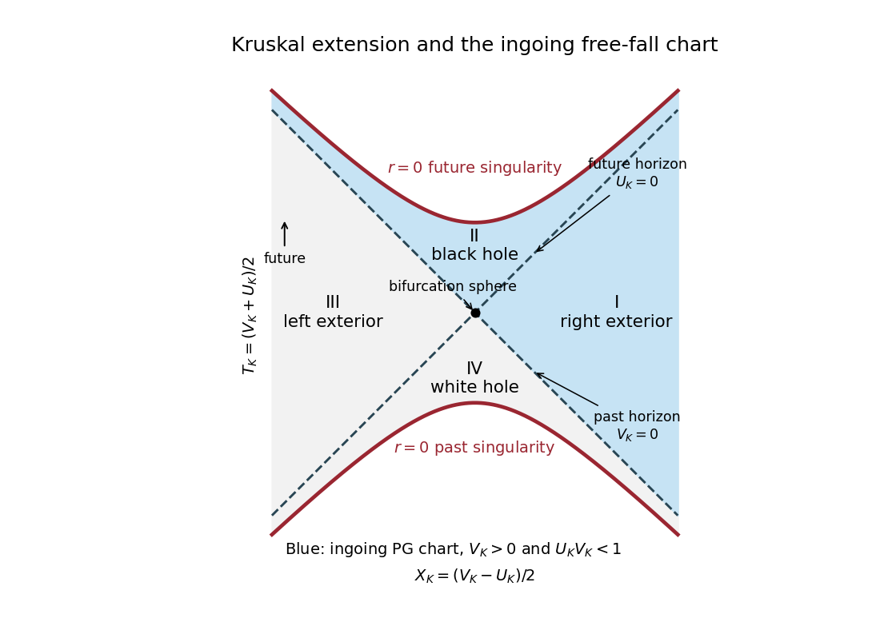

<h1 id="3/solution">Solution</h1>

↑ **Parent:** [3](../3.md)

Assume $M>0$ and use geometric units. The stationary [Killing vector field](../../../../../killing-vector-field.md) $K=\partial_t$ gives the conserved [Killing energy](../../../../../killing-energy.md) $E=-g(K,U)=f\dot t$. For radial motion, normalization of the [four-velocity](../../../../../four-velocity.md) gives $-f\dot t^2+f^{-1}\dot r^2=-1$. Combining these identities yields

$$
\boxed{f\dot t=E,\qquad \dot r^2+f=E^2.}
$$

At rest at infinity, $f\to1$ and $\dot r\to0$, so $E=1$. Choose the inward branch $\dot r=-\sqrt{2M/r}$. Its [proper time](../../../../../proper-time.md) from the [Schwarzschild event horizon](../../../../../schwarzschild-event-horizon.md) to the [curvature singularity](../../../../../curvature-singularity.md) is

$$
\boxed{\Delta\tau=\int_0^{2M}\sqrt{\frac r{2M}}\,dr=\frac{4M}{3}.}
$$

In ordinary units this is $4GM/(3c^3)$. The endpoint $r=0$ is not a regular centre of the [spacetime](../../../../../spacetime.md). This is the [Schwarzschild horizon-to-singularity proper time for fall from infinity](../../../../../schwarzschild-horizon-to-singularity-proper-time-for-fall-from-infinity.md), rather than a universal time for all infall energies.

For this [geodesic congruence](../../../../../geodesic-congruence-split.md), set $w(r)=\sqrt{2M/r}$. Its [four-velocity](../../../../../four-velocity.md) and metric dual are

$$
U=f^{-1}\partial_t-w\partial_r,
\qquad U_a\,dx^a=-dt-f^{-1}w\,dr.
$$

The right side is an exact one-form because $w/f$ depends only on $r$. Thus $U_a=-\partial_a\tau$, with [free-fall proper time in Schwarzschild spacetime](../../../../../free-fall-proper-time-in-schwarzschild-spacetime.md) determined by

$$
\boxed{d\tau=dt+\frac{w}{f}\,dr,\qquad
\tau=t+2\sqrt{2Mr}+2M\log\left|\frac{\sqrt r-\sqrt{2M}}{\sqrt r+\sqrt{2M}}\right|+\text{constant}.}
$$

Indeed $U^a\partial_a\tau=-U^aU_a=1$, so this scalar advances by the actual [proper time](../../../../../proper-time.md) on every member of the infalling [geodesic congruence](../../../../../geodesic-congruence-split.md), with a synchronized choice of additive offsets.

Substitution of $dt=d\tau-wf^{-1}dr$ in the [Schwarzschild metric](../../../../../schwarzschild-spacetime.md) gives

$$
-f\,dt^2+f^{-1}dr^2=-f\,d\tau^2+2w\,d\tau\,dr+dr^2.
$$

Using $f=1-w^2$, the [Painlevé–Gullstrand coordinates](../../../../../painleve-gullstrand-coordinates.md) therefore have

$$
\boxed{ds^2=-d\tau^2+(dr+w\,d\tau)^2+r^2d\Sigma^2.}
$$

All coefficients are finite at $r=2M$; the determinant of the $\tau,r$ block is $-f-w^2=-1$. Hence the horizon is a [coordinate singularity](../../../../../coordinate-singularity.md) of [Schwarzschild time](../../../../../schwarzschild-time.md), not a degeneracy of the metric. The new spatial slices have $d\ell^2=dr^2+r^2d\Sigma^2$, the flat Euclidean metric, and $g^{ab}\partial_a\tau\partial_b\tau=-1$ makes their normals the freely falling [four-velocities](../../../../../four-velocity.md). By contrast, the curvature scalar $R_{abcd}R^{abcd}=48M^2/r^6$ diverges at $r=0$; this genuine singularity is not removed.

For [Ingoing Eddington-Finkelstein coordinates](../../../../../ingoing-eddington-finkelstein-coordinates.md), use $v=t+r_*$ with $dr_*/dr=f^{-1}$, for example $r_*=r+2M\log|r/(2M)-1|$. Then

$$
ds^2=-f\,dv^2+2\,dv\,dr+r^2d\Sigma^2.
$$

Both constructions cross the future horizon. Their time functions have different meanings: $v=\text{constant}$ is an ingoing [null hypersurface](../../../../../null-hypersurface.md), whereas $\tau=\text{constant}$ is a flat spacelike hypersurface orthogonal to the infallers. Thus the former is adapted to ingoing [null geodesics](../../../../../null-geodesic.md), and the latter to a timelike free-fall clock congruence.

For the [Kruskal diagram](../../../../../kruskal-diagram.md), choose [Kruskal–Szekeres coordinates](../../../../../kruskal-szekeres-coordinates.md) with $U_K=-e^{-(t-r_*)/(4M)}$, $V_K=e^{(t+r_*)/(4M)}$ in the right exterior and extend them across its horizon. They obey

$$
U_KV_K=\left(1-\frac r{2M}\right)e^{r/(2M)},\qquad
ds^2=-\frac{32M^3}{r}e^{-r/(2M)}dU_K\,dV_K+r^2d\Sigma^2.
$$

The four regions of [Kruskal spacetime](../../../../../kruskal-spacetime.md) are I, the right exterior $(U_K<0,V_K>0)$; II, the future [black hole](../../../../../black-hole.md) $(U_K>0,V_K>0)$; III, the other exterior $(U_K>0,V_K<0)$; and IV, the past [white hole](../../../../../white-hole.md) $(U_K<0,V_K<0)$. The null axes are horizons, their intersection is the bifurcation two-sphere, and the spacelike boundaries $U_KV_K=1$ are the future and past curvature singularities. A point in this radial diagram represents a symmetry two-sphere.

**[Figure 1](#3/image-kruskal-extension-with-both-exteriors-black-hole-and-white-hole-the-ingoing-painleve-gullstrand-domain-is-shaded-blue). Kruskal extension with both exteriors, black hole and white hole; the ingoing Painlevé-Gullstrand domain is shaded blue**.

The [domain of the ingoing Painleve-Gullstrand chart](../../../../../domain-of-the-ingoing-painleve-gullstrand-chart.md) is **region I together with region II and their common future horizon**. More precisely, it is $V_K>0$, $U_KV_K<1$, or $r>0$ with finite $\tau$. To verify the boundary rather than infer it from the locally regular metric, put $\rho=\sqrt{r/(2M)}$ and write

$$
\tau=v+S(r),\qquad S(r)=4M\rho-2M\rho^2-4M\log(1+\rho).
$$

This follows by subtracting $r_*$ from the preceding radial primitive, and $S$ is finite at $r=2M$. Thus $V_K=\exp[(\tau-S(r))/(4M)]>0$ throughout the chart. Conversely every point with $V_K>0$ and $r>0$ gives a finite $\tau$. The past horizon $V_K=0$, the bifurcation sphere, region III and region IV are absent. Reversing the sign of the radial term produces the outgoing chart through the [white hole](../../../../../white-hole.md) instead.

## ↑ Ancestors (10)

1. [3](../3.md)
2. [Paper 52](../../paper-52-split.md)
3. [Iii](../../split.md)
4. [2010](../../../split.md)
5. [Past exam of the mathematics course of the University of Cambridge](../../../../split.md)
6. [Mathematics course of the University of Cambridge](../../../../../mathematics-course-of-the-university-of-cambridge.md)
7. [Course of the University of Cambridge](../../../../../course-of-the-university-of-cambridge.md)
8. [University of Cambridge](../../../../../university-of-cambridge-split.md)
9. [List of universities](../../../../../list-of-universities.md)
10. [Codex Wiki](../../../../../split.md)
