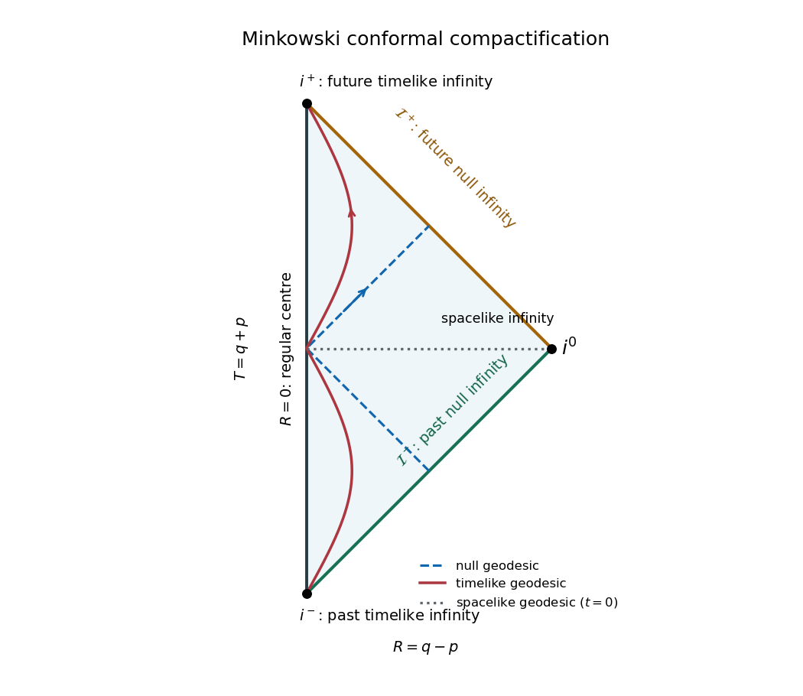

<h1 id="4/solution">Solution</h1>

↑ **Parent:** [4](../4.md)

The radial part of the [Minkowski metric](../../../../../minkowski-metric.md) becomes $-du\,dv$, and $r=(v-u)/2$. With $u=\tan p$, $v=\tan q$ and the positive [conformal factor](../../../../../conformal-factor.md) $\Omega=2\cos p\cos q$, multiplication by $\Omega^2$ gives

$$
\Omega^2(-du\,dv)=-4\,dp\,dq=-dT^2+dR^2,
\qquad
\Omega^2r^2=(\cos p\cos q)^2(\tan q-\tan p)^2=\sin^2(q-p).
$$

Consequently the [Minkowski conformal compactification](../../../../../minkowski-conformal-compactification.md) is

$$
\boxed{ds^2=\Omega^{-2}\left(-dT^2+dR^2+\sin^2R\,d\Sigma^2\right),\qquad
\Omega=\cos T+\cos R.}
$$

The spatial metric $dR^2+\sin^2R\,d\Sigma^2$ is the round unit three-sphere. The extended unphysical metric is therefore that of the [Einstein static universe](../../../../../einstein-static-universe.md), $\mathbb R\times S^3$ with unit spatial radius. Physical [Minkowski spacetime](../../../../../minkowski-spacetime.md) occupies only the diamond-shaped causal patch of this cylinder, or a triangle after restricting to nonnegative spherical radius; it is not the whole cylinder.

The complete coordinate ranges and joint restrictions are

$$
\begin{gathered}
t\in\mathbb R,\quad r\in[0,\infty),\quad\theta\in[0,\pi],\quad\phi\in[0,2\pi),\\
u,v\in\mathbb R,\quad u\le v,\\
-\frac\pi2<p\le q<\frac\pi2,\\
-\pi<T<\pi,\quad 0\le R<\pi,\quad |T|+R<\pi.
\end{gathered}
$$

The polar angles have the usual coordinate degeneracies at their poles and at $r=0$. In the extended [Einstein static universe](../../../../../einstein-static-universe.md) one may let $T\in\mathbb R$ and $0\le R\le\pi$, but these are not the ranges of the original physical patch. In its interior $\Omega>0$. The line $R=0$ is the regular centre $r=0$, not a component of infinity.

The [conformal completion](../../../../../conformal-completion.md) has [future timelike infinity](../../../../../future-timelike-infinity.md) $i^+=(\pi,0)$, [past timelike infinity](../../../../../past-timelike-infinity.md) $i^-=(-\pi,0)$, and [spacelike infinity](../../../../../spacelike-infinity.md) $i^0=(0,\pi)$. The open sloping boundaries are

$$
\mathcal I^+:T+R=\pi,\quad0<R<\pi,
\qquad
\mathcal I^-:T-R=-\pi,\quad0<R<\pi,
$$

namely [future null infinity](../../../../../future-null-infinity.md) and [past null infinity](../../../../../past-null-infinity.md). Each ordinary interior point of the radial diagram represents a two-sphere, and each point on either open null boundary represents a two-sphere of null directions.

**[Figure 2](#4/image-minkowski-penrose-triangle-with-timelike-spacelike-and-null-infinities-the-regular-centre-and-representative-causal-and-spacelike-geodesics). Minkowski Penrose triangle with timelike, spacelike and null infinities, the regular centre and representative causal and spacelike geodesics**.

A [timelike geodesic](../../../../../timelike-geodesic.md) is an inertial worldline $\boldsymbol x=\boldsymbol b+\boldsymbol\beta t$ with $|\boldsymbol\beta|<1$. As $t\to+\infty$, both $t-r$ and $t+r$ tend to $+\infty$, giving $p,q\to\pi/2$ and endpoint $i^+$. At past infinity both tend to $-\infty$, giving $i^-$. These endpoints are reached at infinite physical [proper time](../../../../../proper-time.md), although at finite conformal coordinate time $T$. A [null geodesic](../../../../../null-geodesic.md) has $r\sim|t|$. In its outgoing future, $u$ approaches a finite retarded time while $v\to+\infty$, giving an endpoint on $\mathcal I^+$; in its incoming past, $v$ has a finite limit and $u\to-\infty$, giving an endpoint on $\mathcal I^-$. A [spacelike geodesic](../../../../../spacelike-geodesic.md) is a straight line with spatial tangent larger than its temporal tangent, so $u\to-\infty$, $v\to+\infty$ at either end and both endpoints are $i^0$ in the compactified radial description. All these physical geodesics are complete. Only the unparametrized [null geodesics](../../../../../null-geodesic.md) are necessarily preserved as geodesics of the unphysical metric; timelike and spacelike images need not be its geodesics.

For horizons, distinguish a property of the [spacetime](../../../../../spacetime.md) from a property of an observer or of an initial-data hypersurface. Complete inertial observers have **no particle horizon**: in the flat cosmological slicing $a(t)=1$, the past light-travel distance $\int_{-\infty}^{t_0}dt$ is infinite. There is no finite-age initial singularity truncating communication between comoving observers. This statement does not say that an event receives signals from spacelike-separated events at the same time.

There is also no black-hole [event horizon](../../../../../event-horizon.md), because every event can send a future-directed null ray to [future null infinity](../../../../../future-null-infinity.md). Nevertheless **accelerated timelike observers can have both future and past observer event horizons**. For an entire observer worldline $\gamma$, define them by $H^+_\gamma=\partial I^-(\gamma)$ and $H^-_\gamma=\partial I^+(\gamma)$, using its complete future and past respectively. An inertial observer's chronological past and future of the whole worldline are both all of [Minkowski spacetime](../../../../../minkowski-spacetime.md). By contrast, for the uniformly accelerated worldline in a Cartesian spatial direction,

$$
t=a^{-1}\sinh(a\tau),\qquad x=a^{-1}\cosh(a\tau),\qquad y=z=0,
$$

its null coordinates obey $t-x=-a^{-1}e^{-a\tau}<0$ and $t+x=a^{-1}e^{a\tau}>0$. An event with $t-x<0$ can signal to a sufficiently late point of this worldline, whereas an event with $t-x\ge0$ cannot; finite transverse displacements do not change that conclusion as $t+x\to\infty$. Similarly the worldline can signal to precisely the events with $t+x>0$. Thus its two [observer event horizons](../../../../../observer-event-horizon.md) are

$$
\boxed{H^+_\gamma:\ t-x=0,\qquad H^-_\gamma:\ t+x=0.}
$$

They are the [Rindler horizons](../../../../../rindler-horizon.md), and their accessible common region is $x>|t|$. They do not indicate a [curvature singularity](../../../../../curvature-singularity.md) or a failure of global predictability.

Finally [Minkowski spacetime](../../../../../minkowski-spacetime.md) is a [globally hyperbolic spacetime](../../../../../globally-hyperbolic-spacetime.md): every inextendible [causal curve](../../../../../causal-curve.md) crosses each complete spacelike plane $t=t_0$ exactly once. Indeed $t$ is strictly monotone along future-directed [causal curves](../../../../../causal-curve.md), and the speed bound $|d\boldsymbol x/dt|\le1$ prevents an inextendible curve from ending at finite $t$ by escaping to spatial infinity. Its time range is therefore all of $\mathbb R$. These planes are [Cauchy hypersurfaces](../../../../../cauchy-surface.md) with full [domain of dependence](../../../../../domain-of-dependence.md), so **there are no Cauchy horizons associated with complete Cauchy data**.

A [Cauchy horizon](../../../../../cauchy-horizon.md) is, however, defined relative to a specified initial surface. Under a literal existence reading of “admits”, non-Cauchy initial surfaces can have such horizons even in flat [spacetime](../../../../../spacetime.md). For example the edgeless spacelike hyperboloid $\Sigma_a:\ t=\sqrt{a^2+r^2}$ has $D(\Sigma_a)=\{t>r\}$. To see this, inside the future light cone $t-r$ and $t+r$ are positive and nondecreasing on future-directed [causal curves](../../../../../causal-curve.md). Their product $t^2-r^2$ increases past $a^2$ on every future-inextendible curve from below the hyperboloid; every past-inextendible curve from above it crosses down through $a^2$ before leaving the cone. Outside the cone there is an inextendible null curve avoiding the hyperboloid. The future light cone itself is its past [Cauchy horizon](../../../../../cauchy-horizon.md). The time-reversed hyperboloid gives a future [Cauchy horizon](../../../../../cauchy-horizon.md). This is the [dependence of a Cauchy horizon on the initial hypersurface](../../../../../dependence-of-a-cauchy-horizon-on-the-initial-hypersurface.md), not an intrinsic loss of predictability of full [Minkowski spacetime](../../../../../minkowski-spacetime.md). Thus a categorical claim that no choice of partial initial surface can ever have a Cauchy horizon would be too strong.

## ↑ Ancestors (10)

1. [4](../4.md)
2. [Paper 52](../../paper-52-split.md)
3. [Iii](../../split.md)
4. [2010](../../../split.md)
5. [Past exam of the mathematics course of the University of Cambridge](../../../../split.md)
6. [Mathematics course of the University of Cambridge](../../../../../mathematics-course-of-the-university-of-cambridge.md)
7. [Course of the University of Cambridge](../../../../../course-of-the-university-of-cambridge.md)
8. [University of Cambridge](../../../../../university-of-cambridge-split.md)
9. [List of universities](../../../../../list-of-universities.md)
10. [Codex Wiki](../../../../../split.md)
