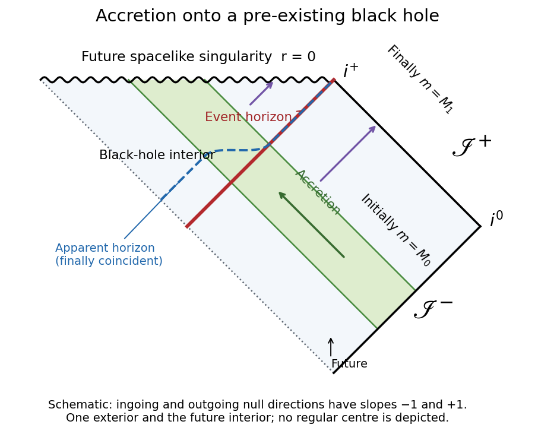

<h1 id="2/d/solution">Solution</h1>

↑ **Parent:** [D](../d.md)

In the final [Schwarzschild spacetime](../../../../../../schwarzschild-spacetime.md), an outgoing ray with $r>2M_1$ escapes to [future null infinity](../../../../../../future-null-infinity.md), whereas one with $r<2M_1$ cannot do so and ends at the [Schwarzschild singularity](../../../../../../schwarzschild-singularity.md). Their boundary is the outgoing [null geodesic](../../../../../../null-geodesic.md) $r=2M_1$. Since the final region continues indefinitely, the boundary of the [causal past](../../../../../../causal-past.md) of [future null infinity](../../../../../../future-null-infinity.md) there is exactly that [Schwarzschild event horizon](../../../../../../schwarzschild-event-horizon.md). Equivalently, integrating the outgoing equation backward from this final boundary selects the complete [event horizon](../../../../../../event-horizon.md). Thus

$$
\boxed{r_H(v)=2M_1\qquad(v>v_0).}
$$

The original [Penrose diagram](../../../../../../penrose-diagram.md) below shows the right-hand exterior and black-hole interior appropriate to ingoing coordinates. The green band is the ingoing accretion interval; the dashed blue curve is the spherical [apparent horizon](../../../../../../apparent-horizon.md) $r=2m(v)$. Outgoing [null geodesics](../../../../../../null-geodesic.md) escaping to [future null infinity](../../../../../../future-null-infinity.md) lie to the right of the red [event horizon](../../../../../../event-horizon.md); those to its left terminate on the future spacelike singularity. In the final stationary region the two horizons coincide. The red [event horizon](../../../../../../event-horizon.md) already lies outside $r=2M_0$ before the ingoing matter arrives, because its position is fixed by the future escape criterion.

**[Figure 1](#2/d/image-penrose-diagram-of-accretion-onto-a-pre-existing-schwarzschild-black-hole). Penrose diagram of accretion onto a pre-existing Schwarzschild black hole**.

## ↑ Ancestors (11)

1. [D](../d.md)
2. [2](../../2.md)
3. [Paper 54](../../../paper-54-split.md)
4. [Iii](../../../split.md)
5. [2010](../../../../split.md)
6. [Past exam of the mathematics course of the University of Cambridge](../../../../../split.md)
7. [Mathematics course of the University of Cambridge](../../../../../../mathematics-course-of-the-university-of-cambridge.md)
8. [Course of the University of Cambridge](../../../../../../course-of-the-university-of-cambridge.md)
9. [University of Cambridge](../../../../../../university-of-cambridge-split.md)
10. [List of universities](../../../../../../list-of-universities.md)
11. [Codex Wiki](../../../../../../split.md)
