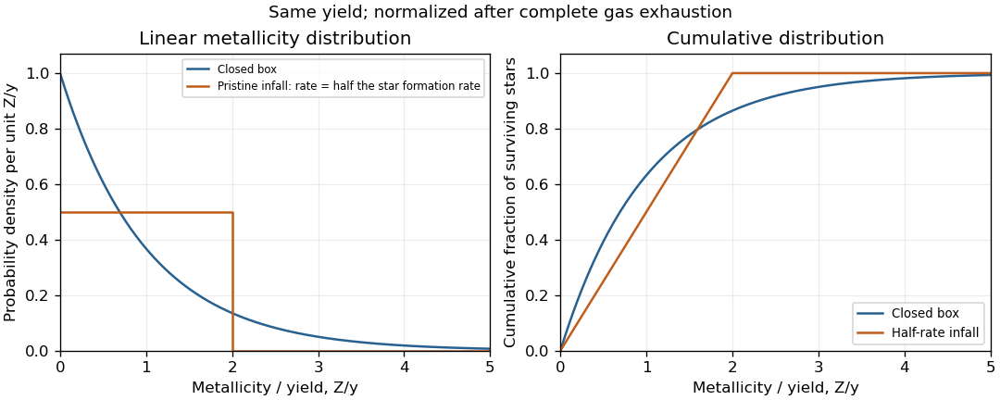

<h1 id="2/iii/solution">Solution</h1>

↑ **Parent:** [Iii](../iii.md)

The [closed-box model of galactic chemical evolution](../../../../../../closed-box-model-of-galactic-chemical-evolution.md) has $M=M_0e^{-Z/y}$ and $S=M_0-M$, giving $dN/dZ=(\kappa M_0/y)e^{-Z/y}$. To compare shapes without confusing different total stellar counts, the figure normalizes both [metallicity distribution functions](../../../../../../metallicity-distribution-function.md) to unit integral after complete gas exhaustion and uses $x=Z/y$:

$$
p_{\rm closed}(x)=e^{-x}\quad(x>0),\qquad
p_{\rm infall}(x)=\begin{cases}1/2,&0<x<2,\\0,&x>2.\end{cases}
$$

The right panel also shows the corresponding cumulative fractions, $1-e^{-x}$ and $\min(x/2,1)$.

**[Figure 1](#2/iii/image-normalized-linear-metallicity-distributions-and-cumulative-fractions-for-closed-box-and-half-rate-pristine-infall-models). Normalized linear metallicity distributions and cumulative fractions for closed-box and half-rate pristine-infall models**.

Pristine [galactic gas inflow](../../../../../../galactic-gas-inflow.md) replenishes the fuel and dilutes freshly produced metals, so enrichment per unit newly formed stellar mass is slower and asymptotes to $2y$. More [stars](../../../../../../star.md) are formed at later abundances; the [proportional-infall model of galactic chemical evolution](../../../../../../proportional-infall-model-of-galactic-chemical-evolution.md) makes twice as many [stars](../../../../../../star.md) as the closed box for the same initial gas mass in this limit. Consequently the normalized low-abundance fraction is smaller: for $Z\ll y$, it is $Z/(2y)$ rather than approximately $Z/y$. Their unnormalized $dN/dZ$ actually agree at $Z=0$ for the same $M_0$, which is why stating the normalization matters. At a finite stopping abundance $Z_f$, use $p_Z=1/Z_f$ for infall and $p_Z=e^{-Z/y}/[y(1-e^{-Z_f/y})]$ for the closed box, each truncated at its own chosen stopping point.

## ↑ Ancestors (11)

1. [Iii](../iii.md)
2. [2](../../2.md)
3. [Paper 60](../../../paper-60-split.md)
4. [Iii](../../../split.md)
5. [2010](../../../../split.md)
6. [Past exam of the mathematics course of the University of Cambridge](../../../../../split.md)
7. [Mathematics course of the University of Cambridge](../../../../../../mathematics-course-of-the-university-of-cambridge.md)
8. [Course of the University of Cambridge](../../../../../../course-of-the-university-of-cambridge.md)
9. [University of Cambridge](../../../../../../university-of-cambridge-split.md)
10. [List of universities](../../../../../../list-of-universities.md)
11. [Codex Wiki](../../../../../../split.md)
