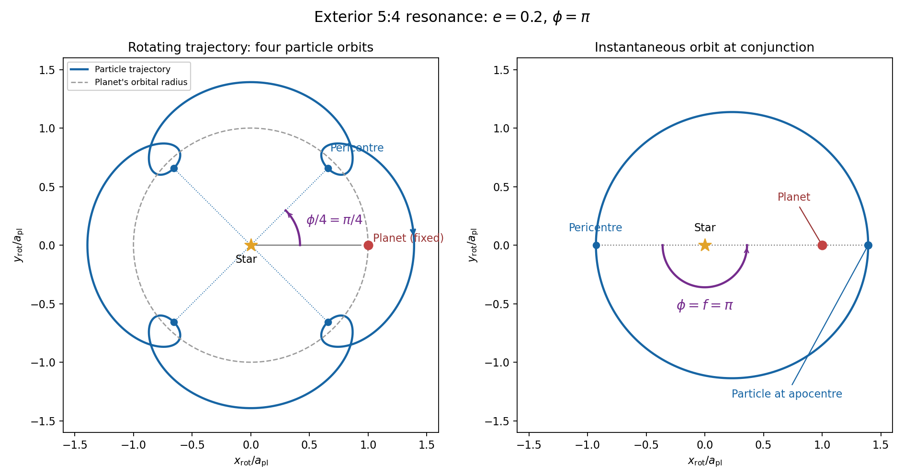

<h1 id="2/solution">Solution</h1>

↑ **Parent:** [2](../2.md)

Use $s=p+1$ and the [exterior mean-motion resonance](../../../../../exterior-mean-motion-resonance.md) condition $sn_r=pn_{\rm pl}$. Then the [resonant semi-major axis](../../../../../resonant-semi-major-axis.md) is $a_r=a_{\rm pl}(s/p)^{2/3}$, neglecting the small planet-to-star mass correction. For the geometric construction, take $a_{\rm pl}=n_{\rm pl}=1$, $p=4$, $e=0.2$, $\varpi=\pi/4$ and start the particle at [pericentre](../../../../../periapsis.md). Solve [Kepler's equation](../../../../../kepler-s-equation.md) $M=E-e\sin E$ with $M=(4/5)t$. Its coordinates in the [rotating reference frame](../../../../../rotating-reference-frame.md) are

$$
r=a_r(1-e\cos E),\qquad \theta_{\rm rot}=\varpi+f(E)-t.
$$

Four particle [orbital periods](../../../../../orbital-period.md) correspond to five planetary [orbital periods](../../../../../orbital-period.md), so the curve closes. At a [pericentre](../../../../../periapsis.md), the [mean longitude](../../../../../mean-longitude.md) and the [true longitude](../../../../../true-longitude.md) both equal $\varpi$, and the [resonant argument](../../../../../resonant-argument.md) becomes $\phi=4(\varpi-\lambda_{\rm pl})$. Thus the four [pericentre](../../../../../periapsis.md) directions are $\phi/4$ modulo $\pi/2$. The figure chooses $\phi=\pi$ and marks the corresponding $\pi/4$ angle to the planet; other phases rotate this pattern. Its second panel shows an instantaneous conjunction at apocentre, where the angle from pericentre to the common longitude is directly $\phi=\pi$: here both true and mean anomaly equal $\pi$. The loops near [pericentre](../../../../../periapsis.md) reflect the fact that the particle can temporarily overtake the planet in angular speed, despite its lower [mean motion](../../../../../mean-motion.md).

**[Figure 1](#2/image-exterior-5-4-resonance-with-eccentricity-0-2-and-resonant-phase-pi). Exterior 5:4 resonance with eccentricity 0.2 and resonant phase pi**.

For the evolution equations, $\lambda$ must be the [mean longitude](../../../../../mean-longitude.md). The PDF calls it [true longitude](../../../../../true-longitude.md), but differentiating the literal [true longitude](../../../../../true-longitude.md) gives the rapidly varying $\dot f$, not $n$. To first order $f=M+2e\sin M+O(e^2)$, so the [true longitude](../../../../../true-longitude.md) version of $\phi$ has an extra $2se\sin M+O(e^2)$ orbital ripple. The stated [Lagrange planetary equations](../../../../../lagrange-planetary-equations.md) and slow [complex eccentricity](../../../../../complex-eccentricity.md) equation are interpreted consistently as orbit-averaged equations in [mean longitude](../../../../../mean-longitude.md). The [pericentre geometry of an exterior resonance](../../../../../pericentre-geometry-of-an-exterior-resonance.md) above is unchanged by this distinction.

Let $F_r,F_\theta$ be perturbing [forces](../../../../../force.md), and let $m$ be the particle's [mass](../../../../../mass.md). The [angular momentum](../../../../../angular-momentum.md) about the star satisfies

$$
\dot{\boldsymbol L}=\boldsymbol r\times\boldsymbol F
=r\widehat{\boldsymbol r}\times(F_r\widehat{\boldsymbol r}+F_\theta\widehat{\boldsymbol\theta})
=\boxed{rF_\theta\widehat{\boldsymbol z}}.
$$

The central gravitational [force](../../../../../force.md) and the radial perturbation have zero [torque](../../../../../torque.md). If the displayed $F$ denotes [acceleration](../../../../../acceleration.md) instead, the identical formula applies to [specific angular momentum](../../../../../specific-angular-momentum.md).

For a weak kick, the [specific orbital energy](../../../../../specific-orbital-energy.md) changes by $\delta\varepsilon=v_r\delta v_r+v_\theta\delta v_\theta$. A planet leading the particle pulls it forwards, while a trailing planet pulls it backwards. For a nearly circular exterior [Kepler orbit](../../../../../kepler-orbit.md), a forward tangential kick raises [angular momentum](../../../../../angular-momentum.md) and [semi-major axis](../../../../../semi-major-axis.md), lowers [mean motion](../../../../../mean-motion.md), and makes the next [conjunction](../../../../../conjunction-astronomy.md) occur sooner in the synodic cycle. Its longitude retreats relative to the unperturbed conjunction sequence. A backward kick produces the opposite shift. At exact alignment the leading [force](../../../../../force.md) is radially inward: before [pericentre](../../../../../periapsis.md), $v_r<0$ and an inward kick does positive [work](../../../../../work.md); after [pericentre](../../../../../periapsis.md), $v_r>0$ and it does negative [work](../../../../../work.md). These likewise raise or lower [semi-major axis](../../../../../semi-major-axis.md). At an apsis, a purely radial infinitesimal kick has no first-order energy change but changes the [eccentricity vector](../../../../../eccentricity-vector.md), so [angular momentum](../../../../../angular-momentum.md) alone does not determine every timing change.

The timing sign follows explicitly from the near-circular [synodic period](../../../../../synodic-period.md), $T_{\rm syn}=2\pi/(n_{\rm pl}-n)$. At the nominal [resonance](../../../../../resonance.md), successive conjunction longitudes agree modulo $2\pi$, since $n_{\rm pl}T_{\rm syn}=2\pi s$. A persistent small change gives

$$
\delta\Lambda_{\rm next}=\frac{2\pi n_{\rm pl}\delta n}{(n_{\rm pl}-n)^2}
=-3\pi ps\frac{\delta a}{a}.
$$

This is the accumulated mean timing shift; an actual impulsive encounter can also change the instantaneous orbital phase and [longitude of periapsis](../../../../../longitude-of-periapsis.md).

Retaining the given first-order [resonant orbital perturbations](../../../../../resonant-orbital-perturbation.md), [eccentricity damping](../../../../../eccentricity-damping.md) and leading Keplerian detuning,

$$
\dot e=-C\sin\phi-Ae,\qquad
\dot\phi=sn-pn_{\rm pl}-\frac Ce\cos\phi
\simeq-Bx-\frac Ce\cos\phi,\qquad B=\frac32pn_{\rm pl}.
$$

Here [Kepler's third law](../../../../../kepler-s-third-law.md) gives $n=n_r(1+x)^{-3/2}=n_r(1-3x/2)+O(x^2)$. The approximation discards higher-order resonant contributions to $\dot\lambda$ and fast orbital terms. Differentiate the rotating [complex eccentricity](../../../../../complex-eccentricity.md) $z=e\exp(i\phi)$:

$$
\dot z=e^{i\phi}(\dot e+ie\dot\phi)
=-(A+iBx)z-Ce^{i\phi}(\sin\phi+i\cos\phi).
$$

Since $\sin\phi+i\cos\phi=ie^{-i\phi}$,

$$
\boxed{\dot z\simeq-iC-(A+\tfrac32ipn_{\rm pl}x)z.}
$$

The apparent singularity in $\dot\phi$ at $e=0$ disappears in this [complex eccentricity](../../../../../complex-eccentricity.md) equation.

Take $A>0$, and the conventional positive resonant coefficient $C>0$. At a [fixed point](../../../../../fixed-point.md), the two balance conditions $\dot e=0$ and $\dot a=0$ give

$$
C\sin\phi_f=-Ae_f,\qquad
-2sCe_f\sin\phi_f-\frac45A=0.
$$

Substitution yields

$$
\boxed{e_f^2=\frac{2}{5s},\qquad \sin\phi_f=-\frac{Ae_f}{C}.}
$$

Thus fixed points exist only if $A\le C\sqrt{5s/2}$. With strict inequality, put $S=\sqrt{(5/2)sC^2-A^2}$ and $\psi_f=\arctan(A/S)\in(0,\pi/2)$. Then

$$
\boxed{\phi_f=-\psi_f\ \text{or}\ \pi+\psi_f,\qquad x_f=-S/B\ \text{or}\ +S/B,}
$$

respectively. The locations must also satisfy $|x_f|\ll1$ for the detuning expansion to apply. At equality the phases merge at $3\pi/2$ and $x_f=0$. If $C$ is assigned the opposite sign, shift the phase convention by $\pi$; the invariant stability distinction is the sign of $C\cos\phi_f$.

For locally constant $A,C$, the [stable equilibrium](../../../../../stable-equilibrium.md) is the branch $\boxed{\phi_f=\pi+\psi_f,\ x_f>0}$ in the leading slow model. At fixed $e_f$, increasing $\phi$ on that branch increases the positive resonant [torque](../../../../../torque.md), because $\partial(\dot a/a)/\partial\phi=-2sCe_f\cos\phi_f>0$. The resulting increase in [semi-major axis](../../../../../semi-major-axis.md) lowers $n$ and hence lowers $\dot\phi$: the subsequent conjunctions shift back, restoring the phase. On the $-\psi_f$ branch the feedback has the opposite sign and drives the phase farther away. [Eccentricity damping](../../../../../eccentricity-damping.md) removes the oscillatory disturbance on the restoring branch.

One can verify that this feedback stabilizes the coupled variables rather than just the phase. Treat $A,C$ as locally constant, and write $z=u+iv$. Then $\dot u=-Au+Bxv$, $\dot v=-C-Av-Bxu$ and $\dot x\simeq-2sCv-4A/5$. At a fixed point $Bxv=Au$. The [characteristic polynomial](../../../../../characteristic-polynomial.md) of the [linear stability analysis](../../../../../linear-stability.md) is

$$
\lambda^3+2A\lambda^2+(A^2+B^2x_f^2-2BsCu_f)\lambda-4ABsCu_f.
$$

For $u_f=e_f\cos\phi_f<0$, all coefficients are positive and the cubic [Routh-Hurwitz stability criterion](../../../../../routh-hurwitz-stability-criterion.md) holds, since

$$
2A(A^2+B^2x_f^2-2BsCu_f)-(-4ABsCu_f)=2A(A^2+B^2x_f^2)>0.
$$

All three [eigenvalues](../../../../../eigenvalue.md) have negative real parts. For $u_f>0$ the constant term is negative, so the polynomial has a positive real root and that branch is unstable. The merged case has a zero [eigenvalue](../../../../../eigenvalue.md). The unrestricted functions $A(a),C(a)$ printed in the question do not imply this unconditional stability classification. If their derivatives are retained, $\dot x=(1+x)[-2sC(x)v-4A(x)/5]$ has, at equilibrium, the derivative

$$
\partial_x\dot x=(1+x_f)\frac45A_f\left(\frac{C_x}{C_f}-\frac{A_x}{A_f}\right).
$$

The trace of the full three-variable linearization is $-2A_f+\partial_x\dot x$. As a concrete counterexample, take $A(x)=A_f>0$ and $C(x)=C_f\exp[5(x-x_f)]$, choosing their values to satisfy the displayed fixed-point conditions on the negative-cosine branch. Its trace is $-2A_f+4A_f(1+x_f)>0$, so at least one [eigenvalue](../../../../../eigenvalue.md) has positive real part. Both coefficients are smooth. Thus the restoring conjunction feedback identifies the stable branch of the usual locally constant model, but additional assumptions on coefficient variation are necessary to assert stability for every allowed function.

## ↑ Ancestors (10)

1. [2](../2.md)
2. [Paper 61](../../paper-61-split.md)
3. [Iii](../../split.md)
4. [2010](../../../split.md)
5. [Past exam of the mathematics course of the University of Cambridge](../../../../split.md)
6. [Mathematics course of the University of Cambridge](../../../../../mathematics-course-of-the-university-of-cambridge.md)
7. [Course of the University of Cambridge](../../../../../course-of-the-university-of-cambridge.md)
8. [University of Cambridge](../../../../../university-of-cambridge-split.md)
9. [List of universities](../../../../../list-of-universities.md)
10. [Codex Wiki](../../../../../split.md)
