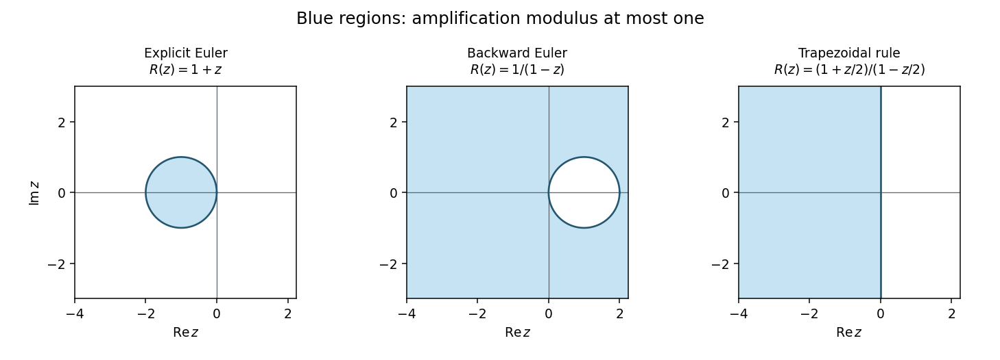

# Paper 63

↑ **Parent:** [Iii](../iii.md)

[https://www.maths.cam.ac.uk/postgrad/part-iii/files/pastpapers/2010/Paper63.pdf](https://www.maths.cam.ac.uk/postgrad/part-iii/files/pastpapers/2010/Paper63.pdf)

**Table of contents**

- [1](#1)
  - [1](#1/1)
    - [Solution](#1/1/solution)
  - [2](#1/2)
    - [Solution](#1/2/solution)
- [2](#2)
  - [1](#2/1)
    - [Solution](#2/1/solution)
  - [2](#2/2)
    - [Solution](#2/2/solution)
  - [3](#2/3)
    - [Solution](#2/3/solution)
- [3](#3)
  - [1](#3/1)
    - [Solution](#3/1/solution)
  - [2](#3/2)
    - [Solution](#3/2/solution)
- [4](#4)
  - [1](#4/1)
    - [Solution](#4/1/solution)
  - [2](#4/2)
    - [Solution](#4/2/solution)
  - [3](#4/3)
    - [Solution](#4/3/solution)
  - [4](#4/4)
    - [Solution](#4/4/solution)
- [5](#5)
  - [1](#5/1)
    - [Solution](#5/1/solution)
  - [2](#5/2)
    - [Solution](#5/2/solution)
  - [3](#5/3)
    - [Solution](#5/3/solution)
- [6](#6)
  - [Solution](#6/solution)
- [7](#7)
  - [Solution](#7/solution)

## 1

↑ **Parent:** [Paper 63](paper-63.md)

<h3 id="1/1">1</h3>

↑ **Parent:** [1](#1)

<h4 id="1/1/solution">Solution</h4>

↑ **Parent:** [1](#1/1)

For an autonomous [ordinary differential equation](../../../differential-equation.md#ordinary-differential-equation), the [chain rule](../../../calculus.md#chain-rule) gives $y''=f'(y)f(y)$. The formula is therefore a [multiderivative multistep method](../../../numerical-analysis.md#multiderivative-multistep-method). Insert the exact solution and expand the two earlier values about $t=t_{n+2}$:

$$
y(t-h)=y-hy'+\tfrac12h^2y''-\tfrac16h^3y'''+\tfrac1{24}h^4y^{(4)}+O(h^5),
$$

$$
y(t-2h)=y-2hy'+2h^2y''-\tfrac43h^3y'''+\tfrac23h^4y^{(4)}+O(h^5).
$$

The unscaled [local truncation error](../../../numerical-analysis.md#local-truncation-error) is

$$
y-\tfrac67hy'+\tfrac27h^2y''-\tfrac87y(t-h)+\tfrac17y(t-2h)
=\frac{h^4}{21}y^{(4)}+O(h^5).
$$

The coefficients through $h^3$ vanish, but the fourth-order coefficient does not. Hence **the method has order three**, not four: the one-step residual is $O(h^{p+1})$ for an order-$p$ multistep formula. Its [zero-stability](../../../numerical-analysis.md#zero-stability) [polynomial](../../../polynomial.md) is $(\zeta-1)(\zeta-1/7)$, with a simple unit root and the other root inside the [unit disk](../../../geometry-and-topology.md#unit-disk). Thus the stated order is also the convergence order for smooth solutions, starting errors $O(h^3)$, and the nearby implicit solution branch, by [convergence of a zero-stable multiderivative method](../../../numerical-analysis.md#convergence-of-a-zero-stable-multiderivative-method).

<h3 id="1/2">2</h3>

↑ **Parent:** [1](#1)

<h4 id="1/2/solution">Solution</h4>

↑ **Parent:** [2](#1/2)

**Yes: this is an A-stable third-order method.** Its second derivative is essential; the [Second Dahlquist barrier](../../../numerical-analysis.md#second-dahlquist-barrier) applies to ordinary first-derivative [linear multistep methods](../../../numerical-analysis.md#linear-multistep-method), not this [multiderivative multistep method](../../../numerical-analysis.md#multiderivative-multistep-method).

Apply the [Dahlquist test equation](../../../numerical-analysis.md#dahlquist-test-equation) $y'=\lambda y$ and put $z=h\lambda$. The amplification [polynomial](../../../polynomial.md) is

$$
Q(z)\zeta^2-8\zeta+1=0,\qquad Q(z)=7-6z+2z^2.
$$

We verify the [root condition for a multistep method](../../../numerical-analysis.md#root-condition-for-a-multistep-method) throughout $\operatorname{Re}z\le0$. For a quadratic $a\zeta^2+b\zeta+c$ with $|a|>|c|$, the [complex quadratic Schur criterion](../../../numerical-analysis.md#complex-quadratic-schur-criterion) is

$$
|\overline a b-c\overline b|<|a|^2-|c|^2
$$

for both roots to be strictly inside the [unit disk](../../../geometry-and-topology.md#unit-disk). Here is a brief justification of the criterion rather than just a root plot. Set $P^\#(\zeta)=\zeta^2\overline{P(1/\overline\zeta)}$. The [polynomial](../../../polynomial.md) $\overline aP-cP^\#$ is $\zeta(D\zeta+E)$, where $D=|a|^2-|c|^2$ and $E=\overline a b-c\overline b$. Its two roots are inside precisely when $|E|<D$. On the [unit circle](../../../complex-analysis.md#complex-unit-circle) $|P^\#|=|P|$, and $|c|<|a|$, so the [Rouche theorem](../../../complex-analysis.md#rouche-s-theorem) equates its interior root count with that of $P$. A boundary zero of $P$ would also be a boundary zero of the transformed [polynomial](../../../polynomial.md), which the strict inequality excludes. This proves the strict criterion; the non-strict form follows by continuity, with any unit root simple because $|c/a|<1$.

For the present [polynomial](../../../polynomial.md) it is enough to show $8|Q-1|<|Q|^2-1$, except at $z=0$. Write $z=-r+iy$, $r\ge0$, and put $k=r^2+3r$, $s=y^2$. Then

$$
Q=(7+2k-2s)-i(6+4r)y,
\qquad X:=|Q|^2-1=(2k+6)(2k+8)+8(k+1)s+4s^2>0.
$$

Direct expansion gives the nonnegative factorization

$$
X^2-64|Q-1|^2
=16\left[k(k+3)^2(k+8)+4k(k^2+8k+11)s
+2(3k^2+11k+6)s^2+4(k+1)s^3+s^4\right].
$$

Every term is nonnegative, and the sum is strictly positive unless $r=y=0$. Also $|Q|^2=X+1>1$, so the criterion applies. For every nonzero $z$ in the closed left half-plane both amplification roots are strictly inside the [unit disk](../../../geometry-and-topology.md#unit-disk). At $z=0$ they are $1$ and $1/7$, and the unit root is simple. Therefore

$$
\boxed{\text{the method is A-stable}.}
$$

This proof establishes stability of both the principal and parasitic modes, including on the imaginary axis.

<h2 id="2">2</h2>

↑ **Parent:** [Paper 63](paper-63.md)

<h3 id="2/1">1</h3>

↑ **Parent:** [2](#2)

<h4 id="2/1/solution">Solution</h4>

↑ **Parent:** [1](#2/1)

In the variational convention needed here, a [positive definite symmetric operator](../../../hilbert-space.md#positive-definite-symmetric-operator) on a real [Hilbert space](../../../hilbert-space.md) satisfies

$$
\langle Lu,v\rangle=\langle u,Lv\rangle,\qquad
\langle Lv,v\rangle>0\quad(v\ne0).
$$

For a bounded operator on the whole space, symmetry is [self-adjointness](../../../linear-operator-theory.md#self-adjoint-operator). On a complex [Hilbert space](../../../hilbert-space.md), the corresponding convention is Hermitian positivity; the quadratic expression is real. Strict positivity should be distinguished from [uniformly positive definite symmetric operator](../../../hilbert-space.md#uniformly-positive-definite-symmetric-operator) coercivity, which requires a fixed $\gamma>0$ such that $\langle Lv,v\rangle\ge\gamma\|v\|^2$.

Symmetry matters in a real space. If “positive definite” means only the inequality for the [quadratic form](../../../linear-algebra.md#quadratic-form), the next variational assertion is false: $L=\begin{pmatrix}1&-1\\1&1\end{pmatrix}$ has $\langle Lv,v\rangle=\|v\|^2>0$, but its skew part disappears from that form. Its [Euler-Lagrange equation](../../../analysis.md#euler-lagrange-equation) is $v=f$, not $Lv=f$. Thus the usual symmetric/Hermitian convention, or an explicit symmetry assumption, is required.

<h3 id="2/2">2</h3>

↑ **Parent:** [2](#2)

<h4 id="2/2/solution">Solution</h4>

↑ **Parent:** [2](#2/2)

For a real [Hilbert space](../../../hilbert-space.md), differentiate along an arbitrary direction $w$:

$$
\left.\frac d{d\varepsilon}I(v+\varepsilon w)\right|_{\varepsilon=0}
=\langle Lv,w\rangle+\langle Lw,v\rangle-2\langle f,w\rangle
=2\langle Lv-f,w\rangle.
$$

The last equality uses the symmetry in the definition of a [positive definite symmetric operator](../../../hilbert-space.md#positive-definite-symmetric-operator). Vanishing of this [first variation](../../../calculus-of-variations.md#first-variation) for every $w$ is equivalent to $Lv=f$, giving

$$
\boxed{Lu=f\quad\text{as the Euler-Lagrange equation}.}
$$

If $u$ solves it, expand the functional about $u$ to find

$$
I(u+w)-I(u)=\langle Lw,w\rangle.
$$

This is strictly positive for nonzero $w$, so $u$ is the unique minimizer. Conversely a minimizer has zero [first variation](../../../calculus-of-variations.md#first-variation) and solves the equation. On a complex [Hilbert space](../../../hilbert-space.md), use the real functional $\langle Lv,v\rangle-2\operatorname{Re}\langle f,v\rangle$ and real directional derivatives; varying $w$ and $iw$ yields the same result.

This proves the [quadratic variational principle for a symmetric positive operator](../../../hilbert-space.md#quadratic-variational-principle-for-a-symmetric-positive-operator), conditional on existence. Strict positivity in infinite dimension does not by itself guarantee a minimizer for every $f$: on $\ell^2$, the operator $(Lv)_j=v_j/j$ is strictly positive, but $f_j=1/j$ would require the non-square-summable solution $v_j=1$. A [coercive bilinear form](../../../linear-algebra.md#coercive-bilinear-form) supplies existence through the [Lax-Milgram theorem](../../../functional-analysis.md#lax-milgram-theorem) under its usual boundedness assumptions.

<h3 id="2/3">3</h3>

↑ **Parent:** [2](#2)

<h4 id="2/3/solution">Solution</h4>

↑ **Parent:** [3](#2/3)

Interpret the differential expression as $Lu=(pu'')''+qu$, with a suitable differential-operator domain and the stated clamped boundary conditions. For sufficiently smooth $u,v$ in that domain, twice integrating by parts gives

$$
\langle Lu,v\rangle
=\left[(pu'')'\overline v-pu''\overline{v'}\right]_{-1}^{1}
+\int_{-1}^{1}\left(pu''\overline{v''}+qu\overline v\right)dx
=\int_{-1}^{1}\left(pu''\overline{v''}+qu\overline v\right)dx.
$$

The boundary term vanishes because $v=v'=0$ at both ends. For real coefficients this form is symmetric/Hermitian. In particular

$$
\boxed{\langle Lu,u\rangle=\int_{-1}^{1}\left(p|u''|^2+q|u|^2\right)dx>0\quad(u\ne0).}
$$

Indeed nonnegativity follows from $p>0$ and $q\ge0$. If the integral were zero, $u''=0$ almost everywhere in the interval, so $u$ would be affine. Its endpoint values then force $u=0$. This proves strict positivity on the intended clamped domain and gives the [weak formulation of a clamped fourth-order equation](../../../sobolev-space.md#weak-formulation-of-a-clamped-fourth-order-equation).

There is a genuine domain issue in the literal wording. The closure of clamped smooth functions in the stated [L2 norm](../../../real-analysis.md#l2-norm) is all of $L^2(-1,1)$, since it contains the dense set $C_c^\infty(-1,1)$. Boundary traces are not retained by that closure, and a fourth-order expression does not define an operator on every element of $L^2$. For example $p=(1-x^2)^2$, $q=0$ satisfy the given sign conditions, but $u=\mathbf1_{(-1/2,1/2)}$ belongs to this closure and makes $(pu'')''$ a distribution rather than an $L^2$ function. Even a general twice-smooth function need not have the four derivatives required by the classical expression.

A rigorous classical repair is to take smooth enough coefficients, for example $p\in C^2([-1,1])$, $q\in C([-1,1])$, and use a clamped domain such as $H^4\cap H_0^2$ in $L^2$, with the appropriate operator realization. A weak repair uses the [clamped second-order Sobolev space](../../../sobolev-space.md#clamped-second-order-sobolev-space) $H_0^2$ and the form just displayed, with hypotheses ensuring its boundedness and closure; uniform positivity $p\ge p_0>0$ makes it coercive there. The integration-by-parts and strict-positivity proof does not need that stronger uniform bound, but existence and completion statements must not be inferred from the original $L^2$ closure alone. The printed $L[f]$ with an expression in $u$ is also a harmless variable-name mismatch; the calculation consistently uses $Lu$.

<h2 id="3">3</h2>

↑ **Parent:** [Paper 63](paper-63.md)

<h3 id="3/1">1</h3>

↑ **Parent:** [3](#3)

<h4 id="3/1/solution">Solution</h4>

↑ **Parent:** [1](#3/1)

Put $h=\Delta x$. The spatial operator is the sum of a centred $x$ difference and a [dissipative second-order forward advection stencil](../../../finite-difference.md#dissipative-second-order-forward-advection-stencil) in $y$. For a smooth function, their [Taylor expansions](../../../calculus.md#taylor-expansion) give

$$
\frac{u(x+h,y)-u(x-h,y)}{2h}
=u_x+\frac{h^2}{6}u_{xxx}+O(h^4),
$$

$$
\frac{-3u(x,y)+4u(x,y+h)-u(x,y+2h)}{2h}
=u_y-\frac{h^2}{3}u_{yyy}-\frac{h^3}{4}u_{yyyy}+O(h^4).
$$

Thus the leading spatial [local truncation error](../../../numerical-analysis.md#local-truncation-error) is $h^2(u_{xxx}/6-u_{yyy}/3)$, generally nonzero. **The semidiscretization is second order in space.** Time has not yet been discretized, so there is no separate time order or time-step condition at this stage.

<h3 id="3/2">2</h3>

↑ **Parent:** [3](#3)

<h4 id="3/2/solution">Solution</h4>

↑ **Parent:** [2](#3/2)

Use [von Neumann stability analysis](../../../finite-difference.md#von-neumann-stability-analysis) on the infinite grid. For the [Fourier mode](../../../fourier-analysis.md#fourier-mode) $u_{m,k}=\widehat u(t)e^{i(m\xi+k\eta)}$, the semidiscrete [eigenvalue](../../../linear-operator-theory.md#eigenvalue) is

$$
\lambda_h(\xi,\eta)=\frac1h\left[-\frac32-\frac12e^{-i\xi}+\frac12e^{i\xi}
+2e^{i\eta}-\frac12e^{2i\eta}\right]
=\frac{-(1-\cos\eta)^2+i[\sin\xi+(2-\cos\eta)\sin\eta]}h.
$$

Its real part is nonpositive for every frequency. The mode evolves by $\widehat u(t)=e^{t\lambda_h}\widehat u(0)$, whose modulus does not grow. The [discrete Fourier transform](../../../numerical-analysis.md#discrete-fourier-transform) and [Parseval identity](../../../fourier-analysis.md#parseval-identity) therefore yield

$$
\boxed{\|u(t)\|_{\ell_h^2}\le\|u(0)\|_{\ell_h^2}\quad(t\ge0),}
$$

with a bound independent of $h$, where $\|u\|_{\ell_h^2}^2=h^2\sum_{m,k}|u_{m,k}|^2$. Hence **the semidiscrete method is stable**. Frequencies with $\eta=0$ are nondissipative rather than unstable.

The same sign can be seen directly by [summation by parts](../../../analytic-number-theory.md#abel-s-summation-formula): the centred $x$ operator is skew-adjoint, and for the unitary $y$ shift $S_y$,

$$
\operatorname{Re}\langle u,D_{y,+,2}u\rangle_h
=-\frac1{4h}\|(S_y-I)^2u\|_h^2\le0.
$$

This is an energy version of the [dissipative second-order forward advection stencil](../../../finite-difference.md#dissipative-second-order-forward-advection-stencil). A subsequent time integrator would need its own stability condition; semidiscrete stability does not assert that every fully discrete method is stable.

## 4

↑ **Parent:** [Paper 63](paper-63.md)

<h3 id="4/1">1</h3>

↑ **Parent:** [4](#4)

<h4 id="4/1/solution">Solution</h4>

↑ **Parent:** [1](#4/1)

For $y'=f(t,y)$ and step $h$, a [collocation Runge-Kutta method](../../../numerical-analysis.md#collocation-runge-kutta-method) constructs a [polynomial](../../../polynomial.md) $P$ of degree at most $s$ on $[t_n,t_n+h]$ satisfying

$$
P(t_n)=y_n,\qquad
P'(t_n+c_i h)=f(t_n+c_i h,P(t_n+c_i h)),\quad 1\le i\le s.
$$

The step value is $y_{n+1}=P(t_n+h)$. Thus the differential equation holds exactly at the prescribed collocation nodes, while the initial value fixes the integration constant. For a smooth vector field and small enough $h$, the implicit stage equations have the local solution branch continuing the zero-step initial state; arbitrary large steps need not have a unique nonlinear solution.

<h3 id="4/2">2</h3>

↑ **Parent:** [4](#4)

<h4 id="4/2/solution">Solution</h4>

↑ **Parent:** [2](#4/2)

Let $\ell_j(\tau)=\prod_{k\ne j}(\tau-c_k)/(c_j-c_k)$ be the [Lagrange interpolation](../../../numerical-analysis.md#lagrange-polynomial) basis. Set $Y_i=P(t_n+c_i h)$ and $F_j=f(t_n+c_jh,Y_j)$. Since $P'$ is a [polynomial](../../../polynomial.md) of degree at most $s-1$, the collocation conditions give

$$
P'(t_n+\tau h)=\sum_{j=1}^s\ell_j(\tau)F_j.
$$

Integrate from zero to $c_i$ and to one to obtain

$$
Y_i=y_n+h\sum_j a_{ij}F_j,\qquad
y_{n+1}=y_n+h\sum_jb_jF_j,
$$

$$
\boxed{a_{ij}=\int_0^{c_i}\ell_j(\tau)d\tau,\qquad
b_j=\int_0^1\ell_j(\tau)d\tau.}
$$

These are the stage and update equations of a [Runge-Kutta method](../../../numerical-analysis.md#runge-kutta-method) with nodes $c_i$. Conversely, stages satisfying these equations reconstruct $P$ by integrating the displayed interpolation [polynomial](../../../polynomial.md), so the equivalence works in both directions. Because $\sum_j\ell_j=1$, they also satisfy the [collocation tableau row-sum identity](../../../numerical-analysis.md#collocation-tableau-row-sum-identity) $\sum_j a_{ij}=c_i$.

<h3 id="4/3">3</h3>

↑ **Parent:** [4](#4)

<h4 id="4/3/solution">Solution</h4>

↑ **Parent:** [3](#4/3)

The [collocation order theorem](../../../numerical-analysis.md#collocation-order-theorem) identifies the classical order with the order of its interpolatory quadrature. If $\sum_i b_i g(c_i)$ integrates every [polynomial](../../../polynomial.md) of degree at most $p-1$ exactly, but fails for some [polynomial](../../../polynomial.md) of degree $p$, then the collocation method has order $p$ for sufficiently smooth differential equations and the local implicit stage branch. With $s$ nodes, $s\le p\le2s$.

Equivalently, put $\pi_s(\tau)=\prod_i(\tau-c_i)$. If its first $k$ moments vanish,

$$
\int_0^1\tau^j\pi_s(\tau)d\tau=0\quad(0\le j<k),
$$

and the next does not, then $p=s+k$. [Polynomial](../../../polynomial.md) division explains the quadrature part: any [polynomial](../../../polynomial.md) through degree $s+k-1$ is a remainder of degree below $s$ plus $\pi_s$ times a [polynomial](../../../polynomial.md) of degree below $k$. The remainder is integrated exactly by interpolation, and the remaining integral vanishes. Conversely a nonzero next moment is an explicit failed quadrature test. The differential-equation order assertion is the collocation theorem being stated here. In particular [Gauss collocation methods](../../../numerical-analysis.md#gauss-legendre-method) achieve $2s$, [Radau IIA methods](../../../numerical-analysis.md#radau-iia-method) achieve $2s-1$, and endpoint-including [Lobatto IIIA methods](../../../numerical-analysis.md#lobatto-iiia-method) achieve $2s-2$ for $s\ge2$.

<h3 id="4/4">4</h3>

↑ **Parent:** [4](#4)

<h4 id="4/4/solution">Solution</h4>

↑ **Parent:** [4](#4/4)

**The tableau as printed is not a collocation tableau.** Its second stage row is $(3/4,3/4)$, whose sum is $3/2$, while the corresponding printed node is $1$. This violates the [collocation tableau row-sum identity](../../../numerical-analysis.md#collocation-tableau-row-sum-identity). The original PDF confirms this coefficient; it is not only a TeX transcription defect.

The required integrated basis at nodes $1/3,1$ is

$$
\ell_1(\tau)=\tfrac32(1-\tau),\qquad \ell_2(\tau)=\tfrac12(3\tau-1),
$$

so direct integration gives

$$
A=\begin{pmatrix}5/12&-1/12\\3/4&1/4\end{pmatrix},\qquad
b=\begin{pmatrix}3/4\\1/4\end{pmatrix},\qquad
c=\begin{pmatrix}1/3\\1\end{pmatrix}.
$$

Thus **replacing the last stage coefficient by $1/4$ gives the intended two-stage Radau IIA collocation method**. Its quadrature moments are

$$
b^T\mathbf1=1,\quad b^Tc=\tfrac12,\quad b^Tc^2=\tfrac13,
\quad b^Tc^3=\tfrac5{18}\ne\tfrac14.
$$

It integrates quadratics exactly but not cubics, so the [collocation order theorem](../../../numerical-analysis.md#collocation-order-theorem) gives **order three**. Independently, $b^TAc=1/6$, confirming the remaining third-order [Butcher order condition](../../../numerical-analysis.md#butcher-order-condition).

For completeness the literal printed [Runge-Kutta method](../../../numerical-analysis.md#runge-kutta-method) has only **order one**. For the autonomous equation $y'=y$, the [Taylor expansion](../../../calculus.md#taylor-expansion) of its [stability function](../../../numerical-analysis.md#stability-function) begins

$$
R(z)=1+z+(b^TA\mathbf1)z^2+O(z^3)
=1+z+\frac58z^2+O(z^3),
$$

whereas $e^z=1+z+z^2/2+O(z^3)$. Since $b^T\mathbf1=1$, it is consistent, but this discrepancy already rules out order two. Therefore neither the requested equivalence nor the third-order conclusion is true without the stated coefficient repair.

## 5

↑ **Parent:** [Paper 63](paper-63.md)

<h3 id="5/1">1</h3>

↑ **Parent:** [5](#5)

<h4 id="5/1/solution">Solution</h4>

↑ **Parent:** [1](#5/1)

Write $h=\Delta x=1/N$ and collect only the interior values, so the actual vector dimension is $(N-1)^2$. The PDF's $N^2$ [matrix](../../../vector-space.md#matrix) size and its indices $k,l$ are inconsistent with the declared interior grid $m,k=1,\ldots,N-1$; neither affects the following stability argument when the interior indexing is used consistently.

Use the discrete [L2 norm](../../../real-analysis.md#l2-norm) $\|u\|_h^2=h^2\sum_{m,k=1}^{N-1}|u_{m,k}|^2$, extending $u$ by zero to the boundary. Let $A$ be the horizontal flux operator and $B$ the vertical one. Each face coefficient is shared by its two adjacent grid values, so [summation by parts](../../../analytic-number-theory.md#abel-s-summation-formula) gives

$$
\langle u,Au\rangle_h=-\sum_{k=1}^{N-1}\sum_{m=0}^{N-1}
a_{m+1/2,k}|u_{m+1,k}-u_{m,k}|^2,
$$

$$
\langle u,Bu\rangle_h=-\sum_{m=1}^{N-1}\sum_{k=0}^{N-1}
a_{m,k+1/2}|u_{m,k+1}-u_{m,k}|^2.
$$

All boundary-face terms are included. Positivity of $a$ makes $A,B$ symmetric negative definite on the interior grid: zero in either energy sum forces each corresponding grid line to be constant, and its zero boundary endpoint forces that constant to vanish. Consequently

$$
\frac d{dt}\|u(t)\|_h^2=2\operatorname{Re}\langle u,(A+B)u\rangle_h\le0,
\qquad
\boxed{\|u(t)\|_h\le\|u(0)\|_h.}
$$

This bound is independent of the spatial mesh, proving semidiscrete stability. No time integrator or time-step restriction has yet been introduced.

<h3 id="5/2">2</h3>

↑ **Parent:** [5](#5)

<h4 id="5/2/solution">Solution</h4>

↑ **Parent:** [2](#5/2)

Put $\delta=\Delta t$ and $L=A+B$, keeping the spatial grid fixed for the temporal error assertion. The [matrix exponential](../../../linear-operator-theory.md#matrix-exponential) expansions give

$$
S_\delta:=e^{\delta A}e^{\delta B}
=I+\delta L+\delta^2(\tfrac12A^2+AB+\tfrac12B^2)+O(\delta^3),
$$

$$
E_\delta:=e^{\delta L}=I+\delta L+\tfrac12\delta^2(A^2+AB+BA+B^2)+O(\delta^3).
$$

Hence the [Lie-Trotter splitting commutator error](../../../numerical-analysis.md#lie-trotter-splitting-commutator-error) is

$$
S_\delta-E_\delta=\tfrac12\delta^2[A,B]+O(\delta^3).
$$

The energy estimate from part 1 makes $e^{tA}$, $e^{tB}$ and $e^{tL}$ contractions, so both $S_\delta$ and $E_\delta$ have norm at most one. Telescope their $n$th powers:

$$
S_\delta^n-E_\delta^n
=\sum_{j=0}^{n-1}S_\delta^{n-1-j}(S_\delta-E_\delta)E_\delta^j.
$$

For $n\delta\le T$, this gives

$$
\boxed{\|S_\delta^nu^0-e^{n\delta L}u^0\|_h
\le nC_h\delta^2\|u^0\|_h\le C_hT\delta\|u^0\|_h.}
$$

Thus the [Lie-Trotter splitting](../../../numerical-analysis.md#lie-product-formula) has global temporal error $O(\Delta t)$. The constant here may depend on the fixed spatial operators; a mesh-uniform joint-limit error estimate needs additional regularity and [commutator](../../../lie-algebra.md#commutator) bounds. If $A$ and $B$ commute, this particular exponential splitting is exact, but variable diffusion coefficients generally remove that commutativity.

<h3 id="5/3">3</h3>

↑ **Parent:** [5](#5)

<h4 id="5/3/solution">Solution</h4>

↑ **Parent:** [3](#5/3)

The $[1/1]$ [Padé approximant](../../../isolated-singularity.md#pade-approximant) of the exponential is $r(z)=(1+z/2)/(1-z/2)$. Replacing each exponential in its original order gives the split [Crank-Nicolson method](../../../numerical-analysis.md#crank-nicolson-method)

$$
u^{n+1}=C_A(\delta)C_B(\delta)u^n,
\qquad C_A(\delta)=(I-\delta A/2)^{-1}(I+\delta A/2),
$$

with the analogous definition for $B$. Operationally, first solve the $B$ substep and then the $A$ substep. The matrices $I-\delta A/2$, $I-\delta B/2$ are invertible for every $\delta\ge0$, since $A,B$ are symmetric negative definite.

An orthonormal eigenbasis of $A$ diagonalizes $C_A$. Its [eigenvalue](../../../linear-operator-theory.md#eigenvalue) for $\lambda\le0$ is

$$
r(\delta\lambda)=\frac{1+\delta\lambda/2}{1-\delta\lambda/2},\qquad
|r(\delta\lambda)|\le1.
$$

Therefore $\|C_A\|_h\le1$, and similarly $\|C_B\|_h\le1$. Submultiplicativity gives the [contractivity of split Crank-Nicolson diffusion](../../../numerical-analysis.md#contractivity-of-split-crank-nicolson-diffusion):

$$
\boxed{\|u^{n+1}\|_h\le\|u^n\|_h\quad\text{for every }\mu=\Delta t/h^2\ge0.}
$$

No commutativity or simultaneous diagonalization is needed for this product bound. This proves unconditional discrete $L^2$ stability, not positivity of every stencil weight or unconditional maximum-norm monotonicity. Nor do the individually second-order rational substeps make the ordered splitting second order: when $[A,B]\ne0$, its leading splitting defect remains $\delta^2[A,B]/2$.

## 6

↑ **Parent:** [Paper 63](paper-63.md)

<h3 id="6/solution">Solution</h3>

↑ **Parent:** [6](#6)

**A-stability removes the scalar linear decay restriction on the step size; it does not replace accuracy, nonlinear solvability or a suitable system norm.** Its importance is clearest for a [stiff differential equation](../../../numerical-analysis.md#stiff-equation), where rapidly decaying modes coexist with slowly varying quantities of interest. On the [Dahlquist test equation](../../../numerical-analysis.md#dahlquist-test-equation) $y'=\lambda y$, the exact solution decays for $\operatorname{Re}\lambda<0$. A stable time integrator should not turn that decay into numerical growth.

For a one-step method write $y_{n+1}=R(z)y_n$, where $z=h\lambda$ and $R$ is its [stability function](../../../numerical-analysis.md#stability-function). Its [linear stability domain](../../../numerical-analysis.md#linear-stability-domain) consists of parameters with $|R(z)|\le1$ and a well-defined update. The method is [A-stable](../../../numerical-analysis.md#a-stability) when this domain contains the closed left half-plane. A consistent order-$p$ one-step method has $R(z)=e^z+O(z^{p+1})$ near zero, but that local agreement alone says nothing about stability at large negative $z$.

For a [Runge-Kutta method](../../../numerical-analysis.md#runge-kutta-method) with stage [matrix](../../../vector-space.md#matrix) $A$, weights $b$ and $\mathbf1=(1,\ldots,1)^T$, eliminating the stages on the test equation gives

$$
R(z)=1+zb^T(I-zA)^{-1}\mathbf1.
$$

An explicit finite-stage method has a [polynomial](../../../polynomial.md) $R$. A nonconstant [polynomial](../../../polynomial.md) is unbounded along the negative real axis, so **no consistent explicit [Runge-Kutta method](../../../numerical-analysis.md#runge-kutta-method) is A-stable**. The [explicit Euler method](../../../numerical-analysis.md#euler-method), with $R(z)=1+z$, is stable in the disk $|1+z|\le1$ and on the negative real axis only for $-2\le z\le0$. A stiff mode with a large negative [eigenvalue](../../../linear-operator-theory.md#eigenvalue) therefore forces an unnecessarily small step even after its exact contribution has almost disappeared.

The [Backward Euler method](../../../numerical-analysis.md#backward-euler-method) has $R(z)=1/(1-z)$. For $\operatorname{Re}z\le0$, $|1-z|^2=1-2\operatorname{Re}z+|z|^2\ge1$, so it is [A-stable](../../../numerical-analysis.md#a-stability). The [trapezoidal rule](../../../numerical-analysis.md#trapezoidal-rule) has

$$
R(z)=\frac{1+z/2}{1-z/2},\qquad
|1-z/2|^2-|1+z/2|^2=-2\operatorname{Re}z\ge0,
$$

and is also [A-stable](../../../numerical-analysis.md#a-stability). The [implicit midpoint method](../../../numerical-analysis.md#implicit-midpoint-rule) has the same scalar [stability function](../../../numerical-analysis.md#stability-function), although its nonlinear update differs from the trapezoidal rule. The first method has order one and the latter two order two. Their implicit solves trade greater work per step for freedom from the scalar stiff stability restriction.

**[Figure 1](#6/image-absolute-stability-domains-of-explicit-euler-backward-euler-and-the-trapezoidal-rule-shaded-regions-satisfy-modulus-of-the-amplification-factor-at-most-one). Absolute stability domains of explicit Euler, backward Euler and the trapezoidal rule; shaded regions satisfy modulus of the amplification factor at most one**.

Damping of very stiff modes separates [A-stability](../../../numerical-analysis.md#a-stability) from [L-stability](../../../numerical-analysis.md#l-stability). For a one-step method, the latter additionally requires $R(z)\to0$ as $z$ tends to infinity in the left half-plane. [Backward Euler method](../../../numerical-analysis.md#backward-euler-method) satisfies this. The trapezoidal and midpoint rules instead have $R(z)\to-1$ along the negative real axis: a very stiff mode can alternate in sign with little damping even though its amplitude remains bounded. [L-stability](../../../numerical-analysis.md#l-stability) is often preferable for diffusion and rapid relaxation, while retaining oscillatory modes can be desirable in conservative dynamics.

For a [linear multistep method](../../../numerical-analysis.md#linear-multistep-method), write

$$
\sum_{j=0}^k\alpha_jy_{n+j}=h\sum_{j=0}^k\beta_jf_{n+j},\qquad
\rho(\zeta)=\sum_j\alpha_j\zeta^j,\quad \sigma(\zeta)=\sum_j\beta_j\zeta^j.
$$

Its test-equation amplification roots satisfy $\rho(\zeta)-z\sigma(\zeta)=0$. [Absolute stability](../../../numerical-analysis.md#linear-stability-domain) requires every root to lie in the [unit disk](../../../geometry-and-topology.md#unit-disk) or on its boundary with all unit-modulus roots simple; all parasitic modes matter. At $z=0$ this is the [zero-stability](../../../numerical-analysis.md#zero-stability) root condition. Consistency requires $\rho(1)=0$ and $\rho'(1)=\sigma(1)$, and the [Dahlquist equivalence theorem](../../../numerical-analysis.md#dahlquist-equivalence-theorem) combines consistency and [zero-stability](../../../numerical-analysis.md#zero-stability) to characterize convergence. Thus a claim of stability obtained by canceling a common factor is not a proof about the original recurrence and its arbitrary consistent starting data.

Explicit [linear multistep methods](../../../numerical-analysis.md#linear-multistep-method) cannot be [A-stable](../../../numerical-analysis.md#a-stability) either. If $\beta_k=0$ and $\alpha_k\ne0$, some lower coefficient of $\rho-z\sigma$ becomes unbounded as $z\to-\infty$, while the leading coefficient stays fixed. If all roots remained in the [unit disk](../../../geometry-and-topology.md#unit-disk), every coefficient-to-leading-coefficient ratio, an elementary symmetric function of those roots, would remain bounded. This contradiction forces an unstable root.

An important implicit example is [BDF2 method](../../../numerical-analysis.md#second-order-backward-differentiation-formula), whose characteristic equation is $(3-2z)\zeta^2-4\zeta+1=0$. A unit root $\zeta=e^{i\theta}$ gives

$$
z(\theta)=\tfrac12(3-4e^{-i\theta}+e^{-2i\theta}),\qquad
\operatorname{Re}z(\theta)=(1-\cos\theta)^2\ge0.
$$

The leading coefficient vanishes only at $z=3/2$, outside the left half-plane. Near a small negative $z$, both roots are inside the disk; no unit-circle crossing can occur in the connected open left half-plane. On the imaginary axis the boundary equality can occur only at $z=0$, where the roots are $1,1/3$. Hence BDF2 is [A-stable](../../../numerical-analysis.md#a-stability) and its two roots tend to zero for very large negative $z$, giving strong stiff-mode damping. This is a complete boundary-locus argument, not just a boundary plot.

The [Second Dahlquist barrier](../../../numerical-analysis.md#second-dahlquist-barrier) says that a convergent [A-stable](../../../numerical-analysis.md#a-stability) ordinary [linear multistep method](../../../numerical-analysis.md#linear-multistep-method) has order at most two. This theorem does not limit [implicit Runge-Kutta methods](../../../numerical-analysis.md#implicit-runge-kutta-method) or [multiderivative multistep methods](../../../numerical-analysis.md#multiderivative-multistep-method). In particular the [A-stable third-order two-step multiderivative method](../../../numerical-analysis.md#a-stable-third-order-two-step-multiderivative-method) in question 1 uses $y''$ and satisfies different order conditions. Among [collocation Runge-Kutta methods](../../../numerical-analysis.md#collocation-runge-kutta-method), the standard family results give [Gauss collocation methods](../../../numerical-analysis.md#gauss-legendre-method) order $2s$ with diagonal $[s/s]$ [Padé approximants](../../../isolated-singularity.md#pade-approximant) to $e^z$ as [stability functions](../../../numerical-analysis.md#stability-function), and [Radau IIA methods](../../../numerical-analysis.md#radau-iia-method) order $2s-1$ with subdiagonal $[s-1/s]$ approximants. Both families are [A-stable](../../../numerical-analysis.md#a-stability); the Gauss functions have a nonzero limit at infinity, whereas Radau IIA is [L-stable](../../../numerical-analysis.md#l-stability). The corrected two-stage right-Radau method, for example, has

$$
R(z)=\frac{1+z/3}{1-2z/3+z^2/6},
$$

which matches the exponential through cubic order and tends to zero at infinity. Its poles $2\pm i\sqrt2$ lie in the right half-plane. For $z=-r+iy$, $r\ge0$, direct subtraction gives

$$
|1-2z/3+z^2/6|^2-|1+z/3|^2
=\frac{r(r+6)(r^2+2r+12)+2r(r+4)y^2+y^4}{36}\ge0,
$$

proving its [A-stability](../../../numerical-analysis.md#a-stability) directly.

Sectorial [A-alpha stability](../../../numerical-analysis.md#a-alpha-stability) relaxes the requirement to a sector around the negative real axis, useful when the spectrum of a stiff problem remains in that sector; higher-order backward differentiation formulas illustrate the usefulness of this weaker requirement. For a normal linear system $y'=Ly$, unitary diagonalization reduces the numerical update to its scalar factors $R(h\lambda_j)$. For a nonnormal system, a scalar [eigenvalue](../../../linear-operator-theory.md#eigenvalue) test alone does not give a uniform bound in the chosen norm. Nonlinear stability is different again: [B-stability](../../../numerical-analysis.md#b-stability) asks for contractivity when $\operatorname{Re}\langle f(u)-f(v),u-v\rangle\le0$, and [algebraic stability of a Runge-Kutta method](../../../numerical-analysis.md#algebraic-stability-of-a-runge-kutta-method) is a standard sufficient criterion. Thus [A-stability](../../../numerical-analysis.md#a-stability) addresses a precise and valuable linear test, while step selection still has to meet accuracy requirements and the actual implicit equations must be solved on the relevant branch.

## 7

↑ **Parent:** [Paper 63](paper-63.md)

<h3 id="7/solution">Solution</h3>

↑ **Parent:** [7](#7)

**[Eigenvalue](../../../linear-operator-theory.md#eigenvalue) analysis proves mesh-uniform stability when it is accompanied by control of [eigenvectors](../../../linear-operator-theory.md#eigenvector) or an energy norm; the signs of [eigenvalues](../../../linear-operator-theory.md#eigenvalue) alone are insufficient.** For an evolution equation, the [method of lines](../../../finite-difference.md#method-of-lines) first produces $u_h'=L_hu_h$. A time integrator then gives an amplification [matrix](../../../vector-space.md#matrix) $S_{h,\delta}$, for example $S_{h,\delta}=R(\delta L_h)$ for a [Runge-Kutta method](../../../numerical-analysis.md#runge-kutta-method). The useful stability requirement on a fixed physical time interval is

$$
\sup_{n\delta\le T}\|S_{h,\delta}^n\|_h\le C_T,
$$

where $C_T$ is independent of the refining spatial and temporal meshes. The semidiscrete analogue is $\|e^{tL_h}\|_h\le C_T$ for $0\le t\le T$. These are bounds on propagation of initial errors and residuals, not merely statements that each finite [matrix](../../../vector-space.md#matrix) has a bounded solution over its own finite time interval.

If $L_h$ is a [normal matrix](../../../linear-operator-theory.md#normal-matrix) in the chosen discrete [inner product](../../../linear-algebra.md#inner-product), it has a unitary eigenbasis. Then

$$
\|e^{tL_h}\|_h=\max_j e^{t\operatorname{Re}\lambda_j},\qquad
\|R(\delta L_h)^n\|_h=\max_j|R(\delta\lambda_j)|^n.
$$

For dissipative problems it is sufficient that every $\delta\lambda_j$ lie in the integrator's [linear stability domain](../../../numerical-analysis.md#linear-stability-domain). A diagonalizable family also suffices if its [eigenvector](../../../linear-operator-theory.md#eigenvector) matrices have uniformly bounded [condition numbers](../../../linear-algebra.md#condition-number): the same maximum is multiplied by $\|V_h\|\|V_h^{-1}\|$. Without that uniform bound the argument does not establish mesh stability. For finite-time estimates, an amplification modulus $1+O(\delta)$ can also be acceptable; strict contraction at every step is a stronger property.

For a constant-coefficient stencil on the full lattice or a periodic grid, [von Neumann stability analysis](../../../finite-difference.md#von-neumann-stability-analysis) provides the [eigenvectors](../../../linear-operator-theory.md#eigenvector) explicitly. A [Fourier mode](../../../fourier-analysis.md#fourier-mode) diagonalizes each translation-invariant spatial difference, giving a scalar symbol $\lambda_h(\theta)$ or a small [matrix](../../../vector-space.md#matrix) symbol for a system. The [discrete Fourier transform](../../../numerical-analysis.md#discrete-fourier-transform) and [Parseval identity](../../../fourier-analysis.md#parseval-identity) turn a uniform modal bound into an actual discrete [L2 norm](../../../real-analysis.md#l2-norm) bound. The two-dimensional stencil in question 3 has $\operatorname{Re}\lambda_h=-(1-\cos\eta)^2/h\le0$, so its continuous-time amplification is contractive; a later time integrator must still be checked. With boundaries one must analyze the boundary rows as well: a whole-line [Fourier symbol](../../../finite-difference.md#fourier-symbol-of-a-difference-operator) cannot detect an unstable boundary closure.

For the heat equation $u_t=\kappa u_{xx}$ on a unit interval with zero Dirichlet data, the centred second difference has a sine eigenbasis and [eigenvalues](../../../linear-operator-theory.md#eigenvalue)

$$
\lambda_j=-\frac{4\kappa}{h^2}\sin^2\frac{j\pi}{2N},\qquad h=1/N,\quad 1\le j<N.
$$

[Explicit Euler method](../../../numerical-analysis.md#euler-method) multiplies mode $j$ by $1+\delta\lambda_j$. Requiring all factors to have modulus at most one yields $\kappa\delta/h^2\le1/[2\sin^2((N-1)\pi/(2N))]$ on a given grid, and the sharp grid-independent sufficient limit is

$$
\boxed{\kappa\delta/h^2\le\tfrac12\quad\text{in one dimension},
\qquad \kappa\delta/h^2\le\tfrac14\quad\text{on the standard equal-mesh two-dimensional grid}.}
$$

These parabolic time-step restrictions express the growth of the largest-magnitude diffusion [eigenvalue](../../../linear-operator-theory.md#eigenvalue) like $h^{-2}$. [Backward Euler method](../../../numerical-analysis.md#backward-euler-method) instead has factor $(1-\delta\lambda_j)^{-1}$ and the [Crank-Nicolson method](../../../numerical-analysis.md#crank-nicolson-method) factor $(1+\delta\lambda_j/2)/(1-\delta\lambda_j/2)$, both bounded by one for every $\delta\ge0$. Their unconditional stability follows from [A-stability](../../../numerical-analysis.md#a-stability), with much stronger damping of the shortest scales for backward Euler.

For $u_t=-a u_x$, $a>0$, explicit time stepping with a backward spatial difference gives

$$
S(\theta)=1-\nu+\nu e^{-i\theta},\qquad \nu=a\delta/h,
\qquad |S(\theta)|^2=1-2\nu(1-\nu)(1-\cos\theta).
$$

Thus the [upwind finite difference scheme](../../../finite-difference.md#upwind-finite-difference-scheme) is contractive exactly for $0\le\nu\le1$, a [Courant–Friedrichs–Lewy condition](../../../finite-difference.md#courant-friedrichs-lewy-condition) matching the direction and speed of information propagation. A centred spatial difference has purely imaginary [eigenvalues](../../../linear-operator-theory.md#eigenvalue), and forward Euler gives $|S|^2=1+\nu^2\sin^2\theta>1$. Under a fixed positive hyperbolic Courant number, high-frequency data grow by a fixed factor in each of $O(1/h)$ steps, proving instability as the mesh is refined. This is not a claim that no exceptionally small coupled step can ever give a finite-time bound: if $\delta=O(h^2)$, the excess per step is only $O(\delta)$, but the usual hyperbolic scaling is unstable. Higher-order explicit integrators can possess nontrivial imaginary-axis stability intervals and are then suitable for skew-adjoint advection or the energy-form first-order wave equation.

Variable coefficients usually prevent Fourier diagonalization, but may preserve a [self-adjoint](../../../linear-operator-theory.md#self-adjoint-operator) spatial operator. The positive-face diffusion discretization in question 5 is an example. Its discrete energy identity makes $A+B$ symmetric negative definite, so a unitary eigenbasis still exists even without a closed [eigenvalue](../../../linear-operator-theory.md#eigenvalue) formula. More generally, a [dissipative operator](../../../functional-analysis.md#dissipative-operator) $L_h$ in a discrete energy [inner product](../../../linear-algebra.md#inner-product) obeys

$$
\frac d{dt}\|u_h\|_h^2=2\operatorname{Re}\langle L_hu_h,u_h\rangle_h\le0,
$$

which directly proves a uniform semigroup estimate. The [dissipative Cayley-transform contraction](../../../functional-analysis.md#dissipative-cayley-transform-contraction) also follows without normality: for $\alpha\ge0$,

$$
\|(I+\alpha L_h)v\|_h^2-\|(I-\alpha L_h)v\|_h^2
=4\alpha\operatorname{Re}\langle L_hv,v\rangle_h\le0.
$$

Taking $v=(I-\alpha L_h)^{-1}u$ proves contraction of the Crank–Nicolson factor. The [contractivity of split Crank-Nicolson diffusion](../../../numerical-analysis.md#contractivity-of-split-crank-nicolson-diffusion) then follows from multiplying two contraction bounds; simultaneous [eigenvectors](../../../linear-operator-theory.md#eigenvector) of the two directional matrices are unnecessary.

The [negative spectra do not imply uniform semidiscrete stability](../../../finite-difference.md#negative-spectra-do-not-imply-uniform-semidiscrete-stability) example shows what can go wrong. Let

$$
L_h=\begin{pmatrix}-1&h^{-1}\\0&-1\end{pmatrix},\qquad
 e^{tL_h}=e^{-t}\begin{pmatrix}1&t/h\\0&1\end{pmatrix}.
$$

Both [eigenvalues](../../../linear-operator-theory.md#eigenvalue) are $-1$ for every mesh, but applying the propagator to the second unit vector at $t=1$ gives norm at least $1/(eh)$. The evolution is therefore not mesh-uniformly stable. For a discrete [matrix](../../../vector-space.md#matrix), a unit-modulus [eigenvalue](../../../linear-operator-theory.md#eigenvalue) with a nontrivial [Jordan block](../../../linear-operator-theory.md#jordan-block) gives powers growing polynomially in the step number. Even strictly interior [eigenvalues](../../../linear-operator-theory.md#eigenvalue) can allow large transient growth when [eigenvectors](../../../linear-operator-theory.md#eigenvector) are badly conditioned. A [pseudospectrum](../../../banach-algebra.md#pseudospectrum) or [numerical range of an operator](../../../functional-analysis.md#numerical-range-of-an-operator), and especially a direct energy estimate, can reveal behavior missed by [eigenvalues](../../../linear-operator-theory.md#eigenvalue).

A [resolvent](../../../functional-analysis.md#resolvent-of-an-operator) estimate provides another way to see the needed uniformity. If $\|S_h^n\|\le C$ for every $n$, then for $|z|>1$,

$$
(zI-S_h)^{-1}=\sum_{n=0}^{\infty}\frac{S_h^n}{z^{n+1}},\qquad
\|(zI-S_h)^{-1}\|\le\frac{C}{|z|-1}.
$$

This shows directly that a uniform power estimate imposes more than the location of the spectrum. Conversely, resolvent-to-power estimates in varying dimension must themselves be uniform; a bound with constants depending on the number of grid points is not enough.

For a [linear multistep method](../../../numerical-analysis.md#linear-multistep-method), each spatial [eigenvalue](../../../linear-operator-theory.md#eigenvalue) gives an amplification [polynomial](../../../polynomial.md), and all roots must satisfy the [root condition for a multistep method](../../../numerical-analysis.md#root-condition-for-a-multistep-method), including simplicity of any unit-modulus root. Merely following the root approximating $e^{\delta\lambda}$ misses parasitic modes. The temporal and spatial analyses must therefore be combined with the appropriate [zero-stability](../../../numerical-analysis.md#zero-stability) and uniform modal bounds.

Finally stability connects to convergence. If the exact grid samples have normalized residual $\tau^n$ and the error obeys $e^{n+1}=S_he^n+\delta\tau^n$, iteration gives

$$
\|e^n\|_h\le C_T\left(\|e^0\|_h+\delta\sum_{j<n}\|\tau^j\|_h\right).
$$

A residual tending uniformly to zero then gives convergence on $[0,T]$. For a well-posed linear initial-value problem and a consistent linear finite-difference approximation, this is the forward implication of the [Lax equivalence theorem](../../../finite-difference.md#lax-equivalence-theorem). The practical conclusion is to analyze the full operator including boundaries, select a time method whose stability region contains the relevant scaled spectrum, and verify that [eigenvectors](../../../linear-operator-theory.md#eigenvector) or an energy estimate make the resulting bounds uniform as the grid is refined.

## ↑ Ancestors (8)

1. [Iii](../iii.md)
2. [2010](../../2010.md)
3. [Past exam of the mathematics course of the University of Cambridge](../../../past-exam-of-the-mathematics-course-of-the-university-of-cambridge.md)
4. [Mathematics course of the University of Cambridge](../../../university-of-cambridge.md#mathematics-course-of-the-university-of-cambridge)
5. [Course of the University of Cambridge](../../../university-of-cambridge.md#course-of-the-university-of-cambridge)
6. [University of Cambridge](../../../university-of-cambridge.md)
7. [List of universities](../../../README.md#list-of-universities)
8. [Codex Wiki](../../../README.md)
