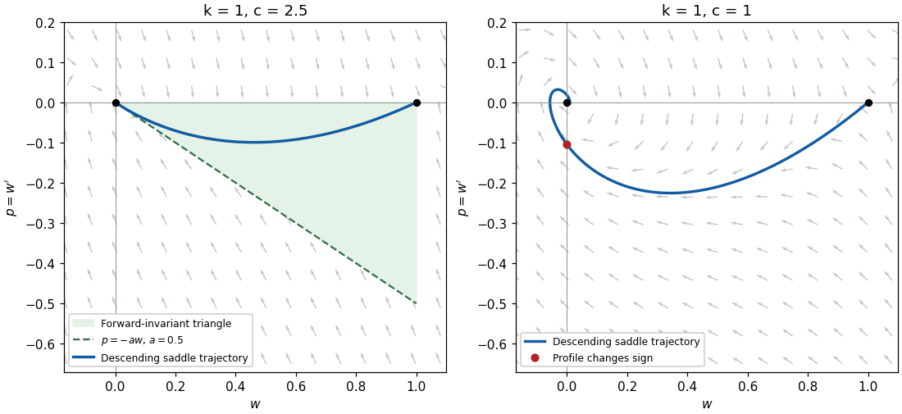

<h1 id="3/solution">Solution</h1>

↑ **Parent:** [3](../3.md)

For a nonconstant invasion [travelling wave](../../../../../travelling-wave.md), the relevant end states are $w(-\infty)=k$ and $w(+\infty)=0$. These fronts do not exist at every nonnegative speed: the [phase plane](../../../../../phase-plane.md) calculation gives the threshold $2\sqrt{k}$. The constant solutions $w\equiv0$ and $w\equiv k$ are, of course, nonnegative [travelling waves](../../../../../travelling-wave.md) for every speed, including zero.

Put $z=x-ct$ and $p=w'$. The [travelling-wave reduction of a reaction-diffusion system](../../../../../travelling-wave-reduction-of-a-reaction-diffusion-system.md) gives

$$
w''+cw'+w(k-w)=0,\qquad
\begin{pmatrix}w'\\p'\end{pmatrix}=\begin{pmatrix}p\\-cp-w(k-w)\end{pmatrix}.
$$

The [equilibrium points](../../../../../equilibrium-point-of-a-dynamical-system.md) in the [phase plane](../../../../../phase-plane.md) are $(k,0)$ and $(0,0)$. At $(k,0)$ the characteristic equation is $r^2+cr-k=0$, so there is one positive and one negative [eigenvalue](../../../../../eigenvalue.md). Thus it is a [saddle equilibrium](../../../../../saddle-equilibrium.md). Its descending [unstable manifold](../../../../../unstable-manifold.md) has $w<k$, $p<0$ and locally

$$
p=r_+(w-k)+o(|w-k|),\qquad r_+=\frac{-c+\sqrt{c^2+4k}}2>0.
$$

At $(0,0)$ the [eigenvalues](../../../../../eigenvalue.md) are

$$
r=\frac{-c\pm\sqrt{c^2-4k}}2.
$$

For $c>2\sqrt{k}$ it is a [stable node](../../../../../stable-node.md); for $0<c<2\sqrt{k}$ it is a [stable spiral](../../../../../stable-spiral.md). The repeated-root case $c=2\sqrt{k}$ must be included in the existence argument rather than inferred from distinct roots.

Suppose $c\geq2\sqrt{k}$. Choose $a>0$ with $a(c-a)\geq k$; for example $a=(c-\sqrt{c^2-4k})/2$. Consider the closed triangular region

$$
\mathcal T=\{(w,p):0\leq w\leq k,\ -aw\leq p\leq0\}.
$$

On the horizontal side $p=0$, the vector field has $p'=-w(k-w)\leq0$, pointing into $\mathcal T$. On the vertical side $w=k$, it has $w'=p\leq0$, again pointing inward. For the sloping side use $h=p+aw$, so that on $h=0$,

$$
h'=p'+aw'=(a-c)p-w(k-w)=w[a(c-a)-k+w]\geq w^2\geq0.
$$

Thus trajectories cannot cross into $h<0$. The remaining boundary point $(0,0)$ is an [equilibrium point](../../../../../equilibrium-point-of-a-dynamical-system.md) and cannot be crossed in finite time by a nonconstant trajectory, by [uniqueness theorem for ordinary differential equations](../../../../../uniqueness-theorem-for-ordinary-differential-equations.md). This proves forward invariance of $\mathcal T$. The argument works unchanged at $c=2\sqrt{k}$ with $a=\sqrt{k}$.

The descending [unstable manifold](../../../../../unstable-manifold.md) of $(k,0)$ initially enters $\mathcal T$. Its forward trajectory remains in this compact region, so it exists for all positive $z$. Within the interior, $p<0$: a first contact with $p=0$ at $0<w<k$ would have $p'<0$, contrary to arrival from below. Hence $w$ decreases strictly and has a limit $\ell\in[0,k)$. To identify the limit, its [omega-limit set](../../../../../omega-limit-set.md) lies on the line $w=\ell$ and is invariant. Any trajectory remaining on this line has $p=w'=0$; its second equation then forces $\ell(k-\ell)=0$. Since $\ell<k$, it follows that $\ell=0$, and the only possible [omega-limit set](../../../../../omega-limit-set.md) is $(0,0)$. Backward in $z$, the [unstable manifold](../../../../../unstable-manifold.md) tends to $(k,0)$ by its construction. We have therefore obtained a positive decreasing [heteroclinic orbit](../../../../../heteroclinic-orbit.md) and hence a nonnegative [travelling wave](../../../../../travelling-wave.md) for every $c\geq2\sqrt{k}$.

For completeness, the threshold is necessary for such a front. When $0<c<2\sqrt{k}$, put $\nu=\sqrt{k-c^2/4}$, $X=w$, and $Y=(p+cw/2)/\nu$. Near the zero [equilibrium point](../../../../../equilibrium-point-of-a-dynamical-system.md) the system becomes

$$
X'=-\frac c2X+\nu Y,\qquad Y'=-\nu X-\frac c2Y+\frac{X^2}{\nu}.
$$

For a nonzero trajectory its polar angle satisfies

$$
\vartheta'=\frac{XY'-YX'}{X^2+Y^2}
=-\nu+\frac{X^3}{\nu(X^2+Y^2)}=-\nu+O(\sqrt{X^2+Y^2}).
$$

A trajectory approaching zero therefore makes infinitely many rotations and must cross $X=w=0$. It cannot be a nonnegative front. At $c=0$, the first integral

$$
E=\frac12p^2+\frac k2w^2-\frac13w^3
$$

is conserved. It has values $k^3/6$ and $0$ at the two desired end states, so no [heteroclinic orbit](../../../../../heteroclinic-orbit.md) connects them. Consequently

$$
\boxed{\text{nonnegative invasion fronts exist exactly for }c\geq c_*=2\sqrt{k}.}
$$

This is the [phase-plane construction of a Fisher travelling front](../../../../../phase-plane-construction-of-a-fisher-travelling-front.md), including the critical speed. The statement for all $c\geq0$ must distinguish these nonconstant fronts from the two constant [travelling waves](../../../../../travelling-wave.md).

**[Figure 1](#3/image-invariant-triangle-and-descending-fisher-front-trajectory-at-a-supercritical-speed-compared-with-sign-changing-motion-at-a-subcritical-speed). Invariant triangle and descending Fisher-front trajectory at a supercritical speed, compared with sign-changing motion at a subcritical speed**.

## ↑ Ancestors (10)

1. [3](../3.md)
2. [Paper 64](../../paper-64-split.md)
3. [Iii](../../split.md)
4. [2010](../../../split.md)
5. [Past exam of the mathematics course of the University of Cambridge](../../../../split.md)
6. [Mathematics course of the University of Cambridge](../../../../../mathematics-course-of-the-university-of-cambridge.md)
7. [Course of the University of Cambridge](../../../../../course-of-the-university-of-cambridge.md)
8. [University of Cambridge](../../../../../university-of-cambridge-split.md)
9. [List of universities](../../../../../list-of-universities.md)
10. [Codex Wiki](../../../../../split.md)
