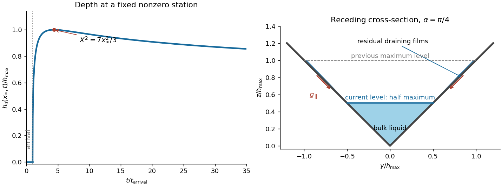

<h1 id="2/solution">Solution</h1>

↑ **Parent:** [2](../2.md)

First estimate transverse relaxation without assuming a thin cross-section. With both depth and width of order $h_0$, a transverse surface-height variation of order $h_0$ gives a [pressure gradient](../../../../../pressure-gradient.md) of order $\rho g$. The [Stokes equation](../../../../../stokes-equation.md) then gives transverse horizontal and vertical [velocities](../../../../../velocity.md) of order $gh_0^2/\nu$. Moving the surface through distance $h_0$ takes

$$
\boxed{\tau_y\sim\frac{\nu}{gh_0}.}
$$

For longitudinal variations over $L\gg h_0$, the hydrostatic [pressure](../../../../../pressure.md) gradient is of order $\rho gh_0/L$, so the longitudinal [velocity](../../../../../velocity.md) is $u\sim gh_0^3/(\nu L)$. [Incompressibility](../../../../../incompressible-flow.md) gives a vertical [velocity](../../../../../velocity.md) $w\sim h_0u/L$, hence

$$
\boxed{\tau_x\sim\frac{h_0}{w}\sim\frac{\nu L^2}{gh_0^3},\qquad
\frac{\tau_y}{\tau_x}\sim\frac{h_0^2}{L^2}\ll1.}
$$

Thus cross-channel variations relax rapidly compared with the longitudinal evolution. These are viscous estimates, requiring inertial relaxation to be negligible; the slow-flow regime in particular excludes a large transverse inertial response. After that initial relaxation the [free surface](../../../../../free-surface.md) is nearly horizontal across the channel, so its height is $h_0(x,t)$ and its local vertical depth is $h_0-|y|\cot\alpha$.

Retain the full cross-sectional geometry for a fixed $0<\alpha<\pi/2$; no small-angle approximation is used. With $|h_{0x}|\ll1$, the leading [hydrostatic pressure](../../../../../hydrostatic-pressure.md) is $p=p_a+\rho g(h_0-z)$. Axial viscous derivatives are small relative to cross-sectional ones. The axial [Stokes equation](../../../../../stokes-equation.md) is therefore

$$
\nu(u_{yy}+u_{zz})=g h_{0x}.
$$

Introduce $Y=y/h_0$, $Z=z/h_0$, and the triangular domain

$$
\mathcal D_\alpha=\{(Y,Z): |Y|\cot\alpha<Z<1\}.
$$

Let the dimensionless cross-sectional [Poisson equation](../../../../../poisson-equation.md) be

$$
\phi_{YY}+\phi_{ZZ}=-1\quad\hbox{in }\mathcal D_\alpha,\qquad
\phi=0\quad(Z=|Y|\cot\alpha),\qquad
\phi_Z=0\quad(Z=1).
$$

The two lower sloping sides impose the [no-slip boundary condition](../../../../../no-slip-boundary-condition.md); the upper horizontal side imposes the [stress-free boundary condition](../../../../../stress-free-boundary-condition.md). Symmetry would additionally give $\phi_Y=0$ at $Y=0$ if only half the domain were used. The full domain needs no extra midline boundary condition. Define $Q(\alpha)=\int_{\mathcal D_\alpha}\phi\,dY\,dZ$. Then

$$
u=-\frac{g}{\nu}h_0^2h_{0x}\phi(Y,Z),\qquad
q=\int u\,dy\,dz=-\frac{gQ(\alpha)}{\nu}h_0^4h_{0x}.
$$

The cross-sectional area is $A=h_0^2\tan\alpha$. [Conservation of mass](../../../../../mass-conservation.md), $A_t+q_x=0$, gives the [V-shaped channel gravity current](../../../../../v-shaped-channel-gravity-current.md) equation

$$
\boxed{\tan\alpha\,(h_0^2)_t=\frac{gQ(\alpha)}{\nu}(h_0^4h_{0x})_x.}
$$

In particular, neither replacing this triangular Poisson problem by a vertically parabolic film nor taking an extreme angle is necessary.

Put $C=gQ(\alpha)/(\nu\tan\alpha)$. For a symmetric fixed-volume [similarity solution](../../../../../similarity-solution.md), write $h_0=t^{-b}f(xt^{-d})$. Volume conservation gives $d=2b$, and balancing $(h_0^2)_t=C(h_0^4h_{0x})_x$ gives $2b+1=5b+2d$. Hence $b=1/7$, $d=2/7$. Integrating the similarity equation once, with zero flux at the centre, yields

$$
Ch_0^4h_{0x}=-\frac{2x}{7t}h_0^2.
$$

Integrating again and imposing $h_0=0$ at $x=\pm X(t)$ gives

$$
\boxed{h_0(x,t)=\left[\frac{3}{7Ct}(X^2-x^2)\right]^{1/3}\quad(|x|<X),\qquad h_0=0\quad(|x|\geq X).}
$$

The [constant-volume similarity in a V-shaped channel](../../../../../constant-volume-similarity-in-a-v-shaped-channel.md) has a compact support. If $H(t)=h_0(0,t)$, its volume is

$$
V=\tan\alpha\,H^2X I,\qquad
I=\int_{-1}^{1}(1-s^2)^{2/3}\,ds,\qquad
H^3=\frac{3X^2}{7Ct}.
$$

Eliminating $H$ therefore gives

$$
\boxed{x_N(t)=X(t)=\left(\frac{V}{I\tan\alpha}\right)^{3/7}
\left(\frac{7gQ(\alpha)t}{3\nu\tan\alpha}\right)^{2/7}.}
$$

This describes the large-time spreading from a localized release; the point-release profile is singular at $t=0$, and the idealized front has a narrow region where its divergent slope violates the long-wave approximation. Neither feature changes the leading bulk similarity law.

At a fixed nonzero $x^*$, the depth is initially zero until $X(t)=|x^*|$. After arrival it rises and then falls. Because $X^2\propto t^{4/7}$, differentiation of $h_0(x^*,t)^3=3(X^2-x^{*2})/(7Ct)$ gives

$$
\frac{d}{dt}h_0^3=\frac{3}{7Ct^2}\left(x^{*2}-\frac37X^2\right).
$$

Thus its unique maximum occurs at **$X^2=7x^{*2}/3$**; thereafter the depth tends to zero as $t^{-1/7}$. If $t_a$ is the arrival time, $t_{\max}/t_a=(7/3)^{7/4}$. At the singular release point $x^*=0$, the point-source similarity profile instead decreases from the start; a finite initial release regularizes its early behaviour.

**[Figure 1](#2/image-depth-history-at-a-fixed-channel-station-and-residual-wall-films-after-the-bulk-level-falls-to-half-its-maximum). Depth history at a fixed channel station and residual wall films after the bulk level falls to half its maximum**.

The right-hand sketch shows the triangular bulk at half its previous maximum depth, with thin draining films on the previously wetted portions of both walls. These [residual wall films in a receding gravity current](../../../../../residual-wall-films-in-a-receding-gravity-current.md) are not captured by a perfectly dry-wall triangular section. They drain rapidly compared with bulk longitudinal spreading. For an order-one angle, a wall film of thickness $b$ and wetted length $\ell$ has speed $O(gb^2/\nu)$ by [falling film flow](../../../../../falling-film-flow.md); its drainage time gives $b\sim(\nu\ell/(gt))^{1/2}$. At a fixed nonzero station the previous maximum wetted height is finite, so film area decays as $t^{-1/2}$, faster than the bulk area $h_0^2\sim t^{-2/7}$. In stations whose arrival and peak times are of order the observation time, the typical residual film fraction is $O(\sqrt{\tau_y/t})\to0$. Therefore the films modify the detailed receding cross-section but do not hold a leading-order fraction of the volume or invalidate the large-time nose law. Microscopic contact-line physics is beyond this ideal viscous model.

## ↑ Ancestors (10)

1. [2](../2.md)
2. [Paper 66](../../paper-66-split.md)
3. [Iii](../../split.md)
4. [2010](../../../split.md)
5. [Past exam of the mathematics course of the University of Cambridge](../../../../split.md)
6. [Mathematics course of the University of Cambridge](../../../../../mathematics-course-of-the-university-of-cambridge.md)
7. [Course of the University of Cambridge](../../../../../course-of-the-university-of-cambridge.md)
8. [University of Cambridge](../../../../../university-of-cambridge-split.md)
9. [List of universities](../../../../../list-of-universities.md)
10. [Codex Wiki](../../../../../split.md)
