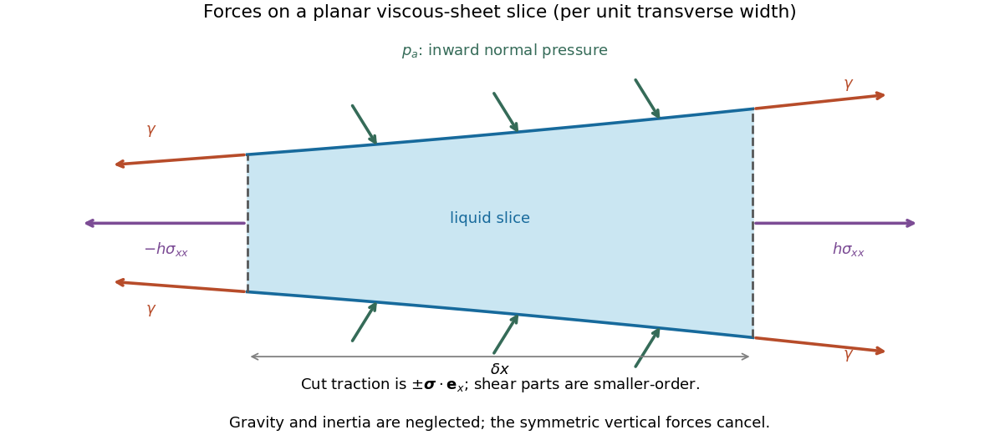

<h1 id="3/solution">Solution</h1>

↑ **Parent:** [3](../3.md)

Let the longitudinal variation scale be $\ell\gg h$. The [stress-free boundary condition](../../../../../stress-free-boundary-condition.md) gives $\mu(u_z+w_x)=0$ at each face. [Incompressibility](../../../../../incompressible-flow.md) implies $w=O(hu/\ell)$, so $w_x$ is smaller than a putative $u_z=O(u/h)$ by $O(h^2/\ell^2)$. The leading [Stokes equation](../../../../../stokes-equation.md) and the two shear-free conditions therefore make $u$ independent of $z$; its thickness-dependent correction is smaller-order. Symmetry gives $w=0$ at $z=0$, and incompressibility integrates to

$$
\boxed{w=-zu_x.}
$$

Vertical momentum makes the leading normal [stress](../../../../../stress.md) independent of $z$. With the normal directed from liquid into gas, the upper-face curvature is $-h_{xx}/2$ to leading order. The [Young–Laplace equation](../../../../../young-laplace-equation.md) gives

$$
\boxed{\sigma_{zz}=-p_a+\frac\gamma2h_{xx}.}
$$

The [Newtonian fluid stress tensor](../../../../../newtonian-fluid-stress-tensor.md) also gives $\sigma_{zz}=-p+2\mu w_z=-p-2\mu u_x$. Hence $p=p_a-\gamma h_{xx}/2-2\mu u_x$ and

$$
\boxed{\sigma_{xx}=-p_a+\frac\gamma2h_{xx}+4\mu u_x.}
$$

The factor four is the planar extension factor: both the longitudinal viscous [stress](../../../../../stress.md) and the [pressure](../../../../../pressure.md) adjustment from transverse contraction contribute.

**[Figure 2](#3/image-end-tractions-ambient-pressure-and-the-four-surface-tension-pulls-on-a-planar-liquid-sheet-slice). End tractions, ambient pressure and the four surface-tension pulls on a planar liquid-sheet slice**.

For [force balance](../../../../../force-balance.md) on the illustrated slice, the vertical cuts give $(h\sigma_{xx})_x\,\delta x$. [Pressure](../../../../../pressure.md) on the sloping broad faces gives $p_a h_x\,\delta x$ horizontally. Each of the two interfaces exerts a tangential [surface tension](../../../../../surface-tension.md) pull at each cut, with horizontal component $\gamma\cos\theta$, where $\tan\theta=h_x/2$. Thus the horizontal [force](../../../../../force.md) balance is the derivative of the effective tension

$$
\mathcal T=h(\sigma_{xx}+p_a)+2\gamma\cos\theta
=4\mu h u_x+\frac\gamma2hh_{xx}+2\gamma-\frac\gamma4h_x^2
$$

to the retained small-slope order. The ambient-pressure contributions cancel in this excess tension. Differentiating cancels the two $h_xh_{xx}$ terms, leaving the [planar viscous-sheet stretching equations](../../../../../planar-viscous-sheet-stretching-equations.md)

$$
\boxed{(4\mu h u_x)_x+\frac\gamma2h h_{xxx}=0.}
$$

The upper-face kinematic condition is $w(x,h/2,t)=(h_t+uh_x)/2$. Combining it with $w=-zu_x$ gives the second equation,

$$
\boxed{h_t+(hu)_x=0,}
$$

which is [conservation of mass](../../../../../mass-conservation.md) per unit transverse width.

For the two bubbles, let $p_g$ be the common gas [pressure](../../../../../pressure.md) and $p_e$ the surrounding liquid [pressure](../../../../../pressure.md) away from the sheet. A cylindrical bubble has one nonzero principal curvature, so the [Young–Laplace equation](../../../../../young-laplace-equation.md) gives $p_g-p_e\simeq\gamma/a$. In the nearly flat sheet the normal [stress](../../../../../stress.md) is $-p_g$, giving liquid [pressure](../../../../../pressure.md) $p_{\rm film}=p_g-2\mu u_x$. The extensional correction is small compared with $\gamma/a$ because the transition scale will satisfy $\sqrt{ah_0}/L\ll1$. Thus $p_{\rm film}\simeq p_g>p_e$, and this capillary [pressure](../../../../../pressure.md) difference drives liquid out through both ends.

For a spatially uniform flat sheet, $h_x=h_{xxx}=0$, so the longitudinal equation gives $u_{xx}=0$. Reflection symmetry at $x=0$ selects

$$
\boxed{u(x,t)=\frac{U(t)}Lx.}
$$

Here $U$ is the outward speed at the positive end. The mass equation then gives $h_t=-Uh/L$, independent of $x$, so initially uniform thickness remains uniform. Writing it as $h_0(t)$,

$$
\boxed{\dot h_0=-\frac{U(t)}Lh_0.}
$$

The end transitions determine $U$, as derived in the following parts.

## ↑ Ancestors (10)

1. [3](../3.md)
2. [Paper 66](../../paper-66-split.md)
3. [Iii](../../split.md)
4. [2010](../../../split.md)
5. [Past exam of the mathematics course of the University of Cambridge](../../../../split.md)
6. [Mathematics course of the University of Cambridge](../../../../../mathematics-course-of-the-university-of-cambridge.md)
7. [Course of the University of Cambridge](../../../../../course-of-the-university-of-cambridge.md)
8. [University of Cambridge](../../../../../university-of-cambridge-split.md)
9. [List of universities](../../../../../list-of-universities.md)
10. [Codex Wiki](../../../../../split.md)
