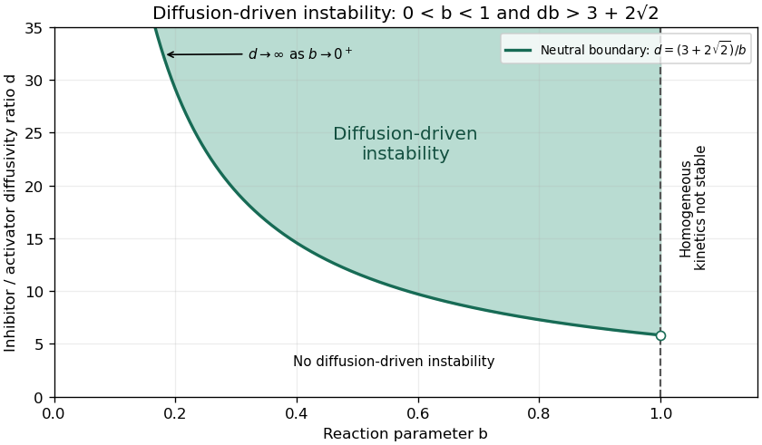

<h1 id="3/solution">Solution</h1>

↑ **Parent:** [3](../3.md)

First find the positive [spatially homogeneous equilibrium](../../../../../spatially-homogeneous-equilibrium.md). Setting the reactions to zero gives $v=u^2$ and $u/v=b$, and hence the unique positive equilibrium is

$$
\boxed{u_*=\frac1b,\qquad v_*=\frac1{b^2}}.
$$

The zero pair is not an admissible positive state and is singular in the $u^2/v$ term. For homogeneous deviations, the reaction [Jacobian matrix](../../../../../jacobian-matrix.md) at this equilibrium is

$$
J=\begin{pmatrix}2u_*/v_*-b&-u_*^2/v_*^2\\2u_*&-1\end{pmatrix}
=\begin{pmatrix}b&-b^2\\2/b&-1\end{pmatrix}.
$$

Thus $\operatorname{tr}J=b-1$, $\det J=b$, and its [eigenvalues](../../../../../eigenvalue.md) are

$$
\boxed{\sigma_\pm=\frac{b-1\pm\sqrt{b^2-6b+1}}2}.
$$

For $0<b<1$, both real parts are negative: a real pair has positive product and negative sum, while a complex pair has real part $(b-1)/2$. The reaction equilibrium is therefore [asymptotically stable](../../../../../asymptotic-stability.md), with no growing oscillatory mode. **This does not exclude damped oscillations.** Indeed, for $3-2\sqrt2<b<1$ the [eigenvalues](../../../../../eigenvalue.md) are complex; for example, $b=1/2$ gives $-1/4\pm i\sqrt7/4$, a [stable focus](../../../../../stable-spiral.md) with oscillatory transients. Thus a literal exclusion of every oscillatory solution is false; the intended exclusion of sustained or growing oscillations is the meaningful statement.

One can strengthen this to exclude nonlinear periodic oscillations in the positive quadrant without relying only on the local [linear stability analysis](../../../../../linear-stability.md). For the reactions $f=u^2/v-bu$, $g=u^2-v$, use the [Dulac function](../../../../../dulac-function.md) $H=u^{-2}$. Then

$$
\partial_u(Hf)+\partial_v(Hg)
=\partial_u\left(\frac1v-\frac bu\right)+
\partial_v\left(1-\frac v{u^2}\right)
=\frac{b-1}{u^2}<0.
$$

Were there a [periodic orbit](../../../../../periodic-orbit.md) wholly in the positive quadrant, the flux of $H(f,g)$ through it would vanish, since this vector is tangent to the orbit; [Green's theorem](../../../../../green-theorem.md) would equate that flux to a strictly negative interior integral. This contradiction proves **there is no sustained positive periodic oscillation when $0<b<1$**, the [positive-quadrant Dulac multiplier for quadratic activation](../../../../../positive-quadrant-dulac-multiplier-for-quadratic-activation.md) argument. It leaves the damped transients entirely consistent with the conclusion.

Now introduce a perturbation $(\delta u,\delta v)=\mathbf a e^{\sigma t+ikx}$ in the [quadratic activator-inhibitor model](../../../../../quadratic-activator-inhibitor-model.md). The [Fourier mode](../../../../../fourier-mode.md) of squared [wavenumber](../../../../../wavenumber.md) $q=k^2$ evolves under

$$
J_q=J-q\begin{pmatrix}1&0\\0&d\end{pmatrix}
=\begin{pmatrix}b-q&-b^2\\2/b&-1-dq\end{pmatrix}.
$$

Its [matrix trace](../../../../../matrix-trace.md) and [determinant](../../../../../determinant.md) are

$$
\tau(q)=b-1-(1+d)q,\qquad
D(q)=dq^2+(1-db)q+b.
$$

A [Turing instability](../../../../../turing-instability.md) must start with reaction stability, requiring $0<b<1$. Then $\tau(q)<0$ for every $q\ge0$, so a mode is unstable exactly when $D(q)<0$: its two real [eigenvalues](../../../../../eigenvalue.md) have opposite signs. This also proves the diffusion-driven onset is stationary rather than oscillatory.

The upward-opening quadratic $D(q)$ has its minimum at $q_m=(db-1)/(2d)$. To have a negative value at a physically allowed positive squared [wavenumber](../../../../../wavenumber.md), one needs

$$
db>1,\qquad D(q_m)=b-\frac{(db-1)^2}{4d}<0.
$$

Writing $r=db$, the second inequality is $r^2-6r+1>0$, with roots $3\pm2\sqrt2$. The first inequality discards the lower branch, giving

$$
\boxed{0<b<1,\qquad db>3+2\sqrt2}.
$$

These are the [Turing threshold of the quadratic activator-inhibitor model](../../../../../turing-threshold-of-the-quadratic-activator-inhibitor-model.md) conditions. Equivalently, in the $(b,d)$ plane the instability region lies strictly above $d=(3+2\sqrt2)/b$ and strictly to the left of $b=1$, with $b>0$. The boundary diverges as $b\to0^+$ and approaches $3+2\sqrt2$ as $b\to1^-$.

**[Figure 1](#3/image-diffusion-driven-instability-above-the-quadratic-model-threshold-in-the-reaction-stable-parameter-strip). Diffusion-driven instability above the quadratic-model threshold in the reaction-stable parameter strip**.

At equality, the [determinant](../../../../../determinant.md) has a double root and one growth rate is zero, while the other remains negative. Substituting $db=3+2\sqrt2$ into its minimum location gives

$$
\boxed{k_c^2=q_c=\frac{db-1}{2d}=\frac{1+\sqrt2}{d}}.
$$

Beyond onset, the unstable band is

$$
\boxed{q_-<k^2<q_+,\qquad
q_\pm=\frac{db-1\pm\sqrt{(db-1)^2-4db}}{2d}}.
$$

The stated parameter region assumes continuously available [wavenumbers](../../../../../wavenumber.md), as on an infinite domain. With specified finite-domain [boundary conditions](../../../../../boundary-condition.md), an allowed nonzero spatial [eigenmode](../../../../../normal-mode.md) must additionally lie in this band; homogeneous stability alone does not ensure that a finite box admits the critical [wavelength](../../../../../wavelength.md).

## ↑ Ancestors (10)

1. [3](../3.md)
2. [Paper 67](../../paper-67-split.md)
3. [Iii](../../split.md)
4. [2010](../../../split.md)
5. [Past exam of the mathematics course of the University of Cambridge](../../../../split.md)
6. [Mathematics course of the University of Cambridge](../../../../../mathematics-course-of-the-university-of-cambridge.md)
7. [Course of the University of Cambridge](../../../../../course-of-the-university-of-cambridge.md)
8. [University of Cambridge](../../../../../university-of-cambridge-split.md)
9. [List of universities](../../../../../list-of-universities.md)
10. [Codex Wiki](../../../../../split.md)
