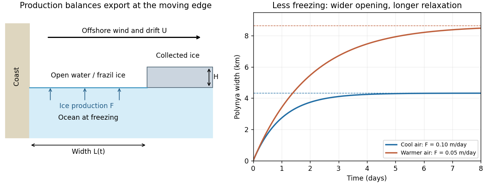

<h1 id="3/solution">Solution</h1>

↑ **Parent:** [3](../3.md)

In the [Pease polynya model](../../../../../pease-polynya-model.md), take a straight fixed coast at $x=0$ and an offshore polynya edge at $x=L(t)$. Let consolidated pack ice move offshore at speed $U>0$, let new ice be produced throughout the opening at equivalent thickness rate $F>0$, and let the collected ice at the edge have a prescribed thickness $H$. All fluxes below are per unit length of coastline. The new-ice volume production is $FL$, while the consolidated-ice export relative to the moving edge is $H(U-\dot L)$. Neglect storage of drifting [frazil ice](../../../../../frazil-ice.md) inside the opening, so conservation gives

$$
H(U-\dot L)=FL,\qquad \boxed{\dot L=U-\frac FH L}.
$$

This is the simplest Pease closure: newly formed ice is collected at the edge rapidly enough that production can be equated to the instantaneous edge flux. A model retaining frazil storage would instead include the local balance $\partial_t h+\partial_x(uh)=F$, with frazil thickness $h$ and transport velocity $u$, together with an edge condition; it should not silently be identified with the instantaneous-collection approximation.

For constant $U,F,H$, the stable equilibrium and relaxation time are

$$
\boxed{L_\infty=\frac{HU}{F},\qquad \tau=\frac HF},\qquad L(t)=L_\infty+[L(0)-L_\infty]e^{-t/\tau}.
$$

In particular, an initially closed opening has $L(t)=L_\infty(1-e^{-t/\tau})$. It initially opens at speed $U$, then slows as its larger area produces more ice. It reaches $63\%$ of its ultimate width after $\tau$ and $95\%$ after $-\tau\log0.05\simeq3\tau$; the exact equilibrium is approached asymptotically, not reached at a finite opening time.

The production rate is determined by the energy budget. With $Q_{\rm surf}$ positive for net upward surface heat loss and $Q_o$ the heat supplied from the underlying ocean, water at its local freezing temperature gives

$$
F=\frac{Q_{\rm surf}-Q_o}{\rho_iL_f}.
$$

The surface loss includes sensible and latent turbulent transfers and net radiation. For example, the sensible component is approximately $\rho_ac_{p,a}C_HV(T_f-T_a)$, where $V$ is wind speed and $C_H$ an exchange coefficient. Ice motion is commonly parameterized as a small fraction of the offshore wind speed, but currents and the direction relative to the coast also matter. Thus colder air and stronger net cooling increase $F$ and narrow the opening; faster export increases $U$ and widens it; thicker collected ice increases both $L_\infty$ and $\tau$. Stronger winds can increase both export and heat loss, so the width's dependence on wind can be much weaker than the formula with artificially fixed $F$ would suggest.

The assumptions are steady spatially uniform forcing; a one-dimensional straight coast; fixed collection thickness and drift speed; no alongshore import of pack ice; water already at freezing rather than an appreciable sensible-heat reservoir; and negligible residence time of newly formed ice. Real coastlines, time-dependent winds, ocean currents, atmospheric adjustment over warm open water and variable ice accumulation can all violate these assumptions. The model describes a [latent-heat polynya](../../../../../latent-heat-polynya.md), not an opening maintained principally by a warm deep-ocean heat supply.

If air temperature rises while wind, $H$ and the other external parameters are unchanged, the smaller air–sea temperature difference reduces net heat loss and hence $F$. For $0<F'<F$,

$$
\boxed{\frac{L_\infty'}{L_\infty}=\frac{\tau'}{\tau}=\frac{F}{F'}>1}.
$$

The opening becomes wider and takes longer to attain the same fraction of its new equilibrium width. Its initial opening speed remains $U$; the longer equilibration follows from weaker ice production, rather than slower initial export. If warming eliminates net freezing, $F=0$ gives $L=L(0)+Ut$ in the simple kinematic closure, with no finite freezing-balanced width. A negative $F$ represents melt and is outside the positive-production Pease model.

**[Figure 1](#3/image-ice-export-and-production-in-the-pease-polynya-model). Ice export and production in the Pease polynya model**.

For the shelf-water calculation, a $30$-day month at $0.05\,\mathrm{m\,day^{-1}}$ produces $h_i=1.5\,\mathrm m$ of ice. Assume a well-mixed $D=100\,\mathrm m$ shelf column, no compensating advection or precipitation, and fixed ice and water densities $\rho_i=917$ and $\rho_w=1025\,\mathrm{kg\,m^{-3}}$. The frozen fraction of its initial liquid mass is

$$
f=\frac{\rho_i h_i}{\rho_wD}=0.01342.
$$

Let the liquid initially have [salinity](../../../../../salinity.md) $S_0$, and newly formed ice retain $rS$ with $r=0.3$ and $S$ the instantaneous ambient value. For remaining liquid mass $M$, freezing removes salt with the departing ice, so [conservation of salt with salt-retaining ice](../../../../../conservation-of-salt-with-salt-retaining-ice.md) gives

$$
d(MS)=rS\,dM,\qquad M\,dS=-(1-r)S\,dM,\qquad S_1=S_0(1-f)^{-(1-r)}.
$$

Therefore

$$
\boxed{\Delta S=S_0[(1-0.01342)^{-0.7}-1]\simeq0.00950S_0}.
$$

An initial shelf-water salinity is needed for an absolute answer. Taking $S_0=34$ psu gives $\boxed{\Delta S\simeq0.32\,\mathrm{psu}}$. At the accuracy of an equal-density thickness calculation, $f\simeq1.5/100$ and $\Delta S\simeq0.7S_0f$, giving about $\boxed{0.36\,\mathrm{psu}}$ for $S_0=34$ psu. These estimates describe the same modest increase. Treating ice as completely fresh would overestimate [brine rejection](../../../../../brine-rejection.md) by omitting the factor $0.7$.

The resulting water is denser and can leave the shelf and intrude beneath fresher surface water. It is therefore a physically plausible contribution to the [cold halocline](../../../../../cold-halocline.md). Nevertheless, this one-month column budget yields only a few tenths of a psu, and the salinity contrast across the Arctic halocline can be several psu. If water from a shelf occupying one-third of the area were spread through an equally deep layer over the whole ocean, the average increase would be only about $0.1$ psu. This illustration is not a volume budget for the actual deep Arctic: shelf area fraction is not ocean water-volume fraction, and the exported water can be concentrated within a relatively thin halocline layer.

Consequently **this calculation supports a shelf contribution but does not establish its dominance**. Repeated seasonal ice production, enhanced production in [polynyas](../../../../../polynya.md), shelf-water export, freshwater dilution, and the thickness and residence time of the receiving layer would all be needed to test dominance. The assumption that the shelf initially becomes ice-free limits the first month's salt production; it does not bound an entire winter's cumulative production if new ice is continually removed.

Another pathway is winter cooling and limited convection of Atlantic-origin water as it enters the Arctic and encounters the ice-covered ocean. Cooling and local freezing can make it near-freezing water without requiring that it first be formed throughout the Siberian shelf. A subsequent fresh surface cap limits further convection; the cooled water is advected into the basin beneath that cap, producing a cold, salinity-stratified lower halocline. Pacific-origin waters also contribute to halocline structure in the western Arctic. Both formation and maintenance depend on circulation and freshwater supply, not simply on the presence of freezing somewhere. The strong [stable density stratification](../../../../../stable-density-stratification.md) then limits upward transfer of heat from the deeper Atlantic layer to [sea ice](../../../../../sea-ice.md).

## ↑ Ancestors (10)

1. [3](../3.md)
2. [Paper 69](../../paper-69-split.md)
3. [Iii](../../split.md)
4. [2010](../../../split.md)
5. [Past exam of the mathematics course of the University of Cambridge](../../../../split.md)
6. [Mathematics course of the University of Cambridge](../../../../../mathematics-course-of-the-university-of-cambridge.md)
7. [Course of the University of Cambridge](../../../../../course-of-the-university-of-cambridge.md)
8. [University of Cambridge](../../../../../university-of-cambridge-split.md)
9. [List of universities](../../../../../list-of-universities.md)
10. [Codex Wiki](../../../../../split.md)
