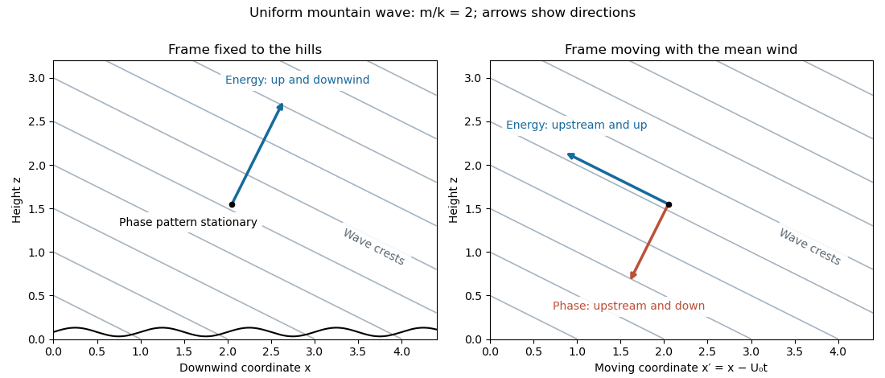

<h1 id="2/a/solution">Solution</h1>

↑ **Parent:** [A](../a.md)

Take $U_0>0$, $k=2\pi/L>0$, and represent the stationary [topographic internal gravity wave](../../../../../../stationary-topographic-internal-gravity-wave.md) by phase $kx+mz$. Its laboratory [angular frequency](../../../../../../angular-frequency.md) is zero, and its [intrinsic frequency](../../../../../../intrinsic-frequency.md) is $\widehat\omega=-kU_0$. The [internal gravity wave](../../../../../../internal-wave.md) [dispersion relation](../../../../../../dispersion-relation.md) gives

$$
m^2=\frac{N_0^2}{U_0^2}-k^2.
$$

The [radiation condition](../../../../../../radiation-condition.md) selects $m>0$, since this makes the vertical [group velocity](../../../../../../group-velocity.md) upward. The lower [kinematic boundary condition](../../../../../../kinematic-boundary-condition.md) is $w=U_0h_x$, so a corresponding linear wave field is

$$
w=kU_0h_0\cos(kx+mz),\qquad
\zeta=h_0\sin(kx+mz),
$$

where $\zeta$ is the vertical [fluid displacement](../../../../../../lagrangian-displacement-fluid-mechanics.md). The [constant-phase lines of an internal gravity wave](../../../../../../constant-phase-line-of-an-internal-gravity-wave.md) slope down to the right, with $dz/dx=-k/m$.

Let $K^2=k^2+m^2$. In the frame fixed to the hills the phase pattern is stationary: its [phase velocity](../../../../../../phase-velocity.md) is zero, while the [group velocity](../../../../../../group-velocity.md) is

$$
\boxed{\mathbf c_g=\frac{U_0}{K^2}(k^2,km).}
$$

Energy travels up and downwind, with ray slope $dz/dx=m/k$. In coordinates $x'=x-U_0t$ moving with the wind, the phase is $kx'+mz+kU_0t$. Thus

$$
\boxed{\mathbf c_p'=-\frac{kU_0}{K^2}(k,m),\qquad
\mathbf c_g'=\frac{U_0}{K^2}(-m^2,km).}
$$

The intrinsic [phase velocity](../../../../../../phase-velocity.md) is upstream and downward; the intrinsic [group velocity](../../../../../../group-velocity.md) is upstream and upward, perpendicular to the [wave vector](../../../../../../wavevector.md). Adding $(U_0,0)$ to the group velocity recovers the laboratory energy ray.

**[Figure 1](#2/a/image-stationary-mountain-wave-crests-and-energy-directions-in-the-ground-and-wind-frames). Stationary mountain-wave crests and energy directions in the ground and wind frames**.

Vertically propagating waves require $kU_0<N_0$, equivalently $\boxed{L>2\pi U_0/N_0}$. At equality the vertical [group velocity](../../../../../../group-velocity.md) vanishes; above the [mountain-wave cutoff](../../../../../../mountain-wave-cutoff.md) the bounded response is an [evanescent wave](../../../../../../evanescent-wave.md). The [linearization](../../../../../../linearization.md) requires small terrain slope $kh_0\ll1$ and small wave-induced displacement gradients $|m|h_0\ll1$, often summarized by $N_0h_0/U_0\ll1$. The model also neglects rotation, viscosity and compressibility; its scales must permit those approximations.

## ↑ Ancestors (11)

1. [A](../a.md)
2. [2](../../2.md)
3. [Paper 71](../../../paper-71-split.md)
4. [Iii](../../../split.md)
5. [2010](../../../../split.md)
6. [Past exam of the mathematics course of the University of Cambridge](../../../../../split.md)
7. [Mathematics course of the University of Cambridge](../../../../../../mathematics-course-of-the-university-of-cambridge.md)
8. [Course of the University of Cambridge](../../../../../../course-of-the-university-of-cambridge.md)
9. [University of Cambridge](../../../../../../university-of-cambridge-split.md)
10. [List of universities](../../../../../../list-of-universities.md)
11. [Codex Wiki](../../../../../../split.md)
