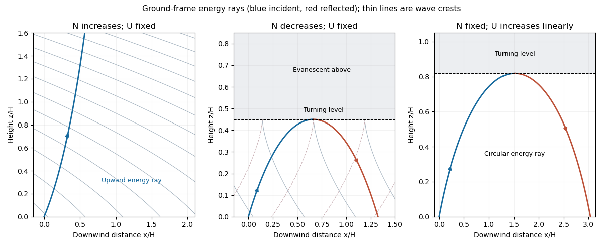

<h1 id="2/b/solution">Solution</h1>

↑ **Parent:** [B](../b.md)

For a stationary component, the [stationary internal-wave WKB solution](../../../../../../stationary-internal-wave-wkb-solution.md) has local vertical [wavenumber](../../../../../../wavenumber.md) and vertical-velocity amplitude

$$
m^2(z)=\frac{N^2(z)}{U_0^2}-k^2,\qquad
w\sim C\,m^{-1/2}(z)\exp\left(i kx+i\int_0^z m(s)\,ds\right),
$$

with the upward branch $m>0$. The [WKB approximation](../../../../../../wkb-approximation.md) requires $|m'|\ll m^2$ and sufficient smoothness, with $|m''|\ll |m|^3$ a useful additional criterion. The background changes little over a vertical wavelength; this excludes a [turning level of a stationary internal wave](../../../../../../turning-level-of-a-stationary-internal-wave.md).

For increasing $N=N_0(1+z/H)$, the vertical [wavenumber](../../../../../../wavenumber.md) increases. The crest slope $-k/m$ tends toward zero, and successive crests get closer vertically. The laboratory energy ray obeys $dx/dz=k/m$, so it becomes more nearly vertical as it rises. There is no upper turning level in this ideal increasing-stratification profile.

For decreasing $N=N_0(1-z/H)$, the vertical [wavenumber](../../../../../../wavenumber.md) decreases to zero at

$$
\boxed{z_t=H\left(1-\frac{kU_0}{N_0}\right).}
$$

This assumes propagation at the bottom, $kU_0<N_0$. The crests become more nearly vertical and the incident energy ray becomes horizontal at $z_t$. Above it the wave is [evanescent](../../../../../../evanescent-wave.md), and the incident wave is reflected downward. The divergent WKB amplitude at $m=0$ is an approximation failure, resolved by an [Airy function](../../../../../../airy-function.md) transition, rather than an infinite physical wave amplitude. The decreasing formula for $N$ is only a positive-frequency background below $z=H$; the relevant turning height lies below that level.

**[Figure 2](#2/b/image-mountain-wave-crests-energy-rays-and-turning-levels-for-slowly-varying-stratification-and-wind). Mountain-wave crests, energy rays, and turning levels for slowly varying stratification and wind**.

## ↑ Ancestors (11)

1. [B](../b.md)
2. [2](../../2.md)
3. [Paper 71](../../../paper-71-split.md)
4. [Iii](../../../split.md)
5. [2010](../../../../split.md)
6. [Past exam of the mathematics course of the University of Cambridge](../../../../../split.md)
7. [Mathematics course of the University of Cambridge](../../../../../../mathematics-course-of-the-university-of-cambridge.md)
8. [Course of the University of Cambridge](../../../../../../course-of-the-university-of-cambridge.md)
9. [University of Cambridge](../../../../../../university-of-cambridge-split.md)
10. [List of universities](../../../../../../list-of-universities.md)
11. [Codex Wiki](../../../../../../split.md)
