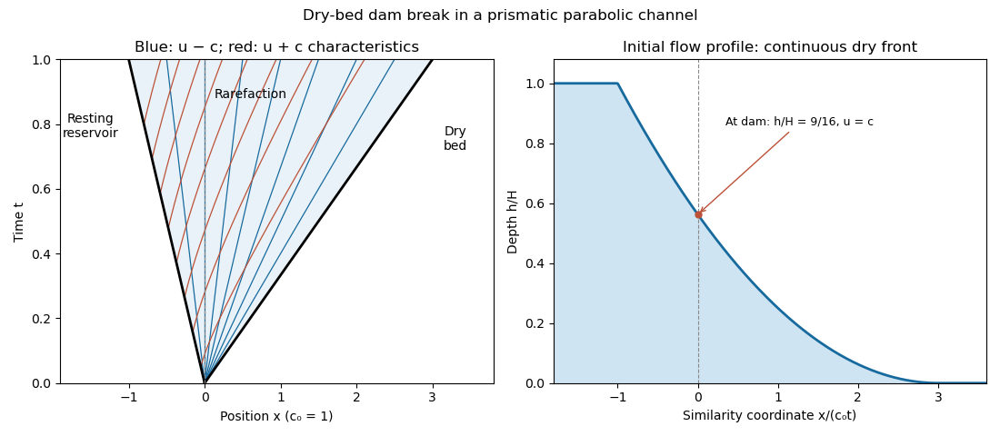

<h1 id="3/c/solution">Solution</h1>

↑ **Parent:** [C](../c.md)

For the early release, approximate the intact left half by water at rest at depth $H$, and the right half by a dry bed. Put $c_0=\sqrt{2gH/3}$. The [parabolic-channel dry-bed dam break](../../../../../../parabolic-channel-dry-bed-dam-break.md) is a centered [rarefaction wave](../../../../../../rarefaction-wave.md) of the $u-c$ family, with the other [Riemann invariant](../../../../../../riemann-invariant.md) fixed at $u+3c=3c_0$. Inside the fan, $\xi=x/t=u-c$, so

$$
c=\frac{3c_0-\xi}{4},\qquad u=\frac{3(c_0+\xi)}4.
$$

Hence

$$
\boxed{h(x,t)=
\begin{cases}
H,&x\leq-c_0t,\\
\displaystyle H\left(\frac{3-x/(c_0t)}4\right)^2,&-c_0t<x<3c_0t,\\
0,&x\geq3c_0t,
\end{cases}
\quad
u(x,t)=\frac34\left(c_0+\frac xt\right)\quad\text{inside the fan}.}
$$

The left edge moves into the reservoir at $-c_0$ and the dry front advances at $3c_0$. At the failed dam $h=9H/16$ and $u=c=3c_0/4$. There is initially no finite-depth [hydraulic bore](../../../../../../hydraulic-bore.md) into the dry bed: the depth falls continuously to zero.

**[Figure 3](#3/c/image-characteristics-and-depth-profile-of-the-initial-dry-bed-dam-break-in-a-parabolic-channel). Characteristics and depth profile of the initial dry-bed dam break in a parabolic channel**.

On the $x$–$t$ diagram, the $u-c$ [characteristic curves](../../../../../../characteristic-curve.md) inside the fan are straight rays from the origin. The $u+c$ curves obey $dx/dt=3c_0/2+x/(2t)$, so they have form $x=3c_0t+C\sqrt t$. The solution describes the period before the finite lake ends and their reflected signals matter. Immediately after failure, near the dam and very near the thin nose, strong vertical acceleration can invalidate the [shallow-water approximation](../../../../../../shallow-water-approximation.md). The outer fan becomes appropriate when the horizontal flow scale is large compared with its depth.

## ↑ Ancestors (11)

1. [C](../c.md)
2. [3](../../3.md)
3. [Paper 71](../../../paper-71-split.md)
4. [Iii](../../../split.md)
5. [2010](../../../../split.md)
6. [Past exam of the mathematics course of the University of Cambridge](../../../../../split.md)
7. [Mathematics course of the University of Cambridge](../../../../../../mathematics-course-of-the-university-of-cambridge.md)
8. [Course of the University of Cambridge](../../../../../../course-of-the-university-of-cambridge.md)
9. [University of Cambridge](../../../../../../university-of-cambridge-split.md)
10. [List of universities](../../../../../../list-of-universities.md)
11. [Codex Wiki](../../../../../../split.md)
