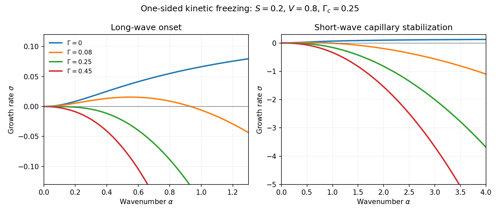

<h1 id="2/solution">Solution</h1>

↑ **Parent:** [2](../2.md)

Use the one-sided [thermal conduction](../../../../../thermal-conduction.md) model encoded by the requested [dispersion relation](../../../../../dispersion-relation.md): neglect solid-side perturbation [heat flux](../../../../../heat-flux-density.md), take equal phase densities, and let the normal point from solid into liquid. Write the isotropic linear [kinetic undercooling](../../../../../kinetic-undercooling.md) law using the [solidification attachment mobility](../../../../../solidification-attachment-mobility.md) $\mathcal M>0$:

$$
\boxed{U=\mathcal M(T_m-\gamma_T\mathcal K-T_i),\qquad
T_i=T_m-\frac U{\mathcal M}-\gamma_T\mathcal K,\qquad
\gamma_T=\frac{T_m\gamma}{\rho L}.}
$$

Here $\gamma$ is [solid-liquid surface energy](../../../../../solid-liquid-surface-energy.md), $\mathcal K$ is the sum of [principal curvatures](../../../../../principal-curvature.md), and $T_m$ is absolute [temperature](../../../../../temperature.md). Positive curvature convex into liquid lowers the equilibrium freezing temperature through the [Gibbs--Thomson relation](../../../../../gibbs-thomson-relation.md). The planar base state has $\mathcal K=0$.

Set $\Delta T=T_m-T_\infty>0$ and define

$$
U_0=\mathcal M\Delta T,\quad \ell=\kappa/U_0,\quad t_0=\kappa/U_0^2,\quad
\theta=\frac{T-T_\infty}{\Delta T},\quad S=\frac{L}{c_p\Delta T},\quad
\Gamma=\frac{\gamma_T}{\Delta T\ell}.
$$

The paper's $S$ is the [latent-to-sensible heat ratio](../../../../../latent-to-sensible-heat-ratio.md), the reciprocal of the common [Stefan number](../../../../../stefan-number.md) convention. Below, velocities, lengths and growth rates are dimensionless in these scales. In the travelling coordinate $\xi=X-Vt$, the liquid [heat equation](../../../../../heat-equation.md) gives $\theta_0''+V\theta_0'=0$, while the bounded solid steady field is constant. Matching a decaying liquid profile to the [Stefan condition](../../../../../stefan-condition.md) $SV=-\theta_0'(0)$ gives

$$
\boxed{\theta_l(\xi)=S e^{-V\xi}\quad(\xi>0),\qquad \theta_s=S,
\qquad T_i=T_\infty+\frac L{c_p}.}
$$

The [kinetic undercooling](../../../../../kinetic-undercooling.md) condition is $\theta_i=1-V$. Thus

$$
\boxed{V=1-S>0,\qquad U=\mathcal M\left(T_m-T_\infty-\frac L{c_p}\right)=\frac{\mathcal ML}{c_p}(S^{-1}-1).}
$$

The speed is constant for $S<1$, determined by $S$ and the attachment coefficient in the specified scales. Thermal diffusivity sets the exponential decay length $\kappa/U$, not the selected speed. Including solid-side perturbation conduction would change the stability equation below.

For [linear stability analysis](../../../../../linear-stability.md), corrugate the interface to $\xi=\zeta e^{\sigma t+i\alpha y}$ and write the liquid perturbation as $A_1e^{-p\xi}e^{\sigma t+i\alpha y}$. The liquid [heat equation](../../../../../heat-equation.md) requires

$$
p^2-Vp=\sigma+\alpha^2,\qquad
\boxed{p=\frac{V+\sqrt{V^2+4(\sigma+\alpha^2)}}2.}
$$

For this graph the linearized curvature is $\alpha^2\zeta e^{\sigma t+i\alpha y}$. Evaluate the [temperature](../../../../../temperature.md) on the displaced interface: its perturbation is $A_1+\theta_0'(0)\zeta=A_1-SV\zeta$. The [kinetic undercooling](../../../../../kinetic-undercooling.md) law therefore gives

$$
A_1=(SV-\sigma-\Gamma\alpha^2)\zeta.
$$

Likewise the derivative evaluated at the displaced surface is $\theta_0'(0)+\theta_0''(0)\zeta-pA_1$, with $\theta_0''(0)=SV^2$. The [Stefan condition](../../../../../stefan-condition.md) at perturbation order reads

$$
S\sigma\zeta=pA_1-SV^2\zeta.
$$

Elimination proves the [one-sided kinetic solidification dispersion](../../../../../one-sided-kinetic-solidification-dispersion.md):

$$
\boxed{\sigma\left(1+\frac Sp\right)=SV-\Gamma\alpha^2-\frac{SV^2}{p}.}
$$

The destabilizing term comes from a protrusion encountering colder liquid; capillarity and kinetic relaxation oppose it.

At $S=0$, $V=1$ and the base liquid has no thermal contrast generated by [latent heat](../../../../../latent-heat.md). The interface obeys $\boxed{\sigma=-\Gamma\alpha^2}$: positive surface energy damps all nonzero modes, while $\Gamma=0$ is neutral at this order. Here the thermal perturbation amplitude vanishes, so the auxiliary decay exponent is immaterial to that pure kinetic relaxation. At $S=1$, $V=0$ and the formal limit gives

$$
\sigma\left(1+\frac1{\sqrt{\sigma+\alpha^2}}\right)=-\Gamma\alpha^2.
$$

For $\Gamma>0$ it has a negative real branch $-\alpha^2<\sigma<0$ and no growing branch; at $\Gamma=0$ the interface branch is neutral. Strictly, $V=0$ is a singular endpoint of the travelling profile: no finite-width stationary exponential connects $\theta_i=1$ to the far-field value zero. These stability statements describe the limit of the travelling-front model.

For $0<S<1$, assume $\sigma=O(\alpha^2)$ at small wavenumber. Expand

$$
p=V+\frac{\sigma+\alpha^2}{V}+O(\alpha^4),\qquad
\frac{V^2}{p}=V-\frac{\sigma+\alpha^2}{V}+O(\alpha^4).
$$

Substituting into the [dispersion relation](../../../../../dispersion-relation.md) cancels $S\sigma/V$ on both sides and gives

$$
\boxed{\sigma=\left(\frac SV-\Gamma\right)\alpha^2+O(\alpha^4).}
$$

At the [capillary stability threshold for a kinetic freezing front](../../../../../capillary-stability-threshold-for-a-kinetic-freezing-front.md) $\Gamma=S/V$, continuing the same expansion gives $\sigma=-2S\alpha^4/V^3+O(\alpha^6)$: the nonzero long waves are damped even at threshold.

For large wavenumber, multiply the [dispersion relation](../../../../../dispersion-relation.md) by $p$ and eliminate $\sigma$ using the thermal equation. The exact algebraic form is

$$
p^3+(S-V)p^2+[(\Gamma-1)\alpha^2-2SV]p-S\alpha^2+SV^2=0,\qquad
\sigma=p^2-Vp-\alpha^2.
$$

It prevents the uncontrolled replacement $p\simeq\alpha$ when $\sigma$ itself is of order $\alpha^2$. In the usual small-capillarity range the leading results are

$$
\boxed{\Gamma=0:\quad \sigma=SV-\frac{SV}{\alpha}+O(\alpha^{-2}),}
$$

$$
\boxed{0<\Gamma<1:\quad
\sigma=-\Gamma\alpha^2+\frac{S\Gamma}{\sqrt{1-\Gamma}}\alpha+O(1).}
$$

For the second result, set $p=\sqrt{1-\Gamma}\alpha+d+O(\alpha^{-1})$ in the cubic; its quadratic-order balance gives $2d-V=S\Gamma/(1-\Gamma)$. Thus positive capillarity stabilizes sufficiently short waves. If also $\Gamma\ll1$ and $|\sigma|\ll\alpha^2$, the useful reduced approximation is

$$
\sigma\simeq\frac{SV-\Gamma\alpha^2-SV^2/\alpha}{1+S/\alpha};
$$

its finite terms should not be treated as a uniform expansion for arbitrary fixed $\Gamma$.

For completeness, large dimensionless capillarity has different balances. At $\Gamma=1$, $p\sim S^{1/3}\alpha^{2/3}$ and $\sigma=-\alpha^2+S^{2/3}\alpha^{4/3}+o(\alpha^{4/3})$. For $1<\Gamma<1+2S/V$, $p\to p_*\equiv S/(\Gamma-1)>V/2$, so $\sigma=-\alpha^2+p_*^2-Vp_*+O(\alpha^{-2})$. At $\Gamma=1+2S/V$, the real branch reaches $p=V/2$: for $S<1/3$ its growth rate is $-\alpha^2-V^2/4+O(\alpha^{-4})$, and for $S=1/3$ that endpoint is exact. For $S>1/3$ at this boundary, or for $\Gamma>1+2S/V$, the selected real-$p$ normal mode ceases to exist at sufficiently large wavenumber; the full diffusion problem includes a thermal [continuous spectrum](../../../../../continuous-spectrum.md) and cannot be assigned a real isolated interface growth rate by this ansatz there. Indeed, writing the bulk thermal perturbation as $\theta_1=e^{-V\xi/2}u$ reduces its [heat equation](../../../../../heat-equation.md) to $u_t=u_{\xi\xi}-(\alpha^2+V^2/4)u$, whose half-line diffusion modes have decay rates $-\alpha^2-V^2/4-k^2$ for $k\ge0$. The thermal branch endpoint is $p=V/2$. Loss of a damped isolated interface mode is not a morphological instability.

The approximate instability condition is already clear from the long-wave coefficient: $\Gamma<S/V$, equivalently $S>\Gamma/(1+\Gamma)$. In fact it is exact for growing modes of the present one-sided model. At $\sigma=0$, let $p_0=[V+\sqrt{V^2+4\alpha^2}]/2$, so $\alpha^2=p_0(p_0-V)$. The right side of the [dispersion relation](../../../../../dispersion-relation.md) becomes

$$
\alpha^2\left(\frac{SV}{p_0^2}-\Gamma\right).
$$

For real $\sigma\ge0$, the residual $F=\sigma(1+S/p)-SV+\Gamma\alpha^2+SV^2/p$ is strictly increasing, since

$$
\frac{dF}{d\sigma}=1+\frac{S(p^2+\alpha^2-V^2)}{p^2(2p-V)}\ge1.
$$

Therefore a unique positive root exists precisely when $\Gamma<SV/p_0^2$. For $0<\Gamma<S/V$, the unstable band is

$$
\boxed{0<\alpha<\alpha_c,\qquad \alpha_c^2=p_c(p_c-V),\qquad p_c=\sqrt{SV/\Gamma}.}
$$

There are no unstable oscillatory roots hidden by this real-root test. Indeed, if $p=a+ib$ and $\operatorname{Re}\sigma\ge0$, the thermal equation implies $a\ge V$. For $b\ne0$, the imaginary parts of the two equations would require $2a-V=S(V-\Gamma\alpha^2)/|p+S|^2\le SV<V$, contradicting $2a-V\ge V$. Thus growing modes have real $p$ and real $\sigma$.

**[Figure 1](#2/image-growth-rate-curves-for-a-one-sided-kinetic-freezing-front). Growth-rate curves for a one-sided kinetic freezing front**.

The sketch shows zero capillarity approaching the positive plateau $SV$, weak capillarity giving a positive band followed by short-wave damping, and threshold/stronger capillarity giving damping at every nonzero wavenumber. The zero-wavenumber mode is a translation. As $S\to1$ with fixed positive $\Gamma$, both the unstable bandwidth and the positive growth rates shrink to zero; the small-wavenumber expansion is not uniform in that limit.

## ↑ Ancestors (10)

1. [2](../2.md)
2. [Paper 72](../../paper-72-split.md)
3. [Iii](../../split.md)
4. [2010](../../../split.md)
5. [Past exam of the mathematics course of the University of Cambridge](../../../../split.md)
6. [Mathematics course of the University of Cambridge](../../../../../mathematics-course-of-the-university-of-cambridge.md)
7. [Course of the University of Cambridge](../../../../../course-of-the-university-of-cambridge.md)
8. [University of Cambridge](../../../../../university-of-cambridge-split.md)
9. [List of universities](../../../../../list-of-universities.md)
10. [Codex Wiki](../../../../../split.md)
