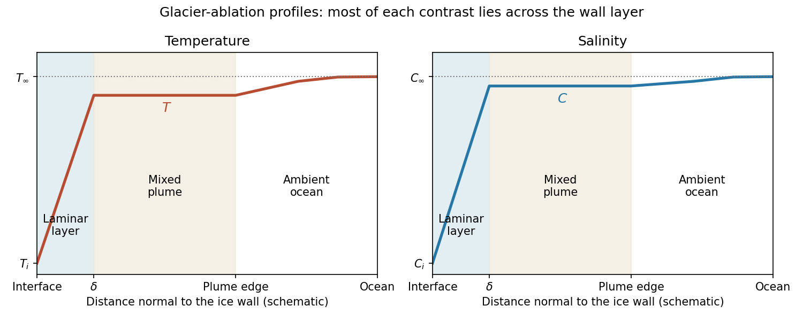

<h1 id="3/solution">Solution</h1>

↑ **Parent:** [3](../3.md)

Use a one-sided [top-hat plume model](../../../../../top-hat-plume-model.md) with [Boussinesq approximation](../../../../../boussinesq-approximation.md) and neglect the solid/liquid density difference in the interfacial volume source. Define the positive ablation speed $U=-\dot a$, [volume flux](../../../../../volumetric-flow-rate.md) per unit wall span $Q=bw$, and kinematic [momentum flux](../../../../../momentum-flux.md) $J=bw^2$. Let ambient entrainment per height be $E=\varepsilon w$, with [entrainment coefficient](../../../../../entrainment-coefficient.md) $\varepsilon$, and take $\rho=\rho_\infty[1+\beta_C(C-C_\infty)]$ for the salinity contribution to density. Conservation of volume and vertical momentum, with negligible wall stress and negligible vertical momentum of entering fluid, gives

$$
\boxed{\frac{d(bw)}{dz}=\varepsilon w+U=\varepsilon w-\dot a,\qquad
\frac{d(bw^2)}{dz}=g\beta_C(C_\infty-C)b.}
$$

Only the ocean-facing edge entrains. Using two edges would change the entrainment coefficient in these formulas.

To derive the heat balance, choose liquid [specific enthalpy](../../../../../specific-enthalpy.md) $h_l=c_pT+L$ and solid [specific enthalpy](../../../../../specific-enthalpy.md) $h_s=c_pT_s$. A horizontal slab receives ambient volume $E\,dz$ with enthalpy $h_\infty=c_pT_\infty+L$, and solid mass-equivalent volume $U\,dz$ with enthalpy $h_s$. Thus

$$
\frac d{dz}[Q(c_pT+L)]=E(c_pT_\infty+L)+Uc_pT_s.
$$

Subtract $(c_pT_\infty+L)Q'$ and divide by $c_p$:

$$
\boxed{\frac d{dz}[bw(T-T_\infty)]
=\dot a\left[\frac L{c_p}+T_\infty-T_s\right].}
$$

Similarly, the incoming salt flux is $EC_\infty+UC_s$, so $(QC)'=EC_\infty+UC_s$. Subtracting $C_\infty Q'$ proves

$$
\boxed{\frac d{dz}[bw(C-C_\infty)]=\dot a(C_\infty-C_s).}
$$

Both anomalies are negative for fresh, cold melt entering the ocean. These balances account for the heat needed to melt the entering [ice](../../../../../ice.md), rather than treating it as already-liquid water at $T_s$.

Now use $L/c_p\gg T_\infty-T_s$, the large [latent-to-sensible heat ratio](../../../../../latent-to-sensible-heat-ratio.md) convention of the paper. Put $\Delta C=C_\infty-C_s>0$. The stated small plume-deficit limits allow us to replace plume $T,C$ by their ambient values in the diffusive interfacial fluxes. The [Stefan condition](../../../../../stefan-condition.md) and interfacial salt balance are then

$$
\frac L{c_p}U=\frac\kappa\delta(T_\infty-T_i),\qquad
U(C_i-C_s)=\frac D\delta(C_\infty-C_i).
$$

For the compositional [Péclet number](../../../../../peclet-number.md) $P\equiv Pe_c=U\delta/D$, solve the second equation and impose the [liquidus](../../../../../liquidus.md):

$$
\boxed{C_i=C_s+\frac{\Delta C}{1+P},\qquad T_i=T_m-\frac{\Gamma\Delta C}{1+P}.}
$$

Substitution in the heat balance gives the [diffusive glacier-ablation interface law](../../../../../diffusive-glacier-ablation-interface-law.md)

$$
\boxed{\frac{LD}{c_p\kappa}P=T_\infty-T_m+\frac{\Gamma(C_\infty-C_s)}{1+P},\qquad \dot a=-\frac D\delta P.}
$$

Here $\Gamma$ is the liquidus slope, unrelated to the surface-energy parameter of the previous question. If $A_T=LD/(c_p\kappa)$, $\Theta=T_\infty-T_m$ and $B_T=\Gamma\Delta C$, the physical root is

$$
\boxed{P=\frac{\Theta-A_T+\sqrt{(A_T+\Theta)^2+4A_TB_T}}{2A_T}.}
$$

It is positive when $\Theta+B_T>0$, exactly the condition that the ocean is warmer than its own [liquidus](../../../../../liquidus.md). Since $\delta$ and ambient properties are fixed, $U$ is constant with height in this approximation.

For the [melting-driven saline wall plume](../../../../../melting-driven-saline-wall-plume.md), measure height $Z=z-z_0$ from a virtual origin. The integrated anomaly balances are

$$
Q(T_\infty-T)=U\frac L{c_p}Z,\qquad Q(C_\infty-C)=U\Delta C Z.
$$

In the specified small-deficit regime the meltwater volume is negligible compared with entrainment. Indeed, the solution below gives $(C_\infty-C)/\Delta C=4U/(3\varepsilon w)$, so a small compositional plume deficit implies $U\ll\varepsilon w$. Thus retain $Q'=\varepsilon w$ for the leading power laws, although $U$ remains essential in the salt and heat sources. Try $b=BZ$, $w=WZ^q$. The salt deficit is proportional to $Z^{-q}$, and the momentum balance has powers $Z^{2q}=Z^{1-q}$, hence $q=1/3$. The volume balance gives $(4/3)BW=\varepsilon W$, and the momentum coefficient gives $(5/3)BW^2=g\beta_CU\Delta C/W$. Therefore

$$
\boxed{b=\frac34\varepsilon Z,\qquad
w=WZ^{1/3},\qquad W=\left(\frac{4g\beta_CU\Delta C}{5\varepsilon}\right)^{1/3},}
$$

$$
\boxed{C_\infty-C=\frac{4U\Delta C}{3\varepsilon W}Z^{-1/3},\qquad
T_\infty-T=\frac{4UL}{3c_p\varepsilon W}Z^{-1/3}.}
$$

These are entrainment-dominated power laws, not an exact solution with the $U$ term retained in the volume equation. They fail close to the virtual origin, where the formal temperature and salinity deficits diverge. Their buoyancy source is distributed melting along the wall, unlike a line plume with a constant buoyancy flux from a localized source.

**[Figure 2](#3/image-temperature-and-salinity-from-the-ice-interface-through-the-wall-layer-and-plume). Temperature and salinity from the ice interface through the wall layer and plume**.

The profiles rise from $T_i,C_i$ across the laminar [boundary layer](../../../../../boundary-layer.md) to the almost-ambient plume values $T,C$, then approach $T_\infty,C_\infty$ across the entraining edge. The sketch uses the linear-gradient approximation implicit in the prescribed diffusive fluxes; it is not an exact normal advection–diffusion profile at large $P$.

For $P\ll1$,

$$
C_i=C_\infty-\Delta C P+O(P^2),\qquad
T_i=T_L(C_\infty)+B_TP+O(P^2),\qquad
\boxed{P\simeq\frac{\Theta+B_T}{A_T+B_T}.}
$$

The last formula retains both first-order terms and is appropriate near the no-ablation threshold. Salt diffusion keeps the interface saline, and freezing-point depression allows [ice dissolution in saline water](../../../../../ice-dissolution-in-saline-water.md) even when $T_\infty<T_m$. Latent heat is still needed, but the thermodynamic permission to ablate comes from the depressed liquidus; small $P$ does not mean a negligible energy cost.

For $P\gg1$, $C_i-C_s\sim\Delta C/P$ and $T_i\sim T_m-B_T/P$. Rapid production of fresh melt dilutes the interface, so its temperature approaches the pure-ice melting point. In the usual thermally driven regime $\Theta>0$ and $\Theta\gg B_T/P$,

$$
\boxed{P\simeq\Theta/A_T,\qquad U\simeq\frac{c_p\kappa}{L\delta}(T_\infty-T_m).}
$$

This is predominantly thermal [melting](../../../../../melting.md). More generally the retained large-$P$ balance is $A_TP\simeq\Theta+B_T/P$. For example, $\Theta=0$ gives $P\sim\sqrt{B_T/A_T}$, which can be large while the driving term is still saline freezing-point depression. Thus the melting/dissolution interpretation must also consider the ocean's temperature relative to $T_m$, not the compositional [Péclet number](../../../../../peclet-number.md) alone.

## ↑ Ancestors (10)

1. [3](../3.md)
2. [Paper 72](../../paper-72-split.md)
3. [Iii](../../split.md)
4. [2010](../../../split.md)
5. [Past exam of the mathematics course of the University of Cambridge](../../../../split.md)
6. [Mathematics course of the University of Cambridge](../../../../../mathematics-course-of-the-university-of-cambridge.md)
7. [Course of the University of Cambridge](../../../../../course-of-the-university-of-cambridge.md)
8. [University of Cambridge](../../../../../university-of-cambridge-split.md)
9. [List of universities](../../../../../list-of-universities.md)
10. [Codex Wiki](../../../../../split.md)
