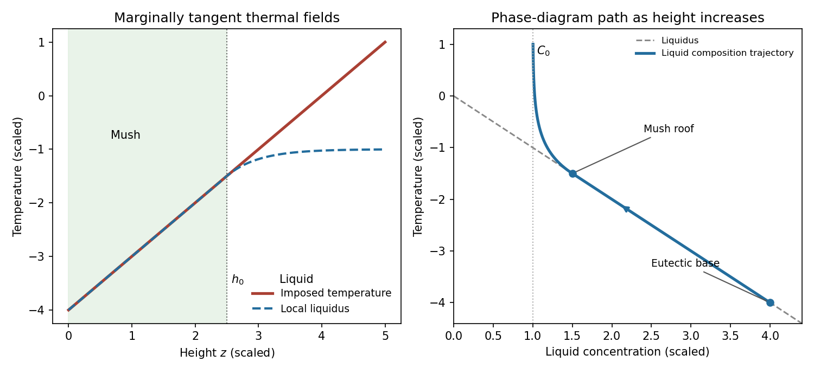
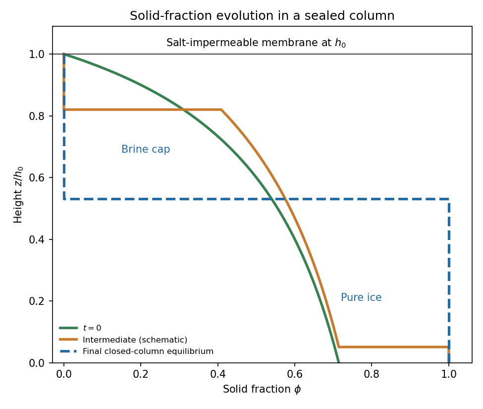

<h1 id="4/solution">Solution</h1>

↑ **Parent:** [4](../4.md)

Take $G,V,D,m,C_0>0$ and $T_E<0$, with the liquidus referenced to the pure-water melting point. The [solid-liquid segregation coefficient](../../../../../solid-liquid-segregation-coefficient.md) $k_D=0$ means that newly formed [ice](../../../../../ice.md) contains no salt. A steady sharp front producing only pure ice cannot remove the incoming solute flux. More explicitly, in the liquid the steady solute flux is $J_C=-VC-DC_z=-VC_0$, whereas in pure solid it is zero. Interfacial salt conservation would require $VC_0=0$, a contradiction. An equilibrium [mushy layer](../../../../../mushy-layer.md) avoids this by carrying concentrated pore liquid down to the eutectic region, where a salt-bearing solid assemblage can form.

Use equal densities and common downward translation velocity $-V$. Write $q=1-\phi$ for the [liquid fraction](../../../../../liquid-fraction.md); $\phi$ here is the [solid fraction](../../../../../solid-fraction.md). Local [liquidus](../../../../../liquidus.md) equilibrium in the mush requires

$$
C_m(z)=-\frac{T_E+Gz}{m}.
$$

Above a stationary roof $h_0$, the liquid [advection-diffusion equation](../../../../../advection-diffusion-equation.md) is $-VC_z=DC_{zz}$, with solution

$$
C_l(z)=C_0+(C_i-C_0)e^{-V(z-h_0)/D}\quad(z\ge h_0).
$$

The [marginal equilibrium at a mush-liquid boundary](../../../../../marginal-equilibrium-at-a-mush-liquid-boundary.md) condition is $-mC_l'(h_0)=G$, hence $C_i=C_0+GD/(mV)$. Matching the [temperature](../../../../../temperature.md) and [liquidus](../../../../../liquidus.md) at the roof gives

$$
\boxed{h_0=\frac{-mC_0-T_E}{G}-\frac DV.}
$$

A positive equilibrium mush requires $(-mC_0-T_E)/G>D/V$; otherwise this positive-thickness construction does not apply.

Including solute diffusion in the liquid pore space, the steady solute flux in the mush is

$$
J_C=-VqC-DqC_z=-VC_0.
$$

Thus $q[C+(D/V)C_z]=C_0$. Inserting $C_z=-G/m$ and the value of $h_0$ yields

$$
q=\frac{C_0}{C-GD/(mV)}
=\frac{mC_0/G}{mC_0/G+h_0-z},\qquad
\boxed{\phi(z)=\frac{h_0-z}{mC_0/G+h_0-z}.}
$$

This is the [diffusive steadily pulled equilibrium mush](../../../../../diffusive-steadily-pulled-equilibrium-mush.md). Omitting the diffusive contribution would give a different solid-fraction distribution.

The imposed [temperature](../../../../../temperature.md) and local [liquidus](../../../../../liquidus.md) coincide throughout the mush. In the liquid put $y=V(z-h_0)/D\ge0$. Their difference is

$$
T(z)-T_L(C_l(z))=\frac{GD}{V}(y-1+e^{-y})\ge0,
$$

with equality and matching first derivatives at the roof. The inequality follows because the derivative of $y-1+e^{-y}$ is $1-e^{-y}\ge0$. Thus the liquid is not constitutionally supercooled. In the [phase diagram](../../../../../phase-diagram.md), the pore-liquid trajectory follows the liquidus from the eutectic composition $C_E=-T_E/m$ to $(C_i,T_i)$, then curves into the liquid region and approaches $C=C_0$ as height increases. Pure-ice crystals have composition zero; the trajectory denotes the liquid composition, not the bulk mush composition.

**[Figure 3](#4/image-steady-pulled-mush-thermal-fields-and-liquid-composition-trajectory). Steady pulled mush: thermal fields and liquid-composition trajectory**.

After pulling stops, the imposed [temperature](../../../../../temperature.md) keeps the pore-liquid composition fixed wherever the material remains mush. Solute conservation becomes

$$
\partial_t[(1-\phi)C]=D\partial_z[(1-\phi)C_z],\qquad C=-\frac{T_E+Gz}{m}.
$$

Because $C_{zz}=0$, this reduces to

$$
\boxed{\left(z+\frac{T_E}{G}\right)\phi_t=D\phi_z.}
$$

The [method of characteristics](../../../../../method-of-characteristics.md) uses $dz/dt=-D/(z+T_E/G)$ and $d\phi/dt=0$. Hence

$$
\frac d{dt}\left[z^2+\frac{2T_E}{G}z+2Dt\right]=0,
\qquad
\boxed{\phi=f(\eta),\qquad \eta=z^2+\frac{2T_E}{G}z+2Dt.}
$$

These are the [solute-diffusion characteristics in a fixed-temperature mush](../../../../../solute-diffusion-characteristics-in-a-fixed-temperature-mush.md); their validity is local to the coexisting solid–liquid region.

For an explicit initial-data solution, define $H=-T_E/G$, $c=mC_0/G$ and $d=D/V$, so $h_0=H-c-d$. A characteristic through $(z,t)$ has initial foot

$$
z_i=H-\sqrt{(H-z)^2+2Dt}.
$$

While that foot lies in the original mush and no phase boundary has removed the point,

$$
\boxed{\phi(z,t)=1-\frac{c}{\sqrt{(H-z)^2+2Dt}-d}.}
$$

This recovers the initial distribution and shows that interior ice fraction increases as salt diffuses upward from colder, more concentrated pore liquid.

If one simply transports the initial zero-solid-fraction level, $f(\eta(h_0,0))=0$ implies the printed formal law

$$
\boxed{\left(h+\frac{T_E}{G}\right)^2
=\left(h_0+\frac{T_E}{G}\right)^2-2Dt.}
$$

On the physical concentration branch $h<H$, this is $h(t)=H-\sqrt{(H-h_0)^2-2Dt}$, so $\dot h=D/(H-h)>0$. It starts moving above $h_0$ immediately.

This formal continuation cannot be the physical mush–liquid roof of a column sealed to salt by the membrane. The [no-flux constraint in a fixed-temperature mush](../../../../../no-flux-constraint-in-a-fixed-temperature-mush.md) is $J_C=-DqC_z=0$ at the membrane. At a smooth zero-fraction equilibrium roof, however, $q=1$ and $C_z=-G/m$, giving $J_C=DG/m\ne0$. Moreover the formal roof has left the membrane-bounded domain. **The printed interface law is incompatible with a salt-impermeable membrane when interpreted as the physical roof.** Its derivation above is a characteristic extrapolation; it does not enforce the stated boundary condition. If “impermeable” were intended to block bulk flow but allow salt diffusion, a different boundary condition would need to be specified.

The closed-column physical sketch is consequently different. Salt transported upward accumulates below the membrane and produces a liquid brine cap; the cap composition need not lie on the liquidus at every height. Its lower boundary can have a finite jump in [solid fraction](../../../../../solid-fraction.md), so it need not follow the initial zero-fraction characteristic. Near the cold solid base, zero salt supply from below requires the liquid fraction to vanish, and a pure-ice region develops. In the surviving mush, the characteristic formula increases $\phi$ relative to its initial value. An intermediate profile therefore has pure ice at the bottom, a remaining mush with elevated solid fraction, and liquid at the top. The plotted intermediate roof is schematic, not claimed to obey the inconsistent formal law.

**[Figure 4](#4/image-initial-intermediate-and-final-solid-fractions-in-a-salt-sealed-column). Initial, intermediate and final solid fractions in a salt-sealed column**.

One can characterize the final state quantitatively if the solid base also admits no salt diffusion, as in the usual pure-solid/no-solid-diffusion closure. In a stationary column, solute flux is constant and is zero at the sealed roof. A finite-width equilibrium mush would have $J_C=DGq/m$, forcing $q=0$ everywhere in that region; it therefore cannot remain mush. The final state is pure ice for $0<z<h_f$ and a uniform-composition liquid cap for $h_f<z<h_0$. At their boundary,

$$
\boxed{C_f=\frac Gm(H-h_f),\qquad
\phi_f(z)=\begin{cases}1,&0<z<h_f,\\0,&h_f<z<h_0.\end{cases}}
$$

The cap is liquid because $T(z)>-mC_f=T(h_f)$ above its base. The fixed external thermal field can supply or remove the heat involved; this is a solute-budget determination rather than an isolated enthalpy budget.

The [final salt budget of a sealed mush column](../../../../../final-salt-budget-of-a-sealed-mush-column.md) determines $h_f$. Initially

$$
N=\int_0^{h_0}(1-\phi_0)C_m\,dz
=C_0\left[h_0+d\log\left(1+\frac{h_0}{c}\right)\right],
$$

since $(1-\phi_0)C_m=C_0[1+d/(c+h_0-z)]$. Conservation requires $C_f(h_0-h_f)=N$. Writing the final cap depth $\ell_f=h_0-h_f$, the equation and its unique positive root are

$$
\ell_f(\ell_f+c+d)=c\left[h_0+d\log\left(1+\frac{h_0}{c}\right)\right],
$$

$$
\boxed{\ell_f=\frac{\sqrt{(c+d)^2+4c[h_0+d\log(1+h_0/c)]}-(c+d)}{2},\qquad h_f=h_0-\ell_f.}
$$

The initial salt integral is less than $C_Eh_0$, so $0<\ell_f<h_0$ and $0<h_f<h_0$; the resulting $C_f<C_E$ remains on the ice–brine branch above the eutectic. If the basal eutectic region is instead allowed to exchange solute with the column, this salt budget must include that flux and the numerical final height is not fixed by the printed data alone. No universal physical $h(t)$ follows from the interior characteristic equation without the cap and basal boundary conditions.

## ↑ Ancestors (10)

1. [4](../4.md)
2. [Paper 72](../../paper-72-split.md)
3. [Iii](../../split.md)
4. [2010](../../../split.md)
5. [Past exam of the mathematics course of the University of Cambridge](../../../../split.md)
6. [Mathematics course of the University of Cambridge](../../../../../mathematics-course-of-the-university-of-cambridge.md)
7. [Course of the University of Cambridge](../../../../../course-of-the-university-of-cambridge.md)
8. [University of Cambridge](../../../../../university-of-cambridge-split.md)
9. [List of universities](../../../../../list-of-universities.md)
10. [Codex Wiki](../../../../../split.md)
