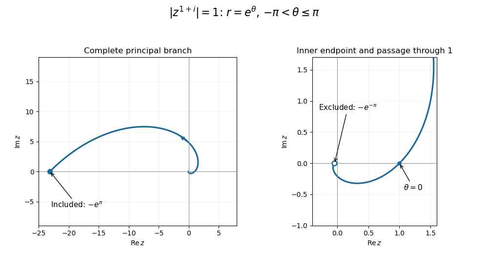

<h1 id="1c/solution">Solution</h1>

↑ **Parent:** [1C](../1c.md)

For a nonzero [complex number](../../../../../complex-number.md), write $z=re^{i\theta}$ with $r=|z|>0$ and principal [complex argument](../../../../../argument-complex-analysis.md) $-\pi<\theta\le\pi$. The [principal complex logarithm](../../../../../principal-complex-logarithm.md) and corresponding [complex exponentiation](../../../../../complex-exponentiation.md) are

$$
\boxed{\operatorname{Log}z=\log r+i\theta,\qquad z^a=\exp(a\operatorname{Log}z).}
$$

The value at zero is not defined by this formula. The choice of [complex argument](../../../../../argument-complex-analysis.md) matters: these are single-valued principal powers, rather than all values of a multivalued [complex logarithm](../../../../../complex-logarithm.md).

For the requested sketch, $(1+i)\operatorname{Log}z=(\log r-\theta)+i(\log r+\theta)$. Its [complex exponential](../../../../../complex-exponential-function.md) has [complex modulus](../../../../../complex-modulus.md) $e^{\log r-\theta}$, so

$$
\boxed{|z^{1+i}|=1\quad\Longleftrightarrow\quad r=e^\theta,\qquad-\pi<\theta\le\pi.}
$$

This is one turn of a [logarithmic spiral](../../../../../logarithmic-spiral.md), with increasing radius as the polar angle increases. It passes through $1$ at $\theta=0$, approaches the excluded endpoint $-e^{-\pi}$ from below the negative real axis, and ends at the included endpoint $-e^\pi$ from above that axis. The endpoint distinction follows from the chosen principal [complex argument](../../../../../argument-complex-analysis.md).

**[Figure 1](#1c/image-one-turn-of-the-principal-power-logarithmic-spiral-with-open-inner-and-closed-outer-endpoints). One turn of the principal-power logarithmic spiral, with open inner and closed outer endpoints**.

## ↑ Ancestors (10)

1. [1C](../1c.md)
2. [Paper 1](../../paper-1-split.md)
3. [Ia](../../split.md)
4. [2011](../../../split.md)
5. [Past exam of the mathematics course of the University of Cambridge](../../../../split.md)
6. [Mathematics course of the University of Cambridge](../../../../../mathematics-course-of-the-university-of-cambridge.md)
7. [Course of the University of Cambridge](../../../../../course-of-the-university-of-cambridge.md)
8. [University of Cambridge](../../../../../university-of-cambridge-split.md)
9. [List of universities](../../../../../list-of-universities.md)
10. [Codex Wiki](../../../../../split.md)
