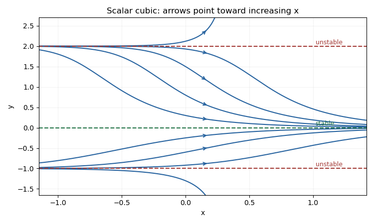

<h1 id="2a/b/solution">Solution</h1>

↑ **Parent:** [B](../b.md)

Factor the right-hand side as $f(y)=y(y-2)(y+1)$. Its [equilibrium points](../../../../../../equilibrium-point-of-a-dynamical-system.md) are $-1,0,2$, and $f'(y)=3y^2-2y-2$ gives

$$
\boxed{y=-1:\ \text{unstable};\qquad y=0:\ \text{asymptotically stable};\qquad y=2:\ \text{unstable}.}
$$

Indeed $f'(-1)=3$, $f'(0)=-2$ and $f'(2)=6$. The [phase line](../../../../../../phase-line.md) has downward motion for $y<-1$, upward motion for $-1<y<0$, downward motion for $0<y<2$, and upward motion for $y>2$. The uniqueness of a smooth [autonomous differential equation](../../../../../../autonomous-system-mathematics.md) prevents trajectories from crossing an [equilibrium point](../../../../../../equilibrium-point-of-a-dynamical-system.md). Consequently trajectories starting between $-1$ and $2$ approach zero as $x\to\infty$, while those outside that interval move away from the three [equilibrium points](../../../../../../equilibrium-point-of-a-dynamical-system.md). The constant trajectories and representative nonconstant trajectories are shown below.

**[Figure 1](#2a/b/image-representative-trajectories-and-equilibrium-levels-for-the-scalar-cubic-differential-equation). Representative trajectories and equilibrium levels for the scalar cubic differential equation**.

## ↑ Ancestors (12)

1. [B](../b.md)
2. [2A](../../2a.md)
3. [Section I](../../section-i.md)
4. [Paper 2](../../../paper-2-split.md)
5. [Ia](../../../split.md)
6. [2011](../../../../split.md)
7. [Past exam of the mathematics course of the University of Cambridge](../../../../../split.md)
8. [Mathematics course of the University of Cambridge](../../../../../../mathematics-course-of-the-university-of-cambridge.md)
9. [Course of the University of Cambridge](../../../../../../course-of-the-university-of-cambridge.md)
10. [University of Cambridge](../../../../../../university-of-cambridge-split.md)
11. [List of universities](../../../../../../list-of-universities.md)
12. [Codex Wiki](../../../../../../split.md)
