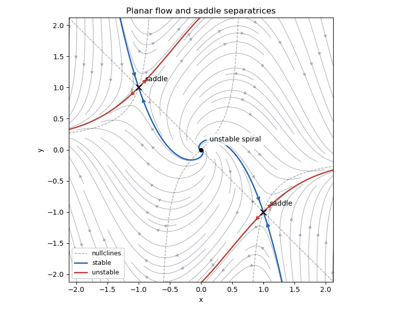

<h1 id="5a/b/solution">Solution</h1>

↑ **Parent:** [B](../b.md)

At a [fixed point](../../../../../../fixed-point.md), the first equation gives $y=-x$. Substitution into the second gives $2x(x^2-1)=0$, so the [equilibrium points](../../../../../../equilibrium-point-of-a-dynamical-system.md) are $(0,0),(1,-1),(-1,1)$. The [Jacobian matrix](../../../../../../jacobian-matrix.md) is

$$
J(x,y)=\begin{pmatrix}1&1\\-1-4xy&1-2x^2\end{pmatrix}.
$$

At the origin its [eigenvalues](../../../../../../eigenvalue.md) are $1\pm i$, so **the origin is an unstable spiral**. The local rotation is clockwise: on the positive $x$-axis the velocity points downward. At either nonzero [equilibrium point](../../../../../../equilibrium-point-of-a-dynamical-system.md),

$$
J=\begin{pmatrix}1&1\\3&-1\end{pmatrix},\qquad \det(J-\lambda I)=\lambda^2-4.
$$

Thus **both nonzero equilibria are saddles**, with [eigenvalues](../../../../../../eigenvalue.md) $-2,2$. The [stable manifold](../../../../../../stable-manifold.md) is tangent to $(1,-3)$, and the [unstable manifold](../../../../../../unstable-manifold.md) to $(1,1)$, at each [saddle equilibrium](../../../../../../saddle-equilibrium.md). Since all these [equilibrium points](../../../../../../equilibrium-point-of-a-dynamical-system.md) are hyperbolic, [linear stability of a planar equilibrium](../../../../../../linear-stability-of-a-planar-equilibrium.md) gives their actual local types.

For the [phase portrait](../../../../../../phase-portrait.md), the [nullclines](../../../../../../nullcline.md) are $y=-x$ and $y=x/(1-2x^2)$, the latter defined away from $x=\pm1/\sqrt2$. The horizontal direction has the sign of $x+y$; the vertical direction has the sign of $(1-2x^2)y-x$. The system is invariant under $(x,y)\mapsto(-x,-y)$, so trajectories occur in centrally symmetric pairs. The arrows below show these directions; the highlighted [stable manifolds](../../../../../../stable-manifold.md) enter the [saddle equilibria](../../../../../../saddle-equilibrium.md), whereas the highlighted [unstable manifolds](../../../../../../unstable-manifold.md) leave them.

**[Figure 2](#5a/b/image-clockwise-unstable-spiral-and-two-saddles-with-stable-and-unstable-separatrices). Clockwise unstable spiral and two saddles with stable and unstable separatrices**.

## ↑ Ancestors (12)

1. [B](../b.md)
2. [5A](../../5a.md)
3. [Section II](../../section-ii.md)
4. [Paper 2](../../../paper-2-split.md)
5. [Ia](../../../split.md)
6. [2011](../../../../split.md)
7. [Past exam of the mathematics course of the University of Cambridge](../../../../../split.md)
8. [Mathematics course of the University of Cambridge](../../../../../../mathematics-course-of-the-university-of-cambridge.md)
9. [Course of the University of Cambridge](../../../../../../course-of-the-university-of-cambridge.md)
10. [University of Cambridge](../../../../../../university-of-cambridge-split.md)
11. [List of universities](../../../../../../list-of-universities.md)
12. [Codex Wiki](../../../../../../split.md)
