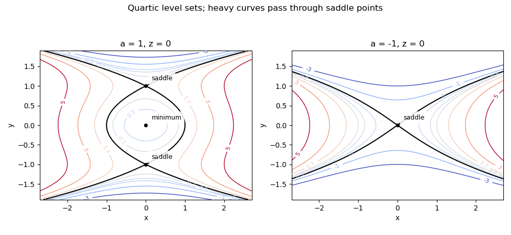

<h1 id="6a/b/iv/solution">Solution</h1>

↑ **Parent:** [Iv](../iv.md)

In the $(x,y)$-plane take $z=0$; holding another fixed $z$ merely shifts all contour labels by $z^2$. The [level sets](../../../../../../../level-set.md) satisfy

$$
x^2=y^4-2ay^2+c.
$$

For $a=1$, the origin is a [local minimum](../../../../../../../local-minimum.md) and $(0,\pm1)$ are [saddle points of a scalar function](../../../../../../../saddle-point-of-a-scalar-function.md) at contour value $1$. For $0<c<1$, a closed contour around the origin is accompanied by unbounded outer components. At $c=1$ the contour satisfies $x=\pm(y^2-1)$ and crosses at the two [saddle points of a scalar function](../../../../../../../saddle-point-of-a-scalar-function.md). For $c>1$, two unbounded components remain; negative contours have only outer components.

For $a=-1$, the origin is a [saddle point of a scalar function](../../../../../../../saddle-point-of-a-scalar-function.md), and the zero contour is $x=\pm y\sqrt{y^2+2}$, with tangent lines $x=\pm\sqrt2\,y$. Positive contours form two components extending on opposite sides of the $y$-axis; negative contours form upper and lower components. These [level sets](../../../../../../../level-set.md) are illustrated below.

**[Figure 3](#6a/b/iv/image-contours-of-the-quartic-surface-at-z-equal-to-zero-for-a-equal-to-one-and-minus-one). Contours of the quartic surface at z equal to zero for a equal to one and minus one**.

## ↑ Ancestors (13)

1. [Iv](../iv.md)
2. [B](../../b.md)
3. [6A](../../../6a.md)
4. [Section II](../../../section-ii.md)
5. [Paper 2](../../../../paper-2-split.md)
6. [Ia](../../../../split.md)
7. [2011](../../../../../split.md)
8. [Past exam of the mathematics course of the University of Cambridge](../../../../../../split.md)
9. [Mathematics course of the University of Cambridge](../../../../../../../mathematics-course-of-the-university-of-cambridge.md)
10. [Course of the University of Cambridge](../../../../../../../course-of-the-university-of-cambridge.md)
11. [University of Cambridge](../../../../../../../university-of-cambridge-split.md)
12. [List of universities](../../../../../../../list-of-universities.md)
13. [Codex Wiki](../../../../../../../split.md)
