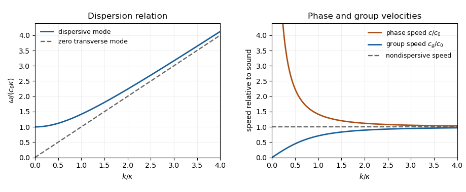

<h1 id="39b/solution">Solution</h1>

↑ **Parent:** [39B](../39b.md)

Use an [acoustic velocity potential](../../../../../acoustic-velocity-potential.md) $\varphi$ with $\mathbf u=\nabla\varphi$ and $p'=-\rho_0\varphi_t$. It obeys the [wave equation](../../../../../wave-equation-split.md) $\varphi_{tt}=c_0^2\nabla^2\varphi$. The rigid walls require zero normal velocity, hence [Neumann boundary conditions](../../../../../neumann-boundary-condition.md) on the transverse variables. Separation gives

$$
\varphi=\operatorname{Re}\left\{A e^{i(kx-\omega t)}\cos(my/\alpha)\cos(nz/\beta)\right\},\qquad m,n\in\{0,1,2,\ldots\}.
$$

Define $\kappa_{mn}^2=m^2/\alpha^2+n^2/\beta^2$. The [dispersion relation](../../../../../dispersion-relation.md), [phase velocity](../../../../../phase-velocity.md) and [group velocity](../../../../../group-velocity.md) for positive $k,\omega$ are

$$
\boxed{\omega=c_0\sqrt{k^2+\kappa_{mn}^2},\qquad c=\frac\omega k=c_0\sqrt{1+\frac{\kappa_{mn}^2}{k^2}},\qquad c_g=\frac{c_0k}{\sqrt{k^2+\kappa_{mn}^2}}=\frac{c_0^2}{c}.}
$$

For a dispersive mode, $\omega(0)=c_0\kappa_{mn}>0$, $c$ decreases from infinity to $c_0$, and $c_g$ increases from zero to $c_0$. The $(0,0)$ mode has $\omega=c_0k$ and $c=c_g=c_0$: it propagates without dispersion.

**[Figure 1](#39b/image-acoustic-waveguide-dispersion-and-velocities-a-nonzero-transverse-wavenumber-is-compared-with-the-nondispersive-mode). Acoustic waveguide dispersion and velocities; a nonzero transverse wavenumber is compared with the nondispersive mode**.

Let $\mathcal A=\pi^2\alpha\beta$ be the cross-sectional area. The appropriate time and cross-sectional average at fixed $x$ is

$$
\langle h\rangle=\frac{\omega}{2\pi\mathcal A}\int_0^{2\pi/\omega}\int_0^{\pi\alpha}\int_0^{\pi\beta}h\,dz\,dy\,dt.
$$

Write $F_{mn}(y,z)$ for the product of cosines and $Q=\mathcal A^{-1}\int F_{mn}^2\,dy\,dz$. Its transverse eigenvalue and wall conditions give $\int|\nabla_\perp F_{mn}|^2=\kappa_{mn}^2\int F_{mn}^2$ by integration by parts. The [kinetic energy density](../../../../../kinetic-energy-density.md) and compressive acoustic energy density are $\rho_0|\mathbf u|^2/2$ and $(p')^2/(2\rho_0c_0^2)$. Time averaging each squared real oscillation contributes a factor $1/2$, so

$$
\boxed{\langle E_{\rm kin}\rangle=\frac{\rho_0|A|^2Q}{4}(k^2+\kappa_{mn}^2)=\frac{\rho_0|A|^2Q\omega^2}{4c_0^2}=\langle E_{\rm comp}\rangle.}
$$

This holds for every dispersive mode, and also for the zero mode.

For localized smooth initial data, a dispersive mode contains integrals of the form $\int a(k)e^{it[kV-\omega(k)]}\,dk$ along $x=Vt$. When $0<V<c_0$, a stationary point exists at $k_* =\kappa_{mn}V/\sqrt{c_0^2-V^2}$. It is nondegenerate because $\omega''(k)=c_0\kappa_{mn}^2/(k^2+\kappa_{mn}^2)^{3/2}>0$. The [stationary phase method](../../../../../stationary-phase-method.md) therefore gives an oscillatory amplitude $O(t^{-1/2})$ for each excited dispersive mode, and for their sum under sufficient mode summability.

At $V=c_0$, no dispersive mode has a finite stationary wavenumber; with smooth localized data these contributions decay, while the nondispersive right-moving pulse retains its original amplitude. Thus a general disturbance with nonzero zero-mode component has **an undiminished $O(1)$ pulse on the sound-speed ray**. If that component is absent, this surviving contribution is absent too. For $V>c_0$, [finite propagation speed](../../../../../finite-propagation-speed.md) puts a compactly supported initial disturbance outside this ray for all sufficiently large $t$, so **the field is eventually zero**. Rapidly localized, rather than strictly compact, data give a correspondingly negligible tail instead.

## ↑ Ancestors (11)

1. [39B](../39b.md)
2. [Section II](../section-ii.md)
3. [Paper 1](../../paper-1-split.md)
4. [Ii](../../split.md)
5. [2011](../../../split.md)
6. [Past exam of the mathematics course of the University of Cambridge](../../../../split.md)
7. [Mathematics course of the University of Cambridge](../../../../../mathematics-course-of-the-university-of-cambridge.md)
8. [Course of the University of Cambridge](../../../../../course-of-the-university-of-cambridge.md)
9. [University of Cambridge](../../../../../university-of-cambridge-split.md)
10. [List of universities](../../../../../list-of-universities.md)
11. [Codex Wiki](../../../../../split.md)
