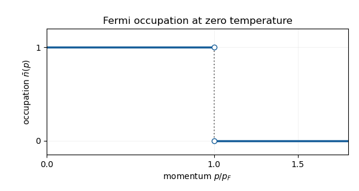

<h1 id="10e/i/solution">Solution</h1>

↑ **Parent:** [I](../i.md)

As $T\downarrow0$, the [Fermi-Dirac distribution](../../../../../../fermi-dirac-distribution.md) tends to a step function: $\bar n(p)=1$ for $\epsilon(p)<\mu_0$, and $0$ for $\epsilon(p)>\mu_0$. The value at equality is immaterial to the integrals. The [Fermi momentum](../../../../../../fermi-momentum.md) is defined by $\epsilon(p_F)=\mu_0$: the [Pauli exclusion principle](../../../../../../pauli-exclusion-principle.md) fills the lowest available states and forbids multiple occupation of a state with a fixed spin. Thus the sketch is a horizontal line at one up to $p_F$, followed by a jump to zero.

**[Figure 1](#10e/i/image-zero-temperature-fermi-occupation-as-a-function-of-momentum-the-value-at-the-jump-is-immaterial). Zero-temperature Fermi occupation as a function of momentum; the value at the jump is immaterial**.

$$
\boxed{n=\frac{4\pi g_s}{3h^3}p_F^3.}
$$

In the [ultrarelativistic](../../../../../../ultrarelativistic-particle.md), $\epsilon(p)\simeq cp$, giving

$$
\frac EV\simeq\frac{4\pi g_s c}{h^3}\int_0^{p_F}p^3\,dp=\frac{\pi g_sc}{h^3}p_F^4=\frac34ncp_F.
$$

Eliminate $p_F$ to obtain

$$
\boxed{E\simeq\frac34\left(\frac3{4\pi g_s}\right)^{1/3}hc\,n^{4/3}V\sim hc\,n^{4/3}V.}
$$

The supplied expression for $\epsilon$ includes rest energy; in this limit its leading term is also the leading kinetic energy.

## ↑ Ancestors (11)

1. [I](../i.md)
2. [10E](../../10e.md)
3. [Paper 3](../../../paper-3-split.md)
4. [Ii](../../../split.md)
5. [2011](../../../../split.md)
6. [Past exam of the mathematics course of the University of Cambridge](../../../../../split.md)
7. [Mathematics course of the University of Cambridge](../../../../../../mathematics-course-of-the-university-of-cambridge.md)
8. [Course of the University of Cambridge](../../../../../../course-of-the-university-of-cambridge.md)
9. [University of Cambridge](../../../../../../university-of-cambridge-split.md)
10. [List of universities](../../../../../../list-of-universities.md)
11. [Codex Wiki](../../../../../../split.md)
