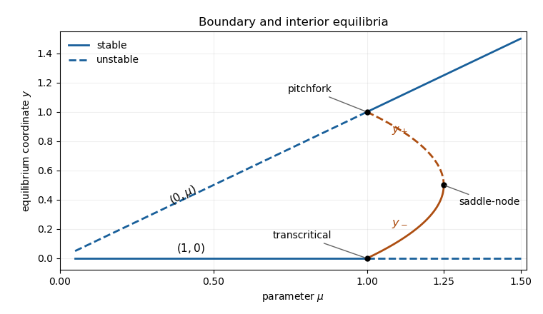

<h1 id="14c/iv/solution">Solution</h1>

↑ **Parent:** [Iv](../iv.md)

The [bifurcation diagram](../../../../../../bifurcation-diagram.md) has boundary branches $y=0$ at $(1,0)$ and $y=\mu$ at $(0,\mu)$. The former is stable for $0<\mu<1$ and a saddle for $\mu>1$; the latter is a saddle for $0<\mu<1$ and stable for $\mu>1$. The origin is an unstable equilibrium for every $\mu>0$; its $y=0$ branch coincides in this projection with the $(1,0)$ branch, so it is shown separately in the caption.

The stable interior branch $y_-$ rises from $0$ at $\mu=1$ to $1/2$ at $\mu=5/4$. The unstable interior branch $y_+$ falls from $1$ to $1/2$ over the same interval. These meet at the [saddle-node bifurcation](../../../../../../saddle-node-bifurcation.md); at $\mu=1$ they meet the transcritical and pitchfork points respectively. There is bistability between the lower interior node and $(0,\mu)$ for $1<\mu<5/4$.

**[Figure 2](#14c/iv/image-equilibrium-branches-and-stability-for-question-14-the-always-unstable-origin-also-projects-to-y-equals-zero). Equilibrium branches and stability for Question 14; the always unstable origin also projects to y equals zero**.

## ↑ Ancestors (11)

1. [Iv](../iv.md)
2. [14C](../../14c.md)
3. [Paper 3](../../../paper-3-split.md)
4. [Ii](../../../split.md)
5. [2011](../../../../split.md)
6. [Past exam of the mathematics course of the University of Cambridge](../../../../../split.md)
7. [Mathematics course of the University of Cambridge](../../../../../../mathematics-course-of-the-university-of-cambridge.md)
8. [Course of the University of Cambridge](../../../../../../course-of-the-university-of-cambridge.md)
9. [University of Cambridge](../../../../../../university-of-cambridge-split.md)
10. [List of universities](../../../../../../list-of-universities.md)
11. [Codex Wiki](../../../../../../split.md)
