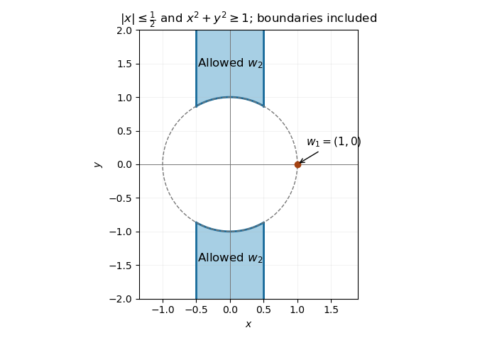

<h1 id="12g/solution">Solution</h1>

↑ **Parent:** [12G](../12g.md)

A [Euclidean lattice](../../../../../euclidean-lattice.md) in $\mathbb R^2$ is a discrete additive [subgroup](../../../../../subgroup.md), equivalently the [integer](../../../../../integer.md) span of zero, one or two real-linearly independent [vectors](../../../../../vector.md). Its rank is the number of these generators, or the dimension of its real span. Discreteness makes its intersection with any bounded set finite, so shortest nonzero vectors exist.

First $\Lambda\cap\mathbb Rw_1=\mathbb Zw_1$. Otherwise an element $tw_1$ with noninteger $t$ could be reduced by its nearest [integer](../../../../../integer.md) multiple of $w_1$ to a nonzero vector of length at most $|w_1|/2$, contradicting minimality. Therefore $w_2\notin\mathbb Zw_1$ is not parallel to $w_1$.

Write any $v\in\Lambda$ as $v=aw_1+bw_2$ with real coefficients. Subtract nearest [integer](../../../../../integer.md) multiples to obtain $r=sw_1+tw_2\in\Lambda$, with $|s|,|t|\le1/2$. If $t\ne0$, it is not on the first axis, yet

$$
|r|\le\tfrac12(|w_1|+|w_2|)\le|w_2|,
$$

with strict inequality because the independent vectors cannot achieve equality in the [triangle inequality](../../../../../triangle-inequality.md); if one coefficient vanishes the inequality is also strict. This contradicts minimality of $w_2$. If $t=0$ and $r\ne0$, then $|r|\le|w_1|/2$, contradicting minimality of $w_1$. Thus $r=0$ and both original coefficients are [integers](../../../../../integer.md). Hence **$\boxed{\Lambda=\mathbb Zw_1+\mathbb Zw_2}$**.

For $w_1=(1,0)$ and $w_2=(x,y)$, minimality implies $x^2+y^2\ge1$ and $|w_2|\le|w_2\pm w_1|$, hence $|x|\le1/2$. The exact region is

$$
\boxed{-\tfrac12\le x\le\tfrac12,\qquad |y|\ge\sqrt{1-x^2}.}
$$

These conditions are sufficient: in the generated lattice, vectors with second coefficient $\pm1$ have smallest length when the first coefficient is zero, allowing ties at $|x|=1/2$. A vector with second coefficient of magnitude at least two has length at least $2|y|>\sqrt{x^2+y^2}$, since $|y|^2\ge3/4$ and $x^2\le1/4$. Vectors on the first axis have length at least one. Thus the shaded region includes exactly all allowable choices, including ties on its boundary.

**[Figure 2](#12g/image-allowed-second-shortest-lattice-vectors-in-the-vertical-strip-outside-the-unit-circle). Allowed second shortest lattice vectors in the vertical strip outside the unit circle**.

For a second lattice basis, write $v_1=aw_1+bw_2$, $v_2=cw_1+dw_2$ with [integer](../../../../../integer.md) coefficients, as just proved. Conversely each $w_i$ is an [integer](../../../../../integer.md) combination of the $v_j$. The change-of-basis matrix $\begin{pmatrix}a&c\\b&d\end{pmatrix}$ and its inverse therefore both have [integer](../../../../../integer.md) entries. Their [determinants](../../../../../determinant.md) are [integers](../../../../../integer.md) with product one, giving **$\boxed{ad-bc=\pm1}$**. Thus lattice bases are related by a [unimodular matrix](../../../../../unimodular-matrix.md).

## ↑ Ancestors (10)

1. [12G](../12g.md)
2. [Paper 4](../../paper-4-split.md)
3. [Ii](../../split.md)
4. [2011](../../../split.md)
5. [Past exam of the mathematics course of the University of Cambridge](../../../../split.md)
6. [Mathematics course of the University of Cambridge](../../../../../mathematics-course-of-the-university-of-cambridge.md)
7. [Course of the University of Cambridge](../../../../../course-of-the-university-of-cambridge.md)
8. [University of Cambridge](../../../../../university-of-cambridge-split.md)
9. [List of universities](../../../../../list-of-universities.md)
10. [Codex Wiki](../../../../../split.md)
