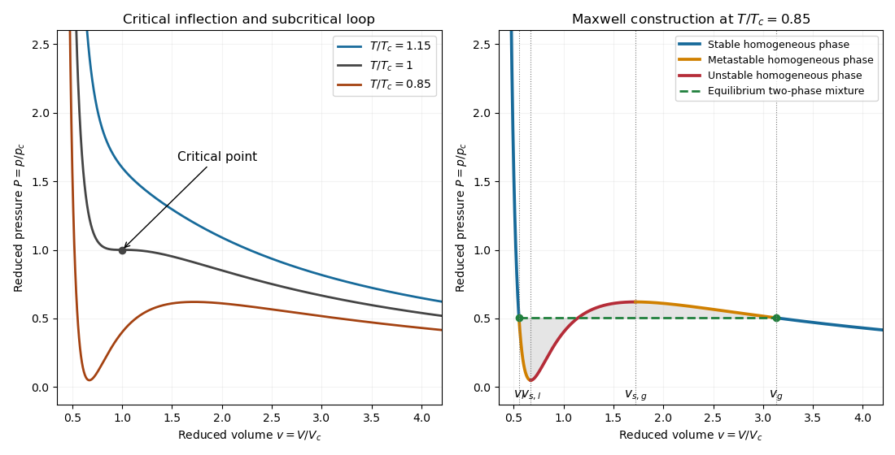

<h1 id="34d/ii/solution">Solution</h1>

↑ **Parent:** [Ii](../ii.md)

In the [Van der Waals equation](../../../../../../van-der-waals-equation.md), $b>0$ accounts for excluded volume per particle, while $a>0$ accounts for attractive interactions that reduce the pressure relative to a hard-core ideal gas. Writing $v=V/N$ gives $p=k_BT/(v-b)-a/v^2$. At the [critical point](../../../../../../critical-point.md) the first two volume derivatives vanish:

$$
-\frac{k_BT}{(v-b)^2}+\frac{2a}{v^3}=0,\qquad
\frac{2k_BT}{(v-b)^3}-\frac{6a}{v^4}=0.
$$

Dividing gives $v_c=3b$ and then

$$
\boxed{k_BT_c=\frac{8a}{27b},\qquad V_c=3bN,\qquad p_c=\frac{a}{27b^2}.}
$$

Above $T_c$ the isotherms decrease monotonically; at $T_c$ there is a horizontal inflection; below $T_c$ the formal curve develops a local minimum and maximum. The physically equilibrated isotherm replaces part of that loop by a constant-pressure coexistence segment.

**[Figure 3](#34d/ii/image-van-der-waals-isotherms-and-maxwell-construction-with-stable-metastable-and-unstable-branches). Van der Waals isotherms and Maxwell construction with stable, metastable and unstable branches**.

## ↑ Ancestors (11)

1. [Ii](../ii.md)
2. [34D](../../34d.md)
3. [Paper 4](../../../paper-4-split.md)
4. [Ii](../../../split.md)
5. [2011](../../../../split.md)
6. [Past exam of the mathematics course of the University of Cambridge](../../../../../split.md)
7. [Mathematics course of the University of Cambridge](../../../../../../mathematics-course-of-the-university-of-cambridge.md)
8. [Course of the University of Cambridge](../../../../../../course-of-the-university-of-cambridge.md)
9. [University of Cambridge](../../../../../../university-of-cambridge-split.md)
10. [List of universities](../../../../../../list-of-universities.md)
11. [Codex Wiki](../../../../../../split.md)
