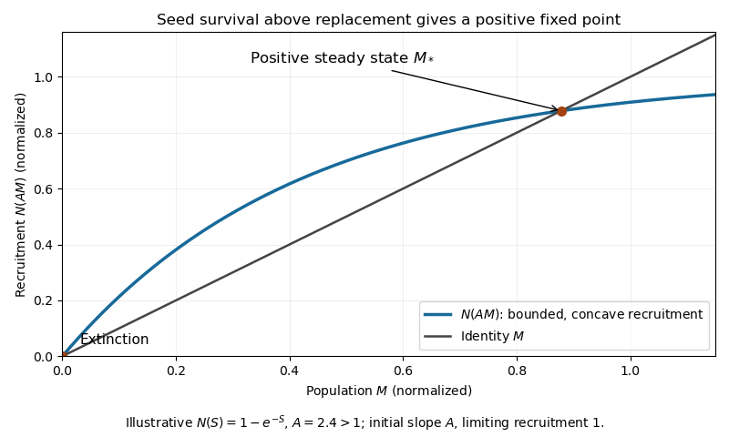

<h1 id="6b/solution">Solution</h1>

↑ **Parent:** [6B](../6b.md)

The preceding summer supplies $\gamma M_n$ new seeds. After one winter, $\alpha\gamma M_n$ survive and the fraction $\mu$ germinates. Seeds from summer $n-1$ must survive two winters and fail to germinate after the first, so their germinating contribution is $\nu\alpha^2(1-\mu)\gamma M_{n-1}$. Older seeds cannot contribute. Applying the density-dependent maturation function gives

$$
\boxed{M_{n+1}=N(aM_n+bM_{n-1}),\qquad a=\alpha\mu\gamma,\quad b=\nu\gamma\alpha^2(1-\mu).}
$$

This is a [seed-bank population recurrence](../../../../../seed-bank-population-recurrence.md). Put $A=a+b$. Its [fixed points](../../../../../fixed-point.md) satisfy $M_*=N(AM_*)$. The zero solution always exists. If $A>1$, the graph of $N(AM)$ leaves the origin with slope $A>1$, is concave because $N'$ decreases, and is bounded above by $N_{\max}$; it therefore crosses the straight line $M$ again at a positive value. [Concavity](../../../../../concave-function.md) makes this positive crossing unique: the ratio $N(S)/S$ is nonincreasing, starts at one, tends to zero, and is strictly decreasing at any level below one that it attains after the initial slope has dropped. Thus **there are exactly two nonnegative steady states when $A>1$**.

**[Figure 1](#6b/image-concave-seed-bank-recruitment-crossing-the-identity-at-extinction-and-a-positive-population). Concave seed-bank recruitment crossing the identity at extinction and a positive population**.

Linearization at extinction uses $N'(0)=1$:

$$
\delta M_{n+1}=a\delta M_n+b\delta M_{n-1},\qquad
r^2-ar-b=0.
$$

The positive root is $r_+=(a+\sqrt{a^2+4b})/2$. Since the polynomial at $r=1$ is $1-A<0$, and tends to positive infinity, $r_+>1$. Its associated two-component perturbation can be chosen nonnegative, so the growing mode is physically admissible. **Extinction is unstable whenever $\boxed{a+b>1}$**.

## ↑ Ancestors (10)

1. [6B](../6b.md)
2. [Paper 4](../../paper-4-split.md)
3. [Ii](../../split.md)
4. [2011](../../../split.md)
5. [Past exam of the mathematics course of the University of Cambridge](../../../../split.md)
6. [Mathematics course of the University of Cambridge](../../../../../mathematics-course-of-the-university-of-cambridge.md)
7. [Course of the University of Cambridge](../../../../../course-of-the-university-of-cambridge.md)
8. [University of Cambridge](../../../../../university-of-cambridge-split.md)
9. [List of universities](../../../../../list-of-universities.md)
10. [Codex Wiki](../../../../../split.md)
