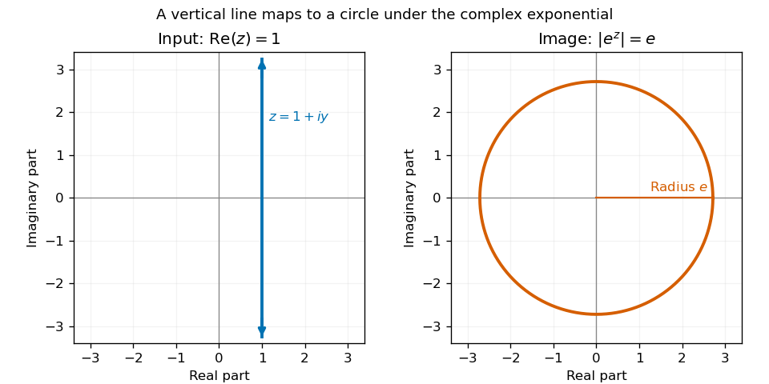

# Paper 1

↑ **Parent:** [Ia](../ia.md)

[https://www.maths.cam.ac.uk/undergrad/pastpapers/files/2012/PaperIA_1.pdf](https://www.maths.cam.ac.uk/undergrad/pastpapers/files/2012/PaperIA_1.pdf)

**Table of contents**

- [1C](#1c)
  - [a](#1c/a)
    - [Solution](#1c/a/solution)
  - [b](#1c/b)
    - [i](#1c/b/i)
      - [Solution](#1c/b/i/solution)
    - [ii](#1c/b/ii)
      - [Solution](#1c/b/ii/solution)
  - [c](#1c/c)
    - [Solution](#1c/c/solution)
- [2A](#2a)
  - [Solution](#2a/solution)
- [3E](#3e)
  - [Solution](#3e/solution)
- [4F](#4f)
  - [Solution](#4f/solution)
- [5C](#5c)
  - [Solution](#5c/solution)
- [6A](#6a)
  - [Solution](#6a/solution)
- [7B](#7b)
  - [a](#7b/a)
    - [Solution](#7b/a/solution)
  - [b](#7b/b)
    - [Solution](#7b/b/solution)
  - [c](#7b/c)
    - [Solution](#7b/c/solution)
- [8B](#8b)
  - [a](#8b/a)
    - [i](#8b/a/i)
      - [Solution](#8b/a/i/solution)
    - [ii](#8b/a/ii)
      - [Solution](#8b/a/ii/solution)
  - [b](#8b/b)
    - [i](#8b/b/i)
      - [Solution](#8b/b/i/solution)
    - [ii](#8b/b/ii)
      - [Solution](#8b/b/ii/solution)
- [9E](#9e)
  - [a](#9e/a)
    - [Solution](#9e/a/solution)
  - [b](#9e/b)
    - [Solution](#9e/b/solution)
- [10D](#10d)
  - [i](#10d/i)
    - [Solution](#10d/i/solution)
  - [ii](#10d/ii)
    - [Solution](#10d/ii/solution)
  - [iii](#10d/iii)
    - [Solution](#10d/iii/solution)
  - [iv](#10d/iv)
    - [Solution](#10d/iv/solution)
- [11D](#11d)
  - [i](#11d/i)
    - [Solution](#11d/i/solution)
  - [ii](#11d/ii)
    - [Solution](#11d/ii/solution)
  - [iii](#11d/iii)
    - [Solution](#11d/iii/solution)
  - [iv](#11d/iv)
    - [Solution](#11d/iv/solution)
- [12F](#12f)
  - [a](#12f/a)
    - [i](#12f/a/i)
      - [Solution](#12f/a/i/solution)
    - [ii](#12f/a/ii)
      - [Solution](#12f/a/ii/solution)
    - [iii](#12f/a/iii)
      - [Solution](#12f/a/iii/solution)
    - [iv](#12f/a/iv)
      - [Solution](#12f/a/iv/solution)
  - [b](#12f/b)
    - [i](#12f/b/i)
      - [Solution](#12f/b/i/solution)
    - [ii](#12f/b/ii)
      - [Solution](#12f/b/ii/solution)

## 1C

↑ **Parent:** [Paper 1](paper-1.md)

<h3 id="1c/a">a</h3>

↑ **Parent:** [1C](#1c)

<h4 id="1c/a/solution">Solution</h4>

↑ **Parent:** [A](#1c/a)

Write $z=1+iy$ with $y\in\mathbb R$. In the [complex plane](../../../complex-analysis.md#complex-plane), this is the vertical line through $1$. The [complex exponential](../../../calculus.md#complex-exponential-function) gives $e^z=e(\cos y+i\sin y)$, so its [complex modulus](../../../complex-analysis.md#complex-modulus) is always $e$. Conversely, every point of that modulus has an [complex argument](../../../complex-analysis.md#argument-complex-analysis) $y$ and is obtained in this way. **The image is the entire circle centered at zero with radius $e$**, traversed repeatedly as $y$ varies; it is not a disk.

**[Figure 1](#1c/a/image-the-vertical-line-with-real-part-one-maps-under-the-complex-exponential-to-the-circle-of-radius-e). The vertical line with real part one maps under the complex exponential to the circle of radius e**.

<h3 id="1c/b">b</h3>

↑ **Parent:** [1C](#1c)

<h4 id="1c/b/i">i</h4>

↑ **Parent:** [B](#1c/b)

<h5 id="1c/b/i/solution">Solution</h5>

↑ **Parent:** [I](#1c/b/i)

For $z=x+iy$, the [complex exponential](../../../calculus.md#complex-exponential-function) has [complex modulus](../../../complex-analysis.md#complex-modulus) $e^x$. Equality to the positive real number $e$ therefore forces $x=1$ and $\cos y+i\sin y=1$. The latter holds precisely when $y$ is an integer multiple of $2\pi$. Hence **all solutions are**

$$
\boxed{z=1+2\pi i k,\qquad k\in\mathbb Z.}
$$

Substitution verifies every listed value; the modulus and angle arguments exclude any others.

<h4 id="1c/b/ii">ii</h4>

↑ **Parent:** [B](#1c/b)

<h5 id="1c/b/ii/solution">Solution</h5>

↑ **Parent:** [Ii](#1c/b/ii)

Let $w$ denote the value of the [complex logarithm](../../../analysis.md#complex-logarithm) used in the equation. Factoring $w^2+\pi^2/4$ gives $w=i\pi/2$ or $w=-i\pi/2$. Since $z=e^w$, **the complete answer is**

$$
\boxed{z=i\quad\text{or}\quad z=-i.}
$$

The [principal complex logarithm](../../../analysis.md#principal-complex-logarithm) takes exactly these values at $i$ and $-i$, so both are solutions with that convention. If the [complex logarithm](../../../analysis.md#complex-logarithm) is interpreted as multivalued, the same answer holds in the sense that a logarithm value satisfies the equation. The equation is not an assertion that every logarithm value of these numbers has the stated square.

<h3 id="1c/c">c</h3>

↑ **Parent:** [1C](#1c)

<h4 id="1c/c/solution">Solution</h4>

↑ **Parent:** [C](#1c/c)

Put $z=x+iy$. Comparing imaginary parts gives $-y=1$, so $y=-1$. Comparing real parts then gives $\sqrt{x^2+1}=x$. The left side is positive, so squaring is legitimate only with $x\geq0$, but even then it would give $x^2+1=x^2$. This contradiction proves **there is no solution**. Equivalently, with nonzero imaginary part the [complex modulus](../../../complex-analysis.md#complex-modulus) is strictly greater than the real part.

## 2A

↑ **Parent:** [Paper 1](paper-1.md)

<h3 id="2a/solution">Solution</h3>

↑ **Parent:** [2A](#2a)

All the transformations below fix the origin. A [planar rotation](../../../linear-algebra.md#planar-rotation) preserves lengths and angles and turns every vector through one common oriented angle. Its [rotation matrix](../../../linear-algebra.md#rotation-matrix) is

$$
R_\theta=\begin{pmatrix}\cos\theta&-\sin\theta\\\sin\theta&\cos\theta\end{pmatrix}.
$$

An [orthogonal reflection](../../../linear-algebra.md#reflection-in-a-hyperplane) in a line fixes that line and reverses its perpendicular direction; reflection in the horizontal axis has [reflection matrix](../../../linear-algebra.md#reflection-matrix) $\operatorname{diag}(1,-1)$. A [uniform dilation](../../../vector-space.md#uniform-dilation) multiplies every vector by the same positive scale $s$, represented by $sI$; for example $2I$ doubles lengths. A [shear mapping](../../../vector-space.md#shear-mapping) fixes one line pointwise and shifts vectors parallel to that line by an amount proportional to their transverse coordinate. A horizontal [shear mapping](../../../vector-space.md#shear-mapping) has matrix

$$
S_k=\begin{pmatrix}1&k\\0&1\end{pmatrix},\qquad (x,y)\longmapsto(x+ky,y),
$$

with $S_1$ a nontrivial example.

The first given matrix is **the clockwise [planar rotation](../../../linear-algebra.md#planar-rotation) through $\pi/4$**, namely $A=R_{-\pi/4}$. Direct multiplication gives

$$
\boxed{C=AB=\begin{pmatrix}1&2\\0&1\end{pmatrix}=S_2.}
$$

Thus **$C$ is a horizontal [shear mapping](../../../vector-space.md#shear-mapping) of strength $2$**. Because $A^{-1}=R_{\pi/4}$,

$$
\boxed{B=R_{\pi/4}S_2.}
$$

So **$B$ is the composition of that [shear mapping](../../../vector-space.md#shear-mapping) followed by an anticlockwise [planar rotation](../../../linear-algebra.md#planar-rotation) through $\pi/4$**; order matters. It is not individually one of the four elementary types under these definitions. In particular, its [determinant](../../../linear-algebra.md#determinant) is $1$, but it is not an [orthogonal matrix](../../../linear-algebra.md#orthogonal-matrix), excluding both a [planar rotation](../../../linear-algebra.md#planar-rotation) and an [orthogonal reflection](../../../linear-algebra.md#reflection-in-a-hyperplane). It is not a scalar matrix, excluding a [uniform dilation](../../../vector-space.md#uniform-dilation); its [eigenvalues](../../../linear-operator-theory.md#eigenvalue) $\sqrt2+1$ and $\sqrt2-1$ exclude a pure [shear mapping](../../../vector-space.md#shear-mapping), whose [eigenvalues](../../../linear-operator-theory.md#eigenvalue) are both $1$. As a symmetric [positive-definite matrix](../../../linear-algebra.md#positive-definite-matrix), $B$ can also be described as stretching two perpendicular principal directions by these reciprocal factors, preserving area.

## 3E

↑ **Parent:** [Paper 1](paper-1.md)

<h3 id="3e/solution">Solution</h3>

↑ **Parent:** [3E](#3e)

A [continuous function](../../../calculus.md#continuous-function) at $x_0$ satisfies the following quantified condition:

$$
\boxed{\forall\varepsilon>0\ \exists\delta>0\ \forall x\in\mathbb R:\quad |x-x_0|<\delta\ \Longrightarrow\ |f(x)-f(x_0)|<\varepsilon.}
$$

The choice of $\delta$ may depend on $x_0$ and $\varepsilon$.

For the bounded example, take

$$
\boxed{f(x)=(1-x)\sin(1/x),\qquad 0<x\leq1.}
$$

This is a [continuous function](../../../calculus.md#continuous-function) on its domain and $|f(x)|\leq1-x<1$. Along $x_n=(\pi/2+2\pi n)^{-1}$ its values tend to $1$, while along $y_n=(3\pi/2+2\pi n)^{-1}$ its values tend to $-1$. Hence the [supremum](../../../real-analysis.md#supremum) is $1$ and the [infimum](../../../real-analysis.md#infimum) is $-1$, and neither is attained. “Upper and lower bound” here means the least upper and greatest lower bounds.

For the nonnegative function on the whole real line, if $f\equiv0$ the conclusion is immediate. Otherwise choose $x_*$ with $m=f(x_*)>0$. The limits at both infinities give $R>|x_*|$ such that $f(x)<m/2$ whenever $|x|>R$. By the [extreme value theorem](../../../real-analysis.md#extreme-value-theorem), a [continuous function](../../../calculus.md#continuous-function) on the compact interval $[-R,R]$ has a maximum $M=f(\alpha)$ there. Since $M\geq m$, it also exceeds every value outside this interval. Thus **$f$ is bounded above and attains its global maximum**. Nonnegativity ensures that either the function is zero or such a positive comparison value exists; without it, a function such as $-e^{-x^2}$ would have an unattained [supremum](../../../real-analysis.md#supremum) of zero.

## 4F

↑ **Parent:** [Paper 1](paper-1.md)

<h3 id="4f/solution">Solution</h3>

↑ **Parent:** [4F](#4f)

The [extreme value theorem](../../../real-analysis.md#extreme-value-theorem) ensures that $M$ is finite. Since $f(x)\leq|f(x)|\leq M$ and $g(x)\geq0$, multiplication preserves the inequality. Monotonicity of the [Riemann integral](../../../real-analysis.md#riemann-integral) gives **the required bound**

$$
\boxed{\int_0^1 fg\,dx\leq M\int_0^1g\,dx.}
$$

To prove the [weighted mean value theorem for integrals](../../../real-analysis.md#weighted-mean-value-theorem-for-integrals), put $G=\int_0^1g\,dx$ and $I=\int_0^1fg\,dx$. If $G=0$, then $|I|\leq\int_0^1|f|g\,dx\leq MG=0$, so any $\alpha$ works. This includes $g\equiv0$.

If $G>0$, the [extreme value theorem](../../../real-analysis.md#extreme-value-theorem) gives $m_0=\min f$ and $M_0=\max f$. Integrating $m_0g\leq fg\leq M_0g$ gives $m_0\leq I/G\leq M_0$. A [continuous function](../../../calculus.md#continuous-function) on an interval takes every value between its minimum and maximum by the [intermediate value theorem](../../../calculus.md#intermediate-value-theorem). Choose $\alpha$ with $f(\alpha)=I/G$. Consequently

$$
\boxed{\int_0^1fg\,dx=f(\alpha)\int_0^1g\,dx\quad\text{for some }\alpha\in[0,1].}
$$

## 5C

↑ **Parent:** [Paper 1](paper-1.md)

<h3 id="5c/solution">Solution</h3>

↑ **Parent:** [5C](#5c)

For a point $\mathbf x$ on the [plane](../../../geometry-and-topology.md#plane), the [Cauchy-Schwarz inequality](../../../probability-and-statistics.md#cauchy-schwarz-inequality) gives $|d|=|\mathbf x\cdot\mathbf n|\leq|\mathbf x|$, because $\mathbf n$ is a [unit vector](../../../vector-space.md#unit-vector). Equality is achieved at $\mathbf x=d\mathbf n$. Thus **the distance from the origin is $|d|$**.

Let $\delta=\mathbf p\cdot\mathbf n-d$ and let $\mathbf q=\mathbf p-\delta\mathbf n$ be the perpendicular projection of the [sphere](../../../geometry-and-topology.md#sphere)'s center onto the [plane](../../../geometry-and-topology.md#plane). Every point of the [plane](../../../geometry-and-topology.md#plane) has form $\mathbf x=\mathbf q+\mathbf u$ with $\mathbf u\cdot\mathbf n=0$. The [Pythagorean theorem](../../../geometry-and-topology.md#pythagorean-theorem) gives

$$
|\mathbf x-\mathbf p|^2=|\mathbf u-\delta\mathbf n|^2=|\mathbf u|^2+\delta^2.
$$

If $|\delta|=r$, the [sphere](../../../geometry-and-topology.md#sphere) equation therefore forces $\mathbf u=0$. **There is exactly one contact point, $\mathbf q$**; it lies on both surfaces.

Write $\tau=\mathbf a\cdot(\mathbf b\times\mathbf c)>0$. The nonzero [scalar triple product](../../../linear-algebra.md#scalar-triple-product) proves that $\mathbf a,\mathbf b,\mathbf c$ are [linearly independent](../../../vector-space.md#linear-independence), so they form a positively oriented [basis](../../../vector-space.md#basis) of $\mathbb R^3$ and define a nondegenerate [tetrahedron](../../../geometry-and-topology.md#tetrahedron).

For the three faces through the origin, choose the inward [unit vectors](../../../vector-space.md#unit-vector)

$$
\mathbf n_a=\frac{\mathbf b\times\mathbf c}{|\mathbf b\times\mathbf c|},\quad
\mathbf n_b=\frac{\mathbf c\times\mathbf a}{|\mathbf c\times\mathbf a|},\quad
\mathbf n_c=\frac{\mathbf a\times\mathbf b}{|\mathbf a\times\mathbf b|}.
$$

Their signs are correct because each has positive [inner product](../../../linear-algebra.md#inner-product) with the opposite vertex vector. Write the center as $\mathbf p=\alpha\mathbf a+\beta\mathbf b+\gamma\mathbf c$. It lies on the interior side of every face. Tangency of the interior [sphere](../../../geometry-and-topology.md#sphere) therefore means signed distance $r$, not $-r$, from each of those three [planes](../../../geometry-and-topology.md#plane). Taking [inner products](../../../linear-algebra.md#inner-product) gives

$$
\alpha\frac{\tau}{|\mathbf b\times\mathbf c|}=r,\quad
\beta\frac{\tau}{|\mathbf c\times\mathbf a|}=r,\quad
\gamma\frac{\tau}{|\mathbf a\times\mathbf b|}=r.
$$

Solving proves **the center formula**

$$
\boxed{\mathbf p=\frac r\tau\left(|\mathbf b\times\mathbf c|\mathbf a+|\mathbf c\times\mathbf a|\mathbf b+|\mathbf a\times\mathbf b|\mathbf c\right).}
$$

This is the [sphere center from three tetrahedron face distances](../../../geometry-and-topology.md#sphere-center-from-three-tetrahedron-face-distances); the interior hypothesis selects these signs rather than an exterior center.

Finally set $\mathbf N=\mathbf a\times\mathbf b+\mathbf b\times\mathbf c+\mathbf c\times\mathbf a$. The [scalar triple product](../../../linear-algebra.md#scalar-triple-product) identities give $\mathbf N\cdot\mathbf a=\mathbf N\cdot\mathbf b=\mathbf N\cdot\mathbf c=\tau$. In particular $\mathbf N\ne0$, and the [plane](../../../geometry-and-topology.md#plane) through the three vertices is

$$
\boxed{\Psi:\ \mathbf N\cdot\mathbf x=\tau,\qquad \operatorname{dist}(O,\Psi)=\frac{\tau}{|\mathbf N|}.}
$$

The second formula follows by normalizing $\mathbf N$ to a [unit vector](../../../vector-space.md#unit-vector) and applying the first distance result.

## 6A

↑ **Parent:** [Paper 1](paper-1.md)

<h3 id="6a/solution">Solution</h3>

↑ **Parent:** [6A](#6a)

The [system of linear equations](../../../linear-algebra.md#system-of-linear-equations) is consistent precisely when $\mathbf b$ belongs to the [column space](../../../vector-space.md#column-space) of $A$. If $\mathbf x_0$ is one solution, all solutions form the [affine subspace](../../../vector-space.md#affine-subspace)

$$
\mathbf x_0+\ker A,
$$

because subtracting two solutions produces a vector in the [kernel](../../../linear-algebra.md#kernel-of-a-linear-map), and adding any [kernel](../../../linear-algebra.md#kernel-of-a-linear-map) vector preserves the equation. Therefore the necessary and sufficient cases are:

- **No solution:** $\operatorname{rank}[A\mid\mathbf b]>\operatorname{rank}A$, equivalently $\mathbf b$ is outside the [column space](../../../vector-space.md#column-space).
- **Exactly one solution:** $\operatorname{rank}A=3$, equivalently $\det A\ne0$; then $\mathbf x=A^{-1}\mathbf b$ for every $\mathbf b$.
- **Infinitely many solutions:** $\operatorname{rank}[A\mid\mathbf b]=\operatorname{rank}A<3$. The [rank-nullity theorem](../../../linear-algebra.md#rank-nullity-theorem) gives a nonzero [kernel](../../../linear-algebra.md#kernel-of-a-linear-map) vector $\mathbf v$, and $\mathbf x_0+t\mathbf v$ gives distinct solutions for all real $t$.

For the matrix equation, each column of $X$ solves the same [system of linear equations](../../../linear-algebra.md#system-of-linear-equations) with the corresponding column of $B$. Thus **a unique $X$ exists if and only if $A$ is invertible**, and then $X=A^{-1}B$. Necessity does not depend on $B$: if $A$ is singular and one $X$ exists, put any nonzero [kernel](../../../linear-algebra.md#kernel-of-a-linear-map) vector in one column of a matrix $Y$ and zeros in its other columns. Then $AY=0$ and every $X+tY$ is another solution.

For the specified data, $\det A=3$. If $\mathbf x_j$ denotes row $j$ of $X$ and $\mathbf b_j$ row $j$ of $B$, row elimination yields $\mathbf x_3=(2\mathbf b_1-\mathbf b_2-\mathbf b_3)/3$, $\mathbf x_1=\mathbf b_2-\mathbf x_3$, and $\mathbf x_2=\mathbf b_1-\mathbf b_2-\mathbf x_3$. Hence

$$
\boxed{X=\begin{pmatrix}1&1&-1\\1&-1&0\\1&0&1\end{pmatrix}.}
$$

Multiplying $AX$ gives the prescribed $B$, which both checks the arithmetic and confirms the unique answer.

## 7B

↑ **Parent:** [Paper 1](paper-1.md)

<h3 id="7b/a">a</h3>

↑ **Parent:** [7B](#7b)

<h4 id="7b/a/solution">Solution</h4>

↑ **Parent:** [A](#7b/a)

Expansion along the first column gives the [characteristic polynomial](../../../linear-operator-theory.md#characteristic-polynomial)

$$
\chi_M(t)=\det(tI-M)=(t-2)[(t-1)(t-4)+2]=(t-2)^2(t-3).
$$

Thus the [eigenvalue](../../../linear-operator-theory.md#eigenvalue) $2$ has [algebraic multiplicity](../../../linear-operator-theory.md#algebraic-multiplicity) two. Solving $(M-2I)(x,y,z)^T=0$ gives $y=0$ and then $z=0$, leaving $x$ arbitrary. Its [eigenspace](../../../linear-operator-theory.md#eigenspace) is $\operatorname{span}\{(1,0,0)^T\}$ and has [geometric multiplicity](../../../linear-operator-theory.md#geometric-multiplicity) one. A [diagonalisable matrix](../../../linear-operator-theory.md#diagonalizable-matrix) needs an [eigenvector](../../../linear-operator-theory.md#eigenvector) [basis](../../../vector-space.md#basis), so **$M$ is not diagonalisable**.

<h3 id="7b/b">b</h3>

↑ **Parent:** [7B](#7b)

<h4 id="7b/b/solution">Solution</h4>

↑ **Parent:** [B](#7b/b)

If $B=S^{-1}AS$ with $S$ invertible, then $tI-B=S^{-1}(tI-A)S$. Multiplicativity of the [determinant](../../../linear-algebra.md#determinant) gives

$$
\chi_B(t)=\det(S^{-1})\det(tI-A)\det(S)=\chi_A(t).
$$

The roots of the [characteristic polynomial](../../../linear-operator-theory.md#characteristic-polynomial), counted with their multiplicities, are the [eigenvalues](../../../linear-operator-theory.md#eigenvalue) with their [algebraic multiplicities](../../../linear-operator-theory.md#algebraic-multiplicity). Thus **[similar matrices](../../../linear-algebra.md#matrix-similarity) have the same [eigenvalues](../../../linear-operator-theory.md#eigenvalue) with the same [algebraic multiplicities](../../../linear-operator-theory.md#algebraic-multiplicity)**.

**The converse is false.** The matrices

$$
I_2\quad\text{and}\quad J=\begin{pmatrix}1&1\\0&1\end{pmatrix}
$$

both have [characteristic polynomial](../../../linear-operator-theory.md#characteristic-polynomial) $(t-1)^2$, but every matrix similar to $I_2$ is $S^{-1}I_2S=I_2$, whereas $J\ne I_2$. Alternatively, their [geometric multiplicities](../../../linear-operator-theory.md#geometric-multiplicity) for $1$ differ.

<h3 id="7b/c">c</h3>

↑ **Parent:** [7B](#7b)

<h4 id="7b/c/solution">Solution</h4>

↑ **Parent:** [C](#7b/c)

The [Cayley-Hamilton theorem](../../../mathematics.md#cayley-hamilton-theorem) says that every square complex matrix satisfies its own [characteristic polynomial](../../../linear-operator-theory.md#characteristic-polynomial): if $\chi_A(t)=t^n+c_{n-1}t^{n-1}+\cdots+c_0$, then

$$
\boxed{\chi_A(A)=A^n+c_{n-1}A^{n-1}+\cdots+c_0I=0.}
$$

For a $2\times2$ [diagonalisable matrix](../../../linear-operator-theory.md#diagonalizable-matrix), write $A=SDS^{-1}$ with $D=\operatorname{diag}(\lambda_1,\lambda_2)$. The [characteristic polynomial](../../../linear-operator-theory.md#characteristic-polynomial) is $(t-\lambda_1)(t-\lambda_2)$, including repeated roots. Evaluating it at $D$ gives zero in each diagonal position, and polynomial evaluation respects [matrix similarity](../../../linear-algebra.md#matrix-similarity): $\chi_A(A)=S\chi_A(D)S^{-1}=0$. This proves the requested case.

For the final assertion, let $\lambda$ be any complex [eigenvalue](../../../linear-operator-theory.md#eigenvalue) of $B$, with nonzero [eigenvector](../../../linear-operator-theory.md#eigenvector) $\mathbf v$. From $B^k=0$ we obtain $0=B^k\mathbf v=\lambda^k\mathbf v$, so $\lambda=0$. The [characteristic polynomial](../../../linear-operator-theory.md#characteristic-polynomial) of this [nilpotent linear map](../../../linear-operator-theory.md#nilpotent-linear-map) is therefore $t^n$. Applying the full [Cayley-Hamilton theorem](../../../mathematics.md#cayley-hamilton-theorem) yields **$\boxed{B^n=0}$**. This argument does not assume $B$ is diagonalisable.

## 8B

↑ **Parent:** [Paper 1](paper-1.md)

<h3 id="8b/a">a</h3>

↑ **Parent:** [8B](#8b)

<h4 id="8b/a/i">i</h4>

↑ **Parent:** [A](#8b/a)

<h5 id="8b/a/i/solution">Solution</h5>

↑ **Parent:** [I](#8b/a/i)

The symmetry between the last two coordinates gives the [eigenvector](../../../linear-operator-theory.md#eigenvector) $(0,1,-1)^T$ with [eigenvalue](../../../linear-operator-theory.md#eigenvalue) $2$. On vectors $(s,t,t)^T$, the remaining [eigenvalue equation](../../../linear-operator-theory.md#eigenvalue-equation) is

$$
\begin{pmatrix}3&2\\1&2\end{pmatrix}\binom st=\lambda\binom st,
$$

whose [characteristic polynomial](../../../linear-operator-theory.md#characteristic-polynomial) is $\lambda^2-5\lambda+4=(\lambda-1)(\lambda-4)$. Corresponding [eigenvectors](../../../linear-operator-theory.md#eigenvector) are $(1,-1,-1)^T$ and $(2,1,1)^T$. Thus **all [eigenvalues](../../../linear-operator-theory.md#eigenvalue) and [eigenspaces](../../../linear-operator-theory.md#eigenspace) are**

$$
\boxed{\lambda=1:\ \operatorname{span}\{(1,-1,-1)^T\};\quad
\lambda=2:\ \operatorname{span}\{(0,1,-1)^T\};\quad
\lambda=4:\ \operatorname{span}\{(2,1,1)^T\}.}
$$

Nonzero scalar multiples give all [eigenvectors](../../../linear-operator-theory.md#eigenvector) in each [eigenspace](../../../linear-operator-theory.md#eigenspace). The three displayed vectors are mutually [orthogonal](../../../linear-algebra.md#orthogonal-vectors) and have squared norms $3,2,6$, respectively.

<h4 id="8b/a/ii">ii</h4>

↑ **Parent:** [A](#8b/a)

<h5 id="8b/a/ii/solution">Solution</h5>

↑ **Parent:** [Ii](#8b/a/ii)

The quadratic expression is $\mathbf x^TA\mathbf x$. Normalize the preceding [eigenvectors](../../../linear-operator-theory.md#eigenvector) to obtain an [orthonormal basis](../../../linear-algebra.md#orthonormal-basis)

$$
\mathbf u_1=\frac{(1,-1,-1)^T}{\sqrt3},\quad
\mathbf u_2=\frac{(0,1,-1)^T}{\sqrt2},\quad
\mathbf u_3=\frac{(2,1,1)^T}{\sqrt6}.
$$

With the [orthogonal matrix](../../../linear-algebra.md#orthogonal-matrix) $U=(\mathbf u_1\ \mathbf u_2\ \mathbf u_3)$ and coordinates $\mathbf y=U^T\mathbf x$, the surface equation becomes $y_1^2+2y_2^2+4y_3^2=1$. All coefficients are positive, so **it is an [ellipsoid](../../../geometry-and-topology.md#ellipsoid)**, with principal semiaxes $1,1/\sqrt2,1/2$ along the respective [eigenvectors](../../../linear-operator-theory.md#eigenvector). This is [principal-axis reduction of a quadric](../../../linear-algebra.md#principal-axis-reduction-of-a-quadric).

A map to the unit [sphere](../../../geometry-and-topology.md#sphere) is $\mathbf x\mapsto\operatorname{diag}(1,\sqrt2,2)U^T\mathbf x$. One explicit matrix is

$$
\boxed{B=\begin{pmatrix}1/\sqrt3&-1/\sqrt3&-1/\sqrt3\\0&1&-1\\4/\sqrt6&2/\sqrt6&2/\sqrt6\end{pmatrix}.}
$$

Indeed $B^TB=A$, so $|B\mathbf x|^2=\mathbf x^TA\mathbf x$. Since $B$ is invertible, every point on the unit [sphere](../../../geometry-and-topology.md#sphere) has a preimage on the [ellipsoid](../../../geometry-and-topology.md#ellipsoid); the map is onto, not merely into. The requested $B$ is not unique, since an additional [orthogonal matrix](../../../linear-algebra.md#orthogonal-matrix) on the left preserves the unit [sphere](../../../geometry-and-topology.md#sphere).

<h3 id="8b/b">b</h3>

↑ **Parent:** [8B](#8b)

<h4 id="8b/b/i">i</h4>

↑ **Parent:** [B](#8b/b)

<h5 id="8b/b/i/solution">Solution</h5>

↑ **Parent:** [I](#8b/b/i)

For a real [orthogonal matrix](../../../linear-algebra.md#orthogonal-matrix), $P^TP=I$. Consequently

$$
\boxed{(P\mathbf u)\cdot(P\mathbf v)=\mathbf u^TP^TP\mathbf v=\mathbf u^T\mathbf v=\mathbf u\cdot\mathbf v.}
$$

Thus it preserves every real [inner product](../../../linear-algebra.md#inner-product), and in particular lengths and angles.

<h4 id="8b/b/ii">ii</h4>

↑ **Parent:** [B](#8b/b)

<h5 id="8b/b/ii/solution">Solution</h5>

↑ **Parent:** [Ii](#8b/b/ii)

An [eigenvalue](../../../linear-operator-theory.md#eigenvalue) can be complex even though $P$ is real, so use the complex [Hermitian inner product](../../../linear-algebra.md#hermitian-form). For a nonzero complex [eigenvector](../../../linear-operator-theory.md#eigenvector) $\mathbf v$, the real [orthogonal matrix](../../../linear-algebra.md#orthogonal-matrix) also satisfies $P^*P=P^TP=I$. Hence

$$
\|\mathbf v\|^2=\|P\mathbf v\|^2=|\lambda|^2\|\mathbf v\|^2,
$$

and **$\boxed{|\lambda|=1}$**. Taking complex conjugates in $P\mathbf v=\lambda\mathbf v$ gives $P\overline{\mathbf v}=\overline\lambda\,\overline{\mathbf v}$ because $P$ is real. The conjugate vector is nonzero, so **$\boxed{\lambda^*=\overline\lambda\text{ is also an eigenvalue}}$**.

For the unheaded geometrical conclusion, the third [eigenvalue](../../../linear-operator-theory.md#eigenvalue) of $Q$ must be real: nonreal [eigenvalues](../../../linear-operator-theory.md#eigenvalue) of a real matrix occur in conjugate pairs. Its modulus is one, so it is $1$ or $-1$. Exact [algebraic multiplicity](../../../linear-operator-theory.md#algebraic-multiplicity) two for $1$ excludes a third $1$, leaving $-1$. By the supplied diagonalisability fact, the $1$-[eigenspace](../../../linear-operator-theory.md#eigenspace) is a two-dimensional [plane](../../../geometry-and-topology.md#plane) and the $-1$-[eigenspace](../../../linear-operator-theory.md#eigenspace) is a line. They are [orthogonal](../../../linear-algebra.md#orthogonal-vectors): preservation of the [inner product](../../../linear-algebra.md#inner-product) between a fixed vector and a negated vector gives $\mathbf u\cdot\mathbf v=-\mathbf u\cdot\mathbf v$. Therefore **$Q$ is the [orthogonal reflection](../../../linear-algebra.md#reflection-in-a-hyperplane) in its fixed [plane](../../../geometry-and-topology.md#plane)**. It fixes the two tangential directions and reverses the normal direction; with unit normal $\mathbf n$, $Q=I-2\mathbf n\mathbf n^T$.

## 9E

↑ **Parent:** [Paper 1](paper-1.md)

<h3 id="9e/a">a</h3>

↑ **Parent:** [9E](#9e)

<h4 id="9e/a/solution">Solution</h4>

↑ **Parent:** [A](#9e/a)

A [sequence](../../../real-analysis.md#sequence) converges to $\ell$ precisely when

$$
\boxed{\forall\varepsilon>0\ \exists N\in\mathbb N\ \forall n\geq N:\quad |x_n-\ell|<\varepsilon.}
$$

For a finite collection of [convergent sequences](../../../real-analysis.md#convergent-sequence), choose $N_j$ for the same tolerance $\varepsilon$ in row $j$, and let $N=\max_{1\leq j\leq k}N_j$. If $n\geq N$, every available $y_n^{(j)}$ lies within $\varepsilon$ of $\ell$, and so does any selected $x_n$. **Every such finite rowwise selection converges to $\ell$**. The finiteness is what permits a single maximum of the cutoffs.

For the infinite collection, define

$$
\boxed{y_n^{(j)}=\begin{cases}\ell+(-1)^j,&n=j,\\\ell,&n\ne j.\end{cases}}
$$

For every fixed $j$, this [sequence](../../../real-analysis.md#sequence) is eventually exactly $\ell$, and hence converges to $\ell$. But its diagonal selection is $x_n=y_n^{(n)}=\ell+(-1)^n$, which has two distinct subsequential limits and **does not converge**. A moving row index can always choose the exceptional entry before that row reaches its eventual behavior.

<h3 id="9e/b">b</h3>

↑ **Parent:** [9E](#9e)

<h4 id="9e/b/solution">Solution</h4>

↑ **Parent:** [B](#9e/b)

The [arithmetic-geometric mean inequality](../../../mathematical-optimization.md#arithmetic-geometric-mean-inequality) gives

$$
0<a_n\leq\sqrt{a_nb_n}=a_{n+1}\leq b_{n+1}=\frac{a_n+b_n}{2}\leq b_n.
$$

By induction these inequalities hold at every step, so $(a_n)$ is increasing and bounded above by $b$, while $(b_n)$ is decreasing and bounded below by $a$. The [bounded monotone sequence theorem](../../../real-analysis.md#bounded-monotone-sequence-theorem) gives limits $\alpha,\beta$ with $0<a\leq\alpha\leq\beta\leq b$. Taking limits in the [arithmetic mean](../../../arithmetic.md#arithmetic-mean) recurrence gives $\beta=(\alpha+\beta)/2$, whence **$\boxed{\alpha=\beta}$**. Thus both [sequences](../../../real-analysis.md#sequence) converge to the same positive limit, the [arithmetic-geometric mean iteration](../../../arithmetic.md#arithmetic-geometric-mean-iteration)'s limit. No elementary closed formula for that limit is needed.

## 10D

↑ **Parent:** [Paper 1](paper-1.md)

<h3 id="10d/i">i</h3>

↑ **Parent:** [10D](#10d)

<h4 id="10d/i/solution">Solution</h4>

↑ **Parent:** [I](#10d/i)

Let $d_j=a_{j+1}-a_j$ and suppose $d_j\to L$. Telescoping gives

$$
\frac{a_n}{n}=\frac{a_1}{n}+\frac1n\sum_{j=1}^{n-1}d_j.
$$

To justify the [Cesaro mean](../../../real-analysis.md#cesaro-mean) limit directly, choose $J$ so that $|d_j-L|<\varepsilon$ for $j\geq J$. The finite initial sum contributes at most $n^{-1}\sum_{j<J}|d_j-L|$, which tends to zero. The remaining terms contribute at most $\varepsilon$, and replacing $(n-1)L/n$ by $L$ contributes $|L|/n$. Consequently **$\boxed{a_n/n\to L}$**.

<h3 id="10d/ii">ii</h3>

↑ **Parent:** [10D](#10d)

<h4 id="10d/ii/solution">Solution</h4>

↑ **Parent:** [Ii](#10d/ii)

Take **$\boxed{a_n=(-1)^n}$**. Then $|a_n/n|=1/n\to0$, but $a_{n+1}-a_n=-2(-1)^n$ alternates between $2$ and $-2$. Thus convergence of the scaled [sequence](../../../real-analysis.md#sequence) does not imply convergence of its successive differences.

<h3 id="10d/iii">iii</h3>

↑ **Parent:** [10D](#10d)

<h4 id="10d/iii/solution">Solution</h4>

↑ **Parent:** [Iii](#10d/iii)

**No.** Take **$\boxed{a_n=\log n}$**. For each fixed positive integer $k$,

$$
a_{n+k}-a_n=\log(1+k/n)\longrightarrow0
$$

by continuity of the logarithm at $1$. Yet $a_n\to+\infty$, so $(a_n)$ is not a [convergent sequence](../../../real-analysis.md#convergent-sequence) of real numbers. Vanishing differences at every fixed lag do not control the accumulation of many small increments.

<h3 id="10d/iv">iv</h3>

↑ **Parent:** [10D](#10d)

<h4 id="10d/iv/solution">Solution</h4>

↑ **Parent:** [Iv](#10d/iv)

**Yes.** The arbitrary variable-lag condition forces the [Cauchy sequence](../../../real-analysis.md#cauchy-sequence) property. Suppose otherwise. Then some $\varepsilon_0>0$ has the property that, for every $N$, there exist $p,q\geq N$ with $|a_p-a_q|\geq\varepsilon_0$. In particular, for each $n$, choose such $p,q\geq n$. By the [triangle inequality](../../../topological-analysis.md#triangle-inequality), at least one satisfies $|a_p-a_n|\geq\varepsilon_0/2$ or $|a_q-a_n|\geq\varepsilon_0/2$. That index must be strictly greater than $n$, since the difference at $n$ itself is zero.

It follows that the following positive integer is defined for every $n$:

$$
f(n)=\min\{k\geq1:\ |a_{n+k}-a_n|\geq\varepsilon_0/2\}.
$$

For this particular function, $|a_{n+f(n)}-a_n|\geq\varepsilon_0/2$ for every $n$, contradicting the assumed limit zero. Therefore $(a_n)$ is a [Cauchy sequence](../../../real-analysis.md#cauchy-sequence), and the [completeness of the real numbers](../../../real-analysis.md#completeness-of-the-real-numbers) proves **it converges to a finite real limit**. This is [convergence from arbitrary variable-lag increments](../../../real-analysis.md#convergence-from-arbitrary-variable-lag-increments); the quantifier over every function is much stronger than the fixed-lag condition in the previous part.

## 11D

↑ **Parent:** [Paper 1](paper-1.md)

<h3 id="11d/i">i</h3>

↑ **Parent:** [11D](#11d)

<h4 id="11d/i/solution">Solution</h4>

↑ **Parent:** [I](#11d/i)

Fix $x\in(0,1)$ and put $x_0=x$, $x_{n+1}=f(x_n)$. Then $0<x_{n+1}<x_n\leq x_0<1$. The [bounded monotone sequence theorem](../../../real-analysis.md#bounded-monotone-sequence-theorem) gives a limit $\ell\in[0,x_0]$. If $\ell>0$, it lies in the domain, where continuity allows passage to the limit in the recurrence: $\ell=f(\ell)$. That is a [fixed point](../../../function.md#fixed-point), contrary to $f(\ell)<\ell$. Hence **$\boxed{f^n(x)\to0\text{ for every }x\in(0,1)}$**. Continuity is used at a possible positive limiting point, not at the excluded endpoint zero.

<h3 id="11d/ii">ii</h3>

↑ **Parent:** [11D](#11d)

<h4 id="11d/ii/solution">Solution</h4>

↑ **Parent:** [Ii](#11d/ii)

**No: pointwise convergence need not be [uniform convergence](../../../real-analysis.md#uniform-convergence).** The [continuous function](../../../calculus.md#continuous-function) $f(x)=x^2$ maps $(0,1)$ into itself and is strictly below the identity. Its [iteration of a map](../../../dynamical-systems.md#iterated-function) gives

$$
\boxed{f^n(x)=x^{2^n}.}
$$

For every finite $n$, these values tend to $1$ as $x\uparrow1$, so $\sup_{0<x<1}f^n(x)=1$. With $\varepsilon=1/2$, choosing $x>2^{-1/2^n}$ gives $f^n(x)>1/2$. Thus no single iterate works for every starting point, although each fixed starting point tends to zero.

<h3 id="11d/iii">iii</h3>

↑ **Parent:** [11D](#11d)

<h4 id="11d/iii/solution">Solution</h4>

↑ **Parent:** [Iii](#11d/iii)

Use the discontinuous example

$$
\boxed{f(x)=\begin{cases}x/2,&0<x\leq1/2,\\(x+1/2)/2,&1/2<x<1.\end{cases}}
$$

In both pieces $0<f(x)<x$. For $x>1/2$, the image stays strictly above $1/2$, and induction gives

$$
f^n(x)=\frac12+2^{-n}\left(x-\frac12\right)\longrightarrow\frac12.
$$

This positive limiting point is not a [fixed point](../../../function.md#fixed-point), since $f(1/2)=1/4$. The discontinuity is precisely why the limit cannot be passed through $f$. Therefore **the pointwise zero-limit conclusion can fail without continuity**.

<h3 id="11d/iv">iv</h3>

↑ **Parent:** [11D](#11d)

<h4 id="11d/iv/solution">Solution</h4>

↑ **Parent:** [Iv](#11d/iv)

**No: there need not be even one orbit tending to zero.** Partition the domain into the disjoint intervals

$$
I_j=\left(\frac1{j+1},\frac1j\right]\cap(0,1),\qquad j=1,2,\ldots,
$$

and, for the unique $j$ with $x\in I_j$, define

$$
\boxed{f(x)=\frac12\left(x+\frac1{j+1}\right).}
$$

The left endpoint is strictly below $x$, so $0<f(x)<x$. Moreover $f(x)>1/(j+1)$ and $f(x)\leq x\leq1/j$, so $f(x)$ remains in the same interval. For every iterate,

$$
\boxed{f^n(x)=\frac1{j+1}+2^{-n}\left(x-\frac1{j+1}\right)\longrightarrow\frac1{j+1}>0.}
$$

Every starting point belongs to some finite-index interval, so this proves the claim for all $x\in(0,1)$. The open left endpoints matter: an orbit approaches a boundary but never crosses it. This is [discontinuous trapping of decreasing iterates](../../../dynamical-systems.md#discontinuous-trapping-of-decreasing-iterates), not a violation of the [bounded monotone sequence theorem](../../../real-analysis.md#bounded-monotone-sequence-theorem); each orbit does converge, just to a positive value where continuity fails.

## 12F

↑ **Parent:** [Paper 1](paper-1.md)

<h3 id="12f/a">a</h3>

↑ **Parent:** [12F](#12f)

<h4 id="12f/a/i">i</h4>

↑ **Parent:** [A](#12f/a)

<h5 id="12f/a/i/solution">Solution</h5>

↑ **Parent:** [I](#12f/a/i)

For a [series](../../../real-analysis.md#series-mathematics) $\sum u_n$ with $u_n>0$, suppose $L=\lim_{n\to\infty}u_{n+1}/u_n$ exists, allowing $L=+\infty$. The [ratio test](../../../real-analysis.md#ratio-test) says **the series converges if $L<1$ and diverges if $L>1$**. In the first case an eventual ratio bound by some $q<1$ compares the tail to a [geometric series](../../../real-analysis.md#geometric-series). In the second case an eventual ratio above some $q>1$ prevents the terms tending to zero.

**If $L=1$, the test is inconclusive**: both $\sum1/n$ and $\sum1/n^2$ have limiting ratio one, while the first diverges and the second converges. If the ratio has no limit, this particular limit formulation gives no conclusion.

<h4 id="12f/a/ii">ii</h4>

↑ **Parent:** [A](#12f/a)

<h5 id="12f/a/ii/solution">Solution</h5>

↑ **Parent:** [Ii](#12f/a/ii)

The [radius of convergence](../../../real-analysis.md#radius-of-convergence) of a [power series](../../../real-analysis.md#power-series) is the extended real number $R\in[0,\infty]$ characterized by **absolute convergence for $|x|<R$ and divergence for $|x|>R$**. Equivalently,

$$
\boxed{R=\sup\{r\geq0:\ \text{the series converges absolutely for every real }|x|<r\}.}
$$

For $R=0$, only the central point is guaranteed; for $R=\infty$, every real point is inside. At finite endpoints $x=\pm R$, convergence must be investigated separately and is not determined by $R$.

<h4 id="12f/a/iii">iii</h4>

↑ **Parent:** [A](#12f/a)

<h5 id="12f/a/iii/solution">Solution</h5>

↑ **Parent:** [Iii](#12f/a/iii)

Let $R_f,R_g$ be the two [radii of convergence](../../../real-analysis.md#radius-of-convergence). First take $|x|<t<R_f$, with $t>0$. Absolute convergence at $t$ bounds the terms: $|a_nt^n|\leq M$ for all $n$. Thus

$$
|(n+1)a_{n+1}x^n|\leq\frac Mt(n+1)(|x|/t)^n.
$$

At $x=0$ the right-hand series is finite. Otherwise it converges by the [ratio test](../../../real-analysis.md#ratio-test), because its limiting ratio is $|x|/t<1$. So the differentiated [power series](../../../real-analysis.md#power-series) converges absolutely at every interior point of $f$, proving $R_g\geq R_f$. This proof also covers $R_f=\infty$ by choosing a finite $t$ above any given $|x|$; if $R_f=0$, that inequality is automatic.

Conversely, if $0<|x|<R_g$, absolute convergence gives

$$
\sum_{n=1}^\infty|a_n||x|^n
=|x|\sum_{m=0}^\infty\frac{|(m+1)a_{m+1}||x|^m}{m+1}
\leq |x|\sum_{m=0}^\infty|(m+1)a_{m+1}||x|^m<\infty.
$$

The constant term does not affect convergence, and both series converge at zero. Hence $R_f\geq R_g$, including the zero and infinite cases. Therefore **$\boxed{R_f=R_g}$**. This proof uses coefficient estimates, rather than assuming the [termwise differentiation of a power series](../../../real-analysis.md#termwise-differentiation-of-a-power-series) result whose radius assertion is being established.

<h4 id="12f/a/iv">iv</h4>

↑ **Parent:** [A](#12f/a)

<h5 id="12f/a/iv/solution">Solution</h5>

↑ **Parent:** [Iv](#12f/a/iv)

The [termwise differentiation of a power series](../../../real-analysis.md#termwise-differentiation-of-a-power-series) theorem states that inside its [radius of convergence](../../../real-analysis.md#radius-of-convergence), the sum is differentiable and its derivative is the sum of the differentiated series. Accordingly **$\boxed{f'(x)=g(x)\text{ for }|x|<R}$**. There is no blanket differentiability assertion at the convergence endpoints.

<h3 id="12f/b">b</h3>

↑ **Parent:** [12F](#12f)

<h4 id="12f/b/i">i</h4>

↑ **Parent:** [B](#12f/b)

<h5 id="12f/b/i/solution">Solution</h5>

↑ **Parent:** [I](#12f/b/i)

For any fixed real $x\ne0$, the ratios between consecutive nonzero terms in the absolute-value series are

$$
\frac{|x|^{2n+2}/(2n+2)!}{|x|^{2n}/(2n)!}=\frac{|x|^2}{(2n+2)(2n+1)}\longrightarrow0,
$$

and

$$
\frac{|x|^{2n+3}/(2n+3)!}{|x|^{2n+1}/(2n+1)!}=\frac{|x|^2}{(2n+3)(2n+2)}\longrightarrow0.
$$

The [ratio test](../../../real-analysis.md#ratio-test) proves absolute convergence of both [power series](../../../real-analysis.md#power-series) at every such $x$; convergence at zero is immediate. **Both [radii of convergence](../../../real-analysis.md#radius-of-convergence) are therefore $\boxed{\infty}$**. Applying the test to the nonzero terms avoids the undefined coefficient ratios caused by alternate zero coefficients when these are viewed as full [power series](../../../real-analysis.md#power-series) in $x$.

<h4 id="12f/b/ii">ii</h4>

↑ **Parent:** [B](#12f/b)

<h5 id="12f/b/ii/solution">Solution</h5>

↑ **Parent:** [Ii](#12f/b/ii)

Since the common [radius of convergence](../../../real-analysis.md#radius-of-convergence) is infinite, the [termwise differentiation of a power series](../../../real-analysis.md#termwise-differentiation-of-a-power-series) theorem applies on the entire real line. For the even series, differentiation and the index change $m=n-1$ give

$$
f'(x)=\sum_{n=1}^\infty(-1)^n\frac{x^{2n-1}}{(2n-1)!}
=-\sum_{m=0}^\infty(-1)^m\frac{x^{2m+1}}{(2m+1)!}=-g(x).
$$

The odd series similarly gives $g'(x)=\sum_{n=0}^\infty(-1)^n x^{2n}/(2n)!=f(x)$. Thus **$\boxed{f'=-g,\qquad g'=f}$** everywhere. By the [product rule](../../../calculus.md#product-rule),

$$
\frac d{dx}(f^2+g^2)=2ff'+2gg'=-2fg+2gf=0.
$$

The [mean value theorem](../../../calculus.md#mean-value-theorem) implies that a differentiable function with zero derivative is constant on the real line. At zero, the series give $f(0)=1$ and $g(0)=0$. Consequently **$\boxed{f(x)^2+g(x)^2=1\text{ for every }x\in\mathbb R}$**. This derives the identity from the [power series](../../../real-analysis.md#power-series) without assuming a trigonometric identity in advance.

## ↑ Ancestors (8)

1. [Ia](../ia.md)
2. [2012](../../2012.md)
3. [Past exam of the mathematics course of the University of Cambridge](../../../past-exam-of-the-mathematics-course-of-the-university-of-cambridge.md)
4. [Mathematics course of the University of Cambridge](../../../university-of-cambridge.md#mathematics-course-of-the-university-of-cambridge)
5. [Course of the University of Cambridge](../../../university-of-cambridge.md#course-of-the-university-of-cambridge)
6. [University of Cambridge](../../../university-of-cambridge.md)
7. [List of universities](../../../README.md#list-of-universities)
8. [Codex Wiki](../../../README.md)
