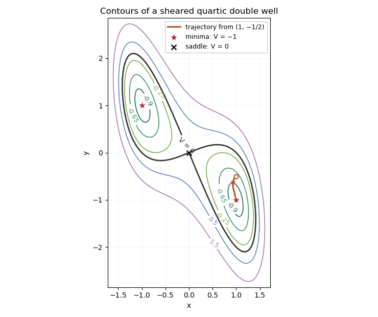

<h1 id="6a/solution">Solution</h1>

↑ **Parent:** [6A](../6a.md)

Completing squares reveals the geometry of the [sheared quartic double-well gradient flow](../../../../../sheared-quartic-double-well-gradient-flow.md):

$$
V=(x^2-1)^2+(x+y)^2-1.
$$

The [critical points](../../../../../critical-point.md) satisfy $2(x+y)=0$ and $4x^3-2x+2y=0$, so they are $(0,0)$, $(1,-1)$ and $(-1,1)$. The [Hessian matrix](../../../../../hessian-matrix.md) is

$$
\operatorname{Hess}V=\begin{pmatrix}12x^2-2&2\\2&2\end{pmatrix}.
$$

At the origin its determinant is $-8$, so $(0,0)$ is a [saddle point](../../../../../saddle-point.md), with $V=0$. At either other [critical point](../../../../../critical-point.md), the determinant is $16$ and the upper-left entry is $10$, so it is a [positive-definite matrix](../../../../../positive-definite-matrix.md). They are strict [local minima](../../../../../local-minimum.md); the completed squares show that both are global minima, with $V=-1$.

A contour at level $c$ obeys

$$
(x+y)^2=c+1-(x^2-1)^2,\qquad
 y=-x\pm\sqrt{c+1-(x^2-1)^2}.
$$

There are no contours for $c<-1$, two isolated minimum points for $c=-1$, and two separate closed ovals for $-1<c<0$. At $c=0$ the two lobes meet at the [saddle point](../../../../../saddle-point.md); near the origin their tangents are $y=(-1\pm\sqrt2)x$. For $c>0$ one closed contour surrounds both minima.

**[Figure 1](#6a/image-sheared-quartic-potential-contours-and-the-trajectory-to-the-positive-x-minimum). Sheared quartic potential contours and the trajectory to the positive-x minimum**.

Along the [gradient flow](../../../../../gradient-flow.md), the [gradient-flow dissipation identity](../../../../../gradient-flow-dissipation-identity.md) is

$$
\boxed{\frac{dV}{dt}=V_x\dot x+V_y\dot y=-V_x^2-V_y^2\leq0}.
$$

At the stated initial point, $V(1,-1/2)=-3/4$. Its trajectory stays in the [invariant sublevel set](../../../../../invariant-sublevel-set.md) $V\leq-3/4$. This set is compact because $V$ is a [coercive function](../../../../../coercive-function.md). It also excludes every point with $x=0$, where $V=y^2\geq0$; continuity therefore keeps the trajectory in its positive-$x$ component.

To justify its limit rather than merely infer it from the sketch, integrate the dissipation identity: $\int_0^\infty\|\nabla V\|^2dt$ is finite. On this compact set the gradient and its time derivative are bounded, so $\|\nabla V\|^2$ is uniformly continuous. A nonnegative uniformly continuous function with finite integral tends to zero: otherwise separated intervals of a fixed positive height and width would force an infinite integral. Every accumulation point is consequently a [critical point](../../../../../critical-point.md). In the positive-$x$ component below this energy level the only one is $(1,-1)$. Compactness then implies convergence, and

$$
\boxed{(x(t),y(t))\longrightarrow(1,-1)\quad(t\to\infty)}.
$$

This is a [compact gradient-flow trapping criterion](../../../../../compact-gradient-flow-trapping-criterion.md); the drawn trajectory illustrates, rather than replaces, the convergence proof.

## ↑ Ancestors (10)

1. [6A](../6a.md)
2. [Paper 2](../../paper-2-split.md)
3. [Ia](../../split.md)
4. [2012](../../../split.md)
5. [Past exam of the mathematics course of the University of Cambridge](../../../../split.md)
6. [Mathematics course of the University of Cambridge](../../../../../mathematics-course-of-the-university-of-cambridge.md)
7. [Course of the University of Cambridge](../../../../../course-of-the-university-of-cambridge.md)
8. [University of Cambridge](../../../../../university-of-cambridge-split.md)
9. [List of universities](../../../../../list-of-universities.md)
10. [Codex Wiki](../../../../../split.md)
