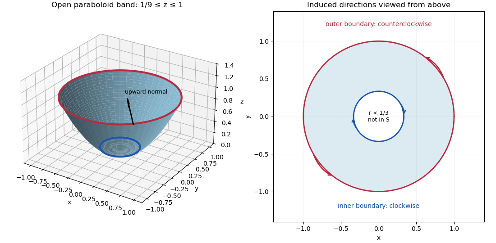

<h1 id="9c/solution">Solution</h1>

↑ **Parent:** [9C](../9c.md)

For an oriented [smooth surface](../../../../../smooth-surface.md) $S$ with piecewise smooth, consistently oriented boundary, [Stokes theorem](../../../../../stokes-theorem.md) gives

$$
\boxed{\int_S(\nabla\times B)\cdot n\,dS=\oint_{\partial S}B\cdot dx}
$$

for a continuously differentiable [vector field](../../../../../vector-field.md) defined on a neighborhood of $S$. Choose the upward [normal vector](../../../../../normal-vector.md) here. The surface is an annular band of an [elliptic paraboloid](../../../../../elliptic-paraboloid.md), parametrized by

$$
r(r,\theta)=(r\cos\theta,r\sin\theta,r^2),\qquad 1/3\leq r\leq1,\quad0\leq\theta<2\pi.
$$

Using $\partial_r r\times\partial_\theta r$ as the oriented [vector area element](../../../../../vector-area-element.md) gives

$$
\boxed{d\mathbf S=(-2r^2\cos\theta,-2r^2\sin\theta,r)\,dr\,d\theta,\qquad
dS=r\sqrt{1+4r^2}\,dr\,d\theta.}
$$

The sketch below shows the open band, not a capped solid. Its upper circle has radius one and its lower circle radius one third.

**[Figure 1](#9c/image-annular-paraboloid-with-upward-normal-and-opposite-induced-orientations-on-the-outer-and-inner-boundary-circles). Annular paraboloid with upward normal and opposite induced orientations on the outer and inner boundary circles**.

Differentiating the given [vector field](../../../../../vector-field.md) yields

$$
\nabla\times B=(0,0,3x^2+3y^2)=(0,0,3r^2).
$$

The [surface integral](../../../../../surface-integral.md) is therefore

$$
I=\int_0^{2\pi}\int_{1/3}^1 3r^3\,dr\,d\theta
=\frac{3\pi}{2}(1-3^{-4})
=\boxed{\frac{40\pi}{27}}.
$$

For the boundary [line integral](../../../../../line-integral.md), the upward [normal vector](../../../../../normal-vector.md) induces counterclockwise traversal of the outer circle and clockwise traversal of the inner circle, as viewed from above. On a circle of radius $R$, parametrized counterclockwise, $z$ is constant and

$$
B\cdot dx=R^4(\sin^4\theta+\cos^4\theta)\,d\theta.
$$

Since each fourth power integrates to $3\pi/4$, the two-circle [line integral](../../../../../line-integral.md) is

$$
\oint_{\partial S}B\cdot dx=\frac{3\pi}{2}\left(1-\frac1{81}\right)=\frac{40\pi}{27},
$$

confirming [Stokes theorem](../../../../../stokes-theorem.md) and the [Stokes flux through an annular paraboloid](../../../../../stokes-flux-through-an-annular-paraboloid.md). Reversing the chosen [orientation](../../../../../orientation-of-a-simplex.md) changes both integrals to $-40\pi/27$.

## ↑ Ancestors (10)

1. [9C](../9c.md)
2. [Paper 3](../../paper-3-split.md)
3. [Ia](../../split.md)
4. [2012](../../../split.md)
5. [Past exam of the mathematics course of the University of Cambridge](../../../../split.md)
6. [Mathematics course of the University of Cambridge](../../../../../mathematics-course-of-the-university-of-cambridge.md)
7. [Course of the University of Cambridge](../../../../../course-of-the-university-of-cambridge.md)
8. [University of Cambridge](../../../../../university-of-cambridge-split.md)
9. [List of universities](../../../../../list-of-universities.md)
10. [Codex Wiki](../../../../../split.md)
