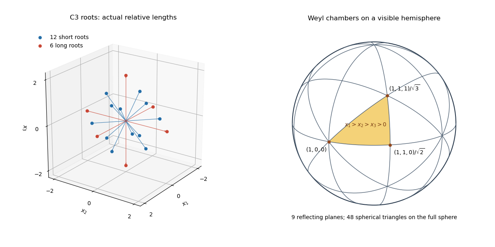

<h1 id="5/solution">Solution</h1>

↑ **Parent:** [5](../5.md)

Here [root systems](../../../../../root-system.md) are finite, reduced and crystallographic, as for complex semisimple [Lie algebras](../../../../../lie-algebra-split.md). For a [base of a root system](../../../../../fundamental-system-of-a-root-system.md) $\Delta=\{\alpha_1,\ldots,\alpha_r\}$, the [Dynkin diagram](../../../../../dynkin-diagram.md) has one vertex for each [simple root](../../../../../simple-root.md). Two distinct vertices have $a_{ij}a_{ji}$ bonds, with the arrow on a multiple bond pointing toward the shorter root. The [classification of finite crystallographic Dynkin diagrams](../../../../../classification-of-finite-crystallographic-dynkin-diagrams.md) consists of the following connected diagrams; the integers describing arms count vertices away from the unique branching vertex.

- $A_r$ ($r\ge1$): a chain with only single bonds.
- $B_r$ ($r\ge2$): a chain with one double bond at an end; that end is short.
- $C_r$ ($r\ge3$): the same bond pattern, but that end is long. The rank-two system is $C_2\cong B_2$; $C_1=A_1$.
- $D_r$ ($r\ge4$): a simply laced tree with three arms of lengths $1,1,r-3$.
- $E_6,E_7,E_8$: simply laced trees with three arms respectively of lengths $(1,2,2)$, $(1,2,3)$ and $(1,2,4)$.
- $F_4$: a four-vertex chain, with single, double, single bonds in order, and two long roots adjacent on one side of the middle bond and two short roots on the other.
- $G_2$: two vertices joined by a triple bond, one long and one short.

This is classification up to diagram isomorphism and overall rescaling of the root system. It includes the conventional identifications $D_3\cong A_3$ and $B_1\cong A_1$ when those low-rank notations are used. The weighting here encodes root lengths and bonds; it is not the separate theory of vertex labels attached to nilpotent orbits. Dropping the crystallographic or reduced hypothesis changes the classification.

Precisely, a [base of a root system](../../../../../fundamental-system-of-a-root-system.md) is a vector-space basis $\Delta\subset\Phi$ such that each root has a unique expansion $\beta=\sum_i n_i\alpha_i$, with integer coefficients all nonnegative or all nonpositive. This defines the positive and negative roots. We use the column-coroot convention for the [Cartan matrix](../../../../../cartan-matrix.md):

$$
a_{ij}=\langle\alpha_i,\alpha_j^\vee\rangle=\frac{2(\alpha_i,\alpha_j)}{(\alpha_j,\alpha_j)},\qquad
\alpha_j^\vee=\frac{2\alpha_j}{(\alpha_j,\alpha_j)}.
$$

Some conventions transpose this matrix; specifying which index labels the coroot resolves that difference. The [Weyl group](../../../../../weyl-group.md) is the subgroup of orthogonal transformations generated by the [Weyl reflections](../../../../../weyl-reflection.md)

$$
s_\alpha(v)=v-\frac{2(v,\alpha)}{(\alpha,\alpha)}\alpha\qquad(\alpha\in\Phi).
$$

For the [C3 root system](../../../../../c3-root-system.md), take an orthonormal basis $e_1,e_2,e_3$ of $\mathbb R^3$ and

$$
\Phi=\{\pm2e_i:1\le i\le3\}\ \cup\ \{\pm e_i\pm e_j:1\le i<j\le3\}.
$$

There are six long roots of squared length $4$ and twelve short roots of squared length $2$. A base is $\alpha_1=e_1-e_2$, $\alpha_2=e_2-e_3$, $\alpha_3=2e_3$. The [Cartan matrix convention for C3](../../../../../cartan-matrix-convention-for-c3.md) above gives

$$
\boxed{A=\begin{pmatrix}2&-1&0\\-1&2&-1\\0&-2&2\end{pmatrix}}.
$$

Thus the double bond connects $\alpha_2$ to $\alpha_3$, with its arrow directed toward $\alpha_2$.

An explicit complex [Lie algebra](../../../../../lie-algebra-split.md) realizing this root system is the [symplectic Lie algebra](../../../../../symplectic-lie-algebra.md)

$$
\mathfrak{sp}_6(\mathbb C)=\{X\in M_6(\mathbb C):X^TJ+JX=0\},\qquad
J=\begin{pmatrix}0&I_3\\-I_3&0\end{pmatrix}.
$$

It is closed under [commutators](../../../../../commutator.md), since the two identities $X^TJ=-JX$, $Y^TJ=-JY$ imply $[X,Y]^TJ=-J[X,Y]$. Equivalently,

$$
X=\begin{pmatrix}A&B\\C&-A^T\end{pmatrix},\qquad B=B^T,\quad C=C^T,
$$

so its dimension is $9+6+6=21$. A [Cartan subalgebra](../../../../../cartan-subalgebra.md) is

$$
H=\{\operatorname{diag}(h_1,h_2,h_3,-h_1,-h_2,-h_3)\},\qquad e_i(h)=h_i.
$$

With $E_{ab}$ denoting a matrix unit, the [root spaces](../../../../../root-space.md) have generators $E_{ij}-E_{3+j,3+i}$ for $e_i-e_j$ ($i\ne j$), $E_{i,3+j}+E_{j,3+i}$ for $e_i+e_j$ ($i<j$), and $E_{i,3+i}$ for $2e_i$; the analogous lower-left generators give the negative roots. These are all eighteen [root spaces](../../../../../root-space.md), each one-dimensional, and together with $H$ they exhaust the algebra.

For an explicit semisimplicity check, let $I\ne0$ be an ideal. Simultaneous diagonalization of $\operatorname{ad}H$ makes $I$ a sum of its intersections with $H$ and these [root spaces](../../../../../root-space.md). If it contains a nonzero $h\in H$, some root has $\alpha(h)\ne0$, and $[h,L_\alpha]$ supplies a [root vector](../../../../../root-vector.md) in $I$. Thus $I$ always contains a [root vector](../../../../../root-vector.md). Bracket it with its opposite [root vector](../../../../../root-vector.md) to obtain a nonzero coroot $h_\alpha\in I$. Whenever $(\alpha,\beta)\ne0$, bracketing $h_\alpha$ with either $L_\beta$ or $L_{-\beta}$ puts both [root spaces](../../../../../root-space.md) into $I$. The graph of the roots with edges for nonzero inner products is connected: $2e_i$ connects to $e_i+e_j$, which connects to $2e_j$, and every short root connects to an axis root. Repeating the argument yields all [root spaces](../../../../../root-space.md) and then all of $H$ from their brackets. Hence $I=L$: **the constructed algebra is simple, and therefore semisimple**.

The reflections in $e_1-e_2$ and $e_2-e_3$ exchange adjacent coordinates, while reflection in $2e_3$ changes the sign of the third coordinate. They generate every signed permutation. Conversely reflection in any displayed root is a signed permutation. Thus

$$
\boxed{W(C_3)\cong(\mathbb Z/2\mathbb Z)^3\rtimes S_3,\qquad |W(C_3)|=48}.
$$

The reflecting hyperplanes are $x_i=0$ and $x_i=\pm x_j$. A fundamental open [Weyl chamber](../../../../../fundamental-chamber-of-a-root-system.md) is $x_1>x_2>x_3>0$. Every regular point has three nonzero coordinates of distinct absolute values; its signs and the ordering of those absolute values specify exactly one of the $2^3\cdot3!=48$ chambers. The closure of this chamber is generated by the rays through $(1,0,0)$, $(1,1,0)$ and $(1,1,1)$. This is the [Weyl chamber geometry of C3](../../../../../weyl-chamber-geometry-of-c3.md).

**[Figure 1](#5/image-c3-roots-and-the-spherical-tessellation-into-48-weyl-chambers). C3 roots and the spherical tessellation into 48 Weyl chambers**.

The left panel retains the actual long and short root lengths. The right panel radially projects a hemisphere of the unit sphere, draws every visible reflecting great-circle arc, and highlights the chamber $x_1>x_2>x_3>0$. Each spherical triangle is the section of a three-dimensional chamber by the sphere; opposite triangles on the rear hemisphere supply the remaining chambers. [Roots of a root system](../../../../../root-of-a-root-system.md) are normal to the chamber walls, rather than generally lying along their edges.

## ↑ Ancestors (10)

1. [5](../5.md)
2. [Paper 1](../../paper-1-split.md)
3. [Iii](../../split.md)
4. [2012](../../../split.md)
5. [Past exam of the mathematics course of the University of Cambridge](../../../../split.md)
6. [Mathematics course of the University of Cambridge](../../../../../mathematics-course-of-the-university-of-cambridge.md)
7. [Course of the University of Cambridge](../../../../../course-of-the-university-of-cambridge.md)
8. [University of Cambridge](../../../../../university-of-cambridge-split.md)
9. [List of universities](../../../../../list-of-universities.md)
10. [Codex Wiki](../../../../../split.md)
