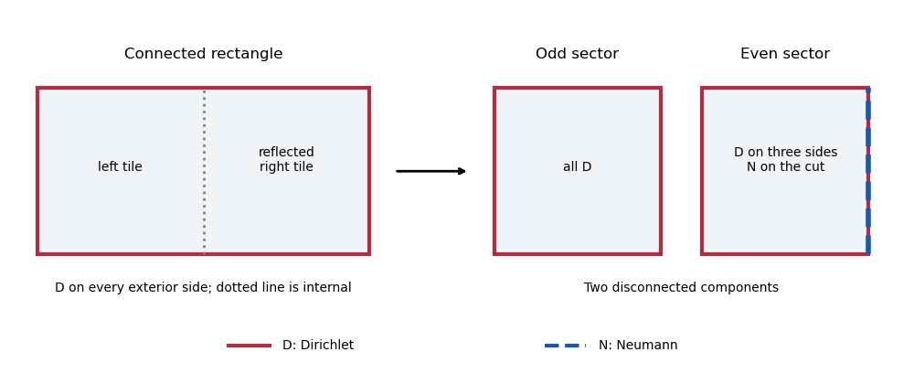

# Paper 12

↑ **Parent:** [Iii](../iii.md)

[https://www.maths.cam.ac.uk/postgrad/part-iii/files/pastpapers/2012/paper_12.pdf](https://www.maths.cam.ac.uk/postgrad/part-iii/files/pastpapers/2012/paper_12.pdf)

**Table of contents**

- [1](#1)
  - [Solution](#1/solution)
- [2](#2)
  - [Solution](#2/solution)
- [3](#3)
  - [Solution](#3/solution)
- [4](#4)
  - [Solution](#4/solution)
- [5](#5)
  - [Solution](#5/solution)

## 1

↑ **Parent:** [Paper 12](paper-12.md)

<h3 id="1/solution">Solution</h3>

↑ **Parent:** [1](#1)

Use the [positive Laplace-Beltrami operator](../../../differential-geometry.md#positive-laplace-beltrami-operator), $\Delta=-\operatorname{div}\nabla$. A [flat torus](../../../second-fundamental-form.md#flat-torus) is the quotient $\mathbb R^d/\Lambda$, where $\Lambda$ is a full-rank [Euclidean lattice](../../../fourier-analysis.md#euclidean-lattice) and the metric descends from the [Euclidean metric](../../../differential-geometry.md#euclidean-metric). Its [dual lattice](../../../fourier-analysis.md#dual-lattice) is

$$
\Lambda^*=\{\xi\in\mathbb R^d:\langle\xi,\ell\rangle\in\mathbb Z\text{ for every }\ell\in\Lambda\}.
$$

If $V$ is the [covolume](../../../fourier-analysis.md#covolume) of $\Lambda$, the functions $\phi_\xi(x)=V^{-1/2}e^{2\pi i\langle\xi,x\rangle}$ descend to the torus. Direct differentiation gives the [spectrum of a flat torus](../../../second-fundamental-form.md#spectrum-of-a-flat-torus):

$$
\boxed{\Delta\phi_\xi=4\pi^2|\xi|^2\phi_\xi,\qquad
\operatorname{Spec}\Delta=\{4\pi^2|\xi|^2:\xi\in\Lambda^*\}.}
$$

The multiset includes one entry for each dual vector. In particular zero has multiplicity one. Writing $\Lambda=B\mathbb Z^d$ identifies the dual vectors with $B^{-T}m$, $m\in\mathbb Z^d$. Standard [Fourier series](../../../fourier-series.md) on the unit cube then prove that these functions are an [orthonormal basis](../../../linear-algebra.md#orthonormal-basis) of $L^2$ on the torus. If $\Delta f=\lambda f$, its [Fourier coefficients](../../../fourier-series.md#fourier-coefficient) satisfy $(4\pi^2|\xi|^2-\lambda)\widehat f(\xi)=0$. Thus every [eigenfunction](../../../linear-operator-theory.md#eigenfunction) is a linear combination of the indicated shell of frequencies, with no additional [eigenvalues](../../../linear-operator-theory.md#eigenvalue). Compactness gives the discrete self-adjoint realization, whose [eigenfunctions](../../../linear-operator-theory.md#eigenfunction) are smooth. For real functions the two characters at $\xi,-\xi$ become cosine and sine, giving the same real multiplicities. The opposite Laplacian sign would negate all displayed [eigenvalues](../../../linear-operator-theory.md#eigenvalue) without changing the rigidity conclusion.

To prove two-dimensional [spectral rigidity](../../../riemannian-geometry.md#spectral-rigidity), let $L=\Lambda^*$ and recover its [Gram matrix](../../../linear-algebra.md#gram-matrix) from its vector-length multiset. Let $a$ be the shortest nonzero length and choose $v\in L$ with $|v|=a$. This vector is primitive: a proper integer multiple would have a shorter lattice vector. Hence $L\cap\mathbb Rv=\mathbb Zv$. From the spectral multiset subtract exactly two occurrences of each length $ka$, $k=1,2,\ldots$. The remaining multiset consists precisely of the vectors not on this line, including correct multiplicities at coincident lengths. Its least length $b$ is the length of a shortest vector $w$ independent of $v$.

The pair $(v,w)$ is a [basis](../../../vector-space.md#basis) of $L$. Otherwise take a lattice point in a nonzero coset of $\mathbb Zv+\mathbb Zw$ and reduce its two coefficients into $[-1/2,1/2]$. The resulting nonzero lattice vector $z=\alpha v+\beta w$ is not on $\mathbb Rv$, by primitivity of $v$. But

$$
|z|\leq\frac{|v|+|w|}{2}\leq b,
$$

with strict inequality: when both coefficients are nonzero the triangle inequality is strict for independent vectors, and when one vanishes its length is at most $b/2$. This contradicts the definition of $b$. Subtract an integer multiple of $v$ from $w$ and, if necessary, change its sign to arrange $0\leq c=\langle v,w\rangle\leq a^2/2$; minimality of $b$ makes this reduction possible without decreasing its length.

The [covolume](../../../fourier-analysis.md#covolume) $A$ of $L$ is also spectral. The count of lattice vectors with length at most $R$ obeys

$$
\#(L\cap B_R)=\frac{\pi R^2}{A}+O(R).
$$

For example, translate a bounded fundamental parallelogram of diameter bound $D$: the union of tiles with centres in $B_R$ contains $B_{R-D}$ and lies inside $B_{R+D}$. Comparing their areas proves the leading coefficient. The [spectrum](../../../linear-operator-theory.md#spectrum-functional-analysis) supplies this count. Since $(v,w)$ is a lattice [basis](../../../vector-space.md#basis), its parallelogram area satisfies $A^2=a^2b^2-c^2$. Therefore

$$
\boxed{\operatorname{Gram}(v,w)=
\begin{pmatrix}a^2&\sqrt{a^2b^2-A^2}\\\sqrt{a^2b^2-A^2}&b^2\end{pmatrix}.}
$$

All three quantities are determined by the [spectrum](../../../linear-operator-theory.md#spectrum-functional-analysis). Equal [Gram matrices](../../../linear-algebra.md#gram-matrix) give an orthogonal map between the [dual lattices](../../../fourier-analysis.md#dual-lattice); taking duals gives an orthogonal map between the original lattices, descending to a [Riemannian isometry](../../../differential-geometry.md#riemannian-isometry) of the tori. **Isospectral flat two-tori are isometric.** This is the [two-dimensional lattice reconstruction from vector lengths](../../../second-fundamental-form.md#two-dimensional-lattice-reconstruction-from-vector-lengths); it uses lengths with multiplicities, not merely the set of distinct lengths.

## 2

↑ **Parent:** [Paper 12](paper-12.md)

<h3 id="2/solution">Solution</h3>

↑ **Parent:** [2](#2)

Consider two finite assemblies of the same number $n$ of congruent bounded Euclidean tiles. Label their matching faces so the same prescribed face identifications are used in both assemblies. For each face type $c$, encode the first assembly by a symmetric involution $A_c$: a paired face exchanges its two tile indices, an exterior [Dirichlet boundary condition](../../../differential-equation.md#dirichlet-boundary-condition) contributes diagonal $-1$, and an exterior [Neumann boundary condition](../../../differential-equation.md#neumann-boundary-condition) contributes diagonal $+1$. Let $B_c$ encode the second assembly. Face coordinates are pulled back to the same reference face; if identifications have additional face isometries, these pullbacks must be included in the intertwining operators.

The [transplantation theorem](../../../riemannian-geometry.md#transplantation-theorem) says that a constant matrix $C$ with $CA_c=B_cC$ for every face type sends the vector of tile restrictions of a [Laplacian eigenfunction](../../../partial-differential-equation.md#laplacian-eigenfunction) on the first assembly to one on the second, by $g=Cf$. If $C$ is invertible, it is a [bijection](../../../function.md#bijection) of each [eigenspace](../../../linear-operator-theory.md#eigenspace) and the assemblies are isospectral with multiplicities.

To prove it, each component solves the same interior equation $\Delta f_j=\lambda f_j$, and a constant linear combination solves that equation too. On a face, let $u$ be the vector of boundary values and $v$ the vector of outward [normal derivatives](../../../differential-geometry.md#normal-derivative). All matching and exterior conditions are exactly

$$
A_cu=u,\qquad A_cv=-v.
$$

For an internal face these equations say that values agree and the two outward derivatives sum to zero. For diagonal $-1$ they impose zero value, and for diagonal $+1$ zero [normal derivative](../../../differential-geometry.md#normal-derivative). The intertwining identity gives $B_c(Cu)=Cu$ and $B_c(Cv)=-Cv$, so the transplanted functions match and satisfy the correct [boundary conditions](../../../differential-equation.md#boundary-condition). Applying $C^{-1}$ proves the [eigenspace](../../../linear-operator-theory.md#eigenspace) [bijection](../../../function.md#bijection). At corners the same reasoning is interpreted in the finite-energy weak domain: no value jump and cancellation of normal flux prevent an extra distributional source. It gives the usual self-adjoint Dirichlet/mixed Laplacians on polygonal assemblies.

Here is an explicit [transplantation by reflection parity](../../../riemannian-geometry.md#transplantation-by-reflection-parity). Take a rectangle of width $2a$ and height $b$, with the [Dirichlet boundary condition](../../../differential-equation.md#dirichlet-boundary-condition) on every exterior side. Cut it at its vertical midline into two congruent half-rectangles, pulling the right-hand half back by reflection. The midline gluing matrix is

$$
S=\begin{pmatrix}0&1\\1&0\end{pmatrix}.
$$

Replace the connected assembly by the disjoint union of two width-$a$, height-$b$ rectangles: the first has Dirichlet conditions on all sides; the second has Dirichlet on three sides and Neumann on the side representing the cut. Its corresponding matrix is $D=\operatorname{diag}(-1,1)$. The invertible, indeed orthogonal, matrix

$$
\boxed{C=\frac1{\sqrt2}\begin{pmatrix}1&-1\\1&1\end{pmatrix},\qquad CS=DC}
$$

intertwines the midline conditions. Every other face has matrix $-I$ on both assemblies, which automatically intertwines. The [transplantation theorem](../../../riemannian-geometry.md#transplantation-theorem) proves equality of the complete [spectra](../../../linear-operator-theory.md#spectrum-functional-analysis), although **one surface is connected and the other has two components with the required uniform and mixed conditions**.

Equivalently, odd reflection [eigenfunctions](../../../linear-operator-theory.md#eigenfunction) vanish on the cut, while even reflection [eigenfunctions](../../../linear-operator-theory.md#eigenfunction) have zero [normal derivative](../../../differential-geometry.md#normal-derivative) there. A direct separation-of-variables check gives the connected rectangle's [eigenvalues](../../../linear-operator-theory.md#eigenvalue)

$$
\pi^2\left(\frac{m^2}{4a^2}+\frac{n^2}{b^2}\right),\qquad m,n\geq1.
$$

Even $m=2j$ gives the fully Dirichlet half-rectangle [spectrum](../../../linear-operator-theory.md#spectrum-functional-analysis), and odd $m=2j+1$, $j\geq0$, gives the mixed half-rectangle [spectrum](../../../linear-operator-theory.md#spectrum-functional-analysis). The split preserves every multiplicity, including coincidences between different pairs of indices.

**[Figure 1](#2/image-reflection-splits-a-connected-dirichlet-rectangle-into-a-disjoint-dirichlet-rectangle-and-a-mixed-dirichlet-neumann-rectangle). Reflection splits a connected Dirichlet rectangle into a disjoint Dirichlet rectangle and a mixed Dirichlet-Neumann rectangle**.

## 3

↑ **Parent:** [Paper 12](paper-12.md)

<h3 id="3/solution">Solution</h3>

↑ **Parent:** [3](#3)

Take $N$ to be a closed compact [Riemannian manifold](../../../riemannian-geometry.md#riemannian-manifold) and use the [positive Laplace-Beltrami operator](../../../differential-geometry.md#positive-laplace-beltrami-operator). Its [Riemannian heat kernel](../../../diffusion-equation.md#riemannian-heat-kernel) $K_N(t,x,y)$ is the integral kernel of $e^{-t\Delta_N}$:

$$
(e^{-t\Delta_N}f)(x)=\int_NK_N(t,x,y)f(y)\,dV(y).
$$

It solves $(\partial_t+\Delta_x)K_N=0$ for $t>0$ and tends to the identity kernel as $t\downarrow0$. For an [orthonormal eigenbasis](../../../linear-operator-theory.md#orthonormal-eigenbasis), the [spectral expansion of the Riemannian heat kernel](../../../diffusion-equation.md#spectral-expansion-of-the-riemannian-heat-kernel) is

$$
K_N(t,x,y)=\sum_j e^{-t\lambda_j}\phi_j(x)\overline{\phi_j(y)}.
$$

The bar is required for a complex basis. With boundary, a specified invariant [boundary condition](../../../differential-equation.md#boundary-condition) must also be included in this definition.

For the quotient formula use the covering-space interpretation: $U$ acts freely and properly discontinuously by [Riemannian isometries](../../../differential-geometry.md#riemannian-isometry). On compact $N$ such a discrete group is finite. Freeness alone, without this covering hypothesis, does not justify the image sum: an infinite dense [subgroup](../../../group.md#subgroup) of circle rotations, for example, acts freely but has no manifold quotient. Positive-dimensional group actions require a different quotient analysis.

For lifts $x,y$ of $\bar x,\bar y\in M$, the [heat kernel on a finite isometric quotient](../../../diffusion-equation.md#heat-kernel-on-a-finite-isometric-quotient) is

$$
\boxed{K_M(t,\bar x,\bar y)=\sum_{u\in U}K_N(t,x,uy).}
$$

Invariance of $K_N$ under simultaneous [Riemannian isometries](../../../differential-geometry.md#riemannian-isometry) and reindexing the sum show that this is independent of both lifts. A local isometry commutes with the Laplacian, so the sum satisfies the quotient [heat equation](../../../diffusion-equation.md#heat-equation). For its initial condition, integrate over a fundamental domain $F\subset N$ against a lifted function. The terms combine into the integral over all of $N$, whose initial limit is $f(x)$. Uniqueness of the heat evolution proves the formula. **There is no factor $1/|U|$ in this kernel formula.**

On the diagonal the sum is $U$-invariant. Its integral over $F$ is therefore $1/|U|$ times its integral over $N$, giving the [heat trace](../../../riemannian-geometry.md#heat-trace)

$$
\boxed{Z_M(t)=\operatorname{Tr}(e^{-t\Delta_M})
=\frac1{|U|}\sum_{u\in U}\int_NK_N(t,x,ux)\,dV(x).}
$$

Thus the normalization factor appears in the trace, not the kernel. Put $F_t(g)=\int_NK_N(t,x,gx)\,dV(x)$. For any finite isometry group $T$, changing variables $x=hy$ proves $F_t(hgh^{-1})=F_t(g)$: it is a [class function](../../../representation-theory.md#class-function) on $T$.

For [Gassmann equivalent](../../../representation-theory.md#gassmann-equivalence) [subgroups](../../../group.md#subgroup) $U_1,U_2\leq T$, their intersections with each [conjugacy class](../../../group-theory.md#conjugacy-class) have equal size, and their orders are equal. If both act freely, the [heat traces](../../../riemannian-geometry.md#heat-trace) of their quotients satisfy

$$
Z_{U_i\backslash N}(t)=\frac1{|U_i|}\sum_{\mathcal C}|U_i\cap\mathcal C|F_t(\mathcal C),
$$

so they agree for every $t>0$. Since $Z_M(t)=\sum_\lambda m(\lambda)e^{-t\lambda}$, equality determines the [spectrum](../../../linear-operator-theory.md#spectrum-functional-analysis) with multiplicities: take $t\to\infty$ to recover the smallest [eigenvalue](../../../linear-operator-theory.md#eigenvalue) and its multiplicity, subtract that term, and repeat. This proves [Sunada theorem](../../../riemannian-geometry.md#sunada-theorem). Equivalently, projection onto $U_i$-invariant functions averages the group action, and the quotient [eigenvalue](../../../linear-operator-theory.md#eigenvalue) multiplicity is $|U_i|^{-1}\sum_{u\in U_i}\chi_\lambda(u)$, with $\chi_\lambda$ the [eigenspace](../../../linear-operator-theory.md#eigenspace) [character of a representation](../../../representation-theory.md#character-of-a-representation). Almost conjugacy equalizes these averages.

## 4

↑ **Parent:** [Paper 12](paper-12.md)

<h3 id="4/solution">Solution</h3>

↑ **Parent:** [4](#4)

First realize the free isometric action. Choose generators $t_1,\ldots,t_r$ of the [finitely presented group](../../../geometric-group-theory.md#finitely-presented-group) $T$. In every dimension $d\geq3$, the [connected sum](../../../differential-geometry.md#connected-sum-of-oriented-manifolds)

$$
B_d=\mathop{\#}_{j=1}^r(S^1\times S^{d-1})
$$

has [fundamental group](../../../algebraic-topology.md#fundamental-group) the [free group](../../../geometric-group-theory.md#free-group) $F_r$. Map its generators onto the $t_j$ and take the connected [regular covering](../../../algebraic-topology.md#regular-covering) $N\to B_d$ corresponding to the kernel. Its [deck transformation group](../../../algebraic-topology.md#deck-transformation-group) is $F_r/\ker\pi\cong T$. Lift any [Riemannian metric](../../../differential-geometry.md#riemannian-metric) on $B_d$ to $N$. [Deck transformations](../../../algebraic-topology.md#deck-transformation) are then [Riemannian isometries](../../../differential-geometry.md#riemannian-isometry), and a [deck transformation](../../../algebraic-topology.md#deck-transformation) fixing one point is the identity by uniqueness of lifts. This gives the [free isometric realization of a finitely generated group](../../../algebraic-topology.md#free-isometric-realization-of-a-finitely-generated-group). For the trivial group use $S^d$. If $T$ is infinite the covering manifold need not be compact, which is allowed in this first construction. Simple connectivity of $N$ is not being asserted here.

**The requested nonhomeomorphism conclusion needs an extra hypothesis.** For a counterexample even with distinct [subgroups](../../../group.md#subgroup), take $T=S_3$, $U_1=\langle(1\ 2)\rangle$ and $U_2=\langle(2\ 3)\rangle$. They are conjugate and therefore [Gassman equivalent](../../../representation-theory.md#gassmann-equivalence). For every free isometric action of $T$, the conjugating element induces a [Riemannian isometry](../../../differential-geometry.md#riemannian-isometry) $U_1\backslash N\to U_2\backslash N$. These quotients cannot be nonhomeomorphic. Identical [subgroups](../../../group.md#subgroup) give an even simpler obstruction. Thus the stated equivalence condition alone cannot imply the claimed topology.

A sufficient version is: for a finite $T$ with [Gassmann equivalent](../../../representation-theory.md#gassmann-equivalence), nonisomorphic [subgroups](../../../group.md#subgroup) $U_1,U_2$, there are closed isospectral manifolds with [fundamental groups](../../../algebraic-topology.md#fundamental-group) $U_1,U_2$, and hence they are not homeomorphic. To prove it, realize $T$ as the [fundamental group](../../../algebraic-topology.md#fundamental-group) of a closed smooth manifold $B$ of dimension four. Here is the needed [closed-manifold realization of a finitely presented fundamental group](../../../algebraic-topology.md#closed-manifold-realization-of-a-finitely-presented-fundamental-group). Start with a four-dimensional zero-handle and one one-handle for each generator. Attach two-handles along disjoint embedded boundary circles representing the relators, with arbitrary framings. The boundary is three-dimensional, so finitely many such loops can be chosen disjoint. The resulting compact handle manifold $W$ has $\pi_1(W)=T$ by the [Seifert-van Kampen theorem](../../../algebraic-topology.md#seifert-van-kampen-theorem).

The inclusion $\partial W\to W$ is surjective on [fundamental groups](../../../algebraic-topology.md#fundamental-group): relative to the boundary the dual handle decomposition uses only handles of indices two, three and four, none of which introduces a fundamental-group generator. Double $W$ along its boundary. In the amalgamated product for the double, both boundary maps are the same surjection onto $T$, so the two copies of $T$ are identified completely and $\pi_1(B)=T$. The double is closed, connected and smooth after smoothing its collar. This construction works in any dimension at least four; it does not claim that every finitely presented group is a closed three-manifold group.

Let $N$ now be the [universal cover](../../../algebraic-topology.md#universal-cover) of $B$ with the lifted metric. Since $T$ is finite, $N$ is compact and [simply connected](../../../algebraic-topology.md#simply-connected-space), with a free isometric deck action of $T$. By [Sunada theorem](../../../riemannian-geometry.md#sunada-theorem), $M_i=U_i\backslash N$ are isospectral. Because $N$ is their universal cover, $\pi_1(M_i)\cong U_i$. Nonisomorphic [fundamental groups](../../../algebraic-topology.md#fundamental-group) rule out a [homeomorphism](../../../topology.md#homeomorphism). For an infinite $T$ the same qualified argument applies to finite-index [subgroups](../../../group.md#subgroup) with equal coset characters: divide first by the intersection $K=\operatorname{Core}_T(U_1)\cap\operatorname{Core}_T(U_2)$ of their finite-index [subgroup cores](../../../group-theory.md#core-group-theory), producing a compact intermediate cover and a finite isometry group to which Sunada applies.

For explicit nonhomeomorphic examples, let $p$ be an odd prime. Let $H_p=(\mathbb Z/p\mathbb Z)^3$, and let $K_p$ be the [Heisenberg group over a prime field](../../../finite-group-theory.md#heisenberg-group-over-a-prime-field), whose elements are triples with multiplication

$$
(a,b,c)(a',b',c')=(a+a',b+b',c+c'+ab').
$$

Both have order $p^3$, and every nonidentity element has order $p$. For $K_p$, induction gives

$$
(a,b,c)^k=(ka,kb,kc+\tbinom{k}{2}ab),
$$

so the assertion follows at $k=p$, since $p$ is odd. But $H_p$ is abelian and $K_p$ is not: $(1,0,0)$ and $(0,1,0)$ do not commute.

Embed both groups regularly in $S_{p^3}$. Every nonidentity element in either [regular representation](../../../representation-theory.md#regular-representation) has cycle type $p^{p^2}$. Hence both embedded [subgroups](../../../group.md#subgroup) meet the identity class once, the class of that cycle type $p^3-1$ times, and all other classes zero times. They are [nonisomorphic Gassmann equivalent regular subgroups](../../../representation-theory.md#nonisomorphic-gassmann-equivalent-regular-subgroups). Taking $p=3$ and using the closed four-manifold construction with $T=S_{27}$ gives an explicit pair of isospectral nonhomeomorphic quotients, completing the intended construction under a sufficient hypothesis.

Finally choose distinct odd primes $p_1,\ldots,p_n$ and take

$$
T_n=\prod_{j=1}^n S_{p_j^3},\qquad
U_\epsilon=\prod_{j=1}^n L_{j,\epsilon_j},\qquad
L_{j,0}=H_{p_j},\quad L_{j,1}=K_{p_j},\quad\epsilon\in\{0,1\}^n.
$$

[Conjugacy classes](../../../group-theory.md#conjugacy-class) in a direct product are products of classes, so their intersection counts factor. Thus all $2^n$ [subgroups](../../../group.md#subgroup) are [Gassmann equivalent](../../../representation-theory.md#gassmann-equivalence). They are pairwise nonisomorphic: the unique Sylow $p_j$-subgroup of $U_\epsilon$ is its $j$th factor, and whether it is abelian records $\epsilon_j$. Realize $T_n$ as the [fundamental group](../../../algebraic-topology.md#fundamental-group) of a closed four-manifold and quotient its universal cover by these [subgroups](../../../group.md#subgroup). The [binary family of nonhomeomorphic Sunada quotients](../../../riemannian-geometry.md#binary-family-of-nonhomeomorphic-sunada-quotients) gives

$$
\boxed{2^n\text{ mutually isospectral closed four-manifolds, pairwise nonhomeomorphic and therefore nonisometric}.}
$$

This existence statement is valid; the earlier universal nonhomeomorphism assertion from Gassmann equivalence alone is not.

## 5

↑ **Parent:** [Paper 12](paper-12.md)

<h3 id="5/solution">Solution</h3>

↑ **Parent:** [5](#5)

Let $m=\operatorname{ord}(A)$, $n=\operatorname{ord}(B)$ and $r=\operatorname{ord}(AB)$. Cut the [Riemann sphere](../../../complex-analysis.md#riemann-sphere) along arcs joining three marked points, say $0,1,\infty$, so the complement is [simply connected](../../../algebraic-topology.md#simply-connected-space). Take copies labeled by the elements of $T$ and glue the slit banks with monodromies given by left multiplication by $A,B,(AB)^{-1}$. The product relation ensures consistency. The surface is connected because $A,B$ generate $T$. At a puncture with monodromy order $m$, fill each cycle using the local complex coordinate $z=w^m$; use the analogous charts at the other two punctures. This constructs the [three-branch-point regular surface cover](../../../complex-analysis.md#three-branch-point-regular-surface-cover) $N\to\mathbb P^1$.

Right multiplication by inverses defines a left action of $T$, commutes with the monodromy gluing and extends holomorphically over the filled points. Average a compatible metric over this finite group to obtain a metric for which $T$ acts by [Riemannian isometries](../../../differential-geometry.md#riemannian-isometry). When the genus is at least two, the unique compatible curvature-minus-one metric from the [uniformization theorem](../../../complex-analysis.md#uniformization-theorem) is an invariant choice. Away from the three marked fibers the action is free. The nontrivial [stabilizer subgroups](../../../group-theory.md#stabilizer-subgroup) are the conjugates of $\langle A\rangle$, $\langle B\rangle$ and $\langle AB\rangle$, of orders $m,n,r$, omitting order-one groups.

There are $|T|/m$, $|T|/n$, $|T|/r$ points over the corresponding branch points. The [Riemann-Hurwitz formula](../../../complex-analysis.md#riemann-hurwitz-formula) gives

$$
\boxed{\chi(N)=|T|\left(\frac1m+\frac1n+\frac1r-1\right).}
$$

This construction also covers the spherical and toroidal cases. If one monodromy has order one it is simply an unbranched marked fiber, with no nontrivial stabilizer.

For the supplied coset actions, faithfulness gives $m=n=3$. Compose permutations with the rightmost factor acting first. The two products $AB$ have cycle decompositions

$$
\begin{aligned}
\rho_1(AB)&=(1\ 5\ 12\ 6\ 3\ 9)(2\ 8\ 7\ 4\ 11\ 10),\\
\rho_2(AB)&=(1\ 5\ 9\ 6\ 3\ 12)(2\ 8\ 7\ 4\ 11\ 10).
\end{aligned}
$$

Thus $r=6$. The index is twelve and each [subgroup](../../../group.md#subgroup) has order eight, so $|T|=96$. Consequently

$$
\boxed{\chi(N)=96(1/3+1/3+1/6-1)=-16,\qquad g(N)=9.}
$$

All cycles of $A,B,AB$ on each coset set have the full orders $3,3,6$. No nontrivial power of any of these branch monodromies fixes a coset. The fixed-coset criterion means that each $U_i$ has trivial intersection with every conjugate of each cyclic branch stabilizer. Since these are all stabilizers on $N$, both $U_i$ act freely. Their quotient surfaces are therefore smooth closed surfaces, not cone-point orbifolds. [Sunada theorem](../../../riemannian-geometry.md#sunada-theorem) supplies isospectrality, and the unbranched [Euler characteristic](../../../homology.md#euler-characteristic) formula gives

$$
\boxed{\chi(U_i\backslash N)=-16/8=-2,\qquad g(U_i\backslash N)=2.}
$$

Choose the hyperbolic metric for these surfaces and their common genus-nine cover.

In this natural construction the two genus-two surfaces are **isometric**, by an orientation-reversing map. Define the sheet permutation

$$
P=(1\ 2)(4\ 6)(7\ 10)(8\ 12)(9\ 11).
$$

Direct composition verifies

$$
\boxed{P\rho_1(A)P^{-1}=\rho_2(A)^{-1},\qquad
P\rho_1(B)P^{-1}=\rho_2(B)^{-1}.}
$$

Complex conjugation of the base sphere fixes its three real branch points and reverses the two chosen generating loops, so their monodromies become the inverses. These identities supply a lift, after relabeling sheets by $P$, to an anticonformal map between the two branched covers. It extends across the branch points by the local power charts. An anticonformal map between closed hyperbolic [Riemann surfaces](../../../complex-analysis.md#riemann-surfaces) is a [Riemannian isometry](../../../differential-geometry.md#riemannian-isometry), by uniqueness of the compatible hyperbolic metric.

Equivalently, take the [hyperbolic triangle group](../../../geometric-group-theory.md#hyperbolic-triangle-group) of signature $(3,3,6)$. Reflection in the side joining the two order-three vertices conjugates its two vertex rotations to their inverses. The displayed sheet permutation identifies the reflected [subgroup](../../../group.md#subgroup) for the first covering with the [subgroup](../../../group.md#subgroup) for the second, up to an irrelevant change of base sheet. This is the [orientation-reversing equivalence of branched-cover monodromy](../../../complex-analysis.md#orientation-reversing-equivalence-of-branched-cover-monodromy). The exhibited isometry is anticonformal, so the conclusion is about [Riemannian isometry](../../../differential-geometry.md#riemannian-isometry), without asserting that this map is holomorphic. Merely knowing the [subgroups](../../../group.md#subgroup) were almost conjugate would not have settled isometry; the explicit inverse-monodromy symmetry does. Nor does the data force this symmetry for every arbitrarily chosen invariant deformation of the cover's metric: it is present for the constructed hyperbolic metric.

## ↑ Ancestors (8)

1. [Iii](../iii.md)
2. [2012](../../2012.md)
3. [Past exam of the mathematics course of the University of Cambridge](../../../past-exam-of-the-mathematics-course-of-the-university-of-cambridge.md)
4. [Mathematics course of the University of Cambridge](../../../university-of-cambridge.md#mathematics-course-of-the-university-of-cambridge)
5. [Course of the University of Cambridge](../../../university-of-cambridge.md#course-of-the-university-of-cambridge)
6. [University of Cambridge](../../../university-of-cambridge.md)
7. [List of universities](../../../README.md#list-of-universities)
8. [Codex Wiki](../../../README.md)
