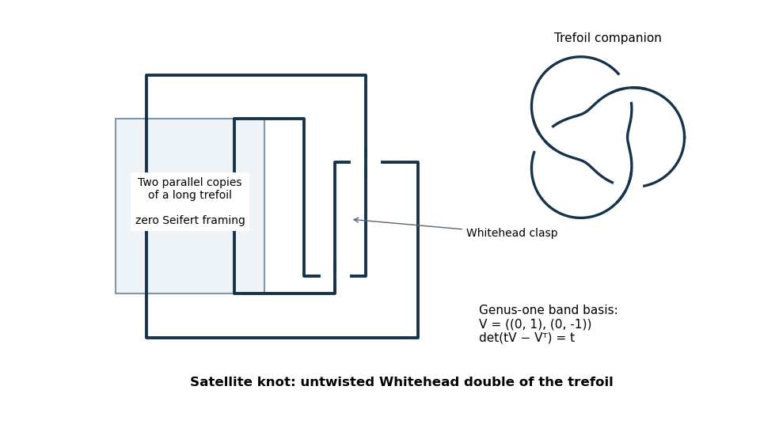

<h1 id="6/solution">Solution</h1>

↑ **Parent:** [6](../6.md)

Choose an oriented [Seifert surface](../../../../../seifert-surface.md) $F$ of [genus](../../../../../genus-of-a-surface.md) $g$ and an integral basis $a_1,\ldots,a_{2g}$ of $H_1(F;\mathbb Z)$. Push $a_i$ in the positive normal direction to $F$. The [Seifert matrix](../../../../../seifert-matrix.md) is

$$
\boxed{V_{ij}=\operatorname{lk}(a_i^+,a_j).}
$$

It represents the [Seifert form](../../../../../seifert-form.md). Its skew-symmetrization $V-V^T$ is the integral [intersection form](../../../../../intersection-form.md) of $F$. The relation to the [Alexander polynomial of a knot](../../../../../alexander-polynomial.md) is

$$
\boxed{\Delta_K(t)\doteq\det(tV-V^T).}
$$

This follows from the presentation of the [Alexander module of a knot](../../../../../alexander-module-of-a-knot.md) obtained by cutting the [knot exterior](../../../../../knot-exterior.md) along $F$ and stacking the resulting copies; a proof is not needed here.

**The printed genus inequality is false.** The useful consequence of the determinant relation is the [Alexander breadth bound on Seifert genus](../../../../../alexander-breadth-bound-on-seifert-genus.md):

$$
\boxed{\operatorname{br}\Delta_K\leq2g_s(K).}
$$

Here the [breadth of a Laurent polynomial](../../../../../breadth-of-a-laurent-polynomial.md) is its largest exponent minus its smallest exponent, so it is unchanged by multiplying by $\pm t^m$. Indeed, for a minimal-[genus](../../../../../genus-of-a-surface.md) [Seifert surface](../../../../../seifert-surface.md), the matrix has size $2g_s(K)$ and each entry of $tV-V^T$ has degree at most one. Its nonzero [determinant](../../../../../determinant.md) is an ordinary polynomial of degree at most $2g_s(K)$; its breadth is no larger than that degree. Equivalently, the highest exponent of a symmetrically normalized [Alexander polynomial of a knot](../../../../../alexander-polynomial.md) is at most $g_s(K)$. An unnormalized degree is not invariant under Laurent units.

For a counterexample to the printed inequality and the requested example, take the **untwisted Whitehead double of a trefoil knot**. The picture specifies the two-strand [tangle](../../../../../tangle.md) in the zero [Seifert framing](../../../../../seifert-framing.md); the two exterior caps form a [Whitehead double](../../../../../whitehead-double.md) clasp. The inset identifies the [trefoil knot](../../../../../trefoil-knot.md) used as companion.

**[Figure 1](#6/image-untwisted-whitehead-double-zero-framed-trefoil-tangle-and-whitehead-clasp). Untwisted Whitehead double: zero-framed trefoil tangle and Whitehead clasp**.

Its usual genus-one [Seifert surface](../../../../../seifert-surface.md) is a zero-framed annulus following the [trefoil knot](../../../../../trefoil-knot.md), joined by the clasp band. Choose the annulus core and a curve traversing the clasp band as the basis of its first [homology](../../../../../homology-split.md). Zero annulus twisting gives the first self-[linking number](../../../../../linking-number.md) $0$. The clasp contributes a [Hopf band](../../../../../hopf-band.md) with self-[linking number](../../../../../linking-number.md) $-1$ in the positive-clasp convention used here. Plumbing the bands contributes one linking in one push-off direction and none in the other. Orienting the basis suitably gives

$$
V=\begin{pmatrix}0&1\\0&-1\end{pmatrix},\qquad
tV-V^T=\begin{pmatrix}0&t\\-1&1-t\end{pmatrix}.
$$

Tying the annulus into the [trefoil knot](../../../../../trefoil-knot.md) changes neither these local linking counts nor its prescribed zero [Seifert framing](../../../../../seifert-framing.md). Therefore

$$
\boxed{\Delta_K(t)\doteq t\doteq1.}
$$

This [Whitehead double](../../../../../whitehead-double.md) is not the [unknot](../../../../../unknot.md), as allowed without proof in the question. Its [Seifert genus](../../../../../seifert-genus.md) is consequently at least one and at most one, hence exactly one. Thus $g_s(K)=1$ while every normalized constant [Alexander polynomial of a knot](../../../../../alexander-polynomial.md) has degree zero: a direct counterexample to the printed inequality.

## ↑ Ancestors (10)

1. [6](../6.md)
2. [Paper 16](../../paper-16-split.md)
3. [Iii](../../split.md)
4. [2012](../../../split.md)
5. [Past exam of the mathematics course of the University of Cambridge](../../../../split.md)
6. [Mathematics course of the University of Cambridge](../../../../../mathematics-course-of-the-university-of-cambridge.md)
7. [Course of the University of Cambridge](../../../../../course-of-the-university-of-cambridge.md)
8. [University of Cambridge](../../../../../university-of-cambridge-split.md)
9. [List of universities](../../../../../list-of-universities.md)
10. [Codex Wiki](../../../../../split.md)
