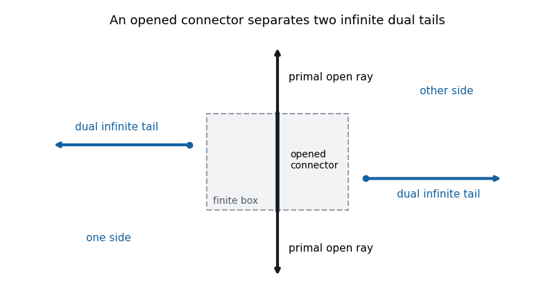

<h1 id="2/b/solution">Solution</h1>

↑ **Parent:** [B](../b.md)

For [bond percolation](../../../../../../bond-percolation-split.md), let $C(0)$ be the [percolation cluster](../../../../../../percolation-cluster.md) of the origin. Its [percolation probability](../../../../../../percolation-probability.md) is

$$
\boxed{\theta(p)=\mathbb P_p(|C(0)|=\infty).}
$$

We prove $\theta(1/2)=0$ by [alternating arms at the self-dual parameter](../../../../../../alternating-arms-argument-at-the-self-dual-percolation-parameter.md), using the [uniqueness of the infinite percolation cluster](../../../../../../uniqueness-of-the-infinite-percolation-cluster.md) proved in Question 4. Suppose instead that $\theta(1/2)>0$.

At $p=1/2$, declaring a dual [edge](../../../../../../edge-of-a-graph.md) open exactly when its crossing primal [edge](../../../../../../edge-of-a-graph.md) is closed produces independent [dual bond percolation](../../../../../../dual-bond-percolation.md) with the same parameter on $\mathbb Z^2+(1/2,1/2)$. It therefore also has an [infinite percolation cluster](../../../../../../infinite-percolation-cluster.md) almost surely, and at most one. The two preliminary arguments below imply that, for a sufficiently large square, the [probability](../../../../../../probability.md) of two primal infinite exterior arms starting through its top and bottom sides exceeds $3/4$. Applying the same arguments to the dual lattice gives [probability](../../../../../../probability.md) greater than $3/4$ for dual infinite exterior arms starting through the left and right sides. Thus all four arms occur together with positive [probability](../../../../../../probability.md), by the [union bound](../../../../../../boole-s-inequality.md).

Here are precise boundary conventions for the [alternating exterior-arm separation lemma](../../../../../../alternating-exterior-arm-separation-lemma.md). Use the primal [graph vertex](../../../../../../vertex-graph-theory.md) box $[-N,N]^2$, the dual [graph vertex](../../../../../../vertex-graph-theory.md) box $[-N+1/2,N-1/2]^2$, and the common continuous square with sides at $\pm(N+1/4)$. The primal arms first cross its top and bottom; the dual arms first cross its left and right. Subsequent [graph vertices](../../../../../../vertex-graph-theory.md) of every arm lie outside this continuous square. Large $N$ gives the required [probabilities](../../../../../../probability.md) for both boxes, by the same rotational symmetry and boundary-side estimate. Primal [open paths](../../../../../../open-path-in-bond-percolation.md) and dual [open paths](../../../../../../open-path-in-bond-percolation.md) cannot cross, since the two states of a crossing [edge](../../../../../../edge-of-a-graph.md) are complementary.

The two primal arms cannot meet in the exterior. If they did, a finite simple primal crosscut in the exterior would join the top and bottom entry points. Together with one of the two arcs of the square boundary it would enclose a bounded region containing one of the dual entry points. That dual exterior arm could not reach infinity without crossing the primal crosscut or the forbidden square interior. This is the [alternating exterior-arm separation lemma](../../../../../../alternating-exterior-arm-separation-lemma.md). Thus the two primal arms are disjoint.

Now modify only the primal [edges](../../../../../../edge-of-a-graph.md) with both endpoints in $[-N,N]^2$, making them open. Their grid supplies a simple interior path joining the two primal arm roots. The unchanged exterior arms and this connector form a proper doubly infinite simple primal path. Such a path separates the plane into two sides, by the [Jordan curve theorem](../../../../../../jordan-curve-theorem.md) applied to its [one-point compactification](../../../../../../alexandroff-extension.md) in the sphere. The left and right dual arms lie on opposite sides. Preserve their tails from their first exterior dual [graph vertices](../../../../../../vertex-graph-theory.md); none of those tails crosses a modified [edge](../../../../../../edge-of-a-graph.md). Their original boundary attachment [edges](../../../../../../edge-of-a-graph.md) may be destroyed, but the infinite exterior tails themselves remain. They now belong to two distinct infinite dual clusters, since any dual connection between them would have to cross the doubly infinite primal path.

This modification has positive [probability](../../../../../../probability.md) by the [finite-energy property of Bernoulli percolation](../../../../../../finite-energy-property-of-bernoulli-percolation.md): condition on the exterior configuration and open the finitely many interior [edges](../../../../../../edge-of-a-graph.md). The exterior projections of the four-arm event have positive [probability](../../../../../../probability.md). The resulting positive-probability event with two infinite dual clusters contradicts [uniqueness of the infinite percolation cluster](../../../../../../uniqueness-of-the-infinite-percolation-cluster.md) on the dual lattice. Therefore

$$
\boxed{\theta(1/2)=0.}
$$

**[Figure 1](#2/b/image-an-opened-connector-separates-two-infinite-dual-tails). An opened connector separates two infinite dual tails**.

Only the selected paths are drawn. The black connector lies in the finitely modified box; the two blue infinite dual tails remain outside and on opposite sides.

The proof uses self-duality, symmetry, positive association, [finite-energy property of Bernoulli percolation](../../../../../../finite-energy-property-of-bernoulli-percolation.md) and uniqueness; it does not assume the [Harris-Kesten theorem](../../../../../../harris-kesten-theorem.md) as a black box. The boundary language means an infinite ray whose first [graph vertex](../../../../../../vertex-graph-theory.md) is on the side and all later [graph vertices](../../../../../../vertex-graph-theory.md) are outside the [graph vertex](../../../../../../vertex-graph-theory.md) box. It cannot mean literal intersection of two disjoint sets, a closed box boundary and its strict complement.

## ↑ Ancestors (11)

1. [B](../b.md)
2. [2](../../2.md)
3. [Paper 30](../../../paper-30-split.md)
4. [Iii](../../../split.md)
5. [2012](../../../../split.md)
6. [Past exam of the mathematics course of the University of Cambridge](../../../../../split.md)
7. [Mathematics course of the University of Cambridge](../../../../../../mathematics-course-of-the-university-of-cambridge.md)
8. [Course of the University of Cambridge](../../../../../../course-of-the-university-of-cambridge.md)
9. [University of Cambridge](../../../../../../university-of-cambridge-split.md)
10. [List of universities](../../../../../../list-of-universities.md)
11. [Codex Wiki](../../../../../../split.md)
