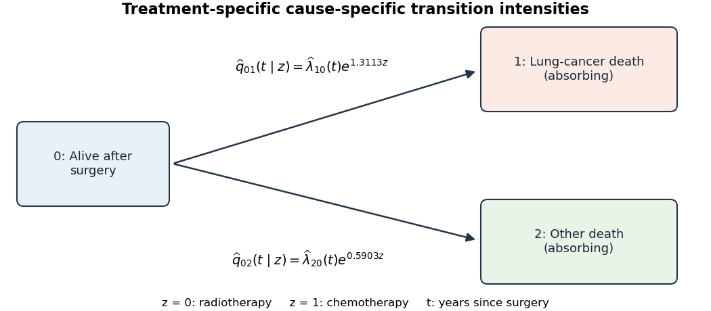

<h1 id="5/c/ii/solution">Solution</h1>

↑ **Parent:** [Ii](../ii.md)

Use the three-state [competing risks model](../../../../../../../competing-risks-model.md) shown below. State 0 is alive after surgery, state 1 is dead from lung cancer, and state 2 is dead from other causes. Both death states are absorbing. Study censoring is an observation mechanism, not a biological transition to a fourth state.

**[Figure 1](#5/c/ii/image-competing-deaths-with-treatment-specific-transition-intensities). Competing deaths with treatment-specific transition intensities**.

For treatment $z=0$ (radiotherapy) or $z=1$ (chemotherapy), define the [transition intensity](../../../../../../../transition-intensity.md)

$$
q_{0k}(t\mid z)=\lim_{h\downarrow0}\frac{\mathbb P(X(t+h)=k\mid X(t)=0,z)}{h},\qquad k=1,2.
$$

The fitted [Cox proportional-hazards models](../../../../../../../cox-proportional-hazards-model.md) are

$$
\boxed{\widehat q_{01}(t\mid z)=\widehat\lambda_{10}(t)e^{1.3113z},\qquad
\widehat q_{02}(t\mid z)=\widehat\lambda_{20}(t)e^{0.5903z}.}
$$

Here $\widehat\lambda_{10}$ and $\widehat\lambda_{20}$ represent the estimated baseline [cause-specific hazards](../../../../../../../cause-specific-hazard.md) for radiotherapy. More formally, the baseline estimates can be expressed as [cumulative hazard](../../../../../../../cumulative-hazard-function.md) measures with increments $d_k(t)/\sum_{i\in R(t)}e^{\widehat\gamma_k z_i}$, rather than ordinary smooth functions. All outgoing intensities from states 1 and 2 vanish, and $q_{00}=-(q_{01}+q_{02})$. The treatment [hazard ratios](../../../../../../../hazard-ratio.md) are 3.7111 and 1.8045 respectively. This model describes the two observed causes of death, not identifiable latent failure times after death has already occurred.

## ↑ Ancestors (12)

1. [Ii](../ii.md)
2. [C](../../c.md)
3. [5](../../../5.md)
4. [Paper 37](../../../../paper-37-split.md)
5. [Iii](../../../../split.md)
6. [2012](../../../../../split.md)
7. [Past exam of the mathematics course of the University of Cambridge](../../../../../../split.md)
8. [Mathematics course of the University of Cambridge](../../../../../../../mathematics-course-of-the-university-of-cambridge.md)
9. [Course of the University of Cambridge](../../../../../../../course-of-the-university-of-cambridge.md)
10. [University of Cambridge](../../../../../../../university-of-cambridge-split.md)
11. [List of universities](../../../../../../../list-of-universities.md)
12. [Codex Wiki](../../../../../../../split.md)
