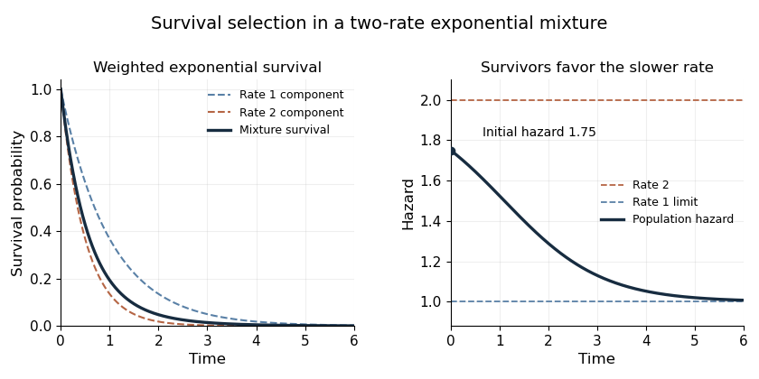

<h1 id="5/a/solution">Solution</h1>

↑ **Parent:** [A](../a.md)

A [survivor function](../../../../../../survival-function.md) is $S(t)=\mathbb P(T>t)$. For a nonnegative event time it is nonincreasing and right-continuous, with values between zero and one; a proper finite event time has $S(t)\to0$ as $t\to\infty$. Here $w(0)=1$, $w(t)>0$, $w(t)\to0$, and $w'(t)=-(e^{-t}+6e^{-2t})/4<0$ for $t\geq0$. Extending it by one for $t<0$ supplies a valid continuous survivor function.

The density is $-w'$, so the [hazard function](../../../../../../hazard-function.md) is

$$
\boxed{h(t)=\frac{e^{-t}+6e^{-2t}}{e^{-t}+3e^{-2t}}
=1+\frac{3e^{-t}}{1+3e^{-t}},\qquad
h'(t)=-\frac{3e^{-t}}{(1+3e^{-t})^2}<0.}
$$

In particular $h(0)=7/4$ and $\boxed{\lim_{t\to\infty}h(t)=1}$. The survivor is a mixture of rate-one and rate-two [exponential distributions](../../../../../../exponential-distribution.md) with weights $1/4$ and $3/4$. Among long-term survivors the rate-one component dominates, explaining the limiting hazard. More generally the [hazard derivative for a mixture of exponential distributions](../../../../../../hazard-derivative-for-a-mixture-of-exponential-distributions.md) is minus the variance of the component rate among survivors; the decreasing hazard is selection, not an individual component's changing hazard.

**[Figure 1](#5/a/image-survival-and-declining-hazard-of-a-two-rate-exponential-mixture). Survival and declining hazard of a two-rate exponential mixture**.

## ↑ Ancestors (11)

1. [A](../a.md)
2. [5](../../5.md)
3. [Paper 41](../../../paper-41-split.md)
4. [Iii](../../../split.md)
5. [2012](../../../../split.md)
6. [Past exam of the mathematics course of the University of Cambridge](../../../../../split.md)
7. [Mathematics course of the University of Cambridge](../../../../../../mathematics-course-of-the-university-of-cambridge.md)
8. [Course of the University of Cambridge](../../../../../../course-of-the-university-of-cambridge.md)
9. [University of Cambridge](../../../../../../university-of-cambridge-split.md)
10. [List of universities](../../../../../../list-of-universities.md)
11. [Codex Wiki](../../../../../../split.md)
