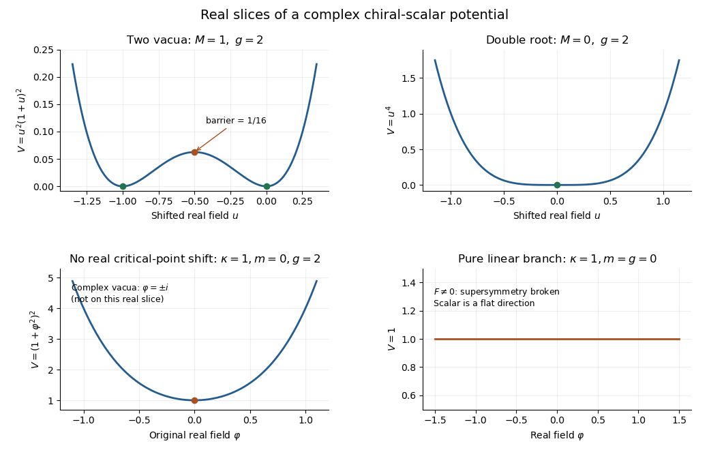

<h1 id="2/b/solution">Solution</h1>

↑ **Parent:** [B](../b.md)

Eliminating the [auxiliary field](../../../../../../auxiliary-field.md) gives $F^*=-W'(\varphi)$ and the nonnegative [F-term scalar potential](../../../../../../f-term-scalar-potential.md)

$$
\boxed{V(\varphi)=\left|\kappa+m\varphi+\frac g2\varphi^2\right|^2.}
$$

Use $u=\varphi-s$ after the critical-point shift, so that

$$
\boxed{V(u)=\left|Mu+\frac g2u^2\right|^2.}
$$

This notation keeps the original parameters distinct from the shifted mass coefficient $M$. For real $M,g$ with $Mg\ne0$, the real slice is $V(u)=u^2(M+gu/2)^2$. It has zero-energy minima at $u=0$ and $u=-2M/g$, a maximum between them at $u=-M/g$ with height $M^4/(4g^2)$, and grows quartically toward both ends. These statements follow by differentiating: $V'(u)=2u(M+gu/2)(M+gu)$.

When $M=0$ it becomes $|g|^2u^4/4$, with one degenerate zero minimum. When $g=0$, it is $|M|^2u^2$ after a permissible shift. For the real parameters with negative [discriminant](../../../../../../discriminant.md), the original real slice can have a positive minimum even though the full complex [scalar potential](../../../../../../scalar-potential.md) has zero-energy vacua away from that slice. The sketch distinguishes these regimes:

**[Figure 1](#2/b/image-real-scalar-potential-slices-two-supersymmetric-minima-a-double-root-complex-vacua-off-the-slice-and-flat-f-term-breaking). Real scalar-potential slices: two supersymmetric minima, a double root, complex vacua off the slice, and flat F-term breaking**.

The plots use illustrative normalized coefficients, not values fixed by the exam. **A positive minimum on a chosen real slice is not evidence for [supersymmetry breaking](../../../../../../supersymmetry-breaking.md) in the full complex field space.**

## ↑ Ancestors (11)

1. [B](../b.md)
2. [2](../../2.md)
3. [Paper 45](../../../paper-45-split.md)
4. [Iii](../../../split.md)
5. [2012](../../../../split.md)
6. [Past exam of the mathematics course of the University of Cambridge](../../../../../split.md)
7. [Mathematics course of the University of Cambridge](../../../../../../mathematics-course-of-the-university-of-cambridge.md)
8. [Course of the University of Cambridge](../../../../../../course-of-the-university-of-cambridge.md)
9. [University of Cambridge](../../../../../../university-of-cambridge-split.md)
10. [List of universities](../../../../../../list-of-universities.md)
11. [Codex Wiki](../../../../../../split.md)
