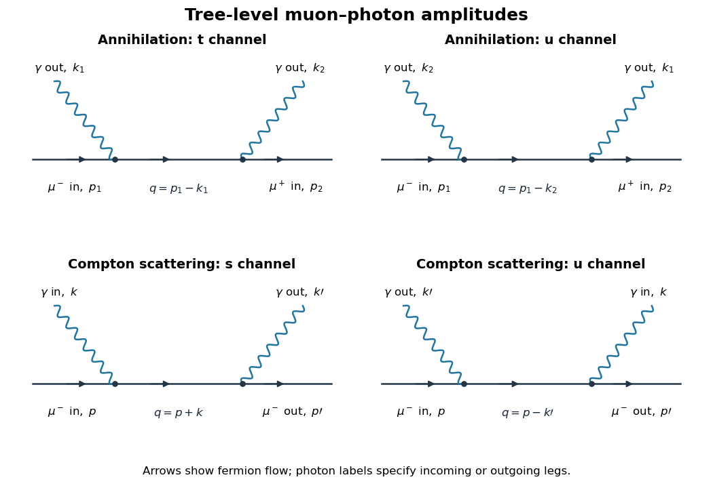

# Paper 46

↑ **Parent:** [Iii](../iii.md)

[https://www.maths.cam.ac.uk/postgrad/part-iii/files/pastpapers/2012/paper_46.pdf](https://www.maths.cam.ac.uk/postgrad/part-iii/files/pastpapers/2012/paper_46.pdf)

**Table of contents**

- [1](#1)
  - [Solution](#1/solution)
- [2](#2)
  - [Solution](#2/solution)
- [3](#3)
  - [Solution](#3/solution)
- [4](#4)
  - [Solution](#4/solution)

## 1

↑ **Parent:** [Paper 46](paper-46.md)

<h3 id="1/solution">Solution</h3>

↑ **Parent:** [1](#1)

Use units $\hbar=c=1$, metric $g_{\mu\nu}=\operatorname{diag}(1,-1,-1,-1)$, and $p\cdot x=E_{\mathbf p}t-\mathbf p\cdot\mathbf x$. Treat the [complex scalar field](../../../scalar-field-theory.md#complex-scalar-field) and its adjoint as independent variables when varying the [action](../../../classical-mechanics.md#action). Their [canonical momenta](../../../classical-mechanics.md#canonical-momentum) are

$$
\boxed{\pi=\frac{\partial\mathcal L}{\partial\dot\phi}=\dot\phi^\dagger,\qquad
\pi^\dagger=\frac{\partial\mathcal L}{\partial\dot\phi^\dagger}=\dot\phi.}
$$

[Canonical quantization](../../../quantum-mechanics.md#canonical-quantization) in the [Heisenberg picture](../../../quantum-mechanics.md#heisenberg-picture) imposes, at the same time $t$,

$$
[\phi(t,\mathbf x),\pi(t,\mathbf y)]=i\delta^{(3)}(\mathbf x-\mathbf y),\qquad
[\phi^\dagger(t,\mathbf x),\pi^\dagger(t,\mathbf y)]=i\delta^{(3)}(\mathbf x-\mathbf y).
$$

All other independent equal-time commutators vanish: in particular $[\phi,\phi^\dagger]=[\pi,\pi^\dagger]=[\phi,\pi^\dagger]=[\phi^\dagger,\pi]=0$, together with the same-type field and momentum commutators. The [Legendre transform](../../../convex-optimization.md#convex-conjugate) gives the [Hamiltonian density](../../../quantum-field-theory.md#hamiltonian-density)

$$
\boxed{\mathcal H=\pi\dot\phi+\pi^\dagger\dot\phi^\dagger-\mathcal L
=\pi\pi^\dagger+\nabla\phi^\dagger\cdot\nabla\phi+m^2\phi^\dagger\phi,\qquad H=\int d^3x\,\mathcal H.}
$$

The [Euler-Lagrange equations](../../../analysis.md#euler-lagrange-equation) are $(\Box+m^2)\phi=(\Box+m^2)\phi^\dagger=0$. The positive- and negative-frequency [plane waves](../../../quantum-mechanics.md#plane-wave) form a complete basis of solutions of the [Klein-Gordon equation](../../../wave-equation.md#klein-gordon-equation). Since the field is complex, their operator coefficients are independent rather than being adjoints of each other. Define the [Lorentz-invariant phase space](../../../relativistic-quantum-field.md#lorentz-invariant-phase-space) measure $d\Pi_p=d^3\mathbf p/[(2\pi)^3 2E_{\mathbf p}]$. A convenient expansion is

$$
\phi(x)=\int d\Pi_p\left[a(\mathbf p)e^{-ip\cdot x}-b^\dagger(\mathbf p)e^{ip\cdot x}\right],\qquad
\phi^\dagger(x)=\int d\Pi_p\left[a^\dagger(\mathbf p)e^{ip\cdot x}-b(\mathbf p)e^{-ip\cdot x}\right].
$$

The minus sign is a phase convention: replacing $b$ by $-b$ produces the usual plus-sign expansion without changing its commutators or [number operator](../../../quantum-mechanics.md#number-operator). The normalization is fixed by the [canonical commutation relations](../../../quantum-mechanics.md#canonical-commutation-relation). For example,

$$
\begin{aligned}
\pi(x)&=i\int d\Pi_p\,E_{\mathbf p}\left[a^\dagger(\mathbf p)e^{ip\cdot x}+b(\mathbf p)e^{-ip\cdot x}\right],\\
[\phi(t,\mathbf x),\pi(t,\mathbf y)]
&=\frac i2\int\frac{d^3\mathbf p}{(2\pi)^3}
\left[e^{i\mathbf p\cdot(\mathbf x-\mathbf y)}+e^{-i\mathbf p\cdot(\mathbf x-\mathbf y)}\right]
=i\delta^{(3)}(\mathbf x-\mathbf y),
\end{aligned}
$$

when $[a(\mathbf p),a^\dagger(\mathbf q)]=[b(\mathbf p),b^\dagger(\mathbf q)]=(2\pi)^3 2E_{\mathbf p}\delta^{(3)}(\mathbf p-\mathbf q)$. The cross commutators vanish and the other canonical relation follows by taking adjoints with the operator order reversed. Conversely these mode commutators can be obtained by Fourier inversion of the equal-time relations. This is [canonical quantization of a complex scalar field](../../../scalar-field-theory.md#canonical-quantization-of-a-complex-scalar-field).

Substitution into the spatial integral for $H$ makes the diagonal terms proportional to $a^\dagger a$ and $bb^\dagger$. Terms creating or annihilating a pair have $\mathbf q=-\mathbf p$ and a coefficient $E_{\mathbf p}^2-\mathbf p^2-m^2=0$, so they cancel. The result before vacuum subtraction is

$$
H_{\rm raw}=\int d\Pi_p\,E_{\mathbf p}\left[a^\dagger(\mathbf p)a(\mathbf p)+b(\mathbf p)b^\dagger(\mathbf p)\right].
$$

Commuting $b$ past $b^\dagger$ leaves a divergent field-independent [vacuum energy](../../../perturbative-quantum-field-theory.md#vacuum-energy). The displayed zero-vacuum-energy form must therefore be understood as a [normal-ordered](../../../perturbative-quantum-field-theory.md#normal-ordering) [Hamiltonian](../../../classical-mechanics.md#hamiltonian):

$$
\boxed{H=:H_{\rm raw}:=\int d\Pi_p\,E_{\mathbf p}(a^\dagger a+b^\dagger b)
=\int\frac{d^3\mathbf p}{(2\pi)^3}\frac12(a^\dagger a+b^\dagger b).}
$$

A regulator can be introduced before subtracting the constant. This is the [normal-ordered Hamiltonian of a free complex scalar field](../../../scalar-field-theory.md#normal-ordered-hamiltonian-of-a-free-complex-scalar-field); the unrenormalized [Hamiltonian](../../../classical-mechanics.md#hamiltonian) is not literally equal to this expression without that convention.

The [scalar-field vacuum](../../../quantum-field-theory.md#scalar-field-vacuum) is annihilated by both [annihilation operators](../../../quantum-mechanics.md#annihilation-operator). Their adjoints create two species of [spin](../../../quantum-mechanics.md#spin)-zero [bosons](../../../quantum-mechanics.md#boson) with the same positive energy $E_{\mathbf p}$ and [mass](../../../classical-mechanics.md#mass) $m$, because

$$
[H,a^\dagger(\mathbf p)]=E_{\mathbf p}a^\dagger(\mathbf p),\qquad
[H,b^\dagger(\mathbf p)]=E_{\mathbf p}b^\dagger(\mathbf p).
$$

Repeated [creation operators](../../../quantum-mechanics.md#creation-operator) give the bosonic [Fock space](../../../quantum-field-theory.md#fock-space). The negative-frequency part does not create a negative-energy physical state; it creates the [antiparticle](../../../relativistic-quantum-field.md#antiparticle) of positive energy. The charge distinguishes the two species.

For the global phase transformation $\delta\phi=-i\alpha\phi$, $\delta\phi^\dagger=i\alpha\phi^\dagger$, [Noether theorem](../../../calculus-of-variations.md#noether-theorem) gives $j^\mu=i(\phi^\dagger\partial^\mu\phi-\partial^\mu\phi^\dagger\,\phi)$. Its divergence is

$$
\partial_\mu j^\mu=i(\phi^\dagger\Box\phi-\Box\phi^\dagger\,\phi)
=i(-m^2\phi^\dagger\phi+m^2\phi^\dagger\phi)=0.
$$

With vanishing boundary flux, the integral of $j^0$ is a [conserved charge](../../../quantum-field-theory.md#conserved-charge). Substituting the modes gives, before charge [normal ordering](../../../perturbative-quantum-field-theory.md#normal-ordering), $Q_{\rm raw}=\int d\Pi_p(a^\dagger a-bb^\dagger)$. The pair terms cancel because their frequency difference is zero when their spatial momenta sum to zero. Taking the vacuum charge to vanish gives the [complex scalar charge operator](../../../scalar-field-theory.md#complex-scalar-charge-operator)

$$
\boxed{Q=\int d\Pi_p(a^\dagger a-b^\dagger b).}
$$

The mode commutators imply $[Q,a^\dagger]=a^\dagger$ and $[Q,b^\dagger]=-b^\dagger$, so

$$
\boxed{Qa^\dagger=a^\dagger(Q+1),\qquad Qb^\dagger=b^\dagger(Q-1).}
$$

Thus the particle carries charge $+1$, the [antiparticle](../../../relativistic-quantum-field.md#antiparticle) carries charge $-1$, and a state with occupation numbers $n_a,n_b$ has charge $n_a-n_b$. Also $[Q,\phi]=-\phi$ and $[Q,H]=0$, agreeing with the phase transformation and charge conservation.

## 2

↑ **Parent:** [Paper 46](paper-46.md)

<h3 id="2/solution">Solution</h3>

↑ **Parent:** [2](#2)

Continue with metric signature $+---$. The Pauli matrices obey $\{\sigma^i,\sigma^j\}=2\delta^{ij}I_2$. Block multiplication in the [chiral gamma-matrix representation](../../../algebra.md#chiral-gamma-matrix-representation) gives

$$
(\gamma^0)^2=I_4,\qquad
\gamma^0\gamma^i=\begin{pmatrix}-\sigma^i&0\\0&\sigma^i\end{pmatrix},\qquad
\gamma^i\gamma^0=-\gamma^0\gamma^i,
$$

and

$$
\gamma^i\gamma^j=-\begin{pmatrix}\sigma^i\sigma^j&0\\0&\sigma^i\sigma^j\end{pmatrix}.
$$

Hence **$\{\gamma^\mu,\gamma^\nu\}=2g^{\mu\nu}I_4$**, the required [Clifford algebra](../../../algebra.md#clifford-algebra). Multiplying the [Dirac equation](../../../relativistic-quantum-field.md#dirac-equation) by $i\gamma^\nu\partial_\nu+m$ yields

$$
(i\gamma^\nu\partial_\nu+m)(i\gamma^\mu\partial_\mu-m)\psi
=-(\Box+m^2)\psi=0.
$$

The antisymmetric part of $\gamma^\nu\gamma^\mu$ drops out because partial derivatives commute. Therefore every component of the [Dirac spinor](../../../relativistic-quantum-field.md#dirac-spinor) satisfies the [Klein-Gordon equation](../../../wave-equation.md#klein-gordon-equation). The converse is not true: four arbitrary scalar solutions need not obey the first-order [Dirac equation](../../../relativistic-quantum-field.md#dirac-equation).

The [Lorentz group](../../../special-relativity.md#lorentz-group) consists of real invertible matrices $\Lambda$ preserving the [Minkowski metric](../../../special-relativity.md#minkowski-metric): $\Lambda^Tg\Lambda=g$. Writing $\Lambda=I+\omega+O(\omega^2)$ gives $\omega_{\mu\nu}=-\omega_{\nu\mu}$, so **there are six continuous parameters: three spatial rotation angles and three boost rapidities**. The [Proper orthochronous Lorentz group](../../../special-relativity.md#proper-orthochronous-lorentz-group) is the connected component with determinant $+1$ that preserves time orientation. [Parity](../../../quantum-mechanics.md#parity) and [time reversal](../../../quantum-field-theory.md#t-symmetry) are additional discrete operations and are not encoded by the six real parameters in an exponential near the identity.

For the real-generator convention used here, vector generators can be written

$$
(M_{\rm vec}^{\rho\sigma})^\mu{}_{\nu}
=g^{\rho\mu}\delta^\sigma{}_{\nu}-g^{\sigma\mu}\delta^\rho{}_{\nu}.
$$

Take $\Omega_{\rho\sigma}=-\Omega_{\sigma\rho}$ and use the same parameters in the spinor representation. The [Lorentz-spinor generators from a Clifford algebra](../../../relativistic-quantum-field.md#lorentz-spinor-generators-from-a-clifford-algebra) are

$$
\boxed{M_{\rm sp}^{\rho\sigma}=\frac14[\gamma^\rho,\gamma^\sigma],\qquad
S(\Lambda)=\exp\left(\frac12\Omega_{\rho\sigma}M_{\rm sp}^{\rho\sigma}\right).}
$$

To verify the [Lorentz algebra](../../../semisimple-lie-algebra.md#lorentz-algebra), first commute a generator with one [gamma matrix](../../../algebra.md#gamma-matrices):

$$
[M_{\rm sp}^{\rho\sigma},\gamma^\tau]
=g^{\sigma\tau}\gamma^\rho-g^{\rho\tau}\gamma^\sigma.
$$

For example, this follows by moving $\gamma^\tau$ through each product using the Clifford [anticommutator](../../../vector-space.md#anticommutator). Applying the commutator derivation rule to $\frac14[\gamma^\tau,\gamma^\nu]$ then gives

$$
[M_{\rm sp}^{\rho\sigma},M_{\rm sp}^{\tau\nu}]
=g^{\sigma\tau}M_{\rm sp}^{\rho\nu}-g^{\rho\tau}M_{\rm sp}^{\sigma\nu}
+g^{\rho\nu}M_{\rm sp}^{\sigma\tau}-g^{\sigma\nu}M_{\rm sp}^{\rho\tau}.
$$

No extra factor of $i$ belongs in these generators with this commutator convention. Hermitian-generator conventions shift the factors of $i$ into the brackets and the exponential instead.

The same gamma commutator proves

$$
S^{-1}\gamma^\mu S=\Lambda^\mu{}_{\nu}\gamma^\nu.
$$

Indeed, to first order $S^{-1}\gamma^\mu S=\gamma^\mu+\frac12\Omega_{\rho\sigma}[\gamma^\mu,M_{\rm sp}^{\rho\sigma}]$, exactly the infinitesimal vector [action](../../../classical-mechanics.md#action) defined above. Exponentiating proves the finite relation. The spinor field transforms as **$\psi'(x')=S(\Lambda)\psi(x)$ with $x'=\Lambda x$**; combining this relation with $\partial'_\mu=(\Lambda^{-1})^\nu{}_{\mu}\partial_\nu$ preserves the [Dirac equation](../../../relativistic-quantum-field.md#dirac-equation). A $2\pi$ rotation gives $S=-I_4$, so the spinor matrices give the double-cover [spin](../../../quantum-mechanics.md#spin) representation, rather than a single-valued ordinary representation of the [Lorentz group](../../../special-relativity.md#lorentz-group) itself.

For a boost in direction $i$, $M_{\rm sp}^{0i}=\frac12\gamma^0\gamma^i$ is Hermitian, with eigenvalues $\pm\frac12$. A real [rapidity](../../../special-relativity.md#rapidity) $\eta$ therefore produces eigenvalues $e^{\pm\eta/2}$ in $S$, whose moduli are not one. **The finite-component spinor representation is not unitary for boosts**, although the rotation matrices are unitary. The [Lorentz group](../../../special-relativity.md#lorentz-group) is noncompact; this does not forbid the unitary infinite-dimensional [action](../../../classical-mechanics.md#action) on the physical Hilbert space of states.

Nevertheless, since $(\gamma^\mu)^\dagger=\gamma^0\gamma^\mu\gamma^0$,

$$
(M_{\rm sp}^{\rho\sigma})^\dagger\gamma^0+\gamma^0M_{\rm sp}^{\rho\sigma}=0,
\qquad S^\dagger\gamma^0S=\gamma^0.
$$

This [Dirac spinor pseudo-unitarity](../../../relativistic-quantum-field.md#dirac-spinor-pseudo-unitarity) implies $\bar\psi'(x')=\bar\psi(x)S^{-1}$, and consequently

$$
\boxed{\bar\psi'(x')\psi'(x')=\bar\psi(x)\psi(x).}
$$

The [Dirac adjoint](../../../relativistic-quantum-field.md#dirac-adjoint) is precisely the adjoint needed to form this [Lorentz scalar](../../../special-relativity.md#lorentz-scalar); ordinary $\psi^\dagger\psi$ alone is not a scalar.

Let $\gamma^5=i\gamma^0\gamma^1\gamma^2\gamma^3=\operatorname{diag}(-I_2,I_2)$. It anticommutes with every [gamma matrix](../../../algebra.md#gamma-matrices) and commutes with every $M_{\rm sp}^{\rho\sigma}$, so $S^{-1}\gamma^5S=\gamma^5$. Thus the [axial current](../../../relativistic-quantum-field.md#axial-current) transforms as a [four-vector](../../../special-relativity.md#four-vector) under proper [Lorentz transformations](../../../special-relativity.md#lorentz-transformation):

$$
j_5'{}^\mu(x')=\Lambda^\mu{}_{\nu}j_5^\nu(x).
$$

Under [parity](../../../quantum-mechanics.md#parity) it is an [axial vector](../../../vector-space.md#pseudovector), acquiring the additional [pseudovector](../../../vector-space.md#pseudovector) sign. Contracting two [axial currents](../../../relativistic-quantum-field.md#axial-current) cancels that sign and uses the invariant metric. Therefore **$j_{5\mu}j_5^\mu$ is compatible with [Lorentz invariance](../../../special-relativity.md#lorentz-invariance)**, including [parity](../../../quantum-mechanics.md#parity) invariance of this contraction. [Lorentz invariance](../../../special-relativity.md#lorentz-invariance) of the interaction does not require the [axial current](../../../relativistic-quantum-field.md#axial-current) to be conserved.

## 3

↑ **Parent:** [Paper 46](paper-46.md)

<h3 id="3/solution">Solution</h3>

↑ **Parent:** [3](#3)

For fields $\Phi_a$ with a first-derivative [Lagrangian density](../../../quantum-field-theory.md#lagrangian-density), suppose an infinitesimal global transformation at fixed coordinates is $\delta\Phi_a=\alpha\Delta_a$ and $\delta\mathcal L=\alpha\partial_\mu K^\mu$, with constant infinitesimal $\alpha$. [Noether theorem](../../../calculus-of-variations.md#noether-theorem) gives the [on shell](../../../quantum-field-theory.md#on-shell) [conserved current](../../../quantum-field-theory.md#conserved-current)

$$
\boxed{J^\mu=\sum_a\frac{\partial\mathcal L}{\partial(\partial_\mu\Phi_a)}\Delta_a-K^\mu,\qquad \partial_\mu J^\mu=0.}
$$

This follows by varying the Lagrangian, integrating the terms with $\partial_\mu\Delta_a$ by parts, and setting the Euler-Lagrange expressions to zero. If spatial boundary flux vanishes, $\int d^3x\,J^0$ is a conserved [Noether charge](../../../quantum-field-theory.md#noether-charge). Spacetime symmetries are covered by including the induced field variation at fixed coordinates and the corresponding total derivative $K^\mu$.

An example of a theory with a Lorentz [four-vector](../../../special-relativity.md#four-vector) is the source-free [Maxwell field](../../../electromagnetism.md#electromagnetic-field) with [electromagnetic four-potential](../../../electromagnetism.md#electromagnetic-four-potential) $A_\mu$. Under an Abelian [gauge transformation](../../../electromagnetism.md#gauge-transformation),

$$
A_\mu\longmapsto A_\mu+\partial_\mu\chi,\qquad
F_{\mu\nu}=\partial_\mu A_\nu-\partial_\nu A_\mu.
$$

The change in $F_{\mu\nu}$ is $\partial_\mu\partial_\nu\chi-\partial_\nu\partial_\mu\chi=0$, so the [Maxwell Lagrangian](../../../electromagnetism.md#maxwell-lagrangian) is [gauge-invariant](../../../relativistic-quantum-field.md#gauge-invariance). For $A_\mu=(\Phi,-\mathbf A)$ define $E_i=F_{0i}$ and $F_{ij}=-\epsilon_{ijk}B_k$. With signature $+---$,

$$
F_{\mu\nu}F^{\mu\nu}=2(\mathbf B^2-\mathbf E^2),\qquad
\mathcal L=\frac12(\mathbf E^2-\mathbf B^2).
$$

The minus sign in $-F^2/4$ gives the positive electric kinetic term and positive physical field energy; reversing it would reverse the [Hamiltonian](../../../classical-mechanics.md#hamiltonian)'s sign for the physical modes. The normalization $1/4$ accounts for antisymmetry and yields the conventional equations. Varying $A_\nu$ gives $\partial_\mu F^{\mu\nu}=0$.

For time translation at fixed coordinates take $\Delta_\nu=\partial_0A_\nu$. Since $\alpha$ is constant, $\delta F_{\mu\nu}=\alpha\partial_0F_{\mu\nu}$, and hence $\delta\mathcal L=\alpha\partial_0\mathcal L$. Thus $K^\mu=\delta^\mu{}_0\mathcal L$. The momentum derivative is

$$
\frac{\partial\mathcal L}{\partial(\partial_\mu A_\nu)}=-F^{\mu\nu}.
$$

[Noether theorem](../../../calculus-of-variations.md#noether-theorem) therefore gives the [canonical stress-energy tensor](../../../quantum-field-theory.md#canonical-stress-energy-tensor)'s time-translation current

$$
J_{\rm can}^\mu=T_{\rm can}^\mu{}_0
=-F^{\mu\nu}\partial_0A_\nu-\delta^\mu{}_0\mathcal L,
\qquad
\boxed{H_{\rm can}=\int d^3x\left[\frac12(\mathbf E^2+\mathbf B^2)+\mathbf E\cdot\nabla A_0\right].}
$$

Here $\dot A_i=E_i+\partial_iA_0$ was used. The [canonical momentum](../../../classical-mechanics.md#canonical-momentum) of $A_0$ vanishes, while that of the lower spatial component $A_i$ is $E_i$: $A_0$ acts as a multiplier for [Gauss law](../../../electromagnetism.md#gauss-s-law), not a propagating degree of freedom. The density above is not manifestly [gauge-invariant](../../../relativistic-quantum-field.md#gauge-invariance), but its charge agrees with the physical energy on the constraint surface and with appropriate [boundary conditions](../../../differential-equation.md#boundary-condition).

The [gauge-covariant time translation](../../../electromagnetism.md#gauge-covariant-time-translation) instead has $\Delta_\nu=\partial_0A_\nu-\partial_\nu A_0=F_{0\nu}$. It is time translation combined with a [gauge transformation](../../../electromagnetism.md#gauge-transformation) of parameter $\chi=-\alpha A_0$. Directly,

$$
\delta F_{\mu\nu}=\alpha(\partial_\mu F_{0\nu}-\partial_\nu F_{0\mu})
=\alpha\partial_0F_{\mu\nu},
$$

using the definition of $F$, equivalently its [Bianchi identity](../../../fiber-bundle.md#bianchi-identity). The total derivative in $\delta\mathcal L$ is unchanged. The improved current is

$$
J_{\rm imp}^\mu=-F^{\mu\nu}F_{0\nu}-\delta^\mu{}_0\mathcal L
=\Theta^\mu{}_0,
\qquad
\Theta^\mu{}_{\nu}=-F^{\mu\rho}F_{\nu\rho}+\frac14\delta^\mu{}_{\nu}F_{\rho\sigma}F^{\rho\sigma}.
$$

It is the [gauge-invariant Maxwell stress-energy tensor](../../../quantum-field-theory.md#gauge-invariant-maxwell-stress-energy-tensor). In particular,

$$
\boxed{u=J_{\rm imp}^0=\frac12(\mathbf E^2+\mathbf B^2),\qquad
H=\int d^3x\,u.}
$$

The spatial current is the [Poynting vector](../../../electromagnetism.md#poynting-vector) $\mathbf E\times\mathbf B$, so conservation gives $\partial_tu+\nabla\cdot(\mathbf E\times\mathbf B)=0$. This is the familiar positive local [electromagnetic field](../../../electromagnetism.md#electromagnetic-field) energy density, expressed entirely in measurable fields.

To compare the currents,

$$
J_{\rm can}^\mu-J_{\rm imp}^\mu=-F^{\mu\nu}\partial_\nu A_0
=-\partial_\nu(A_0F^{\mu\nu})+A_0\partial_\nu F^{\mu\nu}.
$$

The last term vanishes on the source-free [Maxwell equations](../../../electromagnetism.md#maxwell-equations), leaving a [stress-energy tensor improvement](../../../general-relativity.md#stress-energy-tensor-improvement) generated by a [stress-energy superpotential](../../../general-relativity.md#stress-energy-superpotential). At the charge level,

$$
H_{\rm can}-H=\int d^3x\,\mathbf E\cdot\nabla A_0
=\oint A_0\mathbf E\cdot d\mathbf S-\int d^3x\,A_0\nabla\cdot\mathbf E=0
$$

when the surface term vanishes and [Gauss law](../../../electromagnetism.md#gauss-s-law) holds. Thus the symmetries yield the same conserved energy under these conditions while the second supplies a gauge-invariant local density. Boundary terms would have to be retained if those [boundary conditions](../../../differential-equation.md#boundary-condition) were not imposed.

## 4

↑ **Parent:** [Paper 46](paper-46.md)

<h3 id="4/solution">Solution</h3>

↑ **Parent:** [4](#4)

Take the [muon](../../../standard-model.md#muon) [mass](../../../classical-mechanics.md#mass) to be $m_\mu$, and use the [quantum electrodynamics](../../../perturbative-quantum-field-theory.md#quantum-electrodynamics) convention $\mathcal L_{\rm int}=-e\bar\psi\gamma^\mu\psi A_\mu$ with $e>0$. Let $p_1,p_2$ be the incoming [muon](../../../standard-model.md#muon) and antimuon momenta and $k_1,k_2$ the outgoing [photon](../../../quantum-mechanics.md#photon) momenta, so $p_1+p_2=k_1+k_2$. External particles are [on shell](../../../quantum-field-theory.md#on-shell): $p_1^2=p_2^2=m_\mu^2$ and $k_1^2=k_2^2=0$. The two tree-level [Feynman diagrams](../../../perturbative-quantum-field-theory.md#feynman-diagram) are the two orders in which the [photon](../../../quantum-mechanics.md#photon) legs attach to the [muon](../../../standard-model.md#muon) line. There is no three-[photon](../../../quantum-mechanics.md#photon) [QED](../../../perturbative-quantum-field-theory.md#quantum-electrodynamics) vertex, and therefore no single-[photon](../../../quantum-mechanics.md#photon) annihilation diagram into two [photons](../../../quantum-mechanics.md#photon) at this order.

**[Figure 1](#4/image-two-photon-orders-for-muon-annihilation-and-compton-scattering). Two photon orders for muon annihilation and Compton scattering**.

The [QED Feynman rules](../../../perturbative-quantum-field-theory.md#qed-feynman-rules) needed here are the vertex $-ie\gamma^\mu$, the [Dirac propagator](../../../quantum-field-theory.md#dirac-propagator)

$$
\frac{i(\not q+m_\mu)}{q^2-m_\mu^2+i0},\qquad \not q=\gamma^\mu q_\mu,
$$

an incoming [muon](../../../standard-model.md#muon) spinor $u(p_1)$, an incoming antimuon adjoint $\bar v(p_2)$, and an outgoing [photon](../../../quantum-mechanics.md#photon) polarization $\epsilon_\mu^*(k)$. At a vertex enforce [four-momentum](../../../special-relativity.md#four-momentum) conservation. Spinor products are ordered along the [fermion](../../../quantum-mechanics.md#fermion) line; exchanging the external [photons](../../../quantum-mechanics.md#photon) introduces no relative minus sign. Define $R(q)=(\not q+m_\mu)/(q^2-m_\mu^2+i0)$ and $\not\epsilon=\gamma^\mu\epsilon_\mu$.

With the convention that a diagram contributes $i\mathcal M$, the two [muon](../../../standard-model.md#muon)-antimuon annihilation amplitudes are

$$
\begin{aligned}
\mathcal M_t&=-e^2\bar v(p_2)\not\epsilon_2^*R(p_1-k_1)\not\epsilon_1^*u(p_1),\\
\mathcal M_u&=-e^2\bar v(p_2)\not\epsilon_1^*R(p_1-k_2)\not\epsilon_2^*u(p_1),\\
\boxed{\mathcal M_{\rm ann}}&\boxed{=\mathcal M_t+\mathcal M_u.}
\end{aligned}
$$

Their denominators are respectively $t-m_\mu^2+i0$ and $u-m_\mu^2+i0$, where $t=(p_1-k_1)^2$, $u=(p_1-k_2)^2$. A different consistent overall amplitude-phase convention has no physical effect.

A physical [photon polarization vector](../../../quantum-mechanics.md#photon-polarization-vector) obeys **$k\cdot\epsilon=0$**, and represents an equivalence class $\epsilon\sim\epsilon+\alpha k$. For a real null momentum, adding $\alpha k$ preserves transversality. One can additionally choose transverse spatial vectors with $\epsilon^0=0$ and $\epsilon^*\cdot\epsilon=-1$; there are two independent physical polarizations. The equivalence class removes the unphysical longitudinal direction, rather than imposing four independent physical polarization states.

The invariance of the total amplitude is a [two-photon fermion Ward identity](../../../perturbative-quantum-field-theory.md#two-photon-fermion-ward-identity). Replace $\epsilon_1^*$ by $k_1$ and put $q_t=p_1-k_1$, $q_u=p_1-k_2=k_1-p_2$. The external [Dirac equations](../../../relativistic-quantum-field.md#dirac-equation) give

$$
(\not p_1-m_\mu)u(p_1)=0,\qquad \bar v(p_2)(\not p_2+m_\mu)=0.
$$

Away from propagator poles, $R(q)(\not q-m_\mu)=(\not q-m_\mu)R(q)=I$; the identity extends with the common Feynman prescription. Therefore

$$
\begin{aligned}
R(q_t)\not k_1u(p_1)&=R(q_t)(\not p_1-\not q_t)u(p_1)=-u(p_1),\\
\bar v(p_2)\not k_1R(q_u)&=\bar v(p_2)(\not q_u+\not p_2)R(q_u)=\bar v(p_2).
\end{aligned}
$$

The two terms in the bracket then give $-\bar v\not\epsilon_2^*u$ and $+\bar v\not\epsilon_2^*u$, which cancel. Exchanging [photon](../../../quantum-mechanics.md#photon) labels proves the second [Ward identity](../../../perturbative-quantum-field-theory.md#ward-identity). Thus **the sum is unchanged under $\epsilon_i\mapsto\epsilon_i+\alpha k_i$ for either [photon](../../../quantum-mechanics.md#photon)**. Neither diagram is generally [gauge-invariant](../../../relativistic-quantum-field.md#gauge-invariance) separately. Physically, longitudinal pure-gauge polarization does not couple to the observable [scattering amplitude](../../../quantum-mechanics.md#scattering-amplitude); only the two transverse [photon](../../../quantum-mechanics.md#photon) degrees of freedom contribute.

For [Compton scattering](../../../physics.md#compton-scattering) write the incoming momenta as $p,k$ and outgoing momenta as $p',k'$, with $p+k=p'+k'$. The outgoing [muon](../../../standard-model.md#muon) contributes $\bar u(p')$, the incoming [photon](../../../quantum-mechanics.md#photon) contributes $\epsilon(k)$ without conjugation, and the outgoing [photon](../../../quantum-mechanics.md#photon) contributes $\epsilon'^*(k')$. The two [tree-level Compton amplitudes](../../../physics.md#tree-level-compton-amplitude) are

$$
\begin{aligned}
\mathcal M_s&=-e^2\bar u(p')\not\epsilon'^*R(p+k)\not\epsilon\,u(p),\\
\mathcal M_u&=-e^2\bar u(p')\not\epsilon\,R(p-k')\not\epsilon'^*u(p),\\
\boxed{\mathcal M_{\rm C}}&\boxed{=\mathcal M_s+\mathcal M_u.}
\end{aligned}
$$

These are the lower two diagrams. Their intermediate [muon](../../../standard-model.md#muon) momenta are $p+k$ and $p-k'$, with denominators $s-m_\mu^2+i0$ and $u-m_\mu^2+i0$. The first attaches the incoming [photon](../../../quantum-mechanics.md#photon) before the outgoing [photon](../../../quantum-mechanics.md#photon) along [fermion](../../../quantum-mechanics.md#fermion) flow; the second reverses that attachment order. Both contribute at order $e^2$ in the amplitude.

**[Compton scattering](../../../physics.md#compton-scattering) has one incoming and one outgoing [muon](../../../standard-model.md#muon) and one [photon](../../../quantum-mechanics.md#photon) on each side; annihilation has an incoming particle-[antiparticle](../../../relativistic-quantum-field.md#antiparticle) pair and two outgoing [photons](../../../quantum-mechanics.md#photon).** Accordingly the external spinors/polarizations and physical Mandelstam channels differ, although both arise from the same two-vertex [QED](../../../perturbative-quantum-field-theory.md#quantum-electrodynamics) matrix element. [Crossing symmetry](../../../quantum-mechanics.md#crossing-symmetry) relates them by continuing $p_2\mapsto-p'$ and one outgoing [photon](../../../quantum-mechanics.md#photon) momentum $k_1\mapsto-k$, with the corresponding external wavefunction replacements. The annihilation $t$ channel becomes the Compton $s$ channel and the other channel becomes its $u$ channel. Identical final [photons](../../../quantum-mechanics.md#photon) require a factor $1/2!$ in an annihilation phase-space integral over an otherwise double-counted full final-state region; there is no analogous final-state identical-particle factor for the [muon](../../../standard-model.md#muon)-[photon](../../../quantum-mechanics.md#photon) Compton final state. Gauge cancellation holds for the summed Compton amplitude as well.

## ↑ Ancestors (8)

1. [Iii](../iii.md)
2. [2012](../../2012.md)
3. [Past exam of the mathematics course of the University of Cambridge](../../../past-exam-of-the-mathematics-course-of-the-university-of-cambridge.md)
4. [Mathematics course of the University of Cambridge](../../../university-of-cambridge.md#mathematics-course-of-the-university-of-cambridge)
5. [Course of the University of Cambridge](../../../university-of-cambridge.md#course-of-the-university-of-cambridge)
6. [University of Cambridge](../../../university-of-cambridge.md)
7. [List of universities](../../../README.md#list-of-universities)
8. [Codex Wiki](../../../README.md)
