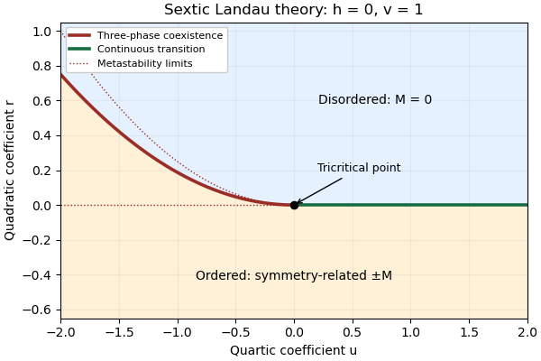

<h1 id="1/vi/solution">Solution</h1>

↑ **Parent:** [Vi](../vi.md)

Consider the $(u,r)$ plane at $h=0$ for $V=rM^2/2+uM^4/4+vM^6/6$, with fixed $v>0$. For $u>0$, the continuous boundary is $r=0$: above it the [global minimum](../../../../../../global-minimum.md) is zero, and below it there are two symmetry-related ordered [pure thermodynamic phases](../../../../../../pure-thermodynamic-phase.md). For $u<0$, the equilibrium boundary is the [tricritical three-phase line](../../../../../../tricritical-three-phase-line.md)

$$
\boxed{r=\frac{3u^2}{16v}.}
$$

Above this curve the disordered minimum wins; below it the two ordered minima win. On the curve,

$$
V(M)=\frac v6M^2\left(M^2+\frac{3u}{4v}\right)^2\geq0.
$$

Its three zeros are exactly $M=0$ and $M=\pm\sqrt{-3u/(4v)}$, proving equality of three [global minimum](../../../../../../global-minimum.md) values. [Spin inversion symmetry](../../../../../../spin-inversion-symmetry.md) enforces the equality of the two ordered phases automatically, so tuning a single remaining coefficient can produce three-phase coexistence on a line in this symmetry plane. This does not contradict the generic phase-rule counting without symmetry restrictions.

The [tricritical point](../../../../../../tricritical-point.md) is $(u,r)=(0,0)$, where the discontinuity vanishes, the first-order boundary meets the continuous boundary, and the positive sextic term becomes the leading stabilizer. The local metastability limits $r=0$ and $r=u^2/(4v)$, $u<0$, bracket the first-order curve but are not phase boundaries. In the full $(r,u,h)$ parameter space, the zero-field line is attached to [tricritical wings](../../../../../../tricritical-wing.md); a nonzero field splits the equality of the two ordered phases.

**[Figure 1](#1/vi/image-zero-field-sextic-landau-phase-diagram-showing-the-continuous-boundary-and-three-phase-coexistence-line). Zero-field sextic Landau phase diagram, showing the continuous boundary and three-phase coexistence line**.

## ↑ Ancestors (11)

1. [Vi](../vi.md)
2. [1](../../1.md)
3. [Paper 49](../../../paper-49-split.md)
4. [Iii](../../../split.md)
5. [2012](../../../../split.md)
6. [Past exam of the mathematics course of the University of Cambridge](../../../../../split.md)
7. [Mathematics course of the University of Cambridge](../../../../../../mathematics-course-of-the-university-of-cambridge.md)
8. [Course of the University of Cambridge](../../../../../../course-of-the-university-of-cambridge.md)
9. [University of Cambridge](../../../../../../university-of-cambridge-split.md)
10. [List of universities](../../../../../../list-of-universities.md)
11. [Codex Wiki](../../../../../../split.md)
