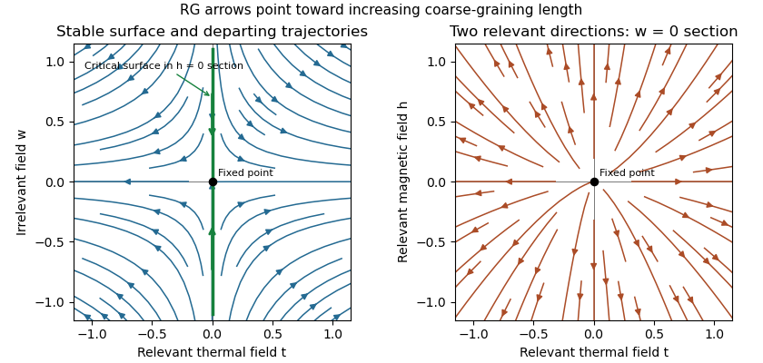

<h1 id="2/solution">Solution</h1>

↑ **Parent:** [2](../2.md)

Use a selected translationally invariant [pure thermodynamic phase](../../../../../pure-thermodynamic-phase.md) and define the connected lattice [correlation function](../../../../../correlation-function.md)

$$
G(\mathbf r)=\langle\sigma_{\mathbf 0}\sigma_{\mathbf n}\rangle-\langle\sigma_{\mathbf 0}\rangle\langle\sigma_{\mathbf n}\rangle,\qquad\mathbf r=a\mathbf n.
$$

Away from criticality its long-distance tail has an exponential factor $e^{-r/\xi}$, possibly multiplied by a power. Equivalently $\xi^{-1}=-\lim_{r\to\infty}r^{-1}\log|G(r)|$ when this limit exists; different directions can have different lengths on an anisotropic lattice. At a [thermodynamic critical point](../../../../../thermodynamic-critical-point.md) the [correlation length](../../../../../correlation-length.md) diverges and the tail becomes algebraic. Differentiate $M=N^{-1}\langle\sum_n\sigma_n\rangle$ with respect to the physical field appearing in the energy [Statistical Hamiltonian](../../../../../statistical-hamiltonian.md). With $\beta_{\rm th}=1/(k_BT)$, the [correlation-function susceptibility sum rule](../../../../../correlation-function-susceptibility-sum-rule.md) is

$$
\boxed{\chi=\frac{\beta_{\rm th}}N\operatorname{Var}\!\left(\sum_n\sigma_n\right)=\beta_{\rm th}\sum_nG(a\mathbf n).}
$$

In physical continuum coordinates the sum becomes $a^{-D}\int d^Dr\,G(r)$. Differentiating with respect to the dimensionless source $\beta_{\rm th}h$ instead removes the explicit inverse-temperature factor. Below the transition, take a one-sided pure-phase limit rather than a macroscopic symmetric mixture.

A [normalized blocking kernel](../../../../../normalized-blocking-kernel.md) $B_b(\sigma',\sigma)$ assigns a probability or a delta constraint to a coarse configuration for each microscopic one, with $\sum_{\sigma'}B_b(\sigma',\sigma)=1$. Define the blocked Boltzmann weight by

$$
e^{-\beta_{\rm th}[\mathcal H(u_1,\sigma')+N_1C_1]}=\sum_\sigma B_b(\sigma',\sigma)e^{-\beta_{\rm th}[\mathcal H(u_0,\sigma)+NC_0]}.
$$

Summing over $\sigma'$ proves exact equality of the [partition functions](../../../../../canonical-partition-function.md). Repeated [real-space renormalization group](../../../../../real-space-renormalization-group.md) steps compose the kernels and integrate out shorter-scale variables. To retain equality one must keep all generated interactions and the field-independent constant; a finite truncation is an approximation. Long-distance observables are mapped through the corresponding coarse observables, not identified blindly with microscopic spins. In physical units,

$$
\boxed{a_p=b^pa,\qquad N_p=b^{-pD}N,\qquad N_pa_p^D=Na^D.}
$$

A subsequent coordinate rescaling restores the reference lattice spacing while expressing couplings in cutoff units.

Let $F(u,C)=-(\beta_{\rm th}N)^{-1}\log Z=C+f(u)$ be [free energy](../../../../../thermodynamic-free-energy.md) per microscopic site. Invariance of $Z$ gives

$$
F(u_0,C_0)=b^{-D}F(u_1,C_1).
$$

The constant transforms as $C_1=b^DC_0+c(u_0)$. Therefore, with $g(u)=b^{-D}c(u)$, the [identity-operator contribution to renormalization-group free energy](../../../../../identity-operator-contribution-to-renormalization-group-free-energy.md) gives

$$
f(u_0)=b^{-D}f(u_1)+g(u_0),\qquad\boxed{f(u_0)=b^{-pD}f(u_p)+\sum_{j=0}^{p-1}b^{-jD}g(u_j).}
$$

The second equality follows by substitution and induction. The inhomogeneous term records eliminated-mode [entropy](../../../../../entropy.md), [determinants](../../../../../determinant.md), and normalization factors, all multiplying the identity operator; it is not an interaction with the retained spins. Strictly, this $f$ can contain regular background terms. After an [analytic subtraction of an inhomogeneous renormalization recursion](../../../../../analytic-subtraction-of-an-inhomogeneous-renormalization-recursion.md), the genuinely singular part satisfies the homogeneous scaling equation, except for possible logarithmic resonances.

A [renormalization-group fixed point](../../../../../renormalization-group-fixed-point.md) satisfies $R_b(u_*)=u_*$. Linearize in scaling coordinates $s_i$: $s_i'=b^{\lambda_i}s_i$. A [relevant operator](../../../../../relevant-operator.md) has $\lambda_i>0$, an [irrelevant operator](../../../../../irrelevant-operator.md) has $\lambda_i<0$, and a [marginal operator](../../../../../marginal-operator.md) has $\lambda_i=0$ and needs nonlinear analysis. These $\lambda_i$ are logarithmic scaling eigenvalues; the discrete Jacobian eigenvalues are $b^{\lambda_i}$, not $\lambda_i$. The [critical surface](../../../../../critical-surface.md) is the stable manifold obtained by tuning all relevant coordinates to zero. A [repulsive renormalization-group trajectory](../../../../../repulsive-renormalization-group-trajectory.md) leaves the fixed point along a relevant direction as the coarse-graining length grows. Stable and unstable manifolds become curved away from linear order.

**[Figure 2](#2/image-linear-renormalization-group-flows-attraction-along-a-critical-surface-and-repulsion-in-two-relevant-directions). Linear renormalization-group flows: attraction along a critical surface and repulsion in two relevant directions**.

The left section has $h=0$, one irrelevant coordinate $w$ and a relevant thermal coordinate $t$. Its [critical surface](../../../../../critical-surface.md) is $t=0$ in that section. With two relevant variables, the full [critical surface](../../../../../critical-surface.md) has codimension two: the second section shows repulsion in the $(t,h)$ plane at $w=0$.

Assume an isolated fixed point with two relevant scaling fields, analytic changes from physical controls to $(t,h)$, short-range isotropic scaling, no dangerously irrelevant variable in the thermodynamic scaling function, and no marginal or resonant logarithm. Let $\lambda_t,\lambda_h>0$ denote their scaling eigenvalues. The homogeneous singular [free-energy density](../../../../../free-energy-density.md) obeys

$$
F_s(t,h)=b^{-pD}F_s(b^{p\lambda_t}t,b^{p\lambda_h}h).
$$

Choose a stopping scale $L=b^p\simeq|t|^{-1/\lambda_t}$ so the renormalized thermal field is order one. Irrelevant fields vanish at this scale. With $s=D/\lambda_t$ and $\Delta=\lambda_h/\lambda_t$,

$$
\boxed{F_s(t,h)=|t|^s\Phi_\pm(h/|t|^\Delta).}
$$

Continuous scale interpolation absorbs the immaterial integer stopping-scale convention. Nonuniversal thermal, field and free-energy metric factors can be included explicitly; the normalized functions depend only on the [universality class](../../../../../universality-class.md). The $+$ and $-$ labels refer to $t>0$ and $t<0$, which flow to different sides of the [critical surface](../../../../../critical-surface.md).

For clarity about the additive terms, let $a(t,h)$ solve $a(t,h)=b^{-D}a(b^{\lambda_t}t,b^{\lambda_h}h)+g(t,h)$. If $g=\sum g_{mn}t^mh^n$, its analytic coefficients are

$$
a_{mn}=\frac{g_{mn}}{1-b^{m\lambda_t+n\lambda_h-D}},
$$

provided the denominators do not vanish. Subtracting $a$ makes the recursion homogeneous. A vanishing denominator is a resonance and generically produces logarithms, which the simple power-law hypothesis excludes. In a convention where the regular field-dependent background has been subtracted, write $\Phi_\pm=f_\pm+C_\pm$ and $I_\pm(t)=C_0+a(t,0)$. This yields the requested form

$$
\boxed{F(t,h)=|t|^{D/\lambda_t}\left[f_\pm\!\left(\frac h{|t|^{\lambda_h/\lambda_t}}\right)+C_\pm\right]+I_\pm(t).}
$$

The $C_\pm$ contain branch-dependent matching contributions; only $f_\pm+C_\pm$ is physically determined. The $I_\pm$ are nonsingular functions analytic through the [thermodynamic critical point](../../../../../thermodynamic-critical-point.md) and represent the same regular Taylor background on the two sides, though either branch may be used to describe them. **For the full [free energy](../../../../../thermodynamic-free-energy.md) at nonzero field, the regular background is generally $I(t,h)$, not just $I(t)$.** Adding an analytic identity-operator contribution proportional to $h^2$ provides a direct counterexample to an exact unrestricted $I(t)$ formula; it changes no singular exponents. The printed expression is justified for the leading singular scaling form with that analytic field background removed. Confluent corrections from irrelevant fields are also omitted in this leading form.

Differentiate the singular scaling form, with one-sided derivatives in the ordered phase. It gives

$$
\alpha=2-\frac D{\lambda_t},\qquad\beta=\frac{D-\lambda_h}{\lambda_t},\qquad\gamma=\frac{2\lambda_h-D}{\lambda_t},\qquad\delta=\frac{\lambda_h}{D-\lambda_h}.
$$

The length transforms as $\xi(t,h)=L\xi(L^{\lambda_t}t,L^{\lambda_h}h)$, so $\nu=1/\lambda_t$. Thus the [Rushbrooke scaling relation](../../../../../rushbrooke-scaling-relation.md) and [hyperscaling relation](../../../../../hyperscaling-relation.md) follow by direct substitution:

$$
\boxed{\alpha+2\beta+\gamma=2,\qquad\alpha=2-D\nu.}
$$

The same reasoning also gives $\gamma=\beta(\delta-1)$. [Hyperscaling relation](../../../../../hyperscaling-relation.md) relies on the assumptions above and can fail above an upper critical dimension because of a stabilizing [dangerously irrelevant coupling](../../../../../dangerously-irrelevant-coupling.md).

For the [universal specific-heat amplitude ratio](../../../../../universal-specific-heat-amplitude-ratio.md), write $F_s=A_f|a_t t|^s\Phi_\pm(0)$ at $h=0$. Two temperature derivatives multiply both branches by the same dimensional and thermal metric factors. Away from logarithmic resonances and exceptional zero amplitudes, $A_+/A_-=\Phi_+(0)/\Phi_-(0)$ with the same heat-capacity sign convention on both sides. Hence

$$
\boxed{A_+/A_-\text{ is universal within a fixed universality class}.}
$$

The functions and their matched branch constants are tied to the fixed-point theory; the constants are not independent arbitrary experimental parameters. If $\alpha<0$, this means the amplitudes of the subleading singular contribution after subtracting the analytic specific-heat background. A finite background ratio itself need not be universal.

## ↑ Ancestors (10)

1. [2](../2.md)
2. [Paper 49](../../paper-49-split.md)
3. [Iii](../../split.md)
4. [2012](../../../split.md)
5. [Past exam of the mathematics course of the University of Cambridge](../../../../split.md)
6. [Mathematics course of the University of Cambridge](../../../../../mathematics-course-of-the-university-of-cambridge.md)
7. [Course of the University of Cambridge](../../../../../course-of-the-university-of-cambridge.md)
8. [University of Cambridge](../../../../../university-of-cambridge-split.md)
9. [List of universities](../../../../../list-of-universities.md)
10. [Codex Wiki](../../../../../split.md)
