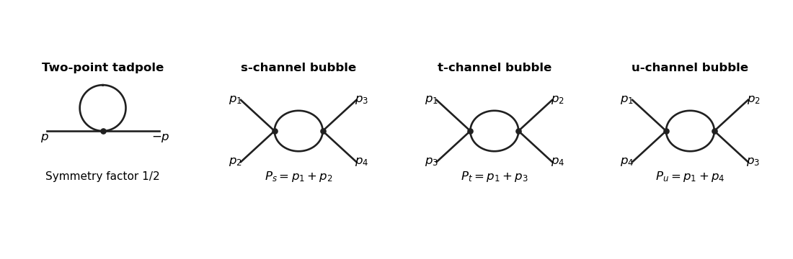

<h1 id="2/solution">Solution</h1>

↑ **Parent:** [2](../2.md)

Use the [metric signature](../../../../../metric-signature.md) $(-,+,\ldots,+)$, so $p^2=-p_0^2+\mathbf p^2$, and the weight $e^{iS}$. The momentum-space [Feynman rules](../../../../../feynman-rule.md) for the massless [Phi-fourth theory](../../../../../quartic-interaction.md) are: an internal scalar line contributes $-i/(k^2-i\epsilon)$; a quartic [interaction vertex](../../../../../interaction-vertex.md) contributes $-i\lambda$ with its momentum-conservation delta function; every independent loop is integrated with $d^dk/(2\pi)^d$; and each graph is multiplied by its [Feynman-diagram symmetry factor](../../../../../feynman-diagram-symmetry-factor.md). All external [momenta](../../../../../momentum.md) can be taken incoming. These rules follow by expanding the interaction exponential and contracting free fields with the [Wick theorem](../../../../../wick-s-theorem.md).

For a connected graph with $I$ internal lines, $V$ [interaction vertices](../../../../../interaction-vertex.md) and $L$ loops,

$$
4V=2I+n,\qquad L=I-V+1,\qquad
D=dL-2I=d+(d-4)V-\frac{d-2}{2}n.
$$

Here $D$ is the [superficial degree of divergence](../../../../../superficial-degree-of-divergence.md). In four dimensions,

$$
\boxed{D=4-n.}
$$

Odd $n$ vanish by [Z2 symmetry](../../../../../z2-symmetry.md). Thus only the nonvacuum two-point and four-point [one-particle-irreducible Feynman diagrams](../../../../../one-particle-irreducible-feynman-diagram.md) can have overall ultraviolet divergences: degree two for $n=2$, degree zero for $n=4$. Vacuum graphs with $n=0$ may also diverge but cancel from normalized correlators. This is an overall power-counting statement; subgraphs must be subtracted before using it to conclude finiteness for $n\ge6$.

For the full [one-particle-irreducible vertices](../../../../../one-particle-irreducible-vertex.md), the tree-level quadratic kernel and quartic interaction give

$$
\boxed{\widehat\tau_2^{(0)}(p,-p)=-p^2,\qquad \widehat\tau_4^{(0)}=-\lambda.}
$$

If $\widehat\tau_2$ is instead reserved for interaction-generated [self-energy](../../../../../self-energy.md) insertions, its tree value is zero and $-p^2$ is displayed separately as the free inverse kernel. The distinction is only that convention; the loop insertions below are unchanged.

The requested one-loop diagrams are the two-point [tadpole diagram](../../../../../tadpole-diagram.md) and the three four-point [bubble diagrams](../../../../../bubble-diagram.md). Each has symmetry factor $1/2$. The three bubble channels correspond to $P_s=p_1+p_2$, $P_t=p_1+p_3$, $P_u=p_1+p_4$.

**[Figure 1](#2/image-one-loop-tadpole-and-the-three-four-point-bubble-channels-in-massless-phi-fourth-theory). One-loop tadpole and the three four-point bubble channels in massless phi-fourth theory**.

The tadpole insertion obeys

$$
i\widehat\tau_2^{(1)}=\frac{-i\lambda}{2}\int\frac{d^dk}{(2\pi)^d}\frac{-i}{k^2-i\epsilon}.
$$

In massless [dimensional regularization](../../../../../dimensional-regularization.md) this scaleless integral is zero. A mass or cutoff regulator exposes the [ultraviolet divergence](../../../../../ultraviolet-divergence.md) allowed by power counting; its vanishing in the scaleless convention does not remove the need to include this diagram.

For a bubble, the vertex and [quantum field theory propagator](../../../../../propagator.md) factors give $(-i\lambda)^2(-i)^2/2=\lambda^2/2$. The PDF defines $f$ with the factor $1/i$ outside the Minkowski integral, so the integral itself is $if(P^2)$. Therefore

$$
\boxed{\widehat\tau_4=-\lambda+\frac{\lambda^2}{2}
\bigl[f(P_s^2)+f(P_t^2)+f(P_u^2)\bigr]+O(\lambda^3).}
$$

The converted TeX misplaces this $i$ as though it were part of the exponent of $(2\pi)$; keeping the printed $1/i$ is essential to this real pole coefficient.

For nonexceptional Euclidean external [momentum](../../../../../momentum.md), [Wick rotation](../../../../../wick-rotation.md) cancels that factor $1/i$. Use a [Feynman parameter](../../../../../feynman-parameter.md) and translate the integration variable:

$$
f_d(P^2)=\int_0^1dx\int\frac{d^d\ell}{(2\pi)^d}
\frac1{\bigl(\ell^2+x(1-x)P^2\bigr)^2}
=\frac{\Gamma(2-d/2)}{(4\pi)^{d/2}}\int_0^1dx\,[x(1-x)P^2]^{d/2-2}.
$$

For example, represent the inverse square as $\int_0^\infty d\alpha\,\alpha e^{-\alpha(\ell^2+\Delta)}$, do the Gaussian [momentum](../../../../../momentum.md) integral, and then use the [Gamma function](../../../../../gamma-function.md). This also derives the formula rather than assuming a loop-integration table. At $d=4-\varepsilon$, $\Gamma(\varepsilon/2)=2/\varepsilon+O(1)$ and the parameter integral tends to one, giving

$$
\boxed{f_d(P^2)=\frac1{16\pi^2}\frac2{4-d}+O(1).}
$$

Take $P^2>0$ before continuation back to Minkowski [momenta](../../../../../momentum.md). At $P=0$, a massless scaleless integral mixes ultraviolet and infrared issues, so it cannot be used to read off this pole.

Introduce a [renormalization scale](../../../../../renormalization-scale.md) $\mu$ and a quartic [counterterm](../../../../../counterterm.md). With $\lambda$ denoting a dimensionless renormalized [coupling constant](../../../../../coupling-constant-physics.md),

$$
\lambda_B=\mu^{\varepsilon}(\lambda+\delta\lambda),\qquad
\delta\lambda=\frac{3\lambda^2}{16\pi^2\varepsilon}+O(\lambda^3).
$$

After factoring out $\mu^\varepsilon$ from the vertex, each loop contains $\mu^\varepsilon f_d$. The [counterterm](../../../../../counterterm.md) contributes $-\delta\lambda$ to $\widehat\tau_4$ and cancels the pole from all three channels. More explicitly,

$$
\mu^\varepsilon f_d(P^2)=\frac1{16\pi^2}
\left[\frac2\varepsilon-\gamma_E+\log4\pi+2-\log\frac{P^2}{\mu^2}\right]+O(\varepsilon).
$$

In [modified minimal subtraction](../../../../../modified-minimal-subtraction-scheme.md), replace the pole-only counterterm by

$$
\delta\lambda_{\overline{\mathrm{MS}}}=\frac{3\lambda^2}{32\pi^2}
\left(\frac2\varepsilon-\gamma_E+\log4\pi\right)+O(\lambda^3),
$$

which subtracts the first three terms inside the brackets. The finite [renormalized quartic scalar vertex](../../../../../renormalized-quartic-scalar-vertex.md) is then

$$
\boxed{\widehat\tau_{4,R}=-\lambda+\frac{\lambda^2}{32\pi^2}
\sum_{r=s,t,u}\left[2-\log\frac{P_r^2}{\mu^2}\right]+O(\lambda^3).}
$$

Another [renormalization condition](../../../../../renormalization-condition.md) can change the finite constant, but not the pole cancellation or the momentum-dependent logarithms. The corresponding timelike expressions follow by the same Feynman continuation.

## ↑ Ancestors (10)

1. [2](../2.md)
2. [Paper 50](../../paper-50-split.md)
3. [Iii](../../split.md)
4. [2012](../../../split.md)
5. [Past exam of the mathematics course of the University of Cambridge](../../../../split.md)
6. [Mathematics course of the University of Cambridge](../../../../../mathematics-course-of-the-university-of-cambridge.md)
7. [Course of the University of Cambridge](../../../../../course-of-the-university-of-cambridge.md)
8. [University of Cambridge](../../../../../university-of-cambridge-split.md)
9. [List of universities](../../../../../list-of-universities.md)
10. [Codex Wiki](../../../../../split.md)
