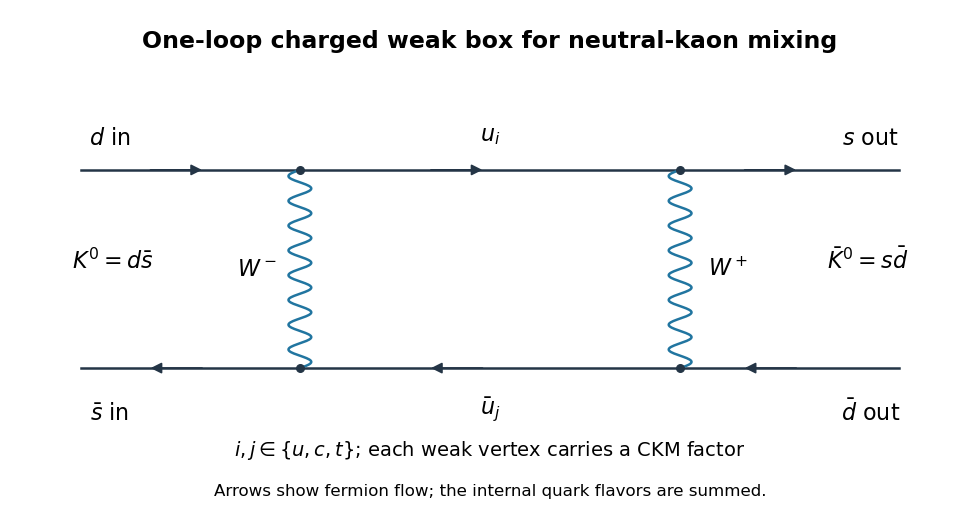

# Paper 52

↑ **Parent:** [Iii](../iii.md)

[https://www.maths.cam.ac.uk/postgrad/part-iii/files/pastpapers/2012/paper_52.pdf](https://www.maths.cam.ac.uk/postgrad/part-iii/files/pastpapers/2012/paper_52.pdf)

**Table of contents**

- [1](#1)
  - [Solution](#1/solution)
- [2](#2)
  - [Solution](#2/solution)
- [3](#3)
  - [Solution](#3/solution)
- [4](#4)
  - [Solution](#4/solution)

## 1

↑ **Parent:** [Paper 52](paper-52.md)

<h3 id="1/solution">Solution</h3>

↑ **Parent:** [1](#1)

Use metric signature $+---$ and the [parity](../../../quantum-mechanics.md#parity) matrix $P^\mu{}_{\nu}=\operatorname{diag}(1,-1,-1,-1)$. If a [Dirac field](../../../relativistic-quantum-field.md#dirac-field) transforms as $\psi'(x)=\eta_P S_P\psi(x_P)$, the chain rule changes the spatial derivatives' signs. Covariance of its [Dirac equation](../../../relativistic-quantum-field.md#dirac-equation) therefore requires

$$
S_P^{-1}\gamma^0S_P=\gamma^0,\qquad S_P^{-1}\gamma^iS_P=-\gamma^i.
$$

The [Clifford algebra](../../../algebra.md#clifford-algebra) gives precisely these identities for $S_P=\gamma^0$. In an irreducible Dirac representation any other solution differs by a scalar phase, because its ratio with $\gamma^0$ commutes with all [gamma matrices](../../../algebra.md#gamma-matrices). With $|\eta_P|=1$, the Dirac [mass](../../../classical-mechanics.md#mass) bilinear and [kinetic term](../../../quantum-field-theory.md#kinetic-term) consequently obey

$$
\bar\psi'(x)\psi'(x)=\bar\psi(x_P)\psi(x_P),\qquad
\bar\psi'(x)i\gamma^\mu\partial_\mu\psi'(x)
=\bar\psi(x_P)i\gamma^\mu\partial_\mu\psi(x_P).
$$

**The factor $\gamma^0$ compensates the sign reversal of spatial derivatives.** A transformation containing only the argument change would not preserve the massive [Dirac equation](../../../relativistic-quantum-field.md#dirac-equation). This establishes [parity](../../../quantum-mechanics.md#parity) symmetry of the free or vector-coupled Dirac theory; it does not make a chiral [weak interaction](../../../standard-model.md#weak-interaction) [parity](../../../quantum-mechanics.md#parity) symmetric.

For [charge conjugation](../../../quantum-field-theory.md#charge-conjugation), transpose the adjoint [Dirac equation](../../../relativistic-quantum-field.md#dirac-equation) to obtain $(i\gamma^{\mu T}\partial_\mu+m)\bar\psi^T=0$. Multiplying by $C$ gives the original [Dirac equation](../../../relativistic-quantum-field.md#dirac-equation) for $\psi^c=C\bar\psi^T$ if

$$
\boxed{C\gamma^{\mu T}C^{-1}=-\gamma^\mu,\qquad
C^{-1}\gamma^\mu C=-\gamma^{\mu T}.}
$$

One may choose $C$ unitary; in four dimensions a conventional choice in a standard Dirac or chiral basis is $C=i\gamma^2\gamma^0$, with $C^T=-C$. Its overall phase and $\eta_C$ do not affect the following bilinear transformation. Reordering the Grassmann [fermion](../../../quantum-mechanics.md#fermion) fields gives, for a color matrix $X$ commuting with the [gamma matrices](../../../algebra.md#gamma-matrices),

$$
\overline{\psi^c}\gamma^\mu X\psi^c=-\bar\psi\gamma^\mu X^T\psi.
$$

Thus a vector color current changes sign and transposes its color generator under [charge conjugation](../../../quantum-field-theory.md#charge-conjugation).

Write the Hermitian color connection as $\mathcal A_\mu=A_\mu^aT^a$. The interaction coming from $D_\mu=\partial_\mu+ig\mathcal A_\mu$ is $-g\bar\psi\gamma^\mu\mathcal A_\mu\psi$. Its charge-conjugation symmetry requires $\mathcal A_\mu^C=-\mathcal A_\mu^T$. [Parity](../../../quantum-mechanics.md#parity) acts on the Lorentz index as on a vector connection, so combining the two gives

$$
\boxed{\mathcal A_\mu^{CP}(x)=-P_\mu{}^\nu\mathcal A_\nu^T(x_P).}
$$

In components, $\mathcal A_0\mapsto-\mathcal A_0^T(x_P)$ and $\mathcal A_i\mapsto+\mathcal A_i^T(x_P)$. The transpose is a color-space transpose, independent of the spinor matrix $C$. Intrinsic [fermion](../../../quantum-mechanics.md#fermion) phases cancel between a field and its adjoint.

Define the matrix [gauge field strength](../../../relativistic-quantum-field.md#gauge-field-strength) unambiguously by

$$
\mathcal F_{\mu\nu}=\partial_\mu\mathcal A_\nu-\partial_\nu\mathcal A_\mu+ig[\mathcal A_\mu,\mathcal A_\nu].
$$

The derivative terms transform with the expected [parity](../../../quantum-mechanics.md#parity) factors and a minus transpose. For the commutator, the crucial identity is $[X^T,Y^T]=-[X,Y]^T$, so the nonlinear term has the same transformation as the derivative terms. This is the [CP transformation of non-Abelian field strength](../../../relativistic-quantum-field.md#cp-transformation-of-non-abelian-field-strength):

$$
\boxed{\mathcal F_{\mu\nu}^{CP}(x)=-P_\mu{}^\alpha P_\nu{}^\beta\mathcal F_{\alpha\beta}^T(x_P).}
$$

For example, $\mathcal F_{0i}\mapsto+\mathcal F_{0i}^T(x_P)$ while $\mathcal F_{ij}\mapsto-\mathcal F_{ij}^T(x_P)$. With $\operatorname{tr}(T^aT^b)=\frac12\delta^{ab}$, the color sum in the theta operator is twice a [trace](../../../linear-algebra.md#matrix-trace) of two field strengths. The two charge-conjugation minus signs cancel, and transposition reverses the [trace](../../../linear-algebra.md#matrix-trace) factors without changing their [trace](../../../linear-algebra.md#matrix-trace). The four [parity](../../../quantum-mechanics.md#parity) matrices contracted with the [Levi-Civita symbol](../../../calculus.md#levi-civita-symbol) contribute $\det P=-1$. Hence

$$
\boxed{\left[\epsilon^{\mu\nu\rho\sigma}F_{\mu\nu}^aF_{\rho\sigma}^a\right]^{CP}(x)
=-\epsilon^{\mu\nu\rho\sigma}F_{\mu\nu}^aF_{\rho\sigma}^a(x_P).}
$$

**The theta operator is [CP](../../../quantum-field-theory.md#cp-symmetry) odd; a generic fixed nonzero coefficient violates [CP](../../../quantum-field-theory.md#cp-symmetry).** Setting the coefficient to zero removes this term. Although the density is locally a total derivative, nontrivial gauge topology means that it need not be irrelevant to the quantum theory. If a properly normalized theta angle is identified periodically, invariance at special values equivalent to their negatives is a separate global question; it does not change the [CP](../../../quantum-field-theory.md#cp-symmetry) odd transformation of the local operator.

## 2

↑ **Parent:** [Paper 52](paper-52.md)

<h3 id="2/solution">Solution</h3>

↑ **Parent:** [2](#2)

A stable symmetry-breaking minimum requires $\lambda>0$ and $m^2<0$. Put $v^2=-m^2/\lambda>0$. The common [scalar potential](../../../quantum-field-theory.md#scalar-potential) can then be written, up to a constant, as

$$
V=\frac\lambda4(\Phi\cdot\Phi-v^2)^2.
$$

Its minima form the sphere $\Phi\cdot\Phi=v^2$. Choose the vacuum direction $\Phi_0=(0,0,v)^T$. If instead $m^2>0$ with positive $\lambda$, the minimum is at the origin and the assumed nonzero [vacuum expectation value](../../../quantum-field-theory.md#vacuum-expectation-value) is not a stable vacuum of these models.

In the ungauged theory, the internal symmetry is global $O(3)$; its connected part is $SO(3)$. Constant [orthogonal](../../../linear-algebra.md#orthogonal-vectors) transformations preserve both the [kinetic term](../../../quantum-field-theory.md#kinetic-term) and the potential. The chosen vacuum is invariant under $O(2)$ acting on its first two components, so the continuous breaking is $SO(3)\to SO(2)$ with two broken generators. The vacuum orientations are genuinely different degenerate global vacua.

The [global triplet scalar symmetry breaking](../../../quantum-field-theory.md#global-triplet-scalar-symmetry-breaking) is visible directly in the fluctuation masses. Write $\Phi=(\pi_1,\pi_2,v+h)^T$. The potential Hessian is

$$
\left.\frac{\partial^2V}{\partial\Phi_a\partial\Phi_b}\right|_{\Phi_0}
=(m^2+\lambda v^2)\delta_{ab}+2\lambda\Phi_{0a}\Phi_{0b}
=\operatorname{diag}(0,0,2\lambda v^2).
$$

The quadratic Lagrangian is therefore

$$
\mathcal L_1^{(2)}=\frac12(\partial h)^2+\frac12(\partial\pi_1)^2+\frac12(\partial\pi_2)^2-\frac12(2\lambda v^2)h^2.
$$

**There is one radial scalar of [mass](../../../classical-mechanics.md#mass) $m_h^2=2\lambda v^2=-2m^2$ and two massless [Goldstone bosons](../../../critical-phenomenon.md#goldstone-boson).** The two Goldstone modes describe motion tangential to the vacuum sphere. They remain physical, since a global rotation has only constant parameters and cannot remove arbitrary spacetime-dependent fluctuations. All three original real-scalar degrees of freedom remain. Interactions persist: the shifted potential is $V-V_{\min}=\frac\lambda4(2vh+h^2+\pi_1^2+\pi_2^2)^2$, containing cubic and quartic terms. Masslessness of the angular modes is protected by the exact continuous symmetry through Goldstone's theorem.

In the gauged theory, the three-component real field is the vector representation of local $SO(3)$, equivalently the [Adjoint representation](../../../lie-algebra.md#adjoint-representation-of-a-lie-algebra) of $SU(2)$. The center of $SU(2)$ acts trivially on this field, so both descriptions have the same local field content and perturbative spectrum. Take $(t^a)_{bc}=-i\epsilon^{abc}$, for which $[t^a,t^b]=i\epsilon^{abc}t^c$. The covariant [kinetic term](../../../quantum-field-theory.md#kinetic-term) and the gauge [kinetic term](../../../quantum-field-theory.md#kinetic-term) are invariant under local transformations with the associated connection transformation. The scalar inversion $\Phi\mapsto-\Phi$, with the [gauge field](../../../relativistic-quantum-field.md#gauge-field) unchanged, is also a discrete invariance of the displayed action.

The vacuum leaves rotations about its third axis unbroken. The residual gauge group is $SO(2)$, or the corresponding $U(1)$ subgroup in the $SU(2)$ description. Expanding the covariant [kinetic term](../../../quantum-field-theory.md#kinetic-term) about $\Phi_0$ gives

$$
\frac12(D_\mu\Phi_0)\cdot(D^\mu\Phi_0)
=\frac12g^2v^2\left(B_\mu^1B^{1\mu}+B_\mu^2B^{2\mu}\right).
$$

Thus the [gauge-boson mass matrix](../../../relativistic-quantum-field.md#gauge-boson-mass-matrix) is $g^2v^2\operatorname{diag}(1,1,0)$. The third generator annihilates the vacuum, while the first two do not. **The masses are $m_{B^1}=m_{B^2}=gv$, $m_{B^3}=0$, and $m_h=\sqrt{2\lambda}\,v$.**

The quadratic derivative mixing displays what happens to the Goldstone fields. With the generator convention just chosen,

$$
(D_\mu\Phi)_1=\partial_\mu\pi_1-gvB_\mu^2+\cdots,\quad
(D_\mu\Phi)_2=\partial_\mu\pi_2+gvB_\mu^1+\cdots,\quad
(D_\mu\Phi)_3=\partial_\mu h+\cdots.
$$

Local rotations can set the two angular fields to zero in [unitary gauge](../../../standard-model.md#unitary-gauge). Then $\Phi=(0,0,v+h)^T$ and

$$
\mathcal L_{\rm scalar}=\frac12(\partial h)^2
+\frac12g^2(v+h)^2\left[(B^1)^2+(B^2)^2\right]-V(v+h).
$$

The two Goldstone modes supply the [longitudinal polarizations](../../../wave-equation.md#longitudinal-polarization) of the two massive vector bosons. They do not survive as additional physical massless scalars. The radial scalar is still physical, and $B^3$ retains only two [transverse polarizations](../../../wave-equation.md#transverse-polarization). This [adjoint triplet Higgs spectrum](../../../standard-model.md#adjoint-triplet-higgs-spectrum) realizes the [Higgs mechanism](../../../standard-model.md#higgs-mechanism); the gauge group is only partially broken, so one massless [gauge boson](../../../relativistic-quantum-field.md#gauge-boson) remains.

The degree-of-freedom check is

$$
\boxed{\text{before: }3+3\times2=9,\qquad
\text{after: }1+2\times3+1\times2=9.}
$$

In contrast, the global theory has just the three scalar modes, including its two physical [Goldstone bosons](../../../critical-phenomenon.md#goldstone-boson). A [vacuum expectation value](../../../quantum-field-theory.md#vacuum-expectation-value) in the local theory is a choice of gauge-fixed description: the direction can be changed by [gauge transformations](../../../electromagnetism.md#gauge-transformation) and is not itself an observable. Gauge-independent masses and the physical degree count express the actual effect. Both theories retain Lorentz symmetry in the constant scalar vacuum.

## 3

↑ **Parent:** [Paper 52](paper-52.md)

<h3 id="3/solution">Solution</h3>

↑ **Parent:** [3](#3)

Put $s_W=\sin\theta_W$ and $c_W=\cos\theta_W$. The left-handed doublet has

$$
T_L^3=\begin{pmatrix}\frac12&0\\0&-\frac12\end{pmatrix},\qquad
Q_L=\begin{pmatrix}0&0\\0&-1\end{pmatrix},
$$

while the right-handed charged-[lepton](../../../standard-model.md#lepton) singlet has $T_R^3=0$ and $Q_R=-1$. There is no weakly coupled right-handed [neutrino](../../../standard-model.md#neutrino) in the stated field content. For a [fermion](../../../quantum-mechanics.md#fermion) $f$, write $g_L^f=T_{3L}^f-Q_fs_W^2$ and $g_R^f=T_{3R}^f-Q_fs_W^2$, with $g_R^\nu=0$ here. Since $\bar f_L\gamma^\mu f_L=\bar f\gamma^\mu P_Lf$ and similarly for $R$,

$$
\bar f\gamma^\mu(g_L^fP_L+g_R^fP_R)f
=\bar f\gamma^\mu(c_V^f-c_A^f\gamma^5)f,
\quad c_V^f=\frac{g_L^f+g_R^f}{2},\quad c_A^f=\frac{g_L^f-g_R^f}{2}.
$$

Consequently the [neutral-current vector and axial couplings](../../../standard-model.md#neutral-current-vector-and-axial-couplings) in the specified overall normalization are

$$
\boxed{c_V^\ell=-\frac14+s_W^2,\qquad c_A^\ell=-\frac14,\qquad
c_V^\nu=c_A^\nu=\frac14.}
$$

These coefficients accompany $g/c_W$. A convention with $g/(2c_W)$ uses twice these vector and axial coefficients; mixing the two conventions would make the widths wrong by a factor of four. For the [neutrino](../../../standard-model.md#neutrino), $c_V-c_A\gamma^5=\frac12P_L$, so the chiral projection is already built into the vertex.

For either massless final pair with momenta $k_1,k_2$, $p=k_1+k_2$, the invariant amplitude is, up to an irrelevant overall phase,

$$
\mathcal M_f=\frac g{c_W}\epsilon_\mu(p)\bar u_f(k_1)\gamma^\mu(c_V^f-c_A^f\gamma^5)v_f(k_2).
$$

The [spin](../../../quantum-mechanics.md#spin)-summed [fermion](../../../quantum-mechanics.md#fermion) tensor is

$$
T_f^{\mu\nu}=\operatorname{tr}\!\left[\not k_1\gamma^\mu(c_V^f-c_A^f\gamma^5)
\not k_2\gamma^\nu(c_V^f-c_A^f\gamma^5)\right].
$$

The symmetric part, using the four-gamma [trace](../../../linear-algebra.md#matrix-trace), is

$$
(T_f^{\mu\nu})_{\rm sym}=4[(c_V^f)^2+(c_A^f)^2]
\left(k_1^\mu k_2^\nu+k_1^\nu k_2^\mu-\eta^{\mu\nu}k_1\cdot k_2\right).
$$

The vector-axial interference is antisymmetric in $\mu,\nu$, so it drops out of the symmetric $Z$ polarization sum. Also $p_\mu T_f^{\mu\nu}=0$ for massless external [fermions](../../../quantum-mechanics.md#fermion), by their [Dirac equations](../../../relativistic-quantum-field.md#dirac-equation); hence the $p_\mu p_\nu/m_Z^2$ part contributes zero. Using $k_1\cdot k_2=m_Z^2/2$ gives

$$
\boxed{\overline{|\mathcal M_f|^2}
=\frac{g^2}{3c_W^2}(-\eta_{\mu\nu})T_f^{\mu\nu}
=\frac{4g^2m_Z^2}{3c_W^2}[(c_V^f)^2+(c_A^f)^2].}
$$

The [massive-vector spin average](../../../relativistic-quantum-field.md#massive-vector-spin-average) supplies the factor $1/3$ for the three [spin](../../../quantum-mechanics.md#spin) states of the massive $Z$. The massless [two-body Lorentz-invariant phase space](../../../relativistic-quantum-field.md#two-body-lorentz-invariant-phase-space) is $d\Phi_2=d\Omega/(32\pi^2)$, and so $\int d\Phi_2=1/(8\pi)$. The [spin](../../../quantum-mechanics.md#spin)-averaged amplitude above is angle-independent in the rest frame, giving

$$
\boxed{\Gamma_f=\frac{g^2m_Z}{12\pi c_W^2}[(c_V^f)^2+(c_A^f)^2].}
$$

The [massless leptonic Z decay widths](../../../standard-model.md#massless-leptonic-z-decay-width) for one charged-[lepton](../../../standard-model.md#lepton) flavor and one active [neutrino](../../../standard-model.md#neutrino) flavor respectively are

$$
\boxed{\Gamma(Z\to\ell\bar\ell)=\frac{g^2m_Z}{96\pi c_W^2}
(1-4s_W^2+8s_W^4),\qquad
\Gamma(Z\to\nu\bar\nu)=\frac{g^2m_Z}{96\pi c_W^2}.}
$$

There is no color factor for [leptons](../../../standard-model.md#lepton) and no extra final-state identical-particle factor for a particle-antiparticle pair. The [neutrino](../../../standard-model.md#neutrino) projectors already exclude sterile helicity states, so no additional factor of two is needed. These are tree-level massless widths; electroweak radiative corrections and charged-[lepton](../../../standard-model.md#lepton) masses have not been included. If desired, using $G_F=g^2/(4\sqrt2m_W^2)$ and $m_W=c_Wm_Z$ converts the common prefactor to $G_Fm_Z^3/(12\sqrt2\pi)$.

## 4

↑ **Parent:** [Paper 52](paper-52.md)

<h3 id="4/solution">Solution</h3>

↑ **Parent:** [4](#4)

The flavor content is $K^0=d\bar s$ and $\bar K^0=s\bar d$. A charged-current [box diagram](../../../perturbative-quantum-field-theory.md#box-diagram) changes [strangeness](../../../standard-model.md#strangeness) by two units. The two internal [quark](../../../standard-model.md#quark) lines can contain any up-type flavors $u_i,u_j\in\{u,c,t\}$, connected by two charged $W$ propagators. One allowed topology is shown below; its crossed counterpart also contributes to the full mixing amplitude.

**[Figure 1](#4/image-charged-weak-box-diagram-converting-a-neutral-kaon-into-its-antikaon). Charged weak box diagram converting a neutral kaon into its antikaon**.

Each charged-current vertex contains the appropriate [CKM matrix](../../../standard-model.md#cabibbo-kobayashi-maskawa-matrix) element. The flavor sum has combinations $\lambda_i\lambda_j$, with $\lambda_i=V_{is}^*V_{id}$, multiplying [mass](../../../classical-mechanics.md#mass)-dependent loop functions. [CKM matrix](../../../standard-model.md#cabibbo-kobayashi-maskawa-matrix) unitarity gives $\sum_i\lambda_i=0$, illustrating the GIM cancellation of flavor-independent loop terms. The diagram is at order $g^4$ and second order in the [weak interaction](../../../standard-model.md#weak-interaction).

Let $\Theta$ be the antiunitary [CPT](../../../quantum-field-theory.md#cpt-symmetry) operator. It interchanges the neutral-[kaon](../../../physics.md#kaon) flavor states up to phases. For a Hermitian [Hamiltonian](../../../classical-mechanics.md#hamiltonian) invariant under [CPT](../../../quantum-field-theory.md#cpt-symmetry),

$$
\langle\Theta K^0|H'|\Theta K^0\rangle
=\langle K^0|\Theta^{-1}H'\Theta|K^0\rangle^*
=\langle K^0|H'|K^0\rangle,
$$

since the diagonal expectation is real. Therefore **[CPT](../../../quantum-field-theory.md#cpt-symmetry) gives $R_{11}=R_{22}$.** More generally an effective decay [Hamiltonian](../../../classical-mechanics.md#hamiltonian) has $R=M-i\Gamma/2$, where both $M$ and $\Gamma$ are Hermitian. [CPT](../../../quantum-field-theory.md#cpt-symmetry) gives $M_{11}=M_{22}$ and $\Gamma_{11}=\Gamma_{22}$, hence the same equality of the complex diagonal entries. It does not require $R_{12}=R_{21}$; that is a [CP](../../../quantum-field-theory.md#cp-symmetry) condition. Nor is $R_{21}=R_{12}^*$ true for the full decay matrix in general.

Choose the [CP](../../../quantum-field-theory.md#cp-symmetry) convention $CP|K^0\rangle=-|\bar K^0\rangle$ and $CP|\bar K^0\rangle=-|K^0\rangle$. Then [CP](../../../quantum-field-theory.md#cp-symmetry) acts as $-\sigma_x$ on the flavor basis. Invariance of $H'$ means $R=\sigma_xR\sigma_x$, and therefore

$$
\boxed{\text{CP invariance: }R_{12}=R_{21}.}
$$

With a different flavor-state phase convention this relation carries the corresponding phase factors; equality is the relation in the convention adopted here. For a Hermitian [mass matrix](../../../numerical-analysis.md#mass-matrix) it makes the off-diagonal element real.

For the requested production-time [mass eigenstates](../../../numerical-analysis.md#mass-eigenstate), discard the absorptive part. From now on $R$ denotes the Hermitian part $(R_{\rm original}+R_{\rm original}^\dagger)/2$, so its entries have the form

$$
R=\begin{pmatrix}r_0&z\\z^*&r_0\end{pmatrix},\qquad r_0\in\mathbb R,\quad z\ne0.
$$

If the original matrix already was Hermitian no replacement is needed. The [neutral-kaon mass matrix diagonalization](../../../physics.md#neutral-kaon-mass-matrix-diagonalization) gives [eigenvalues](../../../linear-operator-theory.md#eigenvalue) $r_0\pm|z|$, since $(r_0-\lambda)^2-|z|^2=0$. Write $z=r e^{i\varphi}$, $r=|z|>0$. Use the [kaon mixing square-root branch convention](../../../physics.md#kaon-mixing-square-root-branch-convention)

$$
a=\sqrt{R_{12}}=\sqrt r\,e^{i\varphi/2},\qquad
b=\sqrt{R_{21}}=\sqrt r\,e^{-i\varphi/2},\qquad ab=r,
$$

continuously from the [CP](../../../quantum-field-theory.md#cp-symmetry)-conserving convention in which $z>0$. Independent unrelated root signs would interchange the [eigenvalue](../../../linear-operator-theory.md#eigenvalue) labels. Direct multiplication gives $R(a,-b)^T=(r_0-r)(a,-b)^T$ and $R(a,b)^T=(r_0+r)(a,b)^T$. Assigning the larger [mass](../../../classical-mechanics.md#mass) to $K_L^0$ gives

$$
\boxed{|K_S^0\rangle=\frac{a|K^0\rangle-b|\bar K^0\rangle}{\sqrt{2r}},\qquad
|K_L^0\rangle=\frac{a|K^0\rangle+b|\bar K^0\rangle}{\sqrt{2r}},}
$$

with [mass](../../../classical-mechanics.md#mass) shifts $r_0-r$ and $r_0+r$ respectively. A common strong-interaction [mass](../../../classical-mechanics.md#mass) may simply be added to both. Their norms are one and their inner product is zero. A Hermitian [mass](../../../classical-mechanics.md#mass)-only calculation determines the lighter and heavier combinations; it does not determine their different lifetimes.

In the [CP](../../../quantum-field-theory.md#cp-symmetry)-conserving limit, the chosen lighter and heavier combinations are

$$
\boxed{|K_1^0\rangle=\frac{|K^0\rangle-|\bar K^0\rangle}{\sqrt2},\qquad
|K_2^0\rangle=\frac{|K^0\rangle+|\bar K^0\rangle}{\sqrt2}.}
$$

They are [CP eigenstates](../../../quantum-field-theory.md#cp-eigenstate) with [eigenvalues](../../../linear-operator-theory.md#eigenvalue) $+1$ and $-1$ in the convention above. The sign of the real off-diagonal entry and the flavor-state convention are chosen together so that the stated $K_1^0=K_S^0$ limit is the lower-[mass](../../../classical-mechanics.md#mass) state.

Changing to this [CP](../../../quantum-field-theory.md#cp-symmetry) basis gives

$$
\begin{aligned}
a|K^0\rangle-b|\bar K^0\rangle
&=\frac{a+b}{\sqrt2}|K_1^0\rangle+\frac{a-b}{\sqrt2}|K_2^0\rangle,\\
a|K^0\rangle+b|\bar K^0\rangle
&=\frac{a+b}{\sqrt2}|K_2^0\rangle+\frac{a-b}{\sqrt2}|K_1^0\rangle.
\end{aligned}
$$

Consequently, provided $a+b\ne0$, define

$$
\boxed{\epsilon=\frac{a-b}{a+b}
=\frac{\sqrt{R_{12}}-\sqrt{R_{21}}}{\sqrt{R_{12}}+\sqrt{R_{21}}}.}
$$

Absorbing the common phase of $a+b$ into the definitions of the [mass eigenstates](../../../numerical-analysis.md#mass-eigenstate) and normalizing now yields

$$
\boxed{|K_S^0\rangle=\frac{|K_1^0\rangle+\epsilon|K_2^0\rangle}{\sqrt{1+|\epsilon|^2}},\qquad
|K_L^0\rangle=\frac{|K_2^0\rangle+\epsilon|K_1^0\rangle}{\sqrt{1+|\epsilon|^2}}.}
$$

For this Hermitian approximation, $\epsilon=i\tan(\varphi/2)$ is purely imaginary, so $\langle K_S^0|K_L^0\rangle=(\epsilon+\epsilon^*)/(1+|\epsilon|^2)=0$. The phase convention matters for the [kaon CP mixing parameter](../../../physics.md#kaon-cp-mixing-parameter). Physical [kaon](../../../physics.md#kaon) decay eigenstates instead diagonalize the generally non-[Hermitian matrix](../../../hilbert-space.md#hermitian-operator) $M-i\Gamma/2$, for which the mixing parameter can have a real part and the eigenstates need not be [orthogonal](../../../linear-algebra.md#orthogonal-vectors). The formula here is the requested [mass](../../../classical-mechanics.md#mass)-only result, not a calculation of that full decay dynamics.

## ↑ Ancestors (8)

1. [Iii](../iii.md)
2. [2012](../../2012.md)
3. [Past exam of the mathematics course of the University of Cambridge](../../../past-exam-of-the-mathematics-course-of-the-university-of-cambridge.md)
4. [Mathematics course of the University of Cambridge](../../../university-of-cambridge.md#mathematics-course-of-the-university-of-cambridge)
5. [Course of the University of Cambridge](../../../university-of-cambridge.md#course-of-the-university-of-cambridge)
6. [University of Cambridge](../../../university-of-cambridge.md)
7. [List of universities](../../../README.md#list-of-universities)
8. [Codex Wiki](../../../README.md)
