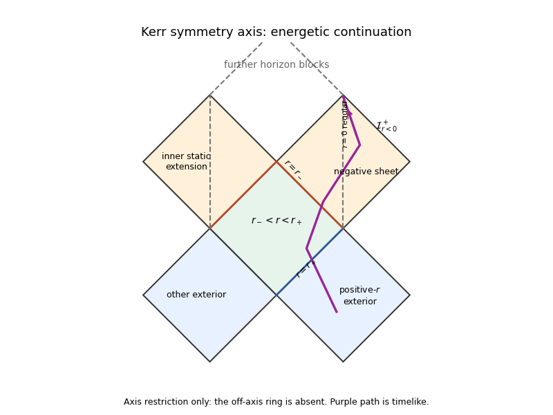

# Paper 58

↑ **Parent:** [Iii](../iii.md)

[https://www.maths.cam.ac.uk/postgrad/part-iii/files/pastpapers/2012/paper_58.pdf](https://www.maths.cam.ac.uk/postgrad/part-iii/files/pastpapers/2012/paper_58.pdf)

**Table of contents**

- [Section I](#section-i)
  - [i](#section-i/i)
    - [Solution](#section-i/i/solution)
  - [ii](#section-i/ii)
    - [Solution](#section-i/ii/solution)
  - [iii](#section-i/iii)
    - [Solution](#section-i/iii/solution)
  - [iv](#section-i/iv)
    - [Solution](#section-i/iv/solution)
  - [v](#section-i/v)
    - [Solution](#section-i/v/solution)
  - [vi](#section-i/vi)
    - [Solution](#section-i/vi/solution)
- [Section II](#section-ii)
  - [1](#1)
    - [a](#1/a)
      - [Solution](#1/a/solution)
    - [b](#1/b)
      - [Solution](#1/b/solution)
    - [c](#1/c)
      - [Solution](#1/c/solution)
    - [d](#1/d)
      - [Solution](#1/d/solution)
    - [e](#1/e)
      - [Solution](#1/e/solution)
  - [2](#2)
    - [a](#2/a)
      - [Solution](#2/a/solution)
    - [b](#2/b)
      - [Solution](#2/b/solution)
    - [c](#2/c)
      - [Solution](#2/c/solution)
    - [d](#2/d)
      - [Solution](#2/d/solution)
    - [e](#2/e)
      - [Solution](#2/e/solution)
  - [3](#3)
    - [Solution](#3/solution)

## Section I

↑ **Parent:** [Paper 58](paper-58.md)

<h3 id="section-i/i">i</h3>

↑ **Parent:** [Section I](#section-i)

<h4 id="section-i/i/solution">Solution</h4>

↑ **Parent:** [I](#section-i/i)

Use [metric signature](../../../topology.md#metric-signature) $(-,+,+,+)$ and a future-oriented worldline. Variation of the [worldline einbein](../../../classical-mechanics.md#worldline-einbein) gives the [mass-shell condition](../../../string-theory.md#string-mass-shell-condition); variation of momentum gives

$$
p^2+m^2=0,\qquad \dot x^\mu=e\,g^{\mu\nu}p_\nu.
$$

Eliminating $p$ first leaves $L=\dot x^2/(2e)-em^2/2$. Its $e$ equation is $\dot x^2=-e^2m^2$. Choose the positive lapse branch $e=\sqrt{-\dot x^2}/m$; substituting gives $L=-m\sqrt{-\dot x^2}$. **Thus $\boxed{S=-m\int\sqrt{-g_{\mu\nu}dx^\mu dx^\nu}=-m\int d\tau}$**, the [proper time](../../../special-relativity.md#proper-time) action. The lapse branch fixes the sign convention. Eliminating auxiliary variables on their algebraic equations preserves the worldline equations, which are timelike [geodesics](../../../riemannian-geometry.md#geodesic) up to parametrization.

<h3 id="section-i/ii">ii</h3>

↑ **Parent:** [Section I](#section-i)

<h4 id="section-i/ii/solution">Solution</h4>

↑ **Parent:** [Ii](#section-i/ii)

Locally write the [null hypersurface](../../../general-relativity.md#null-hypersurface) as $u=0$, $du\ne0$, with normal $\ell_\mu=f\partial_\mu u$, $f\ne0$. A vector $V$ is tangent exactly when $V(u)=0$. Nullness gives $\ell(u)=\ell^2/f=0$ on the hypersurface. **Hence $\boxed{\ell\in T\mathcal N}$**: its normal direction lies inside its tangent space.

Put $n=du$ and $q=n_\mu n^\mu$. Torsion freedom gives $n^\mu\nabla_\mu n_\nu=\tfrac12\partial_\nu q$. Since $q$ vanishes on $\mathcal N$, all tangential derivatives vanish there and $dq=C\,du$ there for a scalar $C$. Consequently

$$
\ell^\mu\nabla_\mu\ell_\nu=\left(\ell(\log|f|)+\tfrac12fC\right)\ell_\nu.
$$

This is the unparametrized [null geodesic](../../../special-relativity.md#null-geodesic) equation. The integral curves are therefore generators of $\mathcal N$. An [affine rescaling of a null normal](../../../geodesic-congruence.md#affine-rescaling-of-a-null-normal) removes the proportionality coefficient locally: if $\nabla_\ell\ell=\kappa\ell$, set $K=h\ell$ with $\ell(\log h)=-\kappa$.

<h3 id="section-i/iii">iii</h3>

↑ **Parent:** [Section I](#section-i)

<h4 id="section-i/iii/solution">Solution</h4>

↑ **Parent:** [Iii](#section-i/iii)

The [future domain of dependence](../../../general-relativity.md#future-domain-of-dependence) $D^+(\Sigma)$ consists of points through which every past-inextendible [causal curve](../../../general-relativity.md#causal-curve) meets the partial [Cauchy hypersurface](../../../general-relativity.md#cauchy-surface) $\Sigma$. Data on $\Sigma$ determine evolution there for suitable hyperbolic equations. Its future boundary is the [Cauchy horizon](../../../general-relativity.md#cauchy-horizon) $H^+(\Sigma)$; one precise definition is $\overline{D^+(\Sigma)}\setminus I^-(D^+(\Sigma))$.

For a nonextremal [Reissner-Nordstrom spacetime](../../../general-relativity.md#reissner-nordstrom-spacetime), $0<|Q|<M$, the metric function is $F=1-2M/r+Q^2/r^2$, with $r_\pm=M\pm\sqrt{M^2-Q^2}$. The outer [event horizon](../../../general-relativity.md#event-horizon) lies at $r_+$. The future trapped region leads toward the inner null surface $r_-$, a future [Cauchy horizon](../../../general-relativity.md#cauchy-horizon) for bridge data on the illustrated $\Sigma$. Beyond it some past [causal curves](../../../general-relativity.md#causal-curve) arrive from other analytic blocks or timelike singularities without meeting $\Sigma$. The [CP diagram](../../../general-relativity.md#penrose-diagram) repeats these analytic blocks; $r=0$ is a timelike [curvature singularity](../../../general-relativity.md#curvature-singularity).

**[Figure 1](#section-i/iii/image-reissner-nordstrom-conformal-block-with-bridge-data-and-future-cauchy-horizons). Reissner-Nordstrom conformal block with bridge data and future Cauchy horizons**.

Near the inner horizon, arbitrarily late exterior radiation is compressed into finite infaller [proper time](../../../special-relativity.md#proper-time). Its frequency is exponentially blueshifted, with scale $e^{|\kappa_-|v}$, so even a decaying flux can have diverging measured stress. Generic ingoing and outgoing perturbations produce [mass inflation](../../../general-relativity.md#mass-inflation), growing internal mass and curvature. **The smooth RN [Cauchy horizon](../../../general-relativity.md#cauchy-horizon) is expected to be unstable to back-reaction.** This is a generic instability argument, not a universal theorem from every specially tuned test trajectory; the approximation of a harmless test particle becomes inconsistent.

<h3 id="section-i/iv">iv</h3>

↑ **Parent:** [Section I](#section-i)

<h4 id="section-i/iv/solution">Solution</h4>

↑ **Parent:** [Iv](#section-i/iv)

A [null geodesic congruence](../../../geodesic-congruence.md#null-geodesic-congruence) is a smooth family of [null geodesics](../../../special-relativity.md#null-geodesic) filling a region without intersections there. For affine tangent $k$, the [null expansion](../../../geodesic-congruence.md#null-expansion) is the trace of the [optical tensor](../../../geodesic-congruence.md#optical-tensor): $\theta=d(\log A)/d\lambda$ for an infinitesimal pencil's area. Positive expansion means spreading; negative expansion means focusing.

For hypersurface-orthogonal generators in four dimensions, the [Null Raychaudhuri equation](../../../geodesic-congruence.md#null-raychaudhuri-equation) reads

$$
\frac{d\theta}{d\lambda}=-\tfrac12\theta^2-\sigma_{ab}\sigma^{ab}-R_{ab}k^ak^b.
$$

The [null twist](../../../geodesic-congruence.md#null-twist) vanishes. The [null energy condition](../../../general-relativity.md#null-energy-condition) implies $R_{ab}k^ak^b\geq0$ through the [Einstein field equations](../../../general-relativity.md#einstein-field-equations). An initial $\theta_0<0$ would force a focal point within affine distance at most $2/|\theta_0|$. A future-complete generator cannot develop such a point while remaining on an achronal [event horizon](../../../general-relativity.md#event-horizon). **Thus $\boxed{\theta\geq0}$** under the energy and global predictability/future-completeness hypotheses of [Hawking's area theorem](../../../general-relativity.md#hawking-s-area-theorem). Quantum energy-condition violations or failure of those global assumptions remove the conclusion.

The [event horizon](../../../general-relativity.md#event-horizon) is the global boundary $\partial J^-(\mathscr I^+)$ and depends on the whole future. An [apparent horizon](../../../general-relativity.md#apparent-horizon) on a chosen spacelike slice is the outermost marginally outer trapped surface, ordinarily $\theta_{\rm out}=0$, $\theta_{\rm in}<0$. It is quasi-local and slice-dependent; its tube need not be null.

**[Figure 2](#section-i/iv/image-ingoing-finkelstein-diagram-for-a-thin-shell-with-an-event-horizon-extending-into-flat-spacetime). Ingoing Finkelstein diagram for a thin shell with an event horizon extending into flat spacetime**.

For a shell arriving at $v=0$, the final horizon is $r=2M$. Before arrival, outgoing flat-space rays obey $dr/dv=1/2$. Tracing this horizon backward gives $r=2M+v/2$ until its beginning at $r=0$, $v=-4M$. No [apparent horizon](../../../general-relativity.md#apparent-horizon) exists in that earlier flat region, explicitly illustrating the [event horizon](../../../general-relativity.md#event-horizon)'s dependence on future collapse.

<h3 id="section-i/v">v</h3>

↑ **Parent:** [Section I](#section-i)

<h4 id="section-i/v/solution">Solution</h4>

↑ **Parent:** [V](#section-i/v)

The qualification concerns gravitational energy. Local matter energy exists: an observer $u$ measures $T_{\mu\nu}u^\mu u^\nu$. What is absent is a generally covariant local gravitational stress-energy density with the required universal conservation properties. The [Equivalence principle](../../../general-relativity.md#equivalence-principle) allows the connection to vanish at a point in freely falling coordinates; standard gravitational energy expressions depend on coordinates. Curvature does remain, but supplies no unique gravitational energy tensor of the required kind. A nonstationary geometry also lacks a preferred time-translation [Killing vector field](../../../general-relativity.md#killing-vector-field). For a trial timelike $t$, [stress-energy conservation](../../../general-relativity.md#stress-energy-conservation) gives $\nabla_\mu(T^{\mu\nu}t_\nu)=T^{\mu\nu}\nabla_{(\mu}t_{\nu)}$, not generally zero.

An internal charge instead has a current $\nabla_\mu j^\mu=0$ independently of spacetime time translations. Its hypersurface flux is conserved with suitable boundary conditions. For [electric charge](../../../electromagnetism.md#electric-charge), the [Gauss law](../../../electromagnetism.md#gauss-s-law) expresses it as a surface flux. Observer-dependent charge density does not prevent a well-defined total charge.

For an [asymptotically flat spacetime](../../../general-relativity.md#asymptotically-flat-spacetime), take asymptotically Cartesian slice coordinates with $\gamma_{ij}=\delta_{ij}+h_{ij}$ and appropriate falloff. In $c=1$ units, **the [ADM energy](../../../general-relativity.md#arnowitt-deser-misner-energy) is**

$$
\boxed{E_{\rm ADM}=\frac1{16\pi G}\lim_{r\to\infty}\int_{S_r}(\partial_jh_{ij}-\partial_ih_{jj})n^i\,dS.}
$$

It is an asymptotic gravitational energy. The [dominant energy condition](../../../general-relativity.md#dominant-energy-condition) requires $-T^\mu{}_\nu u^\nu$ to be future-directed nonspacelike or zero for every future timelike $u$, in particular $T_{\mu\nu}u^\mu u^\nu\geq0$. Together with the constraint equations, completeness and appropriate asymptotic/boundary hypotheses, it yields $E_{\rm ADM}\geq|\mathbf P_{\rm ADM}|\geq0$. The energy condition alone is not the complete positive-energy theorem.

<h3 id="section-i/vi">vi</h3>

↑ **Parent:** [Section I](#section-i)

<h4 id="section-i/vi/solution">Solution</h4>

↑ **Parent:** [Vi](#section-i/vi)

For a [Killing vector field](../../../general-relativity.md#killing-vector-field) $\xi$, set $K^{\mu\nu}=\nabla^\mu\xi^\nu=-K^{\nu\mu}$. Choose surface orientation conventions so that the [Komar charge](../../../general-relativity.md#komar-charge), up to overall normalization, is

$$
Q_\xi(V)=\tfrac12\int_{\partial V}K^{\mu\nu}\,dS_{\mu\nu}=\int_VJ_\xi^\mu\,dS_\mu,\qquad J_\xi^\mu=\nabla_\nu K^{\mu\nu}.
$$

This is the [Komar current from trace-reversed stress-energy](../../../general-relativity.md#komar-current-from-trace-reversed-stress-energy) construction. The equality is the spacetime [Stokes theorem](../../../calculus.md#stokes-theorem). With $[\nabla_\mu,\nabla_\nu]V^\rho=R^\rho{}_{\sigma\mu\nu}V^\sigma$, the [Killing equation](../../../general-relativity.md#killing-equation) and $\nabla_\nu\xi^\nu=0$ give $J_\xi^\mu=R^\mu{}_\nu\xi^\nu$. In four dimensions, at zero cosmological constant, the [Einstein field equations](../../../general-relativity.md#einstein-field-equations) give **the current**

$$
\boxed{J_\xi^\mu=8\pi G\left(T^\mu{}_\nu-\tfrac12T\delta^\mu{}_\nu\right)\xi^\nu.}
$$

Reversing orientation changes the common overall sign, not conservation. The [contracted Bianchi identity](../../../general-relativity.md#contracted-bianchi-identity) gives

$$
\nabla_\mu J_\xi^\mu=\tfrac12\xi^\nu\partial_\nu R+R^{\mu\nu}\nabla_\mu\xi_\nu=0.
$$

An isometry preserves [scalar curvature](../../../second-fundamental-form.md#scalar-curvature), and the second term contracts symmetric and antisymmetric tensors. Equivalently [stress-energy conservation](../../../general-relativity.md#stress-energy-conservation), the [Killing equation](../../../general-relativity.md#killing-equation), and $\mathcal L_\xi T=0$ cancel the matter expression; its trace derivative needs this last observation. **Hence $\boxed{\nabla_\mu J_\xi^\mu=0}$.** Nonzero cosmological constant adds $\Lambda\xi^\mu$ to the geometric current, also divergence-free.

## Section II

↑ **Parent:** [Paper 58](paper-58.md)

### 1

↑ **Parent:** [Section II](#section-ii)

<h4 id="1/a">a</h4>

↑ **Parent:** [1](#1)

<h5 id="1/a/solution">Solution</h5>

↑ **Parent:** [A](#1/a)

A [Killing horizon](../../../general-relativity.md#killing-horizon) is a [null hypersurface](../../../general-relativity.md#null-hypersurface) with a [Killing vector field](../../../general-relativity.md#killing-vector-field) $\xi$ as its normal and generator. Write $\xi=d/d\alpha$ along its orbits. These are [null geodesics](../../../special-relativity.md#null-geodesic), but their Killing parameter need not be affine:

$$
\nabla_\xi\xi=\kappa\xi.
$$

The coefficient is the [surface gravity](../../../general-relativity.md#surface-gravity) for the chosen normalization; nondegeneracy means $\kappa\ne0$. If $\lambda$ is affine and $q=d\lambda/d\alpha$, then $\xi=q\,d/d\lambda$ and $d(\log q)/d\alpha=\kappa$. For constant $\kappa$, $\lambda=\lambda_0+C e^{\kappa\alpha}$.

The [Killing equation](../../../general-relativity.md#killing-equation) yields $\partial_\mu(\xi^2)=2\xi^\nu\nabla_\mu\xi_\nu=-2\xi^\nu\nabla_\nu\xi_\mu$. On the horizon, **$\boxed{\partial_\mu\xi^2=-2\kappa\xi_\mu}$.** Multiplying $\xi$ by a positive constant multiplies $\kappa$ by that constant; physical temperature therefore needs a stated time normalization.

<h4 id="1/b">b</h4>

↑ **Parent:** [1](#1)

<h5 id="1/b/solution">Solution</h5>

↑ **Parent:** [B](#1/b)

A static observer has [four-velocity](../../../special-relativity.md#four-velocity) $u=F^{-1/2}\partial_t$. Its only nonzero acceleration component is $a^r=\Gamma^r{}_{tt}/F=F'/2=-r/R^2$. Using $g_{rr}=F^{-1}$, **the magnitude is**

$$
\boxed{a=\frac{|F'|}{2\sqrt F}=\frac{r}{R^2\sqrt{1-r^2/R^2}}.}
$$

It vanishes only at $r=0$, where $F=1$ and $d\tau=\sqrt F\,dt=dt$. Thus **$t$ is [proper time](../../../special-relativity.md#proper-time) for the central inertial static observer**. Other static observers need inward acceleration to resist de Sitter separation and have a redshifted [proper time](../../../special-relativity.md#proper-time).

<h4 id="1/c">c</h4>

↑ **Parent:** [1](#1)

<h5 id="1/c/solution">Solution</h5>

↑ **Parent:** [C](#1/c)

For the [static patch of de Sitter spacetime](../../../general-relativity.md#static-patch-of-de-sitter-spacetime), $r_*=\int dr/F=(R/2)\log|(R+r)/(R-r)|$. With $v=t+r_*$ or $u=t-r_*$, respectively,

$$
ds^2=-F\,dv^2+2\,dv\,dr+r^2d\Omega_2^2,\qquad ds^2=-F\,du^2-2\,du\,dr+r^2d\Omega_2^2.
$$

Both radial blocks have determinant $-1$ and smooth coefficients at $r=R$. The normal has norm $g^{rr}=F$, so that surface is null. There $k=\partial_v$ has covector $dr$, or $k=\partial_u$ has covector $-dr$, making it normal as well as tangent: it is a [Killing horizon](../../../general-relativity.md#killing-horizon).

For the [signed surface gravity of a de Sitter horizon](../../../general-relativity.md#signed-surface-gravity-of-a-de-sitter-horizon), since $\partial_rk^2=-F'(R)=2/R$, part a gives $\kappa=-1/R$ in the ingoing chart on the past branch, and $\kappa=+1/R$ in the outgoing chart on the future branch, with $k$ future-directed in the static patch. **The physical magnitude is $\boxed{|\kappa|=1/R}$**, normalized by central [proper time](../../../special-relativity.md#proper-time). A negative signed $F'(R)/2$ must not become a negative temperature.

<h4 id="1/d">d</h4>

↑ **Parent:** [1](#1)

<h5 id="1/d/solution">Solution</h5>

↑ **Parent:** [D](#1/d)

In $c=k_B=\hbar=1$ units, the [Hawking temperature](../../../general-relativity.md#hawking-temperature) is $T_H=|\kappa|/(2\pi)$ for the stated time normalization. The inertial central observer sees the [de Sitter horizon temperature](../../../general-relativity.md#de-sitter-horizon-temperature) $T_0=1/(2\pi R)$. The [Tolman temperature law](../../../thermodynamics.md#tolman-ehrenfest-relation) states $T\sqrt{-k^2}=\text{constant}$ in static [thermal equilibrium](../../../thermodynamics.md#thermal-equilibrium). **Hence**

$$
\boxed{T(r)=\frac1{2\pi R\sqrt{1-r^2/R^2}}.}
$$

With part b, $T^2=(a^2+R^{-2})/(4\pi^2)$ and $T/(a/(2\pi))=R/r\to1$ at the horizon. This tends to the [Unruh effect](../../../quantum-field-theory.md#unruh-effect) temperature for the increasingly accelerated observer.

Let $s$ be proper distance inward from the horizon. Then $R-r\simeq s^2/(2R)$, $F\simeq s^2/R^2$, giving

$$
ds^2\simeq-\frac{s^2}{R^2}dt^2+ds^2+R^2d\Omega_2^2.
$$

The radial factor has [Rindler coordinates](../../../special-relativity.md#rindler-coordinates): $T_{\rm M}=s\sinh(t/R)$ and $X_{\rm M}=s\cosh(t/R)$ make it Minkowskian. Fixed $s$ has acceleration $1/s$ and temperature $1/(2\pi s)$, agreeing with the leading behavior. At the center $a=0$ but the finite de Sitter temperature remains; $T=a/(2\pi)$ is only the near-horizon limit here.

<h4 id="1/e">e</h4>

↑ **Parent:** [1](#1)

<h5 id="1/e/solution">Solution</h5>

↑ **Parent:** [E](#1/e)

With $r=R\sin\chi$, **the static metric is**

$$
\boxed{ds^2=-\cos^2\chi\,dt^2+R^2d\chi^2+R^2\sin^2\chi\,d\Omega_2^2.}
$$

The radial coefficient is regular at $\chi=\pi/2$, but the time coefficient vanishes and these coordinates cease to be a chart. Part c supplies smooth horizon-crossing coordinates; the local [Rindler coordinates](../../../special-relativity.md#rindler-coordinates) also prove the degeneracy is a coordinate one. Extending $\chi$ while keeping the same static $t$ alone is not a regular coordinate extension.

The complete analytic extension is the hyperboloid $-Y_0^2+\sum_{i=1}^4Y_i^2=R^2$. Static coordinates are $Y_0=\sqrt{R^2-r^2}\sinh(t/R)$, $Y_4=\sqrt{R^2-r^2}\cosh(t/R)$, and $(Y_1,Y_2,Y_3)=r\mathbf n$. Global coordinates give

$$
ds^2=-dT^2+R^2\cosh^2(T/R)(d\psi^2+\sin^2\psi\,d\Omega_2^2).
$$

With $\tan\eta=\sinh(T/R)$ this is

$$
ds^2=R^2\sec^2\eta(-d\eta^2+d\psi^2+\sin^2\psi\,d\Omega_2^2),\quad-\pi/2<\eta<\pi/2,\quad0\leq\psi\leq\pi.
$$

**The [Penrose diagram](../../../general-relativity.md#penrose-diagram) is a rectangle**, with spacelike past/future infinity, regular pole lines $\psi=0,\pi$, and radial null rays at $45$ degrees. Observer horizons divide static patches from inaccessible regions; they are not curvature boundaries.

**[Figure 3](#1/e/image-global-de-sitter-conformal-rectangle-and-the-north-and-south-static-patches). Global de Sitter conformal rectangle and the north and south static patches**.

### 2

↑ **Parent:** [Section II](#section-ii)

<h4 id="2/a">a</h4>

↑ **Parent:** [2](#2)

<h5 id="2/a/solution">Solution</h5>

↑ **Parent:** [A](#2/a)

Axisymmetry preserves the horizon, so the axial [Killing vector field](../../../general-relativity.md#killing-vector-field) $m$ is tangent to it, so its null normal $\xi=k+\Omega m$ obeys $\xi\cdot m=0$ and $\xi^2=0$. Therefore $k\cdot m=-\Omega m^2$ and

$$
0=k^2+2\Omega(k\cdot m)+\Omega^2m^2=k^2-\Omega^2m^2.
$$

**Thus $\boxed{k^2=\Omega^2m^2}$ there.** A generator has $dt/d\alpha=1$, $d\varphi/d\alpha=\Omega$, making $\Omega=d\varphi/dt$ its angular velocity relative to the nonrotating stationary frame at infinity. For Kerr it is the [Kerr horizon angular velocity](../../../general-relativity.md#kerr-horizon-angular-velocity) $a/(r_+^2+a^2)$; the argument itself is not Kerr-specific.

<h4 id="2/b">b</h4>

↑ **Parent:** [2](#2)

<h5 id="2/b/solution">Solution</h5>

↑ **Parent:** [B](#2/b)

For nonzero $a$, $\Sigma=0$ requires $r=0$, $\theta=\pi/2$. Oblate Cartesian coordinates satisfy $x^2+y^2=(r^2+a^2)\sin^2\theta$, $z=r\cos\theta$, so this is the [Kerr ring singularity](../../../general-relativity.md#kerr-ring-singularity) of radius $|a|$. Curvature components and generic invariants diverge there. The whole $r=0$ surface is not singular: away from the ring it is a disk through which the extension continues to a sheet with $r<0$. This oblate radial parameter is not a nonnegative Euclidean distance.

In $G=c=1$ units, **$\boxed{J=Ma}$.** Horizon candidates solve $\Delta=0$, giving $r_\pm=M\pm\sqrt{M^2-a^2}$. For $J^2>M^4$, equivalently $|a|>M$, there are no real roots. **The over-rotating Kerr solution has no [event horizon](../../../general-relativity.md#event-horizon) hiding its naked ring singularity.** The term [black hole](../../../general-relativity.md#black-hole) in this regime names the Kerr family, not a hidden-singularity [black hole](../../../general-relativity.md#black-hole).

<h4 id="2/c">c</h4>

↑ **Parent:** [2](#2)

<h5 id="2/c/solution">Solution</h5>

↑ **Parent:** [C](#2/c)

The periodic axial orbits have norm $m^2=g_{\varphi\varphi}$. On the equator,

$$
m^2=r^2+a^2+\frac{2Ma^2}{r}\longrightarrow-\infty\quad(r\to0^-).
$$

Thus a neighborhood on the negative sheet has $m^2<0$. A fixed-$(t,r,\theta)$ curve running once around periodic $\varphi$ is a [closed timelike curve](../../../general-relativity.md#closed-timelike-curve): its timelike tangent returns to the same event.

No horizon in the over-rotating solution prevents passage from positive-$r$ infinity through the nonsingular disk to this region. **Timelike periodic axial orbits provide the time-machine mechanism.** This property of the analytic solution does not establish that such a naked geometry can be manufactured stably from generic regular collapse, as envisaged by the [weak cosmic censorship conjecture](../../../general-relativity.md#weak-cosmic-censorship-conjecture).

<h4 id="2/d">d</h4>

↑ **Parent:** [2](#2)

<h5 id="2/d/solution">Solution</h5>

↑ **Parent:** [D](#2/d)

An [ergoregion of a stationary spacetime](../../../general-relativity.md#ergoregion-of-a-stationary-spacetime) is where the stationary [Killing vector field](../../../general-relativity.md#killing-vector-field), normalized as time translation at infinity, is spacelike; a fixed-coordinate stationary observer cannot remain timelike there. For the [Kerr metric](../../../general-relativity.md#kerr-metric), $k^2=-(1-2Mr/\Sigma)$, so the outer stationary-limit surface is

$$
r_{\rm E}(\theta)=M+\sqrt{M^2-a^2\cos^2\theta}.
$$

For a subextremal rotating hole $r_{\rm E}\geq r_+=M+\sqrt{M^2-a^2}$, with equality only at the poles. At the equator $r_{\rm E}=2M>r_+$. **The ergosphere touches the horizon on the rotation axis and is outside it elsewhere.** Its boundary is not the horizon, whose generator is $k+\Omega_Hm$.

**[Figure 4](#2/d/image-kerr-horizon-and-outer-stationary-limit-surface-in-an-oblate-coordinate-meridional-sketch). Kerr horizon and outer stationary-limit surface in an oblate-coordinate meridional sketch**.

The drawing uses oblate Cartesian coordinates to display the intersection and is not an isometric embedding of the spatial geometry.

<h4 id="2/e">e</h4>

↑ **Parent:** [2](#2)

<h5 id="2/e/solution">Solution</h5>

↑ **Parent:** [E](#2/e)

Choose spin orientation so that $0<a<M$; the printed $M/a$ threshold assumes nonzero positive $a$. Put $H=2Mr/(r^2+a^2)$ and $F=1-H$. The axial metric has components $(-F,H,1+H)$ and determinant $-1$. Conserved energy and timelike normalization give

$$
\varepsilon=F\dot{\tilde t}-H\dot r,\qquad-F\dot{\tilde t}^{\,2}+2H\dot{\tilde t}\dot r+(1+H)\dot r^2=-1.
$$

Eliminating $\dot{\tilde t}$ gives **the [Kerr axial timelike effective potential](../../../general-relativity.md#kerr-axial-timelike-effective-potential)**

$$
\boxed{\dot r^2+V_{\rm eff}(r)=\varepsilon^2,\qquad V_{\rm eff}=1-\frac{2Mr}{r^2+a^2}.}
$$

It extends through the zeros of $F$ in the regular original coordinates. Since $V_{\rm eff}(0)=1$, reaching zero requires $\varepsilon^2\geq1$. At equality the infalling orbit reaches zero with zero radial velocity and turns back, because the nearby negative sheet is forbidden. Along the axis zero is regular, unlike the off-axis ring.

For $r<0$, $V'_{\rm eff}=2M(r^2-a^2)/(r^2+a^2)^2$ and the global maximum is $V_{\rm eff}(-a)=1+M/a$. If $\varepsilon^2>1+M/a$, an inward particle has no negative-sheet turning point. **It passes through zero and continues toward $\boxed{r\to-\infty}$**, another asymptotically flat end, with $\dot r\to-\sqrt{\varepsilon^2-1}$ and infinite [proper time](../../../special-relativity.md#proper-time) to infinity. It first crosses the outer and inner horizons. Perturbative Cauchy-horizon instability can invalidate this ideal [Kerr axial analytic extension](../../../general-relativity.md#kerr-axial-analytic-extension) physically.

**[Figure 5](#2/e/image-conformal-blocks-of-the-kerr-axis-with-an-energetic-timelike-orbit-continuing-to-negative-r-infinity). Conformal blocks of the Kerr axis with an energetic timelike orbit continuing to negative-r infinity**.

This is the two-dimensional axis restriction. The dashed $r=0$ curve is regular; the four-dimensional ring lies off-axis and is not an axial singular boundary.

### 3

↑ **Parent:** [Section II](#section-ii)

<h4 id="3/solution">Solution</h4>

↑ **Parent:** [3](#3)

The [laws of black-hole mechanics](../../../general-relativity.md#laws-of-black-hole-mechanics) establish the classical analogy with [thermodynamics](../../../thermodynamics.md). The [Zeroth law of black-hole mechanics](../../../general-relativity.md#zeroth-law-of-black-hole-mechanics) makes [surface gravity](../../../general-relativity.md#surface-gravity) constant on a connected equilibrium [Killing horizon](../../../general-relativity.md#killing-horizon), under its usual field-equation and energy hypotheses, paralleling constant temperature. For neighboring stationary Einstein–Maxwell solutions, the [First law of black-hole mechanics](../../../general-relativity.md#first-law-of-black-hole-mechanics) is

$$
\delta M=\frac{\kappa}{8\pi G}\delta A+\Omega_H\delta J+\Phi_H\delta Q.
$$

This parallels $\delta E=T\delta S$ plus work terms; $M$ denotes energy in $c=1$ units. The [second law of black-hole mechanics](../../../general-relativity.md#second-law-of-black-hole-mechanics) says area cannot decrease under the classical null-energy and global predictability assumptions. The [third law of black-hole mechanics](../../../general-relativity.md#third-law-of-black-hole-mechanics) is unattainability: regular finite physical processes satisfying its hypotheses cannot drive $\kappa$ to zero. It parallels unattainability of absolute zero, not a universal assertion of zero extremal entropy.

Classically a hole absorbs without emitting, so the analogy alone does not identify a measured temperature. Quantum [Hawking radiation](../../../general-relativity.md#hawking-radiation) supplies $T_H=\hbar\kappa/(2\pi)$, with $c=k_B=1$ and future-horizon normalization at infinity. Comparing the area terms in the first laws gives **the [Bekenstein-Hawking entropy](../../../general-relativity.md#bekenstein-hawking-entropy)**

$$
\delta S_{\rm BH}=\frac{\delta A}{4G\hbar},\qquad\boxed{S_{\rm BH}=\frac{A}{4G\hbar}},
$$

up to a conventionally fixed additive constant. In ordinary units it is $k_Bc^3A/(4G\hbar)$. Entropy scales with area, not interior volume.

For the massless scalar in [quantum field theory in curved spacetime](../../../quantum-field-theory.md#quantum-field-theory-in-curved-spacetime), [global hyperbolicity](../../../general-relativity.md#globally-hyperbolic-spacetime) ensures well-posed Cauchy evolution. The conserved [Klein-Gordon inner product](../../../quantum-field-theory.md#klein-gordon-inner-product) is

$$
(f,g)=i\int_\Sigma d\Sigma^\mu(f^*\nabla_\mu g-g\nabla_\mu f^*).
$$

Its current has zero divergence by the wave equation, making it slice-independent with appropriate boundary behavior. Positive frequency relative to the asymptotic past and future Minkowski times defines complete bases $u_j,v_i$, with $(u_i,u_j)=\delta_{ij}$, $(u_i^*,u_j^*)=-\delta_{ij}$ and vanishing mixed products. Expand the field as

$$
\Phi=\sum_j(a_j^{\rm in}u_j+a_j^{{\rm in}\dagger}u_j^*)=\sum_i(a_i^{\rm out}v_i+a_i^{{\rm out}\dagger}v_i^*).
$$

Continuous labels replace sums by integrals; wave packets avoid artificial normalization infinities. [Particle creation by a nonstationary spacetime](../../../quantum-field-theory.md#particle-creation-by-a-nonstationary-spacetime) occurs when evolution mixes frequency signs through a [Bogoliubov transformation](../../../quantum-field-theory.md#bogoliubov-transformation):

$$
v_i=\sum_j(\alpha_{ij}u_j+\beta_{ij}u_j^*),\qquad a_i^{\rm out}=\sum_j(\alpha_{ij}^*a_j^{\rm in}-\beta_{ij}^*a_j^{{\rm in}\dagger}).
$$

The inner product gives $\alpha\alpha^\dagger-\beta\beta^\dagger=I$ and $\alpha\beta^{\mathsf T}=\beta\alpha^{\mathsf T}$. For the initial vacuum annihilated by all $a_j^{\rm in}$, **$\boxed{\langle N_i^{\rm out}\rangle_{\rm in}=\sum_j|\beta_{ij}|^2}$.** Thus nonzero negative-frequency mixing makes the in-vacuum non-vacuum for final observers. The [vacuum state in a stationary spacetime](../../../quantum-field-theory.md#vacuum-state-in-a-stationary-spacetime) depends on its positive-frequency splitting; this is not inconsistent with deterministic mode evolution. A unitary implementation on one fixed infinite-mode [Fock space](../../../quantum-field-theory.md#fock-space) further needs the Hilbert–Schmidt condition on $\beta$.

For collapse forming a [Schwarzschild black hole](../../../general-relativity.md#schwarzschild-spacetime), a late outgoing ray traced back to past null infinity obeys the [Hawking exponential ray map](../../../general-relativity.md#hawking-exponential-ray-map)

$$
U_H-U=C e^{-\kappa u},\qquad\kappa=1/(4GM).
$$

Pulling $e^{-i\omega u}$ back gives $(U_H-U)^{i\omega/\kappa}$ for $U<U_H$. Its past Fourier transform has both frequency signs. For $y=\omega/\kappa$ and damping $\epsilon>0$, the [Gamma function](../../../complex-analysis.md#gamma-function) evaluates the Fourier integrals as

$$
I_\pm=\int_0^\infty x^{iy}e^{-\epsilon x\pm i\omega' x}dx=\frac{\Gamma(1+iy)}{(\epsilon\mp i\omega')^{1+iy}}.
$$

As $\epsilon\downarrow0$, the two denominator arguments approach $\mp\pi/2$, so $|I_+|/|I_-|=e^{-\pi y}$. Thus the [thermal ratio of Hawking Bogoliubov coefficients](../../../general-relativity.md#thermal-ratio-of-hawking-bogoliubov-coefficients) is $|\beta|^2/|\alpha|^2=e^{-2\pi\omega/\kappa}$. Together with the bosonic normalization difference, this yields $1/(e^{2\pi\omega/\kappa}-1)$. Potential scattering adds a [greybody factor](../../../general-relativity.md#greybody-factor):

$$
\frac{dN}{dt\,d\omega}=\frac1{2\pi}\sum_{\ell,m}\frac{\Gamma_\ell(\omega)}{e^{2\pi\omega/\kappa}-1},\qquad\boxed{T_H=\frac{\hbar}{8\pi GM}}.
$$

The collapse state has outgoing flux at future infinity without an incoming thermal bath and is regular for infall. It is not the eternal-hole equilibrium state. Horizon-entering modes complete the future basis; tracing over their correlated partners gives the approximately thermal exterior state. The collapsing geometry is not literally Minkowskian everywhere in the far future: asymptotically flat null-infinity modes are the relevant application of the earlier in/out construction.

Emission reduces the isolated hole's mass. Schwarzschild temperature is proportional to $M^{-1}$, giving the [negative heat capacity of a Schwarzschild black hole](../../../general-relativity.md#negative-heat-capacity-of-a-schwarzschild-black-hole): losing energy makes it hotter. Dimensional estimates give luminosity proportional to $M^{-2}$ and evaporation time proportional to $M^3$, with species and greybody factors determining coefficients. Area may shrink because quantum stress violates the energy assumptions of [Hawking's area theorem](../../../general-relativity.md#hawking-s-area-theorem). The [generalized second law](../../../general-relativity.md#generalized-second-law) instead concerns $S_{\rm gen}=A/(4G\hbar)+S_{\rm outside}$, incorporating radiation entropy and preventing ordinary thermodynamic violations by disposal of entropy into a hole.

Pair correlations also distinguish thermal reduced states from the complete pure state. The [black hole information paradox](../../../general-relativity.md#black-hole-information-paradox) asks whether complete evaporation preserves quantum information: an exactly thermal final exterior with no remaining partners would appear inconsistent with unitary pure-state evolution. The semiclassical calculation controls late-time flux, not the Planck-scale endpoint, and does not itself settle this question. **Quantum emission gives the temperature–entropy identification physical meaning; generalized entropy replaces the classical area alone when radiation back-reacts.**

## ↑ Ancestors (8)

1. [Iii](../iii.md)
2. [2012](../../2012.md)
3. [Past exam of the mathematics course of the University of Cambridge](../../../past-exam-of-the-mathematics-course-of-the-university-of-cambridge.md)
4. [Mathematics course of the University of Cambridge](../../../university-of-cambridge.md#mathematics-course-of-the-university-of-cambridge)
5. [Course of the University of Cambridge](../../../university-of-cambridge.md#course-of-the-university-of-cambridge)
6. [University of Cambridge](../../../university-of-cambridge.md)
7. [List of universities](../../../README.md#list-of-universities)
8. [Codex Wiki](../../../README.md)
