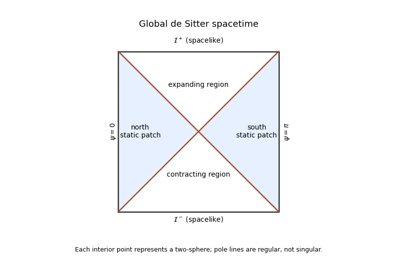

<h1 id="1/e/solution">Solution</h1>

↑ **Parent:** [E](../e.md)

With $r=R\sin\chi$, **the static metric is**

$$
\boxed{ds^2=-\cos^2\chi\,dt^2+R^2d\chi^2+R^2\sin^2\chi\,d\Omega_2^2.}
$$

The radial coefficient is regular at $\chi=\pi/2$, but the time coefficient vanishes and these coordinates cease to be a chart. Part c supplies smooth horizon-crossing coordinates; the local [Rindler coordinates](../../../../../../rindler-coordinates.md) also prove the degeneracy is a coordinate one. Extending $\chi$ while keeping the same static $t$ alone is not a regular coordinate extension.

The complete analytic extension is the hyperboloid $-Y_0^2+\sum_{i=1}^4Y_i^2=R^2$. Static coordinates are $Y_0=\sqrt{R^2-r^2}\sinh(t/R)$, $Y_4=\sqrt{R^2-r^2}\cosh(t/R)$, and $(Y_1,Y_2,Y_3)=r\mathbf n$. Global coordinates give

$$
ds^2=-dT^2+R^2\cosh^2(T/R)(d\psi^2+\sin^2\psi\,d\Omega_2^2).
$$

With $\tan\eta=\sinh(T/R)$ this is

$$
ds^2=R^2\sec^2\eta(-d\eta^2+d\psi^2+\sin^2\psi\,d\Omega_2^2),\quad-\pi/2<\eta<\pi/2,\quad0\leq\psi\leq\pi.
$$

**The [Penrose diagram](../../../../../../penrose-diagram.md) is a rectangle**, with spacelike past/future infinity, regular pole lines $\psi=0,\pi$, and radial null rays at $45$ degrees. Observer horizons divide static patches from inaccessible regions; they are not curvature boundaries.

**[Figure 3](#1/e/image-global-de-sitter-conformal-rectangle-and-the-north-and-south-static-patches). Global de Sitter conformal rectangle and the north and south static patches**.

## ↑ Ancestors (12)

1. [E](../e.md)
2. [1](../../1.md)
3. [Section II](../../section-ii.md)
4. [Paper 58](../../../paper-58-split.md)
5. [Iii](../../../split.md)
6. [2012](../../../../split.md)
7. [Past exam of the mathematics course of the University of Cambridge](../../../../../split.md)
8. [Mathematics course of the University of Cambridge](../../../../../../mathematics-course-of-the-university-of-cambridge.md)
9. [Course of the University of Cambridge](../../../../../../course-of-the-university-of-cambridge.md)
10. [University of Cambridge](../../../../../../university-of-cambridge-split.md)
11. [List of universities](../../../../../../list-of-universities.md)
12. [Codex Wiki](../../../../../../split.md)
