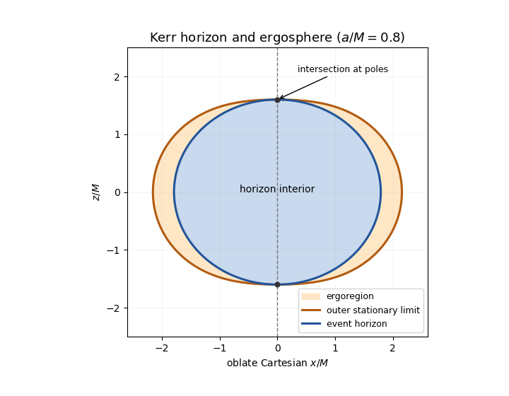

<h1 id="2/d/solution">Solution</h1>

↑ **Parent:** [D](../d.md)

An [ergoregion of a stationary spacetime](../../../../../../ergoregion-of-a-stationary-spacetime.md) is where the stationary [Killing vector field](../../../../../../killing-vector-field.md), normalized as time translation at infinity, is spacelike; a fixed-coordinate stationary observer cannot remain timelike there. For the [Kerr metric](../../../../../../kerr-metric.md), $k^2=-(1-2Mr/\Sigma)$, so the outer stationary-limit surface is

$$
r_{\rm E}(\theta)=M+\sqrt{M^2-a^2\cos^2\theta}.
$$

For a subextremal rotating hole $r_{\rm E}\geq r_+=M+\sqrt{M^2-a^2}$, with equality only at the poles. At the equator $r_{\rm E}=2M>r_+$. **The ergosphere touches the horizon on the rotation axis and is outside it elsewhere.** Its boundary is not the horizon, whose generator is $k+\Omega_Hm$.

**[Figure 4](#2/d/image-kerr-horizon-and-outer-stationary-limit-surface-in-an-oblate-coordinate-meridional-sketch). Kerr horizon and outer stationary-limit surface in an oblate-coordinate meridional sketch**.

The drawing uses oblate Cartesian coordinates to display the intersection and is not an isometric embedding of the spatial geometry.

## ↑ Ancestors (12)

1. [D](../d.md)
2. [2](../../2.md)
3. [Section II](../../section-ii.md)
4. [Paper 58](../../../paper-58-split.md)
5. [Iii](../../../split.md)
6. [2012](../../../../split.md)
7. [Past exam of the mathematics course of the University of Cambridge](../../../../../split.md)
8. [Mathematics course of the University of Cambridge](../../../../../../mathematics-course-of-the-university-of-cambridge.md)
9. [Course of the University of Cambridge](../../../../../../course-of-the-university-of-cambridge.md)
10. [University of Cambridge](../../../../../../university-of-cambridge-split.md)
11. [List of universities](../../../../../../list-of-universities.md)
12. [Codex Wiki](../../../../../../split.md)
