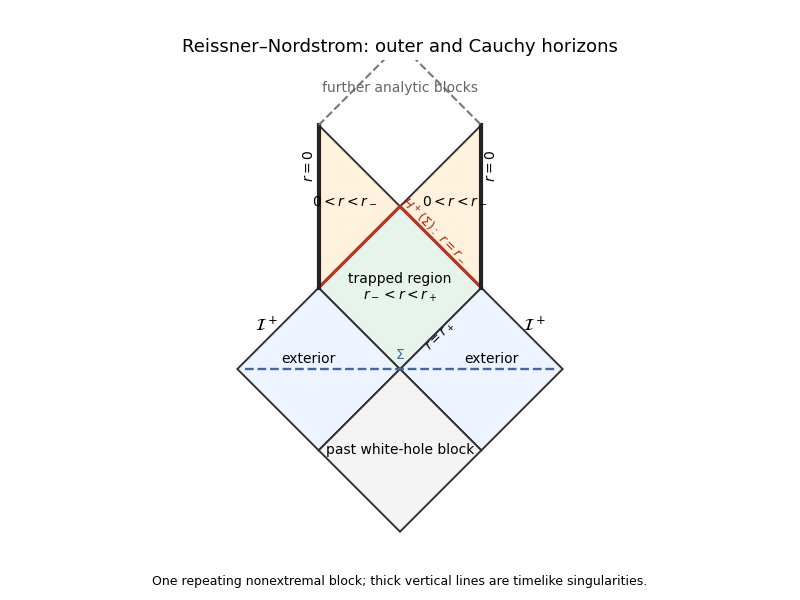

<h1 id="section-i/iii/solution">Solution</h1>

↑ **Parent:** [Iii](../iii.md)

The [future domain of dependence](../../../../../../future-domain-of-dependence.md) $D^+(\Sigma)$ consists of points through which every past-inextendible [causal curve](../../../../../../causal-curve.md) meets the partial [Cauchy hypersurface](../../../../../../cauchy-surface.md) $\Sigma$. Data on $\Sigma$ determine evolution there for suitable hyperbolic equations. Its future boundary is the [Cauchy horizon](../../../../../../cauchy-horizon.md) $H^+(\Sigma)$; one precise definition is $\overline{D^+(\Sigma)}\setminus I^-(D^+(\Sigma))$.

For a nonextremal [Reissner-Nordstrom spacetime](../../../../../../reissner-nordstrom-spacetime.md), $0<|Q|<M$, the metric function is $F=1-2M/r+Q^2/r^2$, with $r_\pm=M\pm\sqrt{M^2-Q^2}$. The outer [event horizon](../../../../../../event-horizon.md) lies at $r_+$. The future trapped region leads toward the inner null surface $r_-$, a future [Cauchy horizon](../../../../../../cauchy-horizon.md) for bridge data on the illustrated $\Sigma$. Beyond it some past [causal curves](../../../../../../causal-curve.md) arrive from other analytic blocks or timelike singularities without meeting $\Sigma$. The [CP diagram](../../../../../../penrose-diagram.md) repeats these analytic blocks; $r=0$ is a timelike [curvature singularity](../../../../../../curvature-singularity.md).

**[Figure 1](#section-i/iii/image-reissner-nordstrom-conformal-block-with-bridge-data-and-future-cauchy-horizons). Reissner-Nordstrom conformal block with bridge data and future Cauchy horizons**.

Near the inner horizon, arbitrarily late exterior radiation is compressed into finite infaller [proper time](../../../../../../proper-time.md). Its frequency is exponentially blueshifted, with scale $e^{|\kappa_-|v}$, so even a decaying flux can have diverging measured stress. Generic ingoing and outgoing perturbations produce [mass inflation](../../../../../../mass-inflation.md), growing internal mass and curvature. **The smooth RN [Cauchy horizon](../../../../../../cauchy-horizon.md) is expected to be unstable to back-reaction.** This is a generic instability argument, not a universal theorem from every specially tuned test trajectory; the approximation of a harmless test particle becomes inconsistent.

## ↑ Ancestors (11)

1. [Iii](../iii.md)
2. [Section I](../../section-i.md)
3. [Paper 58](../../../paper-58-split.md)
4. [Iii](../../../split.md)
5. [2012](../../../../split.md)
6. [Past exam of the mathematics course of the University of Cambridge](../../../../../split.md)
7. [Mathematics course of the University of Cambridge](../../../../../../mathematics-course-of-the-university-of-cambridge.md)
8. [Course of the University of Cambridge](../../../../../../course-of-the-university-of-cambridge.md)
9. [University of Cambridge](../../../../../../university-of-cambridge-split.md)
10. [List of universities](../../../../../../list-of-universities.md)
11. [Codex Wiki](../../../../../../split.md)
