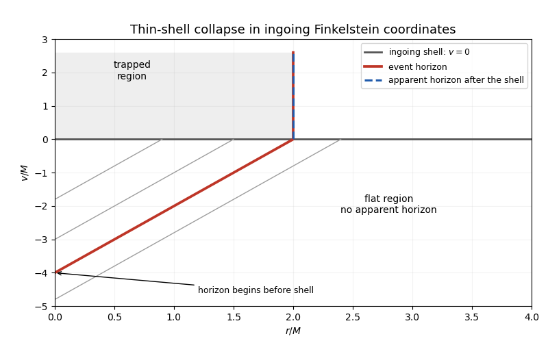

<h1 id="section-i/iv/solution">Solution</h1>

↑ **Parent:** [Iv](../iv.md)

A [null geodesic congruence](../../../../../../null-geodesic-congruence.md) is a smooth family of [null geodesics](../../../../../../null-geodesic.md) filling a region without intersections there. For affine tangent $k$, the [null expansion](../../../../../../null-expansion.md) is the trace of the [optical tensor](../../../../../../optical-tensor.md): $\theta=d(\log A)/d\lambda$ for an infinitesimal pencil's area. Positive expansion means spreading; negative expansion means focusing.

For hypersurface-orthogonal generators in four dimensions, the [Null Raychaudhuri equation](../../../../../../null-raychaudhuri-equation.md) reads

$$
\frac{d\theta}{d\lambda}=-\tfrac12\theta^2-\sigma_{ab}\sigma^{ab}-R_{ab}k^ak^b.
$$

The [null twist](../../../../../../null-twist.md) vanishes. The [null energy condition](../../../../../../null-energy-condition.md) implies $R_{ab}k^ak^b\geq0$ through the [Einstein field equations](../../../../../../einstein-field-equations.md). An initial $\theta_0<0$ would force a focal point within affine distance at most $2/|\theta_0|$. A future-complete generator cannot develop such a point while remaining on an achronal [event horizon](../../../../../../event-horizon.md). **Thus $\boxed{\theta\geq0}$** under the energy and global predictability/future-completeness hypotheses of [Hawking's area theorem](../../../../../../hawking-s-area-theorem.md). Quantum energy-condition violations or failure of those global assumptions remove the conclusion.

The [event horizon](../../../../../../event-horizon.md) is the global boundary $\partial J^-(\mathscr I^+)$ and depends on the whole future. An [apparent horizon](../../../../../../apparent-horizon.md) on a chosen spacelike slice is the outermost marginally outer trapped surface, ordinarily $\theta_{\rm out}=0$, $\theta_{\rm in}<0$. It is quasi-local and slice-dependent; its tube need not be null.

**[Figure 2](#section-i/iv/image-ingoing-finkelstein-diagram-for-a-thin-shell-with-an-event-horizon-extending-into-flat-spacetime). Ingoing Finkelstein diagram for a thin shell with an event horizon extending into flat spacetime**.

For a shell arriving at $v=0$, the final horizon is $r=2M$. Before arrival, outgoing flat-space rays obey $dr/dv=1/2$. Tracing this horizon backward gives $r=2M+v/2$ until its beginning at $r=0$, $v=-4M$. No [apparent horizon](../../../../../../apparent-horizon.md) exists in that earlier flat region, explicitly illustrating the [event horizon](../../../../../../event-horizon.md)'s dependence on future collapse.

## ↑ Ancestors (11)

1. [Iv](../iv.md)
2. [Section I](../../section-i.md)
3. [Paper 58](../../../paper-58-split.md)
4. [Iii](../../../split.md)
5. [2012](../../../../split.md)
6. [Past exam of the mathematics course of the University of Cambridge](../../../../../split.md)
7. [Mathematics course of the University of Cambridge](../../../../../../mathematics-course-of-the-university-of-cambridge.md)
8. [Course of the University of Cambridge](../../../../../../course-of-the-university-of-cambridge.md)
9. [University of Cambridge](../../../../../../university-of-cambridge-split.md)
10. [List of universities](../../../../../../list-of-universities.md)
11. [Codex Wiki](../../../../../../split.md)
