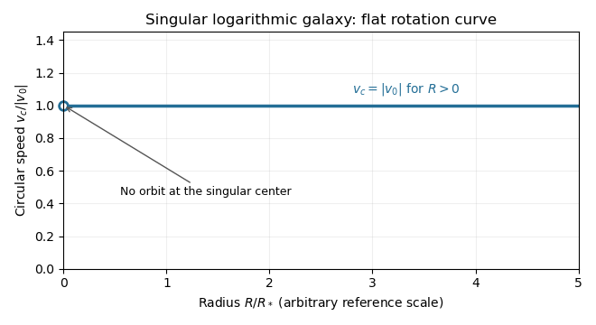
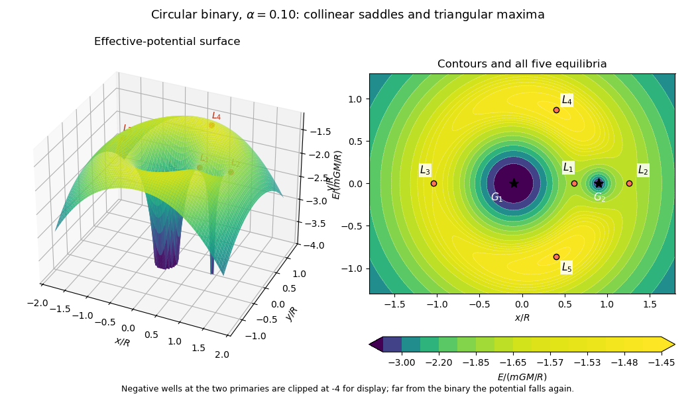

# Paper 59

↑ **Parent:** [Iii](../iii.md)

[https://www.maths.cam.ac.uk/postgrad/part-iii/files/pastpapers/2012/paper_59.pdf](https://www.maths.cam.ac.uk/postgrad/part-iii/files/pastpapers/2012/paper_59.pdf)

**Table of contents**

- [1](#1)
  - [Solution](#1/solution)
- [2](#2)
  - [Solution](#2/solution)
- [3](#3)
  - [Solution](#3/solution)
- [4](#4)
  - [Solution](#4/solution)

## 1

↑ **Parent:** [Paper 59](paper-59.md)

<h3 id="1/solution">Solution</h3>

↑ **Parent:** [1](#1)

Put $V=|v_0|>0$, take $q>0$ without loss of generality, and write $s=R^2+z^2/q^2$. The [Newtonian gravitational potential](../../../classical-mechanics.md#newtonian-gravitational-potential) is singular at the origin; all pointwise claims below concern $s>0$. The zero of the [Newtonian gravitational potential](../../../classical-mechanics.md#newtonian-gravitational-potential) is the one in the paper, with an implicit fixed length unit inside the [logarithm](../../../calculus.md#logarithm).

The [Poisson equation for Newtonian gravity](../../../classical-mechanics.md#poisson-equation-for-newtonian-gravity) in [cylindrical coordinates](../../../calculus.md#cylindrical-coordinate-system) gives

$$
4\pi G\rho=\frac1R\partial_R(R\Phi_R)+\Phi_{zz},\qquad \Phi_R=\frac{V^2R}{s},\qquad \Phi_z=\frac{V^2z}{q^2s}.
$$

The two contributions to the [Laplacian](../../../calculus.md#laplacian) are

$$
\frac1R\partial_R(R\Phi_R)=\frac{2V^2}{s}-\frac{2V^2R^2}{s^2},\qquad \Phi_{zz}=\frac{V^2}{q^2s}-\frac{2V^2z^2}{q^4s^2}.
$$

Consequently the [mass density](../../../fluid-mechanics.md#density) of the [axisymmetric logarithmic gravitational potential](../../../classical-mechanics.md#axisymmetric-logarithmic-gravitational-potential) is

$$
\boxed{\rho(R,z)=\frac{V^2}{4\pi Gq^2}\frac{R^2+(2-q^{-2})z^2}{(R^2+q^{-2}z^2)^2}.}
$$

The coefficient of $R^2$ is positive. The coefficient of $z^2$ determines the [density positivity for an axisymmetric logarithmic potential](../../../classical-mechanics.md#density-positivity-for-an-axisymmetric-logarithmic-potential): **strict positivity at every noncentral point requires $q^2>1/2$ and $v_0\ne0$**. Nonnegativity permits $q^2=1/2$, where the [mass density](../../../fluid-mechanics.md#density) vanishes on the noncentral symmetry axis. For $q^2<1/2$ it is negative near that axis. Either sign of a nonzero real $q$ gives the same model, and $q=0$ is undefined. Setting $v_0=0$ yields vacuum away from the singular origin, not strictly positive [mass density](../../../fluid-mechanics.md#density). The $r^{-2}$ central cusp is locally integrable and contains no hidden point [mass](../../../classical-mechanics.md#mass): the [Newtonian gravitational field](../../../classical-mechanics.md#newtonian-gravitational-field) flux through a shrinking sphere is of order its radius.

An equatorial [circular orbit](../../../classical-mechanics.md#circular-orbit) requires inward [gravitational acceleration](../../../classical-mechanics.md#gravitational-acceleration) equal to $v_c^2/R$. Thus the [circular speed](../../../galaxy.md#circular-speed) is

$$
v_c^2=R\Phi_R(R,0)=V^2,\qquad \boxed{v_c(R)=V\quad(R>0).}
$$

This is a [flat galaxy rotation curve](../../../galaxy.md#flat-galaxy-rotation-curve). The singular center does not define an additional circular orbit at $R=0$.

**[Figure 1](#1/image-flat-equatorial-rotation-curve-of-the-singular-logarithmic-galaxy-the-central-point-is-excluded). Flat equatorial rotation curve of the singular logarithmic galaxy; the central point is excluded**.

The [specific orbital energy](../../../classical-mechanics.md#specific-orbital-energy) $E=\tfrac12(v_R^2+v_\phi^2+v_z^2)+\Phi$ is conserved because the [Newtonian gravitational potential](../../../classical-mechanics.md#newtonian-gravitational-potential) is time independent. The axial [specific angular momentum](../../../classical-mechanics.md#specific-angular-momentum) $L_z=Rv_\phi$ is conserved because the [Newtonian gravitational potential](../../../classical-mechanics.md#newtonian-gravitational-potential) is axisymmetric. Hence the [Jeans theorem](../../../galaxy.md#jeans-theorem), or directly $dF(E,L_z^2)/dt=0$ in the [Collisionless Boltzmann equation](../../../galaxy.md#collisionless-boltzmann-equation), permits a stationary [two-integral galactic distribution function](../../../galaxy.md#two-integral-galactic-distribution-function). Using $L_z^2$ makes this [galactic distribution function](../../../galaxy.md#galactic-distribution-function) even under reversal of the azimuthal [velocity](../../../classical-mechanics.md#velocity), so it describes a nonstreaming population. A general axisymmetric population can have an odd part in $L_z$, or dependence on a third [integral of motion](../../../classical-mechanics.md#integral-of-motion); neither is required for this construction.

At each position define $\rho\langle g\rangle=\int gF\,d^3v$. The [two-integral galactic distribution function](../../../galaxy.md#two-integral-galactic-distribution-function) is invariant under swapping $v_R$ and $v_z$, since only their sum of squares occurs in $E$. It is also even in each [velocity](../../../classical-mechanics.md#velocity) component. Swapping integration variables proves [meridional velocity isotropy of a two-integral distribution](../../../galaxy.md#meridional-velocity-isotropy-of-a-two-integral-distribution), while reflecting one variable makes each mixed integrand odd. Therefore

$$
\boxed{\langle v_R^2\rangle=\langle v_z^2\rangle,\qquad \langle v_Rv_z\rangle=\langle v_Rv_\phi\rangle=\langle v_\phi v_z\rangle=0.}
$$

All mean [velocities](../../../classical-mechanics.md#velocity) vanish, so these are also the corresponding statements for the [velocity ellipsoid](../../../galaxy.md#velocity-ellipsoid) and its centered [covariance](../../../variance.md#covariance) tensor. They do not require $\langle v_\phi^2\rangle$ to equal either meridional second moment.

To normalize the proposed [logarithmic-potential two-integral distribution](../../../galaxy.md#logarithmic-potential-two-integral-distribution), first separate the [mass density](../../../fluid-mechanics.md#density) into terms with the same spatial factors as the two exponentials:

$$
\rho=\frac{V^2}{4\pi Gq^2}\left[\frac{2q^2-1}{s}+\frac{2(1-q^2)R^2}{s^2}\right].
$$

Since $e^{-2\Phi/V^2}=s^{-1}$ and $e^{-4\Phi/V^2}=s^{-2}$, the [Gaussian integral](../../../calculus.md#gaussian-integral) and its derivative give

$$
\int e^{-v^2/V^2}\,d^3v=\pi^{3/2}V^3,\qquad \int v_\phi^2e^{-2v^2/V^2}\,d^3v=\frac{\pi^{3/2}V^5}{8\sqrt2}.
$$

Thus velocity integration of the [galactic distribution function](../../../galaxy.md#galactic-distribution-function) yields $AR^2s^{-2}\pi^{3/2}V^5/(8\sqrt2)+Bs^{-1}\pi^{3/2}V^3$. Matching the independent spatial factors determines

$$
\boxed{A=\frac{4\sqrt2(1-q^2)}{\pi^{5/2}Gq^2V^3},\qquad B=\frac{2q^2-1}{4\pi^{5/2}Gq^2V}.}
$$

This verifies both the stationary [Collisionless Boltzmann equation](../../../galaxy.md#collisionless-boltzmann-equation) and the required [Poisson equation for Newtonian gravity](../../../classical-mechanics.md#poisson-equation-for-newtonian-gravity). A shift $\Phi\mapsto\Phi+C$ changes the normalizations to $Ae^{4C/V^2}$ and $Be^{2C/V^2}$; the physical [mass density](../../../fluid-mechanics.md#density) is unchanged.

There is an important distinction between positive [mass density](../../../fluid-mechanics.md#density) and a nonnegative [galactic distribution function](../../../galaxy.md#galactic-distribution-function). For $1/2\le q^2\le1$, both coefficients above are nonnegative. For a prolate model $q^2>1$, $A<0$ and one must test the sum rather than reject the model just because one term is negative. On accessible phase space,

$$
L_z^2e^{-2E/V^2}=\frac{R^2}{s}v_\phi^2e^{-v^2/V^2}\le\frac{V^2}{e},
$$

with equality in the equatorial plane at $v_R=v_z=0$, $v_\phi^2=V^2$. The [nonnegativity bound for a prolate logarithmic-potential distribution](../../../galaxy.md#nonnegativity-bound-for-a-prolate-logarithmic-potential-distribution) is consequently

$$
\boxed{q^2\le\frac{16\sqrt2-e}{16\sqrt2-2e}\quad(q^2>1).}
$$

For larger $q$, the displayed algebraic expression still integrates to the positive [mass density](../../../fluid-mechanics.md#density), but is negative at those equatorial [circular orbit](../../../classical-mechanics.md#circular-orbit) phase points and is not a physical [galactic distribution function](../../../galaxy.md#galactic-distribution-function). This extra restriction is distinct from the earlier density-only answer.

## 2

↑ **Parent:** [Paper 59](paper-59.md)

<h3 id="2/solution">Solution</h3>

↑ **Parent:** [2](#2)

Let $u_i=\langle v_i\rangle$, $\sigma_{ij}=\langle(v_i-u_i)(v_j-u_j)\rangle$, and $P_{ij}=\rho\sigma_{ij}$. The [Jeans equation](../../../galaxy.md#jeans-equation) obtained by taking the first [velocity](../../../classical-mechanics.md#velocity) moment of the [Collisionless Boltzmann equation](../../../galaxy.md#collisionless-boltzmann-equation) is

$$
\partial_t(\rho u_j)+\partial_k(\rho u_ju_k+P_{jk})=-\rho\partial_j\Phi.
$$

For an equilibrium population multiply by $x_i$ and integrate. [Integration by parts](../../../calculus.md#integration-by-parts) gives

$$
\oint x_i(\rho u_ju_k+P_{jk})n_k\,dS-\int(\rho u_iu_j+P_{ji})\,d^3x=-\int\rho x_i\partial_j\Phi\,d^3x.
$$

Assume the integrals exist and the boundary flux vanishes, as for an isolated finite system with adequate decay. With the [stellar kinetic-energy tensor](../../../galaxy.md#stellar-kinetic-energy-tensor), [stellar pressure-energy tensor](../../../galaxy.md#stellar-pressure-energy-tensor) and [stellar potential-energy tensor](../../../galaxy.md#stellar-potential-energy-tensor) defined by

$$
T_{ij}=\frac12\int\rho u_iu_j\,d^3x,\qquad \Pi_{ij}=\int\rho\sigma_{ij}\,d^3x,\qquad W_{ij}=-\int\rho x_i\partial_j\Phi\,d^3x,
$$

we obtain the equilibrium [tensor virial theorem](../../../galaxy.md#tensor-virial-theorem)

$$
\boxed{2T_{ij}+\Pi_{ij}+W_{ij}=0.}
$$

The [stellar kinetic-energy tensor](../../../galaxy.md#stellar-kinetic-energy-tensor) describes ordered motion, whereas the [stellar pressure-energy tensor](../../../galaxy.md#stellar-pressure-energy-tensor) describes random motion. In particular, $T_{ij}=0$ does not mean the [stars](../../../stellar-astrophysics.md#star) have no [kinetic energy](../../../classical-mechanics.md#kinetic-energy). If a surface flux is retained, the right side of the displayed equilibrium identity is that surface tensor; it cannot be discarded for an arbitrary finite aperture. For an isolated self-gravitating population, $W_{ij}$ is symmetric by pairwise interchange in the Newtonian interaction integral, and the time-dependent identity is $\tfrac12\ddot I_{ij}=2T_{ij}+\Pi_{ij}+W_{ij}$ with $I_{ij}=\int\rho x_ix_jd^3x$.

For the spherical [Newtonian gravitational potential](../../../classical-mechanics.md#newtonian-gravitational-potential), $\partial_j\Phi=\Phi'(r)x_j/r$. In the pressure-supported case the [tensor virial theorem](../../../galaxy.md#tensor-virial-theorem) gives $\Pi_{ii}=\int\rho\Phi'(r)x_i^2/r\,d^3x$. The notation $\Pi_{RR}$ used in this question is the [planar virial trace](../../../galaxy.md#planar-virial-trace) $\Pi_{xx}+\Pi_{yy}$, not just the integral of the local cylindrical radial [velocity dispersion](../../../galaxy.md#velocity-dispersion). In [cylindrical coordinates](../../../calculus.md#cylindrical-coordinate-system) this trace includes both $v_R^2$ and $v_\phi^2$. Summing the two Cartesian components therefore gives

$$
\boxed{\frac{\Pi_{RR}}{\Pi_{zz}}=\frac{\int\rho\Phi'(r)R^2/r\,d^3x}{\int\rho\Phi'(r)z^2/r\,d^3x}.}
$$

The distinction explains the factor of two in the spherical limit.

Use ordinary [spherical coordinates](../../../calculus.md#spherical-coordinate-system), $R=r\sin\theta$, $z=r\cos\theta$. The [mass density](../../../fluid-mechanics.md#density) separates as $\rho_0r^{-\gamma}h(\theta)$, where

$$
h(\theta)=(\sin^2\theta+q^{-2}\cos^2\theta)^{-\gamma/2}.
$$

Both potential-energy integrals have the same radial factor $2\pi\rho_0\int_0^\infty r^{3-\gamma}\Phi'(r)\,dr$. When this factor is finite and positive it cancels, leaving the [scale-free tracer virial ratio](../../../galaxy.md#scale-free-tracer-virial-ratio)

$$
\boxed{\frac{\Pi_{RR}}{\Pi_{zz}}=\frac{\int_0^\pi\sin^3\theta\,(\sin^2\theta+q^{-2}\cos^2\theta)^{-\gamma/2}\,d\theta}{\int_0^\pi\sin\theta\cos^2\theta\,(\sin^2\theta+q^{-2}\cos^2\theta)^{-\gamma/2}\,d\theta}.}
$$

**The angular factor in the printed intermediate formula has its sine and cosine interchanged.** Keeping its sine/cosine weights while using that printed factor would instead produce the opposite sign in the final small-flattening correction. Merely measuring $\theta$ from the equatorial plane cannot fix this: the measure and both moment weights would have to change as well.

The angular ratio is finite and positive for every fixed $q>0$ and finite real $\gamma$, because $h$ is positive and bounded above and below. However, the claim that the unrestricted global virial integrals are always well-defined needs a hypothesis. In a point-mass [Newtonian gravitational potential](../../../classical-mechanics.md#newtonian-gravitational-potential), the common radial factor is proportional to $\int_0^\infty r^{1-\gamma}dr$: convergence at zero requires $\gamma<2$, while convergence at infinity requires $\gamma>2$. There is no such $\gamma$. If the global energies diverge, the boxed angular ratio is still the ratio of the two potential-energy integrals with identical spherical inner and outer cutoffs, independent of the cutoffs. It is not a quotient of two finite global [stellar pressure-energy tensors](../../../galaxy.md#stellar-pressure-energy-tensor); applying a finite-aperture [tensor virial theorem](../../../galaxy.md#tensor-virial-theorem) additionally requires its surface terms. These convergence and boundary qualifications are separate from the printed angular typo.

Set $\epsilon=q^{-2}-1$. For modest flattening, the [Taylor expansion](../../../calculus.md#taylor-expansion) is $h=1-(\gamma/2)\epsilon\cos^2\theta+O(\epsilon^2)$. The required elementary angular [integrals](../../../calculus.md#integral) are

$$
\int_0^\pi\sin^3\theta\,d\theta=\frac43,\quad \int_0^\pi\sin^3\theta\cos^2\theta\,d\theta=\frac4{15},\quad \int_0^\pi\sin\theta\cos^2\theta\,d\theta=\frac23,\quad \int_0^\pi\sin\theta\cos^4\theta\,d\theta=\frac25.
$$

These follow directly by $t=\cos\theta$, or from the supplied [gamma function](../../../complex-analysis.md#gamma-function) identity. Hence the numerator is $(4/3)[1-\gamma\epsilon/10+O(\epsilon^2)]$ and the denominator is $(2/3)[1-3\gamma\epsilon/10+O(\epsilon^2)]$. The [flattening–anisotropy virial relation](../../../galaxy.md#flattening-anisotropy-virial-relation) becomes

$$
\boxed{\frac{\Pi_{RR}}{2\Pi_{zz}}=1+\frac\gamma5(q^{-2}-1)+O((q^{-2}-1)^2).}
$$

For a decreasing tracer [mass density](../../../fluid-mechanics.md#density) ($\gamma>0$), oblate flattening ($q<1$) requires more random kinetic support per in-plane direction than vertically. In a spherical [Newtonian gravitational field](../../../classical-mechanics.md#newtonian-gravitational-field), directional orbital anisotropy supplies the flattening rather than an anisotropic force law. A steeper radial [mass density](../../../fluid-mechanics.md#density) amplifies the required [velocity dispersion](../../../galaxy.md#velocity-dispersion) anisotropy. A prolate tracer reverses the leading inequality. The relation constrains integrated [velocity dispersions](../../../galaxy.md#velocity-dispersion), not a unique local [galactic distribution function](../../../galaxy.md#galactic-distribution-function).

## 3

↑ **Parent:** [Paper 59](paper-59.md)

<h3 id="3/solution">Solution</h3>

↑ **Parent:** [3](#3)

For an axisymmetric [Newtonian gravitational potential](../../../classical-mechanics.md#newtonian-gravitational-potential), the vacuum [Laplace equation in cylindrical coordinates](../../../partial-differential-equation.md#laplace-equation-in-cylindrical-coordinates) is $R^{-1}\partial_R(R\partial_R\Phi)+\partial_z^2\Phi=0$. Use [separation of variables](../../../partial-differential-equation.md#separation-of-variables), $\Phi=X(R)Z(z)$. Dividing by $XZ$ and setting the separated constant to $k^2$, with $k>0$, gives

$$
Z''=k^2Z,\qquad X''+\frac1RX'+k^2X=0.
$$

The first equation has solutions $e^{\pm kz}$; with $u=kR$, the second is the order-zero [Bessel differential equation](../../../analysis.md#bessel-differential-equation). Regularity at the axis selects the [Bessel function of the first kind](../../../analysis.md#bessel-function-of-the-first-kind) $J_0(kR)$, rather than the singular [Bessel function of the second kind](../../../analysis.md#bessel-function-of-the-second-kind) $Y_0$. Thus

$$
\boxed{\Phi_k(R,z)=e^{\pm kz}J_0(kR).}
$$

There are also zero-separation-constant modes, and other boundary conditions can select other separated families. For a localized reflection-symmetric [thin disk](../../../astrophysics.md#thin-disk), decay away from the disk selects $e^{-k|z|}$ on the respective half-spaces.

Apply the [divergence theorem](../../../calculus.md#divergence-theorem) to the [Poisson equation for Newtonian gravity](../../../classical-mechanics.md#poisson-equation-for-newtonian-gravity) across a narrow pillbox enclosing disk area. Writing the volume [mass density](../../../fluid-mechanics.md#density) as $\Sigma(R)\delta(z)$ gives

$$
\Phi_z(R,0^+)-\Phi_z(R,0^-)=4\pi G\Sigma(R).
$$

Reflection symmetry makes $\Phi_z(R,0^+)=2\pi G\Sigma(R)$. A superposition of the regular vacuum modes therefore satisfies

$$
\Phi=\int_0^\infty S(k)J_0(kR)e^{-k|z|}\,dk,\qquad -\int_0^\infty kS(k)J_0(kR)\,dk=2\pi G\Sigma(R).
$$

The order-zero [Hankel transform](../../../analysis.md#hankel-transform) and its inversion now determine the [Hankel representation of thin-disk gravity](../../../astrophysics.md#hankel-representation-of-thin-disk-gravity):

$$
\boxed{S(k)=-2\pi G\int_0^\infty\Sigma(R)J_0(kR)R\,dR.}
$$

The sign is fixed by the positive derivative of an attractive [Newtonian gravitational potential](../../../classical-mechanics.md#newtonian-gravitational-potential) above the disk. For ordinary finite disks the representation uses the isolated boundary condition, fixing any extra vacuum field or additive constant. Infinite scale-free disks require suitable regularization of the potential itself.

Equatorial [circular orbit](../../../classical-mechanics.md#circular-orbit) balance is $v_c^2=R\Phi_R(R,0)$. Using $J_0'(u)=-J_1(u)$ in the [Hankel representation of thin-disk gravity](../../../astrophysics.md#hankel-representation-of-thin-disk-gravity) gives

$$
\boxed{v_c^2(R)=-R\int_0^\infty kS(k)J_1(kR)\,dk.}
$$

Differentiation under the integral is justified by convergence for regular models, or by first working off the disk and taking the limiting radial field.

Write $C=\Sigma_0R_0$. For the [Mestel disk](../../../astrophysics.md#mestel-disk), the supplied [Bessel function](../../../analysis.md#bessel-function) integral gives $S(k)=-2\pi GC/k$ for $k>0$. The [circular speed](../../../galaxy.md#circular-speed) is then

$$
v_c^2=2\pi GC R\int_0^\infty J_1(kR)\,dk=2\pi GC.
$$

Meanwhile the interior [mass](../../../classical-mechanics.md#mass) is $M(R)=2\pi\int_0^R(C/s)s\,ds=2\pi CR$. Consequently

$$
\boxed{v_c^2=2\pi G\Sigma_0R_0=\frac{GM(R)}R.}
$$

The [Mestel disk](../../../astrophysics.md#mestel-disk) has a [flat galaxy rotation curve](../../../galaxy.md#flat-galaxy-rotation-curve), despite its nonspherical geometry.

Its infinite total [mass](../../../classical-mechanics.md#mass) prevents setting the [Newtonian gravitational potential](../../../classical-mechanics.md#newtonian-gravitational-potential) to zero at infinity. Indeed the integral for $\Phi$ diverges at $k=0$ because $S(k)\sim1/k$. Subtracting the potential at a reference point removes this additive divergence. As an explicit check, the [Mestel disk potential-density pair](../../../astrophysics.md#mestel-disk-potential-density-pair) is

$$
\Phi=2\pi GC\log\!\left(\frac{\sqrt{R^2+z^2}+|z|}{R_*}\right).
$$

It is harmonic for $z\ne0$, its vertical derivative jump is $4\pi GC/R$, and $R\Phi_R(R,0)=2\pi GC$. Equivalently, an [Abel regularization of an oscillatory integral](../../../distribution-theory.md#abel-regularization-of-an-oscillatory-integral) with damping factor $e^{-ak}$ in the radial-field integral gives $R\int_0^\infty e^{-ak}J_1(kR)dk=1-a/\sqrt{a^2+R^2}$, which tends to one as $a\downarrow0$. The force is well-defined although the unreferenced potential is not.

**The equality with $GM(R)/R$ is special to the Mestel disk, not a thin-disk shell theorem.** The [spherical shell theorem](../../../physics.md#spherical-shell-theorem) normally makes that formula possible, but does not apply to an [astrophysical disk](../../../astrophysics.md#astrophysical-disk). Exterior annuli exert outward radial [gravitational acceleration](../../../classical-mechanics.md#gravitational-acceleration) inside their radii, while interior annuli do not act exactly as point masses at the origin. For this particular scale-free [surface density](../../../astrophysics.md#surface-density-of-a-disk), their combined contributions happen to produce the same result as the interior [mass](../../../classical-mechanics.md#mass) expression. Changing the radial [surface density](../../../astrophysics.md#surface-density-of-a-disk) or truncating the disk generally destroys the equality: [enclosed mass does not determine a disc rotation curve](../../../galaxy.md#enclosed-mass-does-not-determine-a-disc-rotation-curve).

## 4

↑ **Parent:** [Paper 59](paper-59.md)

<h3 id="4/solution">Solution</h3>

↑ **Parent:** [4](#4)

Let $M=M_1+M_2$ and $\alpha=M_2/M$, with $0<\alpha<1$. In the [centre of mass](../../../classical-mechanics.md#center-of-mass) frame the two primary distances are $r_1=\alpha R$ and $r_2=(1-\alpha)R$. Applying [Newton's law of universal gravitation](../../../classical-mechanics.md#newton-s-law-of-universal-gravitation) and circular [centripetal acceleration](../../../classical-mechanics.md#centripetal-acceleration) to the first primary gives $M_1\omega^2\alpha R=GM_1M_2/R^2$, and hence

$$
\boxed{\omega^2=\frac{GM}{R^3}.}
$$

The same result follows from the second primary or from the relative two-body [equation of motion](../../../classical-mechanics.md#equation-of-motion).

A rotating-frame equilibrium has zero rotating-frame [velocity](../../../classical-mechanics.md#velocity), so its [Coriolis force](../../../physics.md#coriolis-force) vanishes. Above the orbital plane both primaries have downward gravitational components; below it both have upward components. The centrifugal [force](../../../classical-mechanics.md#force) has no $z$ component. More explicitly,

$$
a_z=-Gz\left(\frac{M_1}{|\mathbf r-\mathbf r_1|^3}+\frac{M_2}{|\mathbf r-\mathbf r_2|^3}\right),
$$

which vanishes only at $z=0$ for finite nonsingular points. Thus **all equilibria lie in the orbital plane**.

The [equation of motion in a rotating frame](../../../classical-mechanics.md#equation-of-motion-in-a-rotating-frame) for the dwarf is

$$
m\ddot{\mathbf r}=-\nabla U-2m\boldsymbol\omega\mathbin{\times}\dot{\mathbf r}-m\boldsymbol\omega\mathbin{\times}(\boldsymbol\omega\mathbin{\times}\mathbf r),\qquad U=-\frac{GmM_1}{|\mathbf r-\mathbf r_1|}-\frac{GmM_2}{|\mathbf r-\mathbf r_2|}.
$$

On the orbital plane the centrifugal contribution is $m\omega^2\mathbf r$. Thus the [rotating-frame effective potential](../../../physics.md#rotating-frame-effective-potential) is $E=U-m\omega^2(x^2+y^2)/2$; equilibria are exactly its stationary points. The [Coriolis force](../../../physics.md#coriolis-force) affects motion about those equilibria but not their positions. This is the [circular restricted three-body problem](../../../classical-mechanics.md#circular-restricted-three-body-problem), with the dwarf treated as a test [mass](../../../classical-mechanics.md#mass).

**The printed energy unit has the wrong dimensions.** The correct total [energy](../../../classical-mechanics.md#energy) unit is $mGM/R$, or $GM/R$ for specific [energy](../../../classical-mechanics.md#energy); $GM/R^2$ is an [acceleration](../../../classical-mechanics.md#acceleration). Dividing $E$ by $mGM/R$ and measuring lengths in units of $R$ gives the dimensionless [effective potential](../../../physics.md#effective-potential)

$$
\mathcal E(x,y)=-\frac{x^2+y^2}{2}-\frac{1-\alpha}{\sqrt{(x+\alpha)^2+y^2}}-\frac{\alpha}{\sqrt{(x-1+\alpha)^2+y^2}}.
$$

The primary coordinates are $(-\alpha,0)$ and $(1-\alpha,0)$. Restricting to $y=0$ gives $F(x)=\mathcal E(x,0)$ and

$$
F'(x)=-x+\frac{(1-\alpha)(x+\alpha)}{|x+\alpha|^3}+\frac{\alpha(x-1+\alpha)}{|x-1+\alpha|^3},\qquad F''(x)=-1-\frac{2(1-\alpha)}{|x+\alpha|^3}-\frac{2\alpha}{|x-1+\alpha|^3}<0.
$$

The absolute values are essential; dropping them would reverse the attraction on the left of a primary. On each of the intervals separated by the two primaries, $F'$ decreases strictly from $+\infty$ to $-\infty$. There is exactly one [Collinear Lagrange point](../../../classical-mechanics.md#collinear-lagrange-point) on each interval, a maximum along the $x$ direction.

For the [inner Lagrange point](../../../classical-mechanics.md#inner-lagrange-point), write $x=1-\alpha-\delta$ with $\delta>0$. For the [L2 Lagrange point](../../../classical-mechanics.md#l2-lagrange-point), write $x=1-\alpha+\delta$. The respective equations are

$$
0=-(1-\alpha-\delta)+\frac{1-\alpha}{(1-\delta)^2}-\frac{\alpha}{\delta^2}=3\delta-\frac{\alpha}{\delta^2}+O(\delta^2+\alpha\delta),
$$

$$
0=-(1-\alpha+\delta)+\frac{1-\alpha}{(1+\delta)^2}+\frac{\alpha}{\delta^2}=-3\delta+\frac{\alpha}{\delta^2}+O(\delta^2+\alpha\delta).
$$

Balancing the leading terms gives $\delta=(\alpha/3)^{1/3}+O(\alpha^{2/3})$. Therefore the [small-mass-ratio collinear Lagrange points](../../../classical-mechanics.md#small-mass-ratio-collinear-lagrange-points) obey

$$
\boxed{x_{L_1}=1-(\alpha/3)^{1/3}+O(\alpha^{2/3}),\qquad x_{L_2}=1+(\alpha/3)^{1/3}+O(\alpha^{2/3}).}
$$

The omitted $-\alpha$ displacement of the secondary is smaller than the stated error. The leading distance from the secondary is the dimensionless [Hill radius](../../../classical-mechanics.md#hill-radius).

For the [L3 Lagrange point](../../../classical-mechanics.md#l3-lagrange-point) put $x=-1+c\alpha+O(\alpha^2)$. It lies to the left of both primaries, so

$$
F'=-x-\frac{1-\alpha}{(x+\alpha)^2}-\frac{\alpha}{(x-1+\alpha)^2}.
$$

Expanding the two positive inverse-square factors gives $(1-\alpha)/(x+\alpha)^2=1+(2c+1)\alpha+O(\alpha^2)$ and $\alpha/(x-1+\alpha)^2=\alpha/4+O(\alpha^2)$. Thus $F'=-(3c+5/4)\alpha+O(\alpha^2)$, so

$$
\boxed{x_{L_3}=-1-\frac5{12}\alpha+O(\alpha^2).}
$$

All three have $y=z=0$. The small-$\alpha$ equalities in the paper are asymptotic expressions, not exact coordinates for finite mass ratio.

For the remaining [Lagrange points](../../../classical-mechanics.md#lagrange-point), introduce plane [polar coordinates](../../../calculus.md#polar-coordinates) about the first primary: $x=-\alpha+s\cos\theta$, $y=s\sin\theta$. Its distance to the second primary is $d=(s^2+1-2s\cos\theta)^{1/2}$, and

$$
\mathcal E=-\frac12(s^2-2\alpha s\cos\theta+\alpha^2)-\frac{1-\alpha}{s}-\frac\alpha d.
$$

The angular stationary condition is $\partial_\theta\mathcal E=\alpha s\sin\theta(d^{-3}-1)=0$. For an off-axis point $s>0$ and $\sin\theta\ne0$, so $d=1$. The radial stationary condition becomes

$$
\partial_s\mathcal E=-s+\alpha\cos\theta+\frac{1-\alpha}{s^2}+\frac{\alpha(s-\cos\theta)}{d^3}=(1-\alpha)(s^{-2}-s)=0.
$$

Hence $s=1$, and $d=1$ implies $\cos\theta=1/2$. The [Triangular Lagrange points](../../../classical-mechanics.md#triangular-lagrange-point) are exactly

$$
\boxed{L_4=(\tfrac12-\alpha,\tfrac{\sqrt3}{2},0),\qquad L_5=(\tfrac12-\alpha,-\tfrac{\sqrt3}{2},0).}
$$

Both triangles are equilateral. The collinear and off-axis calculations together exhaust the stationary points.

For the requested sketch, $\mathcal E$ tends to $-\infty$ at either primary and at large in-plane radius. Each [Collinear Lagrange point](../../../classical-mechanics.md#collinear-lagrange-point) is a saddle of the planar [effective potential](../../../physics.md#effective-potential): its $x$ curvature is negative and its $y$ curvature is positive. To see the latter, let $d_1=|x+\alpha|$, $d_2=|x-1+\alpha|$ and $D=(1-\alpha)/d_1^3+\alpha/d_2^3$. At an inner point both distances are below one, so $D>1$. At an exterior stationary point, use barycentric positions $a_1=-\alpha$, $a_2=1-\alpha$ and weights $1-\alpha,\alpha$: the equation implies $x(D-1)=\sum w_i a_i/|x-a_i|^3$. To the right, the weighted sum is positive because the positive primary is closer; to the left it is negative because the negative primary is closer. Thus $D>1$ there as well, and $\mathcal E_{yy}=D-1>0$.

At either [Triangular Lagrange point](../../../classical-mechanics.md#triangular-lagrange-point), the planar [Hessian](../../../calculus.md#hessian-matrix) is

$$
D^2\mathcal E=-3\begin{pmatrix}1/4&\pm\sqrt3(1-2\alpha)/4\\\pm\sqrt3(1-2\alpha)/4&3/4\end{pmatrix}.
$$

Its trace is $-3$ and determinant $27\alpha(1-\alpha)/4>0$, so these are local maxima. Their height is $\mathcal E=-3/2+\alpha(1-\alpha)/2$. The sketch below uses a finite mass ratio to separate the five points clearly; its singular wells are clipped only for display. These curvature labels concern the [effective potential](../../../physics.md#effective-potential), not a stability test that ignores the [Coriolis force](../../../physics.md#coriolis-force).

**[Figure 2](#4/image-rotating-binary-effective-potential-surface-and-contours-at-mass-fraction-0-10-with-all-five-lagrange-points-marked). Rotating binary effective-potential surface and contours at mass fraction 0.10, with all five Lagrange points marked**.

## ↑ Ancestors (8)

1. [Iii](../iii.md)
2. [2012](../../2012.md)
3. [Past exam of the mathematics course of the University of Cambridge](../../../past-exam-of-the-mathematics-course-of-the-university-of-cambridge.md)
4. [Mathematics course of the University of Cambridge](../../../university-of-cambridge.md#mathematics-course-of-the-university-of-cambridge)
5. [Course of the University of Cambridge](../../../university-of-cambridge.md#course-of-the-university-of-cambridge)
6. [University of Cambridge](../../../university-of-cambridge.md)
7. [List of universities](../../../README.md#list-of-universities)
8. [Codex Wiki](../../../README.md)
